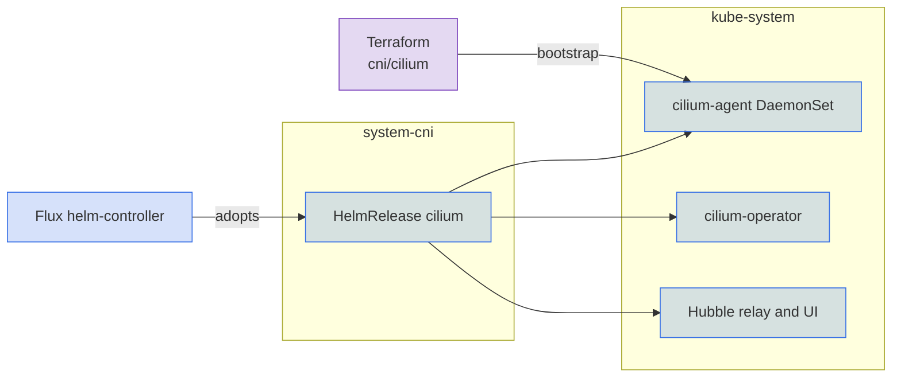

Cilium is the default CNI on Talos clusters. It replaces kube-proxy with eBPF, announces `LoadBalancer` addresses over L2, and provides Hubble for network visibility. With `gateway.driver: cilium` it also runs the [gateway](../gateway/cilium.md).

## Turn it on

```yaml
cluster:
  cni:
    driver: cilium
```

Cilium is already the default on Talos. Its pods run in `kube-system`, and the Flux HelmRelease that manages it lives in `system-cni`. Core turns off Talos's built-in Flannel and kube-proxy in the machine config, and the agent runs with only the Linux capabilities it needs instead of full privileges.

EKS can opt in with the same setting, but that path is untested. Core then installs Cilium once the cluster exists and skips L2 announcements, because the AWS Load Balancer Controller owns `LoadBalancer` Services. AKS and GKE keep their managed CNIs. See [Defaults](index.md#defaults).

## Bootstrap

Flux needs pod networking before it can run, yet Flux is what installs the CNI. Core resolves this by installing Cilium first with Terraform, through the Talos API, before any GitOps exists. Flux then adopts that release through a HelmRelease with the same name and namespace, and day-2 changes flow through Git. Terraform sets only the baseline: IPAM mode, kube-proxy replacement, operator replicas, and the Talos capabilities. Flux owns everything else, including Hubble, the gateway, and L2.

The operator runs one replica on a single-node cluster, because it binds a host port that two replicas cannot share on one node, and two replicas otherwise. Terraform and Flux both take the count from `topology`.

## Load balancer addresses

Cilium hands out `LoadBalancer` addresses from `network.loadbalancer_ips` and announces them over L2 on every network interface. Each address is answered by one node at a time, chosen first come first serve. That replaces MetalLB and kube-vip, and `network.loadbalancer_driver` has no effect with Cilium.

```yaml
network:
  loadbalancer_ips:
    start: 10.5.1.10
    end: 10.5.1.30
```

L2 announcements assume the nodes share a flat network, which Hetzner's cloud network does not. There the Hetzner cloud controller assigns addresses, and the L2 component is left out.

## Hubble

Hubble is always on, with its relay, UI, and flow metrics for DNS, drops, ports, TCP, ICMP, and HTTP. An in-cluster CronJob rotates its certificates, so Hubble does not depend on cert-manager. The UI is not published through the gateway. Reach it with `kubectl port-forward` to the `hubble-ui` Service in `kube-system`.

## Monitoring

With `telemetry.metrics.enabled` (the default), Prometheus scrapes the Cilium agent, operator, and `cilium-envoy` pods and the Hubble metrics, and `observability.enabled` adds a Cilium dashboard.

## Operations

- If the Cilium pods crash-loop with `Operation not permitted` on Talos, the capabilities patch did not apply. Check that the `cilium/talos` component is in the `cni` Kustomization.
- If `cilium-operator` creates no Gateway controller, the Gateway API CRDs were missing when it started. Restart the operator once they exist.
- If the gateway Service has no address, check that the `cilium-gateway-lbipam-sharing` MutatingPolicy is `Ready` and that the `cilium-lbipam-config` ConfigMap exists in `system-gateway`.
- If the HelmRelease reports `no matches for kind CiliumLoadBalancerIPPool`, Flux reconciled before the chart installed its CRDs. Reconcile again.
- If `windsor apply` keeps changing the Cilium replica count, Terraform and Flux disagree about `operator_replicas`. Both come from `topology`.

## Security

Cilium replaces kube-proxy as part of the install, so removing the add-on does not bring kube-proxy back. On Talos the agent runs with an explicit capability set instead of privileged mode, and the workloads run in `kube-system` with host networking.

Cilium enforces `NetworkPolicy` and `CiliumNetworkPolicy`, but Core applies no default deny policy. Pod-to-pod traffic is unencrypted, and routing uses Cilium's default VXLAN tunnel. With the Cilium gateway driver, Cilium copies the gateway's TLS Secret into the `cilium-secrets` namespace, so the wildcard certificate's private key exists in two namespaces.

## Under the hood



## Configuration

| Key | Type | Default | Description |
|-----|------|---------|-------------|
| `cluster.cni.driver` | string | `cilium` on Talos | Set to `cilium`. See [CNI](index.md#defaults). |
| `network.loadbalancer_ips.start` | string | derived | First address of the load balancer pool. |
| `network.loadbalancer_ips.end` | string | derived | Last address of the load balancer pool. |
| `topology` | string | derived | `single-node` runs one operator, otherwise two. |
| `telemetry.metrics.enabled` | boolean | `true` | Scrape Cilium and Hubble metrics. |

## Reference

- [terraform/cni/cilium](../../../terraform/cni/cilium)
- [kustomize/cni](../../../kustomize/cni)
- [kustomize/gateway](../../../kustomize/gateway)
- [kustomize/policy](../../../kustomize/policy)
- [kustomize/telemetry](../../../kustomize/telemetry)
