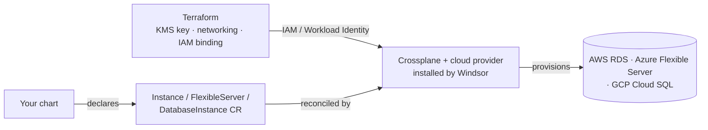

Database gives a chart a Postgres instance without it having to run or
manage one. Turn it on once and every chart gets the same
database-request contract, whether Postgres ends up living in the
cluster or in your cloud account.

## Turn it on

```yaml
database:
  postgres:
    enabled: true
```

By default (`driver: cloudnativepg`) this runs Postgres in-cluster via
the CloudNativePG operator — no cloud account needed, works the same on
every platform. A chart requests one with a `Cluster` CR; CloudNativePG
handles replication, failover, and backups for it.

## Going cloud-managed

```yaml
database:
  postgres:
    enabled: true
    driver: rds   # or: flexibleserver (Azure), cloudsql (GCP)
```

Switching the driver moves Postgres out of the cluster and into your
cloud account — AWS RDS, Azure Database for PostgreSQL Flexible Server,
or GCP Cloud SQL. Windsor installs Crossplane and the matching cloud
provider automatically; you don't enable that separately. A chart's
request shape changes to match — an `Instance`, `FlexibleServer`, or
`DatabaseInstance` CR instead of CloudNativePG's `Cluster` — but the
posture is the same either way: the chart declares what it wants, no
provider wiring or credentials of its own.

## Encryption at rest

Cloud-managed storage is always encrypted — that's never optional. What's
optional is whether Windsor creates a dedicated key for it. By default it
doesn't: encryption uses the driver's own platform-managed default (AWS's
default SSE-KMS key, Azure's platform-managed key, Google's default
encryption), and no key resource of any kind is created.

```yaml
database:
  postgres:
    encryption:
      managed: true   # create and manage a dedicated key instead
```

Bring your own key instead of either of those — this overrides `managed`,
so a dedicated key is neither created nor needed:

```yaml
database:
  postgres:
    encryption:
      kms_key_arn: arn:aws:kms:us-east-1:111122223333:key/...   # AWS
      # key_vault_key_id: "..."                                 # Azure
      # kms_key_name: "..."                                     # GCP
```

## Configuration

<!-- BEGIN_GUIDE_KNOBS -->

| Key | Type | Default | Description |
|-----|------|---------|-------------|
| `database.postgres.enabled` | boolean | `—` | Enable PostgreSQL database service. |
| `database.postgres.driver` | string | `cloudnativepg` | PostgreSQL database driver. One of: cloudnativepg, rds, flexibleserver, cloudsql. |
| `database.postgres.encryption.managed` | boolean | `false` | Create a dedicated customer-managed key instead of the driver's platform-managed default. |
| `database.postgres.encryption.kms_key_arn` | string | `—` | Existing AWS KMS key ARN for RDS storage encryption, overriding managed. |
| `database.postgres.encryption.key_vault_key_id` | string | `—` | Existing Azure Key Vault key ID for Flexible Server storage encryption, overriding managed. |
| `database.postgres.encryption.kms_key_name` | string | `—` | Existing GCP KMS CryptoKey resource name for Cloud SQL storage encryption, overriding managed. |

<!-- END_GUIDE_KNOBS -->

## Under the hood

Cloud-managed mode has two moving parts: Terraform prepares the
cloud-side prerequisites (KMS key, resource group, private networking,
and the IAM/Workload Identity binding Crossplane needs), and a
Kustomize add-on installs Crossplane plus the provider for the active
driver.



Monitoring is automatic once `telemetry.metrics.enabled` (the default):
Windsor provisions a `postgres_exporter` for every database instance,
no chart opt-in needed. A reusable app-credential mechanism is also
available per instance — a chart that wants a scoped, non-master
database user opts in rather than managing its own credential rotation.

## Reference

<!-- BEGIN_GUIDE_REFS -->

- [terraform/database/aws-rds](https://github.com/windsorcli/core/tree/main/terraform/database/aws-rds) on GitHub
- [terraform/database/azure-postgres](https://github.com/windsorcli/core/tree/main/terraform/database/azure-postgres) on GitHub
- [terraform/database/gcp-cloudsql](https://github.com/windsorcli/core/tree/main/terraform/database/gcp-cloudsql) on GitHub
- [terraform/provisioning/crossplane-identity/aws](https://github.com/windsorcli/core/tree/main/terraform/provisioning/crossplane-identity/aws) on GitHub
- [terraform/provisioning/crossplane-identity/azure](https://github.com/windsorcli/core/tree/main/terraform/provisioning/crossplane-identity/azure) on GitHub
- [terraform/provisioning/crossplane-identity/gcp](https://github.com/windsorcli/core/tree/main/terraform/provisioning/crossplane-identity/gcp) on GitHub
- [kustomize/database](https://github.com/windsorcli/core/tree/main/kustomize/database) on GitHub
- [kustomize/demo](https://github.com/windsorcli/core/tree/main/kustomize/demo) on GitHub
- [kustomize/observability](https://github.com/windsorcli/core/tree/main/kustomize/observability) on GitHub
- [kustomize/provisioning](https://github.com/windsorcli/core/tree/main/kustomize/provisioning) on GitHub
- [kustomize/provisioning/crossplane/aws-rds](https://github.com/windsorcli/core/tree/main/kustomize/provisioning/crossplane/aws-rds) on GitHub
- [kustomize/provisioning/crossplane/azure-postgres](https://github.com/windsorcli/core/tree/main/kustomize/provisioning/crossplane/azure-postgres) on GitHub
- [kustomize/provisioning/crossplane/gcp-cloudsql](https://github.com/windsorcli/core/tree/main/kustomize/provisioning/crossplane/gcp-cloudsql) on GitHub

<!-- END_GUIDE_REFS -->

- [Facets](https://www.windsorcli.dev/blueprints/facets) — how `database.postgres.driver` selects which of these actually run
