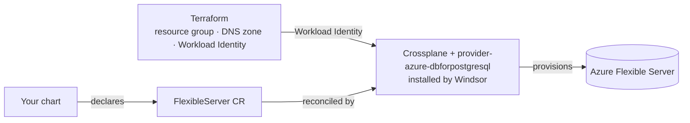

Moves Postgres out of the cluster and into Azure Database for PostgreSQL Flexible Server. Windsor installs Crossplane and its Azure provider automatically — you don't enable that separately.

## Turn it on

```yaml
database:
  postgres:
    enabled: true
    driver: azuredb
```

A chart's request shape changes to match: a `FlexibleServer` CR instead of CloudNativePG's `Cluster`. The posture is the same either way — the chart declares what it wants, no provider wiring or credentials of its own:

```yaml
apiVersion: dbforpostgresql.azure.upbound.io/v1beta1
kind: FlexibleServer
metadata:
  name: my-app-db
spec:
  forProvider:
    location: eastus
    version: "16"
    delegatedSubnetId: <network-output>
    privateDnsZoneId: <database-output>
    administratorLogin: myapp
    administratorPasswordSecretRef:
      name: my-app-db-admin-credentials
      namespace: system-provisioning
      key: password
    autoGeneratePassword: true
```

The database is a separate CR from the server — `FlexibleServer` carries no `dbName` field. Create it alongside:

```yaml
apiVersion: dbforpostgresql.azure.upbound.io/v1beta1
kind: FlexibleServerDatabase
metadata:
  name: myapp
spec:
  forProvider:
    name: myapp
    serverIdRef:
      name: my-app-db
```

## Encryption at rest

Flexible Server storage is always encrypted. By default that's Azure's own platform-managed key — no dedicated key resource of any kind is created.

```yaml
database:
  postgres:
    encryption:
      managed: true   # create and manage a dedicated Key Vault key instead
      # key_id: "..."   # or bring your own Key Vault key ID — overrides managed
```

## Under the hood

Terraform prepares the Azure-side prerequisites (resource group, private DNS zone, network security group, the Workload Identity binding Crossplane needs); a Kustomize add-on installs Crossplane plus `provider-azure-dbforpostgresql`.



Monitoring is automatic once `telemetry.metrics.enabled` (the default): Windsor provisions a `postgres_exporter` for every `FlexibleServer`, no chart opt-in needed. A reusable app-credential mechanism is also available — a chart that wants a scoped, non-master database user opts in rather than managing its own credential rotation.

## Reference

<!-- BEGIN_GUIDE_REFS -->

- [terraform/database/azure-postgres](https://github.com/windsorcli/core/tree/main/terraform/database/azure-postgres) on GitHub
- [terraform/provisioning/crossplane-identity/azure](https://github.com/windsorcli/core/tree/main/terraform/provisioning/crossplane-identity/azure) on GitHub
- [kustomize/database](https://github.com/windsorcli/core/tree/main/kustomize/database) on GitHub
- [kustomize/demo](https://github.com/windsorcli/core/tree/main/kustomize/demo) on GitHub
- [kustomize/observability](https://github.com/windsorcli/core/tree/main/kustomize/observability) on GitHub
- [kustomize/provisioning](https://github.com/windsorcli/core/tree/main/kustomize/provisioning) on GitHub
- [kustomize/provisioning/crossplane/azure-postgres](https://github.com/windsorcli/core/tree/main/kustomize/provisioning/crossplane/azure-postgres) on GitHub

<!-- END_GUIDE_REFS -->

- [Facets](https://www.windsorcli.dev/blueprints/facets) — how `database.postgres.driver` selects which of these actually run
