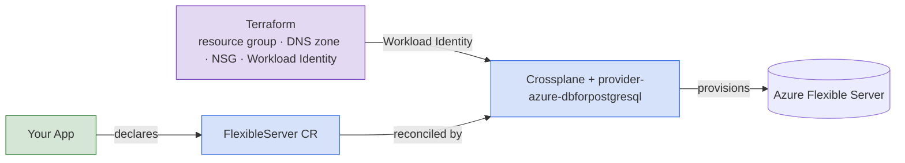

Flexible Server is the default cloud driver when `platform: azure`. When enabled, the Crossplane operator and `provider-azure-dbforpostgresql` are installed in the `system-provisioning` namespace.

## Turn it on

```yaml
database:
  postgres:
    cloud:
      enabled: true
```

`cloud.driver` defaults to `azuredb` on Azure.

To launch a Flexible Server, use the following [FlexibleServer](https://marketplace.upbound.io/providers/upbound/provider-azure-dbforpostgresql/v2.7.2/resources/dbforpostgresql.azure.upbound.io/FlexibleServer/v1beta1) manifest:

```yaml
apiVersion: dbforpostgresql.azure.upbound.io/v1beta1
kind: FlexibleServer
metadata:
  name: my-app-db
spec:
  forProvider:
    location: eastus
    version: "16"
    skuName: B_Standard_B1ms
    storageMb: 32768
    administratorLogin: myapp
    autoGeneratePassword: true
    administratorPasswordSecretRef:
      name: my-app-db-admin-credentials
      namespace: system-database
      key: password
    publicNetworkAccessEnabled: false
    # Injected automatically at admission:
    # resourceGroupName: my-cluster-postgres
    # delegatedSubnetId: /subscriptions/<subscription-id>/resourceGroups/my-cluster/providers/Microsoft.Network/virtualNetworks/my-cluster/subnets/postgres
    # privateDnsZoneId: /subscriptions/<subscription-id>/resourceGroups/my-cluster-postgres/providers/Microsoft.Network/privateDnsZones/my-cluster.postgres.database.azure.com
    # tags:
    #   WindsorContextID: a1b2c3d4
```

`location` must match the region of the delegated subnet. `FlexibleServer` has no database name field, so also create a [FlexibleServerDatabase](https://marketplace.upbound.io/providers/upbound/provider-azure-dbforpostgresql/v2.7.2/resources/dbforpostgresql.azure.upbound.io/FlexibleServerDatabase/v1beta1) that references the server:

```yaml
apiVersion: dbforpostgresql.azure.upbound.io/v1beta1
kind: FlexibleServerDatabase
metadata:
  name: myapp
spec:
  forProvider:
    serverIdRef:
      name: my-app-db
```

At admission, a Kyverno policy sets `resourceGroupName` to the context's Postgres resource group and fills in `delegatedSubnetId` and `privateDnsZoneId` if you leave them out. The Crossplane identity's role assignment is scoped to that resource group, so it can only manage servers inside it.

## Deletion

Deleting a `FlexibleServer` deletes the server and its databases. That is the Crossplane default, `spec.deletionPolicy: Delete`. Set `deletionPolicy: Orphan` to leave the server in Azure when the resource is removed.

`FlexibleServer` has no deletion protection field of its own, so `deletionPolicy` is the only safeguard in the manifest. Deleting the server removes its databases as well, so the demo sets `deletionPolicy: Orphan` on the `FlexibleServerDatabase`.

## Encryption at rest

Flexible Server storage is always encrypted, by default with the Azure platform-managed key. You may provide your own Key Vault key, or allow the blueprint to manage one for you.

```yaml
database:
  postgres:
    cloud:
      encryption:
        managed: true   # create a dedicated Key Vault key
        # key_id: https://my-vault.vault.azure.net/keys/my-key/0123456789abcdef   # use an existing key; overrides managed
```

`managed` has no effect when `ephemeral: true`. With either option set, a second Kyverno policy fills in `identity` and `customerManagedKey` on any `FlexibleServer` that omits them.

## Under the hood

Terraform creates the resource group, a private DNS zone, a network security group open only to the cluster's node subnets, the Key Vault key if `managed` is set, and the Workload Identity and role assignment for the Crossplane provider. Kustomize installs Crossplane and the provider.


```mermaid
flowchart LR
  tf[Terraform<br/>resource group · DNS zone · NSG · Workload Identity]
  crossplane[Crossplane + provider-azure-dbforpostgresql]
  app[Your App]
  cr[FlexibleServer CR]
  azure[(Azure Flexible Server)]

  tf -->|Workload Identity| crossplane
  app -->|declares| cr
  cr -->|reconciled by| crossplane
  crossplane -->|provisions| azure
  classDef terraform fill:#7B42BC33,stroke:#7B42BC
  classDef k8s fill:#326CE533,stroke:#326CE5
  classDef app fill:#2E7D3233,stroke:#2E7D32
  class tf terraform
  class crossplane,cr k8s
  class app app
```

## Application roles

To give an application its own database user, create an `AppRole` with `instanceName` set to the name of the `FlexibleServer` and `databaseName` set to a `FlexibleServerDatabase` on it. See [Application roles](index.md#application-roles) for the full resource and the Secret it produces.

## Monitoring

Monitoring works the same on every cloud driver. See [Monitoring](index.md#monitoring).

## Reference

- [terraform/database/azure-postgres](../../../terraform/database/azure-postgres)
- [terraform/provisioning/crossplane-identity/azure](../../../terraform/provisioning/crossplane-identity/azure)
- [kustomize/database](../../../kustomize/database)
- [kustomize/demo/resources/database/azuredb](../../../kustomize/demo/resources/database/azuredb)
- [kustomize/observability](../../../kustomize/observability)
- [kustomize/provisioning](../../../kustomize/provisioning)
- [kustomize/provisioning/crossplane/azure-postgres](../../../kustomize/provisioning/crossplane/azure-postgres)
