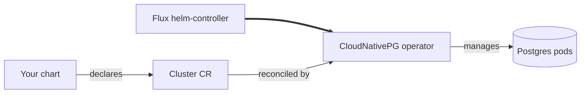

CloudNativePG gives a chart a Postgres instance without it having to run or manage one, entirely inside the cluster — no cloud account needed, and it works the same on every platform.

## Turn it on

```yaml
database:
  postgres:
    enabled: true
```

This is the default driver (`driver: cloudnativepg`), so `enabled: true` alone is enough. A chart requests a database with a `Cluster` CR; CloudNativePG handles replication, failover, and backups for it.

## Under the hood



Monitoring is automatic once `telemetry.metrics.enabled` (the default): Windsor provisions a `postgres_exporter` for every `Cluster`, no chart opt-in needed.

## Reference

<!-- BEGIN_GUIDE_REFS -->

- [kustomize/database](https://github.com/windsorcli/core/tree/main/kustomize/database) on GitHub
- [kustomize/demo](https://github.com/windsorcli/core/tree/main/kustomize/demo) on GitHub
- [kustomize/observability](https://github.com/windsorcli/core/tree/main/kustomize/observability) on GitHub

<!-- END_GUIDE_REFS -->

- [Facets](https://www.windsorcli.dev/blueprints/facets) — how `database.postgres.driver` selects which of these actually run
