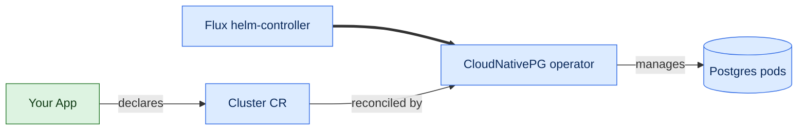

CloudNativePG runs Postgres inside the cluster. It works on any platform and needs no cloud account, including on AWS, Azure, and GCP.

## Turn it on

```yaml
database:
  postgres:
    enabled: true
```

When enabled, the CloudNativePG operator is installed in the `system-database` namespace and watches every namespace. Core creates no application databases; add-ons that need Postgres, such as Keycloak, create their own `Cluster`.

This setting is independent of `database.postgres.cloud`, so both can be enabled at once.

To launch a database, use the following [Cluster](https://cloudnative-pg.io/documentation/current/cloudnative-pg.v1/#postgresql-cnpg-io-v1-Cluster) manifest:

```yaml
apiVersion: postgresql.cnpg.io/v1
kind: Cluster
metadata:
  name: my-app-db
  namespace: my-app
spec:
  instances: 2
  bootstrap:
    initdb:
      database: myapp
  storage:
    size: 1Gi
  monitoring:
    enablePodMonitor: true
```

The operator replicates and fails over the instances. Core configures no backups; set them in the `Cluster` spec. The operator also generates a `basic-auth` Secret named `<cluster name>-app` (`my-app-db-app` here) in the `Cluster`'s namespace. It holds the username, password, RW service hostname, port, database name, and ready-made connection URIs, and the user owns the database. See [Secrets](https://cloudnative-pg.io/documentation/current/applications/#secrets) in the CloudNativePG docs.

## Topology

The context's `topology` setting changes how the operator itself runs:

- `ha` runs two operator replicas with pod anti-affinity across nodes and adds a PodDisruptionBudget so one replica stays up during node drains.
- `single-node` turns off the operator's leader election, which avoids constant lease writes to etcd on a one-node cluster.

`topology` does not affect your databases. The number of Postgres instances, and therefore whether a database fails over, comes from `spec.instances` on the `Cluster`. A `Cluster` with `instances: 1` is a single Postgres instance on any topology.

## Alerts

The telemetry add-on installs seven Prometheus alert rules for CloudNativePG, taken from the operator's own sample set. They are installed when `database.postgres.enabled`, `telemetry.metrics.enabled` and `telemetry.alerts.enabled` are all true, which is the default for the last two. They read the operator's `cnpg_*` metrics, so a `Cluster` needs `monitoring.enablePodMonitor: true` for its instances to be scraped.

Every rule has severity `warning` and fires after its condition has held for one minute:

| Alert | Fires when |
|---|---|
| `LongRunningTransaction` | A query has been running for more than 5 minutes. |
| `BackendsWaiting` | More than 300 backends are waiting on another query. |
| `PGDatabase` | Transaction ID age passes 300 million. |
| `PGReplication` | A standby is more than 5 minutes behind the primary. |
| `LastFailedArchiveTime` | WAL archiving failed more recently than it last succeeded. |
| `DatabaseDeadlockConflicts` | More than 10 deadlocks are recorded. |
| `ReplicaFailingReplication` | A replica is in recovery but its WAL receiver is not running. |

## Under the hood


```mermaid
flowchart LR
  flux[Flux helm-controller]
  operator[CloudNativePG operator]
  app[Your App]
  cluster[Cluster CR]
  pg[(Postgres pods)]

  flux ==> operator
  app -->|declares| cluster
  cluster -->|reconciled by| operator
  operator -->|manages| pg
  classDef k8s fill:#DCEBFF,stroke:#326CE5,color:#0B2A5B
  classDef app fill:#DDF3E1,stroke:#2E7D32,color:#123D17
  class flux,operator,cluster,pg k8s
  class app app
```

## Reference

- [kustomize/database](../../../kustomize/database)
- [kustomize/demo/resources/database/cloudnativepg](../../../kustomize/demo/resources/database/cloudnativepg)
- [kustomize/observability](../../../kustomize/observability)
- [kustomize/telemetry](../../../kustomize/telemetry)
