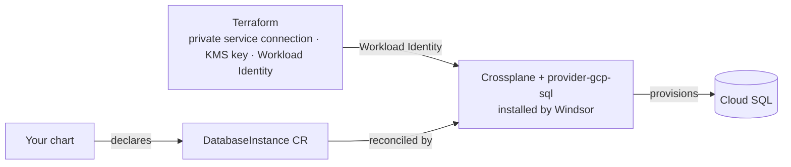

Moves Postgres out of the cluster and into GCP Cloud SQL. Windsor installs Crossplane and its GCP provider automatically — you don't enable that separately.

## Turn it on

```yaml
database:
  postgres:
    enabled: true
    driver: cloudsql
```

A chart's request shape changes to match: a `DatabaseInstance` CR instead of CloudNativePG's `Cluster`, declaring what it wants with no provider wiring or credentials of its own. There's no worked YAML example here yet; the `DatabaseInstance` CR comes from `provider-gcp-sql` — see its own CRD reference for the exact shape.

## Encryption at rest

Cloud SQL storage is always encrypted. By default that's Google's own managed encryption — no dedicated key resource of any kind is created.

```yaml
database:
  postgres:
    encryption:
      managed: true   # create and manage a dedicated KMS key instead
      # key_id: "..."   # or bring your own CryptoKey resource name — overrides managed
```

## Under the hood

Terraform prepares the GCP-side prerequisites (private service connection, KMS key, the Workload Identity binding Crossplane needs); a Kustomize add-on installs Crossplane plus `provider-gcp-sql`.



Cloud SQL's own `User` resource has no auto-generate-and-write-to-Secret mechanism for Postgres the way RDS and Flexible Server do — `passwordSecretRef` only ever reads an existing Secret. Terraform generates and writes the admin password Secret instead.

Monitoring is automatic once `telemetry.metrics.enabled` (the default): Windsor provisions a `postgres_exporter` for every `DatabaseInstance`, no chart opt-in needed. A reusable app-credential mechanism is also available — a chart that wants a scoped, non-master database user opts in rather than managing its own credential rotation.

## Reference

<!-- BEGIN_GUIDE_REFS -->

- [terraform/database/gcp-cloudsql](https://github.com/windsorcli/core/tree/main/terraform/database/gcp-cloudsql) on GitHub
- [terraform/provisioning/crossplane-identity/gcp](https://github.com/windsorcli/core/tree/main/terraform/provisioning/crossplane-identity/gcp) on GitHub
- [kustomize/database](https://github.com/windsorcli/core/tree/main/kustomize/database) on GitHub
- [kustomize/demo](https://github.com/windsorcli/core/tree/main/kustomize/demo) on GitHub
- [kustomize/observability](https://github.com/windsorcli/core/tree/main/kustomize/observability) on GitHub
- [kustomize/provisioning](https://github.com/windsorcli/core/tree/main/kustomize/provisioning) on GitHub
- [kustomize/provisioning/crossplane/gcp-cloudsql](https://github.com/windsorcli/core/tree/main/kustomize/provisioning/crossplane/gcp-cloudsql) on GitHub

<!-- END_GUIDE_REFS -->

- [Facets](https://www.windsorcli.dev/blueprints/facets) — how `database.postgres.driver` selects which of these actually run
