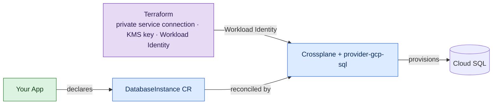

Cloud SQL is the default cloud driver when `platform: gcp`. When enabled, the Crossplane operator and `provider-gcp-sql` are installed in the `system-provisioning` namespace.

## Turn it on

```yaml
database:
  postgres:
    cloud:
      enabled: true
```

`cloud.driver` defaults to `cloudsql` on GCP.

To launch a Cloud SQL instance, use the following [DatabaseInstance](https://marketplace.upbound.io/providers/upbound/provider-gcp-sql/v3.0.2/resources/sql.gcp.upbound.io/DatabaseInstance/v1beta2) manifest:

```yaml
apiVersion: sql.gcp.upbound.io/v1beta2
kind: DatabaseInstance
metadata:
  name: my-app-db
spec:
  forProvider:
    region: us-central1
    databaseVersion: POSTGRES_16
    deletionProtection: true
    settings:
      deletionProtectionEnabled: true
      edition: ENTERPRISE
      tier: db-f1-micro
      ipConfiguration:
        ipv4Enabled: false
        # Injected automatically at admission:
        # privateNetwork: projects/my-project/global/networks/my-cluster
    # Injected automatically at admission:
    # project: my-project
    # settings.userLabels:
    #   windsor_context_id: a1b2c3d4
    # encryptionKeyName: projects/my-project/locations/us-central1/keyRings/my-cluster/cryptoKeys/postgres
```

`encryptionKeyName` is only injected when a dedicated key is configured (see below). The instance holds no database, so also create a [Database](https://marketplace.upbound.io/providers/upbound/provider-gcp-sql/v3.0.2/resources/sql.gcp.upbound.io/Database/v1beta1) that references it:

```yaml
apiVersion: sql.gcp.upbound.io/v1beta1
kind: Database
metadata:
  name: myapp
spec:
  forProvider:
    instanceRef:
      name: my-app-db
```

Cloud SQL cannot generate an admin password, so a Crossplane `WatchOperation` generates one, stores it in a Secret named `<instance>-admin-credentials` in `system-database`, and sets it on an admin user for the instance. You don't declare it.

At admission, a Kyverno policy sets `project` to the context's project and the `windsor_context_id` label, and fills in `privateNetwork` if you leave it out. The Crossplane service account has project-wide access, so `project` keeps a chart from pointing at the wrong project but does not restrict what the account can reach.

## Deletion

Deleting a `DatabaseInstance` deletes the Cloud SQL instance. That is the Crossplane default, `spec.deletionPolicy: Delete`. Set `deletionPolicy: Orphan` to leave the instance in GCP when the resource is removed.

Cloud SQL has two protections. `deletionProtection` blocks deletion through the provider, and the provider enables it by default. `settings.deletionProtectionEnabled` enables GCP's own protection, which also blocks deletion from the console and `gcloud`. For throwaway environments set `deletionProtection: false`, as the demo does. The `Database` resource is a separate object, and the demo sets `deletionPolicy: Orphan` on it.

## Encryption at rest

Cloud SQL storage is always encrypted, by default with a Google-managed key. You may provide your own Cloud KMS key, or allow the blueprint to manage one for you.

```yaml
database:
  postgres:
    cloud:
      encryption:
        managed: true   # create a dedicated KMS key
        # key_id: projects/my-project/locations/us-central1/keyRings/my-ring/cryptoKeys/my-key   # use an existing key; overrides managed
```

`managed` has no effect when `ephemeral: true`. With either option set, a second Kyverno policy fills in `encryptionKeyName` on any `DatabaseInstance` that omits it.

## Under the hood

Terraform creates the private service connection, the KMS key if `managed` is set, and the service account and Workload Identity binding for the Crossplane provider. Kustomize installs Crossplane and the provider.


```mermaid
flowchart LR
  tf[Terraform<br/>private service connection · KMS key · Workload Identity]
  crossplane[Crossplane + provider-gcp-sql]
  app[Your App]
  cr[DatabaseInstance CR]
  gcp[(Cloud SQL)]

  tf -->|Workload Identity| crossplane
  app -->|declares| cr
  cr -->|reconciled by| crossplane
  crossplane -->|provisions| gcp
  classDef terraform fill:#E6DAF5,stroke:#7B42BC,color:#2E1A4F
  classDef k8s fill:#DCEBFF,stroke:#326CE5,color:#0B2A5B
  classDef app fill:#DDF3E1,stroke:#2E7D32,color:#123D17
  class tf terraform
  class crossplane,cr k8s
  class app app
```

## Reference

- [terraform/database/gcp-cloudsql](../../../terraform/database/gcp-cloudsql)
- [terraform/provisioning/crossplane-identity/gcp](../../../terraform/provisioning/crossplane-identity/gcp)
- [kustomize/database](../../../kustomize/database)
- [kustomize/demo/resources/database/cloudsql](../../../kustomize/demo/resources/database/cloudsql)
- [kustomize/observability](../../../kustomize/observability)
- [kustomize/provisioning](../../../kustomize/provisioning)
- [kustomize/provisioning/crossplane/gcp-cloudsql](../../../kustomize/provisioning/crossplane/gcp-cloudsql)
