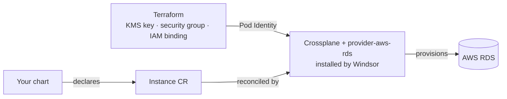

Moves Postgres out of the cluster and into AWS RDS. Windsor installs Crossplane and its AWS provider automatically — you don't enable that separately.

## Turn it on

```yaml
database:
  postgres:
    enabled: true
    driver: rds
```

A chart's request shape changes to match: an `Instance` CR instead of CloudNativePG's `Cluster`. The posture is the same either way — the chart declares what it wants, no provider wiring or credentials of its own:

```yaml
apiVersion: rds.aws.upbound.io/v1beta3
kind: Instance
metadata:
  name: my-app-db
spec:
  forProvider:
    region: us-east-1
    engine: postgres
    instanceClass: db.t4g.micro
    dbSubnetGroupName: <cluster-name>-crossplane-rds
```

## Encryption at rest

RDS storage is always encrypted. By default that's AWS's own SSE-KMS key — no dedicated key resource of any kind is created.

```yaml
database:
  postgres:
    encryption:
      managed: true   # create and manage a dedicated KMS key instead
      # key_id: arn:aws:kms:us-east-1:111122223333:key/...   # or bring your own — overrides managed
```

## Under the hood

Terraform prepares the AWS-side prerequisites (KMS key, security group, the IAM/Pod Identity binding Crossplane needs); a Kustomize add-on installs Crossplane plus `provider-aws-rds`.



Monitoring is automatic once `telemetry.metrics.enabled` (the default): Windsor provisions a `postgres_exporter` for every `Instance`, no chart opt-in needed. A reusable app-credential mechanism is also available — a chart that wants a scoped, non-master database user opts in rather than managing its own credential rotation.

## Reference

<!-- BEGIN_GUIDE_REFS -->

- [terraform/database/aws-rds](https://github.com/windsorcli/core/tree/main/terraform/database/aws-rds) on GitHub
- [terraform/provisioning/crossplane-identity/aws](https://github.com/windsorcli/core/tree/main/terraform/provisioning/crossplane-identity/aws) on GitHub
- [kustomize/database](https://github.com/windsorcli/core/tree/main/kustomize/database) on GitHub
- [kustomize/demo](https://github.com/windsorcli/core/tree/main/kustomize/demo) on GitHub
- [kustomize/observability](https://github.com/windsorcli/core/tree/main/kustomize/observability) on GitHub
- [kustomize/provisioning](https://github.com/windsorcli/core/tree/main/kustomize/provisioning) on GitHub
- [kustomize/provisioning/crossplane/aws-rds](https://github.com/windsorcli/core/tree/main/kustomize/provisioning/crossplane/aws-rds) on GitHub

<!-- END_GUIDE_REFS -->

- [Facets](https://www.windsorcli.dev/blueprints/facets) — how `database.postgres.driver` selects which of these actually run
