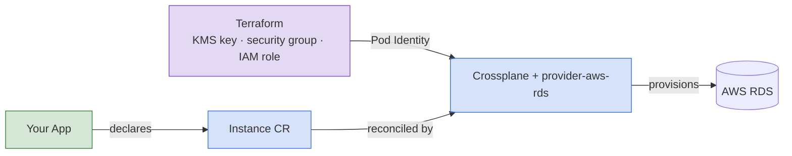

RDS is the default cloud driver when `platform: aws`. When enabled, the Crossplane operator and `provider-aws-rds` are installed in the `system-provisioning` namespace.

## Turn it on

```yaml
database:
  postgres:
    cloud:
      enabled: true
```

`cloud.driver` defaults to `rds` on AWS.

To launch an RDS database, use the following [Instance](https://marketplace.upbound.io/providers/upbound/provider-aws-rds/v2.7.2/resources/rds.aws.upbound.io/Instance/v1beta3) manifest:

```yaml
apiVersion: rds.aws.upbound.io/v1beta3
kind: Instance
metadata:
  name: my-app-db
spec:
  forProvider:
    region: us-east-1
    engine: postgres
    engineVersion: "16"
    instanceClass: db.t4g.micro
    allocatedStorage: 20
    dbName: myapp
    username: myapp
    autoGeneratePassword: true
    passwordSecretRef:
      name: my-app-db-admin-credentials
      namespace: system-database
      key: password
    storageEncrypted: true
    publiclyAccessible: false
    deletionProtection: true
    finalSnapshotIdentifier: my-app-db-final
    # Injected automatically at admission:
    # dbSubnetGroupName: rds-a1b2c3d4
    # vpcSecurityGroupIds: [sg-0123456789abcdef0]
    # kmsKeyId: arn:aws:kms:us-east-1:111122223333:key/1234abcd-12ab-34cd-56ef-1234567890ab
    # tags:
    #   windsorcli.dev/cluster: my-cluster
    #   WindsorContextID: a1b2c3d4
```

At admission, a Kyverno policy adds the `windsorcli.dev/cluster: <cluster-name>` tag and fills in `dbSubnetGroupName`, `vpcSecurityGroupIds`, and `kmsKeyId` for you. The Crossplane IAM role is scoped to only work with databases that include this tag.

## Deletion

Deleting an `Instance` deletes the RDS database. That is the Crossplane default, `spec.deletionPolicy: Delete`. Set `deletionPolicy: Orphan` to leave the database in AWS when the resource is removed.

RDS adds its own checks. `deletionProtection: true` blocks deletion until you turn it off. Unless `skipFinalSnapshot: true` is set, deletion also takes a final snapshot and needs a `finalSnapshotIdentifier`. Keep both protections for databases you can't recreate. For throwaway environments set `deletionProtection: false` and `skipFinalSnapshot: true`, as the demo does.

## Encryption at rest

RDS storage is always encrypted, by default with the AWS-managed key. You may provide your own KMS key, or allow the blueprint to manage one for you.

```yaml
database:
  postgres:
    cloud:
      encryption:
        managed: true   # create a dedicated KMS key
        # key_id: arn:aws:kms:us-east-1:111122223333:key/...   # use an existing key; overrides managed
```

`managed` has no effect when `ephemeral: true`

## Under the hood

Terraform creates the KMS key if `managed` is set, a security group open only to the cluster's nodes, and the IAM role and Pod Identity association for the Crossplane provider. Kustomize installs Crossplane and the provider.


```mermaid
flowchart LR
  tf[Terraform<br/>KMS key · security group · IAM role]
  crossplane[Crossplane + provider-aws-rds]
  app[Your App]
  cr[Instance CR]
  aws[(AWS RDS)]

  tf -->|Pod Identity| crossplane
  app -->|declares| cr
  cr -->|reconciled by| crossplane
  crossplane -->|provisions| aws
  classDef terraform fill:#7B42BC33,stroke:#7B42BC
  classDef k8s fill:#326CE533,stroke:#326CE5
  classDef app fill:#2E7D3233,stroke:#2E7D32
  class tf terraform
  class crossplane,cr k8s
  class app app
```

## Reference

- [terraform/database/aws-rds](../../../terraform/database/aws-rds)
- [terraform/provisioning/crossplane-identity/aws](../../../terraform/provisioning/crossplane-identity/aws)
- [kustomize/database](../../../kustomize/database)
- [kustomize/demo/resources/database/rds](../../../kustomize/demo/resources/database/rds)
- [kustomize/observability](../../../kustomize/observability)
- [kustomize/provisioning](../../../kustomize/provisioning)
- [kustomize/provisioning/crossplane/aws-rds](../../../kustomize/provisioning/crossplane/aws-rds)
