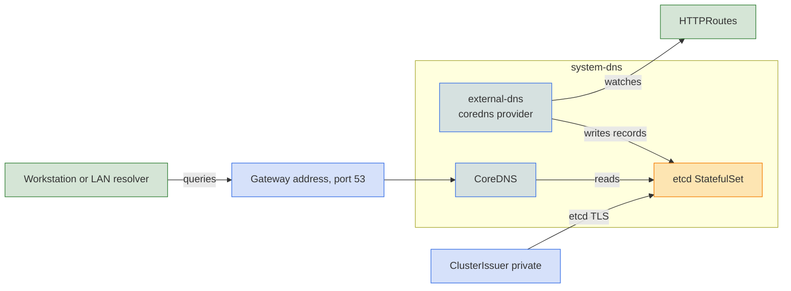

Local clusters and metal have no cloud zone to write to, so Core runs CoreDNS in the cluster as the authoritative server for one domain.

## Turn it on

```yaml
dns:
  private_domain: internal.test
  private:
    enabled: true
```

Core installs CoreDNS and an etcd StatefulSet in `system-dns` and points external-dns at them. external-dns writes records into etcd as routes appear, and CoreDNS answers for everything under `dns.private_domain` from those records. Both reach etcd over mutual TLS, with certificates from the `private` [cluster issuer](../pki/index.md). With `topology: ha`, CoreDNS runs several replicas. Dev mode turns all of this on with the domain `test`.

## Reach it

CoreDNS listens on port 53, and the gateway driver determines how clients reach it.

| `gateway.driver` | Port 53 exposed through |
|---|---|
| [`envoy`](../gateway/envoy.md#private-dns) | UDP and TCP routes on the `external` Gateway. On NodePort clusters, a node port. |
| [`cilium`](../gateway/cilium.md#private-dns) | A `LoadBalancer` Service that shares the gateway address through LB IPAM. |

The address must fall inside `network.loadbalancer_ips`. On a local cluster, the workstation's stub resolver forwards the private domain to it. On metal the address is routable on the LAN. LAN clients can query it directly, or an upstream resolver can forward `*.<dns.private_domain>` to it.

## Under the hood



## Reference

- [kustomize/dns](../../../kustomize/dns)
- [kustomize/gateway](../../../kustomize/gateway)
- [kustomize/pki](../../../kustomize/pki)
