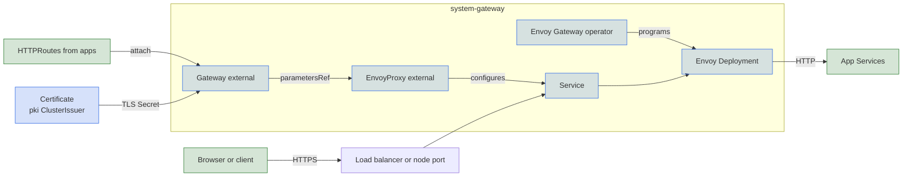

Envoy Gateway is the default driver on AWS, on docker-desktop, and on any cluster that does not use the [Cilium CNI](../cni/cilium.md). It runs its own controller and a dedicated Envoy proxy per Gateway, and costs more resources than the [Cilium](cilium.md) driver, which reuses the Envoy that Cilium already runs on each node. In return you get Envoy's route extensions: `HTTPRouteFilter`, external authorization, and response rewrites.

## Turn it on

```yaml
gateway:
  driver: envoy
```

Core installs the Envoy Gateway operator in `system-gateway`, along with the `external` Gateway, which uses the `envoy` GatewayClass. The operator creates an Envoy Deployment and a Service for it. The Gateway API and Envoy Gateway CRDs come from the vendored CRD layer.

## Unmatched requests

Any HTTPS request that matches no `HTTPRoute` gets a `404` page from the proxy, sent with `Cache-Control: no-store` so browsers do not cache it after the hostname gets a real route. Plain HTTP never gets this far, because the HTTP listener redirects it to HTTPS.

With a public domain or a private gateway, external-dns also publishes the apex and a wildcard record (`example.com` and `*.example.com`) pointing at the gateway. A hostname with no route therefore resolves and lands on the 404.

## Data plane Service

The Gateway references an `EnvoyProxy` named `external` that configures the proxy. It pins the Envoy image by digest, which the cluster's Kyverno policy requires, and sets the platform-critical priority class. The Service type follows `gateway.service_type`:

| Environment | Service | Added |
|---|---|---|
| AWS | `LoadBalancer` | NLB annotations with `target-type: ip`, which send traffic straight to the Envoy pods with the client address preserved, plus cross-zone balancing. The scheme is `internet-facing`, or `internal` with `gateway.access: private`. |
| Azure with `gateway.access: private` | `LoadBalancer` | The internal load balancer annotation. |
| GCP with `gateway.access: private` | `LoadBalancer` | The internal load balancer annotation (`networking.gke.io/load-balancer-type: Internal`). |
| Hetzner | `LoadBalancer` | Annotations for a Hetzner Cloud load balancer in `hetzner.location` (default `ash`) that targets the nodes' public IPs. |
| Local with MetalLB or kube-vip | `LoadBalancer` | A fixed address, the first in `network.loadbalancer_ips`. |
| Azure or GCP, public | `LoadBalancer` | None. The cloud controller assigns an address. |
| docker-desktop, or `service_type: NodePort` | `NodePort` | Extra node ports, listed below. |

On `NodePort` the Service listens on `30080` for HTTP and `30443` for HTTPS. With `dns.private.enabled` it also exposes UDP and TCP port 53 on `30053`, and with `gitops.mode: push` (the default) the Flux webhook on `30292`. `gateway.publish_ports` maps host ports to these node ports.

docker-desktop publishes the proxy on host ports `8443` and `8080`. The Service carries matching ports without node ports. A pod can then reach a hostname on the same port a browser uses.

## Private DNS

`dns.private.enabled` adds UDP and TCP listeners on port 53 to the Gateway and routes them to CoreDNS. On docker-desktop, a second Service at the fixed address `10.96.0.53` selects the same Envoy pods. external-dns points the workstation domain at that address, so a pod that resolves `grafana.test` reaches a listener on the right port. The zone itself is covered under [Private zones](../dns/private.md).

## Monitoring

With `telemetry.metrics.enabled`, Prometheus scrapes the proxies through a PodMonitor and the operator through a ServiceMonitor. The operator installs after the telemetry stack. `observability.enabled` adds an Envoy dashboard.

## Under the hood



TLS ends at Envoy, using a certificate from one of the [cluster issuers](../pki/index.md). The Gateway waits for the `pki` resources tier so the issuer exists when the certificate is requested. Each Gateway has its own `EnvoyProxy`, and there is no controller-wide default.

## Reference

- [kustomize/gateway/install/envoy](../../../kustomize/gateway/install/envoy)
- [kustomize/gateway/resources/envoy](../../../kustomize/gateway/resources/envoy)
- [kustomize/crds](../../../kustomize/crds)
- [kustomize/lb](../../../kustomize/lb)
- [kustomize/pki](../../../kustomize/pki)
