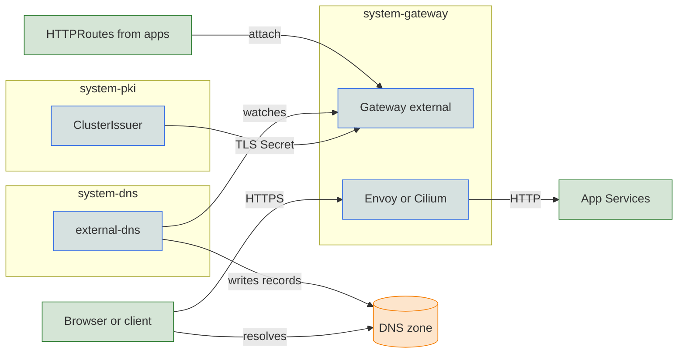

The core blueprint exposes cluster services through a single Gateway built on the Kubernetes [Gateway API](https://gateway-api.sigs.k8s.io/). An application gets a hostname by attaching an `HTTPRoute` to it, and the [DNS](../dns/index.md) records and [TLS certificate](../pki/index.md) for that hostname come from the `dns` and `pki` settings. The gateway is on by default. The following config can be placed in a context's `values.yaml` file to change how it runs.

```yaml
gateway:
  enabled: true
  driver: envoy          # envoy or cilium
  access: public         # public or private
dns:
  public_domain: example.com
```

`gateway.driver` defaults to `envoy` on AWS and docker-desktop. Elsewhere it follows the [CNI](../cni/index.md#defaults): `cilium` when Cilium is the CNI, `envoy` otherwise.

| `gateway.driver` | What Core does |
|---|---|
| [`envoy`](envoy.md) | Installs the Envoy Gateway operator and runs an Envoy data plane in `system-gateway`. |
| [`cilium`](cilium.md) | Uses the Gateway API controller built into the [Cilium CNI](../cni/cilium.md), served by the Envoy that Cilium runs on each node. |

Both drivers run Envoy and implement the same Gateway API. They differ in who manages Envoy and where it runs: Envoy Gateway runs a dedicated proxy Deployment per Gateway under its own controller, and Cilium runs one `cilium-envoy` pod per node under cilium-operator. Routes written against the Gateway API work with either.

## Hostnames

The entrypoint is a `Gateway` named `external` in `system-gateway`, with an HTTPS listener and an HTTP listener that redirects to HTTPS. Add-ons attach their own routes to it, such as `grafana.<domain>` and `keycloak.<domain>`. An application of yours attaches the same way:

```yaml
apiVersion: gateway.networking.k8s.io/v1
kind: HTTPRoute
metadata:
  name: my-app
  namespace: my-app
spec:
  parentRefs:
    - name: external
      namespace: system-gateway
  hostnames:
    - my-app.example.com
  rules:
    - backendRefs:
        - name: my-app
          port: 80
```

The Gateway's certificate covers `<domain>` and `*.<domain>`, so a new subdomain needs no new certificate. `<domain>` is `dns.public_domain` if set, then `dns.private_domain`, then `dns.domain`. A private gateway always uses `dns.private_domain`, and dev mode defaults `dns.domain` to `test`. On docker-desktop the URLs carry port `:8443`, the host port the gateway is forwarded to.

## Access

`gateway.access` decides who can reach the gateway. It moves the load balancer, the DNS zone, and the certificate issuer together.

| `gateway.access` | Load balancer | DNS records go to | Certificates come from |
|---|---|---|---|
| `public` | Reachable from the internet. | The public zone, when `dns.public_domain` is set. | See [PKI](../pki/index.md#issuers). |
| `private` | Internal to the VPC or network. | The private zone for `dns.private_domain`. | The private issuer. |

On AWS, Azure, and GCP, a private gateway gets an internal load balancer.

## Service exposure

`gateway.service_type` sets how traffic reaches the proxy, with a default per platform.

| `gateway.service_type` | Default on | Reached through |
|---|---|---|
| `LoadBalancer` | Every platform except docker-desktop. | A cloud load balancer, or a MetalLB or kube-vip address from `network.loadbalancer_ips`. |
| `NodePort` | docker-desktop. | A node port in the 30000-32767 range. Set it elsewhere to skip the load balancer, as on single-node Talos VMs. |

On Hyper-V with `NodePort`, `gateway.publish_ports` forwards a host port to a node port in the VM. The gateway can then answer on `80` and `443` while the cluster keeps its node ports in the usual range. Keys are host ports, and values are the node ports listed under [Envoy](envoy.md#data-plane-service).

Hyper-V already forwards the Kubernetes API (`6443`), the Talos APIs, and, when enabled, the private DNS node port (`30053`) and the Flux webhook node port (`30292`). A key that reuses one of those host ports is rejected. HTTP and HTTPS are not in the default set. This setting is the only way to expose them, and no other platform reads it.

```yaml
gateway:
  service_type: NodePort
  publish_ports:
    "80": 30080
    "443": 30443
```

## DNS and certificates

Setting `dns.public_domain` creates a public zone at your cloud provider and issues Let's Encrypt certificates. See [Public zones](../dns/public.md) and [ACME](../pki/acme.md). On local clusters and metal, `dns.private.enabled` serves a private zone from CoreDNS instead. See [Private zones](../dns/private.md).

With neither setting, the gateway certificate comes from a self-signed issuer or the [private CA](../pki/private-ca.md), and browsers warn until the root is trusted. The [PKI](../pki/index.md#issuers) page lists the issuer for each configuration.

## Requirements

Windsor rejects these combinations when it validates the configuration:

- `gateway.access: private` needs `dns.private_domain`.
- Grafana SSO and kubectl OIDC with the hosted Keycloak need the gateway enabled. See [Identity](../identity/index.md#requirements).

A disabled gateway leaves services reachable only inside the cluster or through `kubectl port-forward`.

## Under the hood



TLS ends at the proxy. The Gateway waits for the `pki` resources tier, not just cert-manager. Its issuer has to exist when the certificate is requested.

## Configuration

| Key | Type | Default | Description |
|-----|------|---------|-------------|
| `gateway.enabled` | boolean | `true` | Enable the cluster entrypoint. |
| `gateway.driver` | string | by platform | `envoy` or `cilium`. |
| `gateway.access` | string | `public` | `public` or `private`. Private needs `dns.private_domain`. |
| `gateway.service_type` | string | by platform | `LoadBalancer` or `NodePort`. |
| `gateway.publish_ports` | map | none | Host port to node port. Read only on Hyper-V with `NodePort`. |

## Reference

- [kustomize/gateway](../../../kustomize/gateway)
- [kustomize/crds](../../../kustomize/crds)
- [kustomize/lb](../../../kustomize/lb)
- [kustomize/dns](../../../kustomize/dns)
- [kustomize/pki](../../../kustomize/pki)
