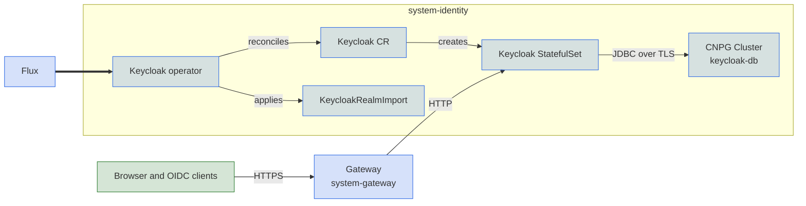

Keycloak is the default identity provider. When identity is enabled, Core runs Keycloak in the cluster, and Grafana, kubectl, and other add-ons with SSO support sign in through it.

## Turn it on

```yaml
identity:
  enabled: true
```

`identity.driver` defaults to `keycloak`. Core installs the Keycloak operator, a `Keycloak` server and a dedicated CloudNativePG `Cluster` named `keycloak-db`, all in the `system-identity` namespace. The operator's CRDs come from the vendored `keycloak-26.7.0` CRD layer.

Keycloak stores its data in Postgres, so `identity.enabled` also turns on `database.postgres.enabled` unless you set it to `false` explicitly. Setting it to `false` leaves Keycloak without a database. See [CloudNativePG](../database/cloudnativepg.md).

The server is published at `keycloak.<domain>` through the shared gateway, where `<domain>` is `dns.public_domain`, or `dns.private_domain` if no public domain is set. On docker-desktop the URL includes port `:8443`, because that is where the gateway is forwarded. To use a different URL, such as a plain NodePort or a fixed production hostname, set it directly:

```yaml
identity:
  keycloak:
    hostname: https://sso.example.com
```

Without a gateway the server still runs, but nothing outside the cluster can reach it. Use `kubectl port-forward` to the `keycloak-service` Service in `system-identity`.

## Dev mode logins

With `dev: true`, Core seeds these accounts so SSO works without any setup. None of them exist outside dev.

| Account | Username | Password | Access |
|---|---|---|---|
| Keycloak console | `admin` | `admin-password` | Keycloak console admin |
| SSO admin | `dev-admin` | `admin-password` | Member of the admin group (`platform-admins` by default): Grafana Admin, and `cluster-admin` when kubectl OIDC is on |
| SSO viewer | `dev-viewer` | `viewer-password` | Grafana Viewer, no Kubernetes permissions |

The console admin and `dev-admin` share a password. Setting `identity.keycloak.admin.password` changes both.

## Admin console

In dev mode the console login is in [Dev mode logins](#dev-mode-logins). Outside dev, the operator generates a temporary admin on first boot and stores it in the `keycloak-initial-admin` secret:

```sh
windsor exec -- kubectl -n system-identity get secret keycloak-initial-admin \
  -o jsonpath='{.data.username}' | base64 -d
windsor exec -- kubectl -n system-identity get secret keycloak-initial-admin \
  -o jsonpath='{.data.password}' | base64 -d
```

To set a known admin in any environment, provide the credentials:

```yaml
identity:
  keycloak:
    admin:
      username: admin
      password: ${secret("MyVault", "keycloak-admin", "password")}
```

The operator applies this only when it first creates the server. Changing it later does not rotate the existing admin.

## Platform realm

Core imports a `platform` realm, so applications stay out of `master`. The realm enforces TLS for external requests, brute-force detection, and a password policy of at least 12 characters that cannot match the username or email. Access tokens last 5 minutes, and SSO sessions expire after 30 minutes idle or 10 hours total.

The realm also has a `platform-admins` group mapped to the realm-management `realm-admin` role. Core creates the group but not its members; add them in the console. Rename the realm with `identity.keycloak.realm`:

```yaml
identity:
  keycloak:
    realm: corp
```

The import runs once. Later changes happen in the console, or by recreating the `KeycloakRealmImport`, not through Git. Adding a consumer that needs a new client, such as turning on Grafana SSO after the fact, re-imports the realm.

In dev mode the realm also has two sign-in users. See [Dev mode logins](#dev-mode-logins).

## Grafana single sign-on

Once identity is enabled, Grafana signs in through Keycloak with no further configuration:

```yaml
identity:
  enabled: true
observability:
  enabled: true
```

Opening Grafana sends the browser to Keycloak to log in, then back to Grafana. Set `observability.grafana.sso: false` to keep Grafana's local login instead.

Core registers the `grafana` client in the platform realm for you. It is a public client that uses PKCE, which checks each login without a shared secret, so there is nothing to create or store. Grafana redirects the browser to Keycloak's public URL, so the gateway must be enabled.

### Who gets which role

Grafana takes a user's role from their Keycloak groups. Members of `platform-admins` become Admin, and everyone else becomes Viewer. Core creates that group empty, and outside dev the realm has no users. To give someone admin access, create the user in the Keycloak console, or connect Keycloak to your directory, and add them to `platform-admins`.

In dev mode `dev-admin` is already in the group and `dev-viewer` is not, and Grafana skips its login page and goes straight to Keycloak.

To use a different group, set `observability.grafana.role_attribute_path`. Group names in the token include a leading slash:

```yaml
observability:
  grafana:
    role_attribute_path: "contains(groups[*], '/grafana-admins') && 'Admin' || 'Viewer'"
```

## kubectl single sign-on

`cluster.oidc.enabled: true` makes the Kubernetes API server accept Keycloak tokens. It patches the Talos machine config with `--oidc-*` flags, so it only works on Talos clusters. That is every platform except AWS, Azure, and GCP unless you override `cluster.driver`.

```yaml
identity:
  enabled: true
cluster:
  oidc:
    enabled: true
```

Core fills in `issuer_url` and `client_id` from the platform realm and registers a public `kubernetes` client that uses PKCE. The client accepts redirects to `http://localhost:8000` and `http://localhost:18000`, so a kubectl plugin such as `kubelogin` works with its default settings. If `pki.enabled` is true, the API server also trusts the cluster's private CA when it verifies tokens. `cluster.oidc.username_claim` (default `sub`) and `cluster.oidc.groups_claim` (default `groups`) change which token claims Kubernetes uses.

The API server fetches the issuer's keys itself, so the gateway must be enabled. Otherwise set `cluster.oidc.issuer_url` explicitly.

OIDC only authenticates users. It grants no permissions, so outside dev you bind `platform-admins`, or another claim, to a `ClusterRoleBinding` yourself. In dev mode Core binds `platform-admins` to `cluster-admin`, so `dev-admin` can do something after logging in.

On EKS and AKS the setting does nothing and nothing warns about it. Those control planes accept no API server flags, and their platform facets never read `cluster.oidc`. Use the cloud's own mechanism there, such as EKS access entries or Microsoft Entra. Hosted Keycloak and Grafana SSO work on every platform.

## Server image

By default the stock Keycloak image runs its build step every time a pod starts. For faster startup, build an optimized image with `kc.sh build --db=postgres`, push it to your registry, and reference it by digest:

```yaml
identity:
  keycloak:
    image: registry.example.com/keycloak-optimized:26.7.0@sha256:<digest>
```

A custom image is assumed to be pre-built, so the operator starts it with `--optimized`. It must be pinned by digest, because `system-identity` is policy-managed and rejects tags alone.

## High availability

With `topology: ha`, Keycloak runs two replicas clustered through Infinispan, and the database grows from one Postgres instance to three with automatic failover. Both use hard pod anti-affinity, so the cluster needs at least two schedulable nodes for Keycloak and three for the database. Other topologies run one of each.

## Monitoring

When `telemetry.metrics.enabled` is true (the default), Keycloak exposes server and user-event metrics on its management port, and Prometheus scrapes them through the operator's ServiceMonitor. The `keycloak-db` cluster gets its own PodMonitor. `observability.enabled` adds an identity dashboard, and `telemetry.alerts.enabled` (default true) adds identity alert rules.

## Under the hood

Keycloak has no first-party Helm chart. Core vendors the operator's Deployment and RBAC unchanged, and the matching CRDs come in through the CRD layer from the same upstream release.



TLS ends at the gateway. Keycloak serves plain HTTP inside the cluster and reads the proxy's forwarded headers for the external scheme and host. The gateway redirects plain HTTP to HTTPS, and with the Cilium gateway driver a network policy limits Keycloak's ingress to the gateway proxy.

Keycloak connects to Postgres with `sslmode=verify-full` against CloudNativePG's generated CA. Grafana and kubectl are public PKCE clients, so there are no client secrets to keep out of Git. A public client cannot prove the Grafana server's identity to Keycloak; the PKCE verifier ties each authorization code to the login that requested it. Every image in `system-identity` is pinned by digest.

## Configuration

| Key | Type | Default | Description |
|-----|------|---------|-------------|
| `identity.enabled` | boolean | `false` | Enable the cluster identity provider. |
| `identity.driver` | string | `keycloak` | `keycloak` hosts one in the cluster. `oidc` uses an [external issuer](oidc.md). |
| `identity.display_name` | string | `SSO` | Login button label consumers show, such as "Sign in with \<name\>". |
| `identity.admin_group` | string | `platform-admins` | Group whose members are administrators in every consumer. Core creates it in the realm. |
| `identity.keycloak.realm` | string | `platform` | Realm consumers target; also the issuer path. |
| `identity.keycloak.hostname` | string | derived | External hostname or base URL. Defaults to `keycloak.<domain>`. |
| `identity.keycloak.image` | string | stock image | Pre-built optimized server image, pinned by digest. |
| `identity.keycloak.admin.username` | string | `admin` | Bootstrap admin username. Applied only at first creation. |
| `identity.keycloak.admin.password` | string | none | Bootstrap admin password, also the `dev-admin` password in dev. Accepts `${secret(...)}`. Unset means a dev default, or the operator's temporary admin. |

## Reference

- [kustomize/identity](../../../kustomize/identity)
- [kustomize/crds](../../../kustomize/crds)
- [kustomize/database](../../../kustomize/database)
- [kustomize/gateway](../../../kustomize/gateway)
- [kustomize/observability](../../../kustomize/observability)
- [kustomize/telemetry](../../../kustomize/telemetry)
