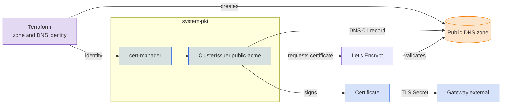

With `dns.public_domain` set, the gateway certificate comes from Let's Encrypt. The certificate is a wildcard, and Let's Encrypt issues wildcards only through DNS-01, where cert-manager proves ownership by writing a challenge record into the [public zone](../dns/public.md). No inbound port 80 is needed.

## Turn it on

```yaml
dns:
  public_domain: example.com
email: ops@example.com
```

Core creates the `public-acme` issuer and moves the gateway certificate to it. Let's Encrypt can validate only after the domain is [delegated](../dns/public.md#delegate-the-domain) to the zone.

## Solvers

| `platform` | Solver | Credential |
|---|---|---|
| `aws` | Route53 | IAM role through Pod Identity |
| `azure` | Azure DNS | Workload identity |
| `gcp` | Cloud DNS | Workload identity |
| `hetzner` | Hetzner DNS | Hetzner Cloud API token, through a webhook solver |

On AWS, Azure, and GCP the cluster Terraform component creates the identity, with write access to the zone only.

## Staging and production

Dev mode uses the Let's Encrypt staging server, which has generous rate limits but issues certificates that browsers do not trust. Every other context uses production.

## Private gateways

DNS-01 cannot validate a zone that exists only inside a VPC, so a private gateway uses the `private` issuer even when `dns.public_domain` is set. The full selection table is on the [PKI](index.md#issuers) page.

## Under the hood



## Reference

- [kustomize/pki/resources/public-issuer/acme](../../../kustomize/pki/resources/public-issuer/acme)
- [terraform/dns/zone/route53](../../../terraform/dns/zone/route53)
- [terraform/dns/zone/azure-dns](../../../terraform/dns/zone/azure-dns)
- [terraform/dns/zone/gcp-dns](../../../terraform/dns/zone/gcp-dns)
- [terraform/dns/zone/hetzner](../../../terraform/dns/zone/hetzner)
- [kustomize/pki](../../../kustomize/pki)
