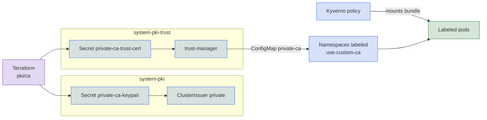

`pki.enabled` puts a real root CA behind the `private` issuer, in place of a self-signed certificate per request. Everything that issuer signs, such as the gateway certificate on a local cluster, then chains to one root that you trust once. [ACME](acme.md) certificates are unaffected.

## Turn it on

```yaml
pki:
  enabled: true
```

Dev mode enables it. Before the cluster is built, a Terraform component generates an ECDSA P-256 root named `Private CA`, valid for 10 years. Core loads it into the cluster as two Secrets, and the key exists only in `system-pki`:

| Secret | Namespace | Holds |
|---|---|---|
| `private-ca-keypair` | `system-pki` | Certificate and key. The `private` issuer signs with it. |
| `private-ca-trust-cert` | `system-pki-trust` | Certificate only. trust-manager reads it. |

## Bring your own CA

To use an existing root, set both halves. Windsor rejects a configuration with only one of them:

```yaml
pki:
  enabled: true
  private_ca:
    cert: ${secret("MyVault", "root-ca", "cert")}
    key: ${secret("MyVault", "root-ca", "key")}
```

## Rotation

A generated root is valid for 10 years and does not renew. To replace it, change `validity_period_hours` on the `pki/ca` component in your blueprint and run `windsor apply`. A root you supply follows your own rotation process.

## Trust the CA in workloads

trust-manager builds a `Bundle` named `private-ca` from the system trust roots plus the private CA, and writes it to a ConfigMap in each namespace labeled `use-custom-ca: "true"` and in no other. A pod gets the bundle when it carries the same label:

```yaml
apiVersion: v1
kind: Namespace
metadata:
  name: my-app
  labels:
    use-custom-ca: "true"
---
apiVersion: v1
kind: Pod
metadata:
  name: my-app
  namespace: my-app
  labels:
    use-custom-ca: "true"
```

When `policies.enabled` is true (the default), a Kyverno policy mounts the bundle at `/usr/local/share/ca-certificates/ca.crt` and sets `SSL_CERT_FILE` and `REQUESTS_CA_BUNDLE` in each container of a labeled pod.

Label the namespace and the pod together. A labeled pod in an unlabeled namespace has no ConfigMap to mount and stays in `ContainerCreating`. The policy also fails closed: labeled pods are rejected while Kyverno is unavailable.

## Trust the CA on a workstation

Browsers reject certificates from a private CA until its root is in the system trust store. Read the root from the cluster:

```sh
windsor exec -- kubectl -n system-pki-trust get secret private-ca-trust-cert \
  -o jsonpath='{.data.tls\.crt}' | base64 -d
```

## Talos API server

With `cluster.oidc.enabled` and `pki.enabled`, the Talos API server also trusts this CA when it verifies tokens from a Keycloak that serves a private certificate. See [kubectl single sign-on](../identity/keycloak.md#kubectl-single-sign-on). Because the CA is generated before the cluster exists, the trust is there at first boot.

## Under the hood



## Reference

- [terraform/pki/ca](../../../terraform/pki/ca)
- [kustomize/pki](../../../kustomize/pki)
- [kustomize/pki/resources/private-issuer/ca](../../../kustomize/pki/resources/private-issuer/ca)
- [kustomize/policy](../../../kustomize/policy)
