# Core

The default blueprint that includes base infrastructure and services. Cloud "primitives" provide storage, networking, security, and observability required to run a consistent platform across major cloud providers, virtualization platforms, and bare metal.

## Dependencies

How Core's Kustomize add-ons and Terraform components depend on each other, as one stack of tiers. A component depends only on components in its own tier or below, and arrows point down to what a tier needs first. Kustomize add-ons run on the cluster that Terraform builds and the Flux that Terraform installs, so the Terraform tiers form the bottom of the stack.

```mermaid
block-beta
  columns 3

  half0["Cluster · Kustomize"]:3
  ktier5["Services"] k_dns["dns"] k_gitops["gitops"]
  space k_observability["observability"] k_identity["identity"]
  space k_demo["demo"] space:1
  karrow5<[" "]>(down):3
  ktier4["Platform"] k_gateway["gateway"] k_pki["pki"]
  space k_database["database"] k_provisioning["provisioning"]
  karrow4<[" "]>(down):3
  ktier3["Storage & telemetry"] k_csi_install["csi-install"] k_csi_resources["csi-resources"]
  space k_telemetry["telemetry"] k_object_store["object-store"]
  karrow3<[" "]>(down):3
  ktier2["Primitives"] k_cni["cni"] k_lb["lb"]
  space k_compute["compute"] space:1
  karrow2<[" "]>(down):3
  ktier1["Base"] k_policy["policy"] k_crds_layer["crds layer"]
  karrow1<[" "]>(down):3
  half1["Infrastructure · Terraform"]:3
  ttier5["Delivery"] t_gitops["gitops"] space:1
  tarrow5<[" "]>(down):3
  ttier4["Integrations"] t_cluster_extensions["cluster-extensions"] t_crossplane_identity["crossplane-identity"]
  tarrow4<[" "]>(down):3
  ttier3["Cluster services"] t_cni["cni"] t_cluster_additions["cluster-additions"]
  space t_database["database"] space:1
  tarrow3<[" "]>(down):3
  ttier2["Cluster"] t_cluster["cluster"] space:1
  tarrow2<[" "]>(down):3
  ttier1["Foundation"] t_network["network"] t_dns_zone["dns-zone"]
  space t_compute["compute"] t_pki["pki"]

  style half0 fill:#2B59C3 !important,stroke:#6BA0FF !important,stroke-width:2px !important,color:#fff !important
  style ktier5 fill:#2B59C3 !important,stroke:#6BA0FF !important,stroke-width:2px !important,color:#fff !important
  style k_dns fill:#6BA0FF30 !important,stroke:#6BA0FF !important,stroke-width:2px !important
  style k_gitops fill:#6BA0FF30 !important,stroke:#6BA0FF !important,stroke-width:2px !important
  style k_observability fill:#6BA0FF30 !important,stroke:#6BA0FF !important,stroke-width:2px !important
  style k_identity fill:#6BA0FF30 !important,stroke:#6BA0FF !important,stroke-width:2px !important
  style k_demo fill:#6BA0FF30 !important,stroke:#6BA0FF !important,stroke-width:2px !important
  style karrow5 fill:#6BA0FF !important,stroke:#6BA0FF !important
  style ktier4 fill:#2B59C3 !important,stroke:#6BA0FF !important,stroke-width:2px !important,color:#fff !important
  style k_gateway fill:#6BA0FF30 !important,stroke:#6BA0FF !important,stroke-width:2px !important
  style k_pki fill:#6BA0FF30 !important,stroke:#6BA0FF !important,stroke-width:2px !important
  style k_database fill:#6BA0FF30 !important,stroke:#6BA0FF !important,stroke-width:2px !important
  style k_provisioning fill:#6BA0FF30 !important,stroke:#6BA0FF !important,stroke-width:2px !important
  style karrow4 fill:#6BA0FF !important,stroke:#6BA0FF !important
  style ktier3 fill:#2B59C3 !important,stroke:#6BA0FF !important,stroke-width:2px !important,color:#fff !important
  style k_csi_install fill:#6BA0FF30 !important,stroke:#6BA0FF !important,stroke-width:2px !important
  style k_csi_resources fill:#6BA0FF30 !important,stroke:#6BA0FF !important,stroke-width:2px !important
  style k_telemetry fill:#6BA0FF30 !important,stroke:#6BA0FF !important,stroke-width:2px !important
  style k_object_store fill:#6BA0FF30 !important,stroke:#6BA0FF !important,stroke-width:2px !important
  style karrow3 fill:#6BA0FF !important,stroke:#6BA0FF !important
  style ktier2 fill:#2B59C3 !important,stroke:#6BA0FF !important,stroke-width:2px !important,color:#fff !important
  style k_cni fill:#6BA0FF30 !important,stroke:#6BA0FF !important,stroke-width:2px !important
  style k_lb fill:#6BA0FF30 !important,stroke:#6BA0FF !important,stroke-width:2px !important
  style k_compute fill:#6BA0FF30 !important,stroke:#6BA0FF !important,stroke-width:2px !important
  style karrow2 fill:#6BA0FF !important,stroke:#6BA0FF !important
  style ktier1 fill:#2B59C3 !important,stroke:#6BA0FF !important,stroke-width:2px !important,color:#fff !important
  style k_policy fill:#6BA0FF30 !important,stroke:#6BA0FF !important,stroke-width:2px !important
  style k_crds_layer fill:#6BA0FF30 !important,stroke:#6BA0FF !important,stroke-width:2px !important
  style karrow1 fill:#6BA0FF !important,stroke:#6BA0FF !important
  style half1 fill:#6B35B0 !important,stroke:#B488FF !important,stroke-width:2px !important,color:#fff !important
  style ttier5 fill:#6B35B0 !important,stroke:#B488FF !important,stroke-width:2px !important,color:#fff !important
  style t_gitops fill:#B488FF30 !important,stroke:#B488FF !important,stroke-width:2px !important
  style tarrow5 fill:#B488FF !important,stroke:#B488FF !important
  style ttier4 fill:#6B35B0 !important,stroke:#B488FF !important,stroke-width:2px !important,color:#fff !important
  style t_cluster_extensions fill:#B488FF30 !important,stroke:#B488FF !important,stroke-width:2px !important
  style t_crossplane_identity fill:#B488FF30 !important,stroke:#B488FF !important,stroke-width:2px !important
  style tarrow4 fill:#B488FF !important,stroke:#B488FF !important
  style ttier3 fill:#6B35B0 !important,stroke:#B488FF !important,stroke-width:2px !important,color:#fff !important
  style t_cni fill:#B488FF30 !important,stroke:#B488FF !important,stroke-width:2px !important
  style t_cluster_additions fill:#B488FF30 !important,stroke:#B488FF !important,stroke-width:2px !important
  style t_database fill:#B488FF30 !important,stroke:#B488FF !important,stroke-width:2px !important
  style tarrow3 fill:#B488FF !important,stroke:#B488FF !important
  style ttier2 fill:#6B35B0 !important,stroke:#B488FF !important,stroke-width:2px !important,color:#fff !important
  style t_cluster fill:#B488FF30 !important,stroke:#B488FF !important,stroke-width:2px !important
  style tarrow2 fill:#B488FF !important,stroke:#B488FF !important
  style ttier1 fill:#6B35B0 !important,stroke:#B488FF !important,stroke-width:2px !important,color:#fff !important
  style t_network fill:#B488FF30 !important,stroke:#B488FF !important,stroke-width:2px !important
  style t_dns_zone fill:#B488FF30 !important,stroke:#B488FF !important,stroke-width:2px !important
  style t_compute fill:#B488FF30 !important,stroke:#B488FF !important,stroke-width:2px !important
  style t_pki fill:#B488FF30 !important,stroke:#B488FF !important,stroke-width:2px !important
```

## Configuration

Windsor configures Core through `values.yaml` for the current context. See the
[Values](/catalog/core/values) page for the full schema, and the
[Blueprints chapter](/blueprints/overview) for how operators author and
customize blueprints.
