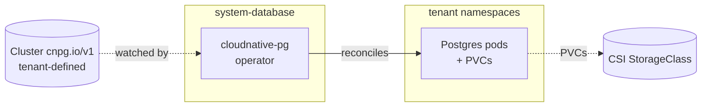

# Database

Installs the CloudNativePG operator in `system-database`. The operator
watches `Cluster` (cnpg.io/v1) resources cluster-wide; tenants create their
own `Cluster` objects to provision Postgres instances. This add-on does NOT
ship a tenant Postgres cluster — it only deploys the operator and (on HA
clusters) makes the operator itself highly available.

`cloudnative-pg` is currently the only supported driver
(`addons.database.postgres.driver: cloudnativepg`). The add-on is gated on
`addons.database.postgres.enabled: true` — disabled by default.

## Flow



The operator runs `clusterWide: true` so a single deployment watches
`Cluster` resources in every namespace. Tenants do not need to install
their own operator copies.

## Recipes

### Default (HA topology)

Both `addons.database.postgres.enabled: true` and `topology: ha`.
The `cloudnativepg/ha` component layers anti-affinity and a
PodDisruptionBudget onto the operator deployment.

```yaml
- name: database
  path: database
  dependsOn: [csi]
  components:
    - cloudnativepg
    - cloudnativepg/prometheus
    - cloudnativepg/ha
  timeout: 15m
  interval: 10m
```

### Single-node

`addons.database.postgres.enabled: true` and `topology: single-node`.
`option-single-node` adds the `cloudnativepg/single-node` component which
disables the operator's leader election.

```yaml
- name: database
  path: database
  dependsOn: [csi]
  components:
    - cloudnativepg
    - cloudnativepg/single-node
    - cloudnativepg/prometheus
  timeout: 15m
```

### With Grafana dashboard

When `addons.observability.enabled: true` is also on, `addon-database`
patches the observability add-on to add the CloudNativePG dashboard. Wired
separately from the database add-on itself:

```yaml
- name: observability
  path: observability
  dependsOn: [telemetry-base]
  components:
    - grafana/dashboards/cloudnativepg
```

## Substitutions

This add-on does not consume any blueprint substitutions. Behavior is
fully driven by component selection.

## Components

| Component | Enable when | Effect |
|---|---|---|
| `cloudnativepg` | `addons.database.postgres.driver: cloudnativepg` | Helm release of `cloudnative-pg` v0.28.0 in `system-database`. Operator image v1.29.0. `clusterWide: true` so the operator watches `Cluster` resources in every namespace. Webhook `failurePolicy: Fail` (admission rejects requests if the webhook is down). Resource requests 250m/256Mi, memory limit 256Mi. |
| `cloudnativepg/single-node` | `topology: single-node` | Appends `--leader-elect=false` to the operator's `additionalArgs`. The chart unconditionally passes `--leader-elect`; Go's flag parser applies last-wins so the override sticks. |
| `cloudnativepg/ha` | `topology: ha` | `operator.replicaCount: 2`, hard pod anti-affinity (hostname topology key), PodDisruptionBudget with `minAvailable: 1`, `rollingUpdate.maxUnavailable: 1`. |
| `cloudnativepg/prometheus` | always (per addon-database) | Adds `monitoring.podMonitorEnabled: true` and labels the PodMonitor with `release: kube-prometheus-stack` so the telemetry add-on's Prometheus picks it up. Adds a Flux `dependsOn` so the operator waits for `kube-prometheus-stack` to be ready. |

## Dependencies

| Add-on | Reason |
|---|---|
| `csi` | Tenant `Cluster` resources allocate PVCs for WAL archives and data volumes as soon as the first one is applied. The operator itself doesn't create PVCs, but reconciliation fails immediately if no StorageClass is available. |

The `cloudnativepg/prometheus` component adds an implicit dependency on
`kube-prometheus-stack` (in the `telemetry` add-on) via Flux's HelmRelease
`dependsOn`. The `addon-database` facet also patches the observability
add-on to add the Grafana dashboard, but that's a separate Kustomization
entry rather than a hard dependency of `database`.

## Operations

Add-on-specific failure modes; generic Flux/Renovate behaviour is documented
at the repo level.

- **Tenant `Cluster` stuck creating** — usually a CSI / StorageClass issue. Check the tenant's `Cluster` events and confirm a default StorageClass exists. The operator does not create PVCs eagerly; PVCs come up as the operator reconciles tenant Clusters.
- **Operator pods crashlooping with `failed to acquire lease`** — leader election is on but multiple replicas can't agree on a leader. On single-node clusters confirm `cloudnativepg/single-node` is enabled (it disables election). On HA clusters the lease conflict is usually a CoreDNS / API issue, not a database issue.
- **Webhook `failurePolicy: Fail` blocks `Cluster` creation when the operator is down** — by design. If you must apply tenant Clusters during an operator outage, temporarily patch the ValidatingWebhookConfiguration to `failurePolicy: Ignore` (and revert when the operator is healthy).
- **`HelmRelease/cloudnativepg` reports `no matches for kind PodMonitor`** — `cloudnativepg/prometheus` is enabled but the kube-prometheus-stack CRDs aren't ready yet. The Flux `dependsOn` on `kube-prometheus-stack` should prevent this; if it fires, reconcile in the right order.

The operator exposes Prometheus metrics on each pod via the PodMonitor
created by `cloudnativepg/prometheus`. Tenant `Cluster` resources also
emit metrics; they're scraped by the same Prometheus when the
`Cluster.spec.monitoring.enablePodMonitor` field is set.

## Security

- The `system-database` namespace runs at PSA `baseline`. The operator pod uses a restricted security context: `runAsNonRoot: true`, `allowPrivilegeEscalation: false`, all capabilities dropped, `seccompProfile: RuntimeDefault`.
- Tenant Postgres pods inherit security context from the operator's defaults. Operators creating `Cluster` resources should set explicit `imagePullSecrets`, `serviceAccount`, and resource limits.
- The webhook configuration is `failurePolicy: Fail` for both mutating and validating webhooks. This is correct for the operator's role (admission must validate `Cluster` specs) but means an operator outage blocks new tenant Clusters until the webhook is back.
- WAL and data PVCs are encrypted only if the underlying CSI driver provides encryption (AWS EBS defaults to `encrypted: true`; OpenEBS hostpath does not).

## See also

- [contexts/_template/facets/addon-database.yaml](../../contexts/_template/facets/addon-database.yaml) — canonical wiring (operator + dashboard).
- [contexts/_template/facets/option-single-node.yaml](../../contexts/_template/facets/option-single-node.yaml) — adds the `cloudnativepg/single-node` patch when topology is single-node.
- Blueprint schema and facet syntax — https://www.windsorcli.dev/docs/blueprints/
- CloudNativePG operator docs — https://cloudnative-pg.io/docs/
- Related add-ons: [csi](../csi/), [telemetry](../telemetry/), [observability](../observability/).
