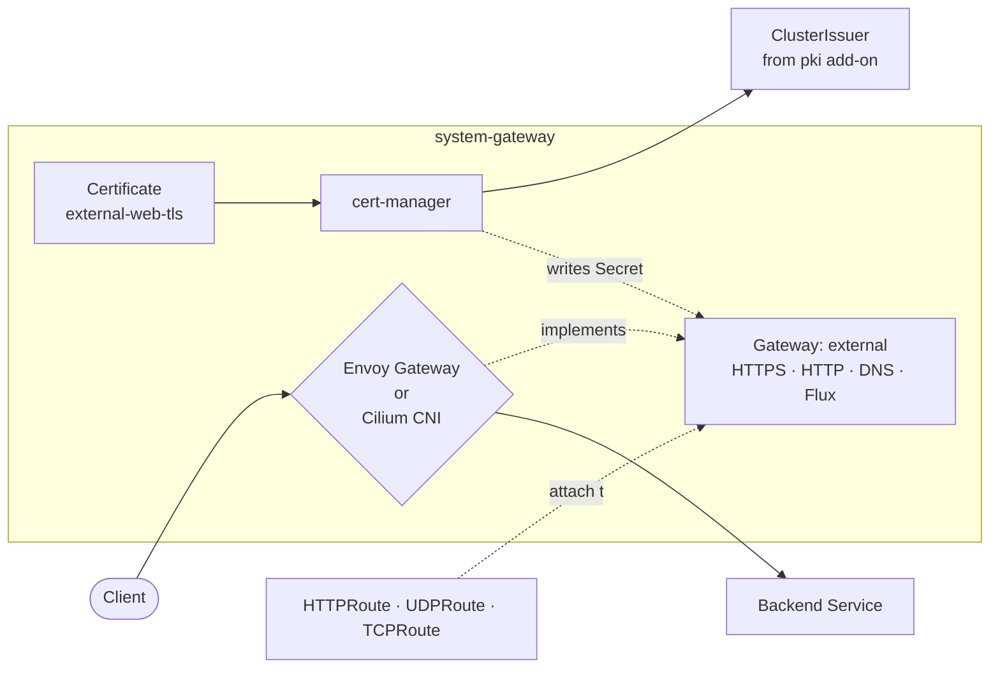

# Gateway

The cluster's traffic entrypoint. A single Gateway resource named `external`
is rendered into `system-gateway` with HTTP, HTTPS, and (optionally) DNS
and Flux listeners. Two implementation paths share the same Gateway: Envoy
Gateway as a separately-deployed controller, or Cilium's built-in Gateway
API support via the CNI. cert-manager (from the `pki` add-on) issues the TLS
certificate; HTTPRoutes from any namespace attach to the Gateway.

## Flow



The Gateway resource is identical across drivers; what changes is which
controller reconciles it (`gateway.envoyproxy.io/gatewayclass-controller`
for Envoy, `io.cilium/gateway-controller` for Cilium) and how the data plane
is exposed (Envoy via a Service of type LoadBalancer or NodePort; Cilium via
the CNI's own LBIPAM path).

## Recipes

`gateway-base` is rendered when `gateway.enabled: true`. `gateway-resources`
is rendered alongside it. Platform facets layer cloud-specific patches onto
`gateway-base` (AWS NLB annotations, Azure SLB internal flip).

### Local Cilium cluster (default `windsor up`)

Cilium provides the Gateway implementation through the CNI; this add-on only
supplies the GatewayClass and the Gateway/Certificate resources.

```yaml
- name: gateway-base
  path: gateway/base
  dependsOn: [pki-base]
  components:
    - cilium
  timeout: 10m

- name: gateway-resources
  path: gateway/resources
  dependsOn: [gateway-base]
  components:
    - cilium
    - lb-address
    - flux-webhook
  substitutions:
    gateway_class_name: cilium
    gateway_dns_target: 10.5.0.10
    external_domain: example.internal
    gateway_cert_issuer: public-selfsigned
    loadbalancer_start_ip: 10.5.0.10
```

### Envoy with NodePort (docker-desktop or metal)

```yaml
- name: gateway-base
  path: gateway/base
  dependsOn: [pki-base]
  components:
    - envoy
    - envoy/nodeport
    - envoy/prometheus

- name: gateway-resources
  path: gateway/resources
  dependsOn: [gateway-base]
  components:
    - envoy/default-404
    - flux-webhook
  substitutions:
    gateway_class_name: envoy
    external_domain: example.internal
    gateway_cert_issuer: public-selfsigned
```

### Envoy on AWS (NLB)

The AWS Load Balancer Controller (separately installed by `lb-base`)
provisions an NLB pointed at the Envoy data-plane Service.

```yaml
- name: gateway-base
  path: gateway/base
  dependsOn: [pki-base, lb-base]
  components:
    - envoy
    - envoy/loadbalancer
    - envoy/loadbalancer/aws-nlb
    - envoy/prometheus

- name: gateway-resources
  path: gateway/resources
  dependsOn: [gateway-base, lb-base]
  components:
    - envoy/default-404
    - envoy/default-404/external-dns
    - flux-webhook
  substitutions:
    gateway_class_name: envoy
    external_domain: example.com
    gateway_cert_issuer: public-acme
```

### Envoy on Azure (private)

```yaml
- name: gateway-base
  path: gateway/base
  dependsOn: [pki-base]
  components:
    - envoy
    - envoy/loadbalancer
    - envoy/loadbalancer/azure-lb-internal
    - envoy/prometheus

- name: gateway-resources
  path: gateway/resources
  dependsOn: [gateway-base]
  components:
    - envoy/default-404
    - envoy/default-404/external-dns
    - flux-webhook
  substitutions:
    gateway_class_name: envoy
    external_domain: vpc.example.com
    gateway_cert_issuer: private
```

## Substitutions

| Name | Required when | Effect |
|---|---|---|
| `gateway_class_name` | always | Drives `Gateway.spec.gatewayClassName`. Must match the GatewayClass installed by the chosen driver (`envoy` or `cilium`). |
| `external_domain` | always | DNS name (and wildcard) on the Gateway TLS certificate. Switches between `dns.private_domain` and `dns.public_domain` in the upstream facet based on `gateway.access`. |
| `gateway_cert_issuer` | always | ClusterIssuer name the `external-web-tls` Certificate references. One of `private`, `public-selfsigned`, `public-acme` — must exist (rendered by the `pki` add-on). Renaming the issuer triggers cert-manager reissuance. |
| `gateway_dns_target` | when external-dns is reconciling Gateway hostnames | IP advertised by external-dns for Gateway-attached hostnames. Stamped onto the Gateway via the `dns` component's annotation. |
| `loadbalancer_start_ip` | `cilium`, `lb-address`, or any in-cluster LB path | Anchor IP for the Gateway's load balancer. Used by Cilium LBIPAM, the `lb-address` patch, and intended for `envoy/loadbalancer`. Must sit inside the LBIPAM pool (Cilium) or the cluster's MetalLB pool (Envoy). |
| `lb_scheme` | AWS only, when `gateway.access == 'private'` | AWS LB scheme annotation. Defaults to `internet-facing` when empty (kustomize fallback `${lb_scheme:-internet-facing}`); set to `internal` for VPC-only gateways. |

## Components

### `gateway/base/`

The base kustomization always installs the upstream Gateway API experimental
CRDs (vendored at `gateway-api-experimental-v1.5.1.yaml`) and the
`system-gateway` namespace.

| Component | Enable when | Effect |
|---|---|---|
| `cilium` | `gateway.driver: cilium` | GatewayClass `cilium` pointing at `io.cilium/gateway-controller`. The Cilium HelmRelease itself is owned by the `cni` add-on. |
| `envoy` | `gateway.driver: envoy` | Helm release of Envoy Gateway in `system-gateway`, vendored Envoy Gateway CRDs v1.7.1, GatewayClass `envoy`. |
| `envoy/loadbalancer` | `gateway.driver: envoy` AND `gateway.service_type: LoadBalancer` (or platform default) | Patches the Envoy data-plane Service to type `LoadBalancer`. |
| `envoy/loadbalancer/aws-nlb` | `platform: aws` AND `gateway.driver: envoy` AND LB mode | AWS LB Controller annotations: `aws-load-balancer-type: external`, `nlb-target-type: ip`, scheme from `${lb_scheme}`, cross-zone enabled. |
| `envoy/loadbalancer/azure-lb-internal` | `platform: azure` AND `gateway.driver: envoy` AND `gateway.access: private` | Adds `service.beta.kubernetes.io/azure-load-balancer-internal: "true"` to flip the AKS Standard LB to internal. |
| `envoy/nodeport` | `gateway.driver: envoy` AND `gateway.service_type: NodePort` (or docker-desktop default) | Patches the Envoy data-plane Service to NodePort with hardcoded ports: 80→30080, 443→30443, 53 UDP/TCP→30053, 9292→30292. |
| `envoy/prometheus` | `gateway.driver: envoy` AND `telemetry.metrics.enabled: true` | ServiceMonitor + PodMonitor for the Envoy controller and proxies. |

### `gateway/resources/`

The base kustomization always renders `Gateway/external` (HTTP/80 +
HTTPS/443 listeners) and `Certificate/external-web-tls`.

| Component | Enable when | Effect |
|---|---|---|
| `cilium` | `gateway.driver: cilium` | LBIPAM annotations on the Gateway (`lbipam.cilium.io/ips`, `sharing-key: external`, `sharing-cross-namespace: "*"`) so the Gateway can share its IP with CoreDNS and other LB consumers. |
| `dns` | `addons.private_dns.enabled: true` AND `gateway.driver: envoy` | Adds UDP/53 (UDPRoute) and TCP/53 (TCPRoute) listeners so CoreDNS port-53 traffic terminates on the Gateway. |
| `envoy/default-404` | `gateway.driver: envoy` | Catch-all 404 HTTPRoute using the Envoy-specific `gateway.envoyproxy.io/HTTPRouteFilter` `directResponse`. Cilium clusters don't ship that CRD. |
| `envoy/default-404/external-dns` | `dns.public_domain` is set OR (`gateway.access: private` AND `dns.private_domain` is set) | Adds `external-dns.alpha.kubernetes.io/hostname: "${external_domain},*.${external_domain}"` to the 404 route so external-dns publishes apex + wildcard records pointing at the Gateway IP. |
| `flux-webhook` | `gitops.mode: push` (the default) | Adds an HTTP/9292 listener for the Flux notification receiver. |
| `lb-address` | in-cluster LB is active (`network.loadbalancer_driver` is set on metal/incus, or `gateway.driver: cilium`) | Pins `spec.addresses` on the Gateway to `${loadbalancer_start_ip}`. |

## Dependencies

| Add-on | Reason |
|---|---|
| `pki-base` | cert-manager must be running before `Certificate/external-web-tls` is created. |
| `lb-base` *(`platform: aws`, or `network.loadbalancer_driver` set on metal/incus)* | Provides the AWS Load Balancer Controller (or MetalLB) that the Envoy data-plane Service needs to acquire an external IP. |
| `dns` *(when `dns.enabled: true`)* | external-dns (in the `dns` add-on) watches Gateway HTTPRoutes for hostname annotations. When the private-DNS addon is also active, the `gateway-resources/dns` component attaches port-53 listeners that route to upstream CoreDNS. |
| `cni` *(reverse, `gateway.driver: cilium` only)* | When Cilium is the driver, the `cni` add-on `dependsOn` `gateway-base` so the Gateway API CRDs are present before the Cilium HelmRelease is applied — Cilium's operator initializes its Gateway controller at startup and won't pick up CRDs added later. |

## Operations

Add-on-specific failure modes; generic Flux/Renovate behaviour is documented
at the repo level.

- **`Certificate/external-web-tls` stuck `Issuing`** — the `gateway_cert_issuer` substitution names a ClusterIssuer that the `pki-resources` Kustomization hasn't rendered yet. Confirm the ClusterIssuer exists (`kubectl get clusterissuer`) and matches the substitution. On a switch from `public-selfsigned` to `public-acme`, the Certificate spec changes and cert-manager reissues.
- **Envoy data-plane Service stuck without an external IP** — the LB controller isn't installed or reachable. On AWS check `lb-base` is healthy and the AWS LB Controller pods are running. On metal/incus check MetalLB.
- **`gateway-base` reports `no matches for kind GatewayClass`** — the base CRDs (vendored `gateway-api-experimental-v1.5.1.yaml`) didn't apply. Usually a kustomize build failure; reconcile manually with `flux reconcile kustomization gateway-base`.
- **Cilium clusters: HTTPRoutes attach but never serve traffic** — Cilium's Gateway controller didn't initialize because the CRDs weren't present when cilium-operator started. The reverse `cni dependsOn gateway-base` ordering is meant to prevent this; if it fires, restart `cilium-operator`.
- **Envoy LB IP appears unset on `envoy/loadbalancer`** — known issue: the `loadBalancerIP` patch references `${loadbalancer_ip_start}` but the actual substitution is `loadbalancer_start_ip`. The patch silently renders an empty value; the cloud LB allocates an arbitrary IP. Either pin via `lb-address` (which uses the correct name) or fix the substitution name in the patch.

The Envoy controller exposes Prometheus metrics through the
`envoy/prometheus` component (ServiceMonitor + PodMonitor). Cilium's metrics
are scraped by the `cni` add-on's own ServiceMonitor.

## Security

- The `system-gateway` namespace is PSA `baseline`.
- The Gateway's `external-web-tls` Certificate is issued by a ClusterIssuer from the `pki` add-on. The Secret is consumed only by the Gateway's TLS listener; it is not mounted by application workloads.
- HTTPRoute, UDPRoute, TCPRoute resources are accepted from all namespaces (`spec.listeners[*].allowedRoutes.namespaces.from: All`). Tenant isolation, if needed, must come from upstream policy (NetworkPolicy, Kyverno) — the Gateway itself does not gate cross-namespace attachment.
- AWS NLB target-type is `ip` so traffic flows directly to Envoy pods (kube-proxy is bypassed); the source IP reaches Envoy unmodified for X-Forwarded-For handling.
- The Azure internal-LB annotation pins the data-plane Service to the VNet — it is not reachable from outside the VNet. Public exposure on Azure requires omitting `envoy/loadbalancer/azure-lb-internal`.

## See also

- [contexts/_template/facets/option-gateway.yaml](../../contexts/_template/facets/option-gateway.yaml) — canonical wiring for both drivers, including the reverse `cni` dep and the cert-issuer fallback logic.
- [contexts/_template/facets/platform-aws.yaml](../../contexts/_template/facets/platform-aws.yaml) — AWS NLB annotations layered onto `gateway-base`.
- [contexts/_template/facets/platform-azure.yaml](../../contexts/_template/facets/platform-azure.yaml) — Azure internal-LB conditional layering.
- Blueprint schema and facet syntax — https://www.windsorcli.dev/docs/blueprints/
- Related add-ons: [pki](../pki/), [dns](../dns/), [cni](../cni/), [lb](../lb/), [gitops](../gitops/), [telemetry](../telemetry/).
