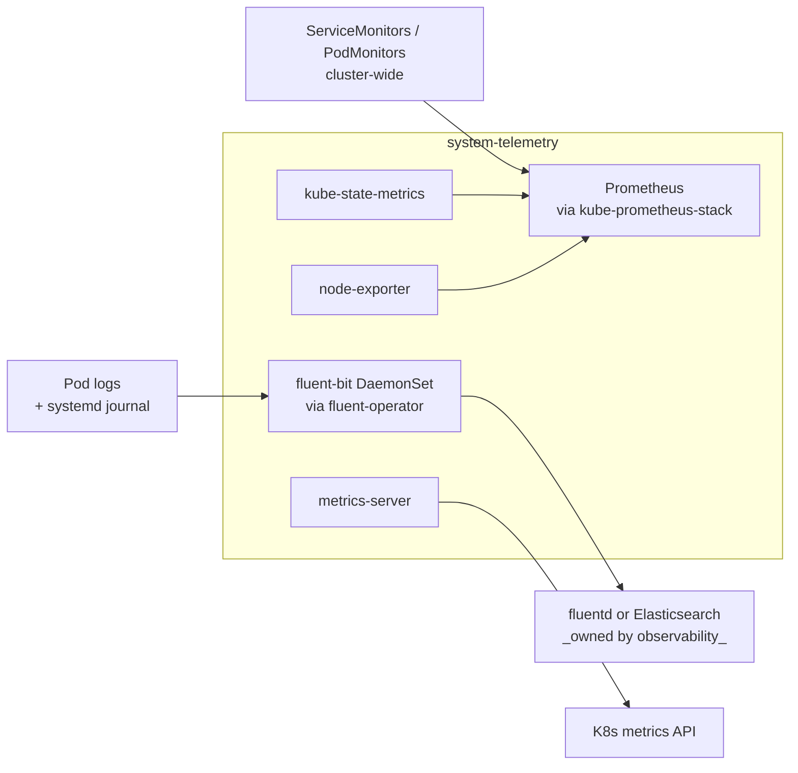

# Telemetry

The cluster's metrics and logs collection layer. Two parallel pipelines, both
managed from `system-telemetry`:

- **Metrics**: kube-prometheus-stack runs Prometheus, kube-state-metrics, and
  node-exporter. Scrape targets across all add-ons register via ServiceMonitor
  and PodMonitor resources.
- **Logs**: fluent-operator manages a fluent-bit DaemonSet that reads
  container logs and (on Talos) the systemd journal. Logs are forwarded to a
  sink owned by the **observability** add-on (`fluentd` aggregator by default,
  Elasticsearch when the alternative driver is selected).

Grafana is intentionally not in this add-on — it lives in `observability`,
which is also responsible for the log sink. Telemetry collects; observability
visualizes and stores.

## Flow



`telemetry-base` installs the operators (Prometheus operator,
fluent-operator). `telemetry-resources` adds the configuration that turns
those operators into a working pipeline: a `FluentBit` CR with
`ClusterFluentBitConfig`, fluent-bit `ClusterInput` / `ClusterFilter` /
`ClusterOutput` resources for each log source and parser, a `metrics-server`
release, and Prometheus scrape extras.

## Recipes

`telemetry-base` and `telemetry-resources` are gated on
`telemetry.metrics.enabled` or `telemetry.logs.enabled`. Both default to
`true`.

### Default (both pipelines on, fluentd logs driver)

```yaml
- name: telemetry-base
  path: telemetry/base
  components:
    - prometheus
    - prometheus/flux
    - fluentbit
  timeout: 30m
  interval: 10m

- name: telemetry-resources
  path: telemetry/resources
  dependsOn: [telemetry-base]
  components:
    - metrics-server
    - prometheus
    - prometheus/flux
    - fluentbit
    - fluentbit/containerd
    - fluentbit/kubernetes
    - fluentbit/parser
    - fluentbit/systemd
    - fluentbit/prometheus
    - fluentbit/fluentd
  timeout: 10m
  interval: 5m
```

### Metrics-only (`telemetry.logs.enabled: false`)

```yaml
- name: telemetry-base
  path: telemetry/base
  components:
    - prometheus
    - prometheus/flux

- name: telemetry-resources
  path: telemetry/resources
  dependsOn: [telemetry-base]
  components:
    - metrics-server
    - prometheus
    - prometheus/flux
```

### AKS (managed metrics-server)

On `platform: azure`, the `metrics-server` component is dropped because
AKS ships metrics-server as a built-in addon. Same shape as the default
recipe minus `metrics-server`.

### Logs-only / Elasticsearch sink

When `addon-observability` selects `logs_driver: elasticsearch`, the
`fluentbit/fluentd` ClusterOutput is dropped and addon-observability layers
in `filebeat` (in `telemetry-base`) for direct Elasticsearch shipping. See
`addon-observability` for the full layering.

## Substitutions

This add-on does not consume any blueprint substitutions. The two
platform-base globals (`private_domain`, `public_domain`) are exposed to
every Kustomization but are not referenced inside any telemetry manifest.

## Components

### `telemetry/base/`

| Component | Enable when | Effect |
|---|---|---|
| `prometheus` | `telemetry.metrics.enabled` | Helm release of `kube-prometheus-stack` v84.5.0 in `system-telemetry`. Includes Prometheus, prometheus-operator, kube-state-metrics, node-exporter. Grafana is disabled here (lives in `observability`). All `*SelectorNilUsesHelmValues` are set to `false` so cluster-wide ServiceMonitors and PodMonitors are picked up. |
| `prometheus/flux` | `telemetry.metrics.enabled` | Patches kube-prometheus-stack to add kube-state-metrics RBAC and `customResourceState` config for Flux's CRDs (GitRepository, Kustomization, HelmRelease, etc.) so they show up in metrics. |
| `fluentbit` | `telemetry.logs.enabled` | Helm release of `fluent-operator` v4.0.0 in `system-telemetry` with `containerRuntime: containerd`. The chart installs the operator and the FluentBit/FluentD CRDs; `fluentd.enable: false` and `fluentbit.enable: false` so no instances are created at this layer (instances come from `telemetry-resources`). |
| `filebeat` | (only via `addon-observability` for the Elasticsearch sink) | Helm release of filebeat for direct Elasticsearch shipping. Not wired by `platform-base`. |

### `telemetry/resources/`

The base kustomization is empty; every component contributes its own
manifests.

| Component | Enable when | Effect |
|---|---|---|
| `metrics-server` | `telemetry.metrics.enabled` AND `metrics_server_enabled != false` | Helm release of `metrics-server`. Skipped on AKS (managed). |
| `metrics-server/skip-tls` | (opt-in patch) | Patches metrics-server to add `--kubelet-insecure-tls`. Not wired by platform-base; available for clusters where kubelet certs aren't trusted by metrics-server. |
| `prometheus` | `telemetry.metrics.enabled` | Patches kube-state-metrics RBAC to read Flux CRDs and adds a `customResourceState` config for them, so Flux resource state shows up as metrics. |
| `prometheus/flux` | `telemetry.metrics.enabled` | Helm release of `flux2` v2.18.3 named `flux-pod-monitor` in `system-gitops`. All controllers are `create: false`; only the `prometheus.podMonitor` is created — a PodMonitor for scraping Flux's controller pods. The chart-as-PodMonitor-shim trick avoids hand-writing a PodMonitor against Flux's labels. |
| `fluentbit` | `telemetry.logs.enabled` | Creates the `FluentBit` CR (DaemonSet) with `nodeAffinity` excluding nodes labeled `node-role.kubernetes.io/edge`, host-path positionDB at `/var/lib/fluent-bit/`, and a `ClusterFluentBitConfig` selecting all input / filter / output resources labeled `fluentbit.fluent.io/enabled: "true"`. |
| `fluentbit/containerd` | `telemetry.logs.enabled` | Systemd journal ClusterInput reading from `/var/log/journal` filtered to `containerd.service` and `kubelet.service` (tagged `service.*`), plus a Lua ClusterFilter that processes the CRI line format on `kube.*` records. |
| `fluentbit/kubernetes` | `telemetry.logs.enabled` | Tail ClusterInput on `/var/log/containers/*.log` using the `cri` parser (tagged `kube.*`), plus a kubernetes ClusterFilter that enriches each record with pod metadata (namespace, pod name, container) using the in-cluster service account. |
| `fluentbit/parser` | `telemetry.logs.enabled` | Aggregate component bundling parsers for coredns, JSON-structured, klog, logfmt, nginx-access, rust-tracing, zerolog, plus service-name extraction, suppress filter, fallback parser, and a generic gRPC parser. Each parser is a ClusterFilter with a Lua script. |
| `fluentbit/systemd` | `telemetry.logs.enabled` | Lua ClusterFilter for `service.*` tagged records (the systemd journal entries captured by `fluentbit/containerd`). Adds an ISO 8601 timestamp and maps systemd fields (`_HOSTNAME`, `SYSLOG_IDENTIFIER`) into a kubernetes-shaped record so downstream processing matches the format from the kubernetes filter. |
| `fluentbit/prometheus` | `telemetry.logs.enabled` AND `telemetry.metrics.enabled` | ServiceMonitor for fluent-bit's own `/metrics` endpoint. |
| `fluentbit/fluentd` | `telemetry.logs.enabled` AND `telemetry.logs.driver: fluentd` (the default) | ClusterOutput shipping all enriched logs to the fluentd aggregator (in the `observability` namespace). |

## Dependencies

`telemetry-base` has no `dependsOn` — it is foundational and installs early.

`telemetry-resources` `dependsOn: telemetry-base` (the operator CRDs must
exist before any FluentBit CR or ServiceMonitor is created).

Add-ons that depend on `telemetry-base`:

- `pki-base` — when telemetry metrics or logs are enabled, pki-base waits so cert-manager's ServiceMonitor has a working Prometheus target from creation.
- `cni` — same reason: cilium/prometheus and cilium/hubble ServiceMonitors need Prometheus to be live.
- `observability` — depends on telemetry-base because grafana / fluentd / elasticsearch all need the operators or the log shipper this add-on provides.

## Operations

Add-on-specific failure modes; generic Flux/Renovate behaviour is documented
at the repo level.

- **No metrics in Grafana despite Prometheus running** — ServiceMonitor / PodMonitor resources aren't being picked up. The `*SelectorNilUsesHelmValues: false` settings in `prometheus/helm-release.yaml` mean an empty selector matches everything; if Prometheus is filtering, check the Prometheus CR's `serviceMonitorSelector` for unintended overrides.
- **fluent-bit DaemonSet not running on edge nodes** — the FluentBit CR's nodeAffinity excludes nodes labeled `node-role.kubernetes.io/edge`. If you want logs from edge nodes, remove the affinity or relabel the nodes. This is intentional — edge nodes are typically resource-constrained.
- **Logs collected but never delivered** — the fluent-bit → fluentd ClusterOutput is missing. Check the `fluentbit/fluentd` component is enabled (it requires `telemetry.logs.driver: fluentd`, which is the default). When `telemetry.logs.driver: none`, fluent-bit runs without an output and buffers indefinitely.
- **`HelmRelease/kube-prometheus-stack` reports `no matches for kind ServiceMonitor`** — the kube-prometheus-stack CRDs haven't installed yet. The chart installs them; if the apply is racing, re-reconcile.
- **fluent-operator pods crash with `cannot create ConfigMap`** — RBAC issue. The operator needs to write the rendered fluent-bit config; check `system-telemetry`'s ServiceAccount and ClusterRole.
- **node-exporter DaemonSet missing pods** — node taints. node-exporter's chart values set `replicas: 1` which is misleading (it's a DaemonSet); check that tolerations cover the cluster's taints.

## Security

- The `system-telemetry` namespace runs at PSA `privileged`. fluent-bit needs host paths (`/var/lib/fluent-bit/` for the position DB, `/var/log/containers/` for container logs, `/var/log/journal` for the systemd journal) and node-exporter needs host PID and host network.
- kube-state-metrics is granted RBAC to read Flux's CRDs (GitRepository, Kustomization, HelmRelease, etc.) so Flux resource state is exposed as Prometheus metrics. The grant is read-only (`list`, `watch`).
- The `flux-pod-monitor` release lives in `system-gitops` (not `system-telemetry`) — only a PodMonitor object is created, no controllers, so no additional permissions are granted to telemetry.
- fluent-bit reads container logs from `/var/log/containers/*.log` (kubernetes input) and the systemd journal at `/var/log/journal` (containerd input). Pod logs may contain secrets if applications log them; consider this when configuring downstream sinks.

## See also

- [contexts/_template/facets/platform-base.yaml](../../contexts/_template/facets/platform-base.yaml) — canonical wiring of `telemetry-base` and `telemetry-resources`, including the `telemetry_effective` internal config that folds `telemetry.*` values together with addon-observability overrides.
- [contexts/_template/facets/addon-observability.yaml](../../contexts/_template/facets/addon-observability.yaml) — log sink (fluentd / quickwit / elasticsearch + filebeat) layered on top of telemetry.
- [contexts/_template/facets/platform-azure.yaml](../../contexts/_template/facets/platform-azure.yaml) — `metrics_server_enabled: false` override for AKS.
- Blueprint schema and facet syntax — https://www.windsorcli.dev/docs/blueprints/
- Related add-ons: [observability](../observability/), [pki](../pki/), [cni](../cni/), [policy](../policy/).
