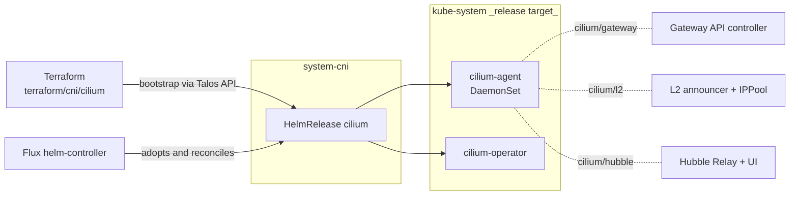

# CNI

Cilium is the only CNI driver this blueprint installs. The HelmRelease CR
lives in `system-cni`; the actual Cilium workloads (DaemonSet, Operator,
Hubble) deploy into `kube-system` per upstream convention. Other CNIs
(flannel on docker-desktop, AKS's managed CNI) bypass this stack entirely
when `cluster.cni.driver` is not `cilium`.

The defining shape of this stack is the **bootstrap-then-adopt** pattern.
Cilium has a chicken-and-egg problem: Flux needs pod networking to
reconcile, but Flux is normally what installs the CNI. Resolution:
Terraform installs Cilium first via the Talos API, then Flux adopts the
running HelmRelease so day-2 changes flow through GitOps.

## Flow



The Terraform module sets `privileged: false` and `cgroup_auto_mount:
false` (Talos forbids privileged pods and mounts cgroups at init);
`cilium/talos` re-applies the same settings via Helm values so the
Flux-adopted release does not flap the deployment between reconciles.

## Recipes

This stack has a single Kustomization (`cni`) with two `when:` variants —
`talos_enabled` and `eks_enabled`. Each emits a different component set.

The recipes below show the materialized form assuming `policies.enabled:
true` and `telemetry.metrics.enabled: true` (the platform-base defaults).
If either is disabled, the corresponding `dependsOn` entry drops and the
related conditional component (`cilium/prometheus`) is omitted.

### Talos (default `windsor up`)

```yaml
- name: cni
  path: cni
  dependsOn: [policy-resources, telemetry-base]
  components:
    - cilium
    - cilium/talos
    - cilium/prometheus
    - cilium/hubble
    - cilium/l2
  substitutions:
    k8s_service_host: 10.5.0.10
    loadbalancer_start_ip: 10.5.1.10
    loadbalancer_end_ip: 10.5.1.30
    cluster_name: local
    operator_replicas: "2"
  timeout: 15m
```

### Talos with Cilium as the gateway driver

Adds the `cilium/gateway` component, which enables Cilium's built-in
Gateway API controller and ships a Kyverno ClusterPolicy that races-fixes
LBIPAM IP sharing on Cilium-managed Gateway services.

```yaml
- name: cni
  path: cni
  dependsOn: [policy-resources, telemetry-base, gateway-base]
  components:
    - cilium
    - cilium/talos
    - cilium/gateway
    - cilium/prometheus
    - cilium/hubble
    - cilium/l2
  substitutions:
    k8s_service_host: 10.5.0.10
    loadbalancer_start_ip: 10.5.1.10
    loadbalancer_end_ip: 10.5.1.30
    cluster_name: local
    operator_replicas: "2"
```

The `gateway-base` entry in `dependsOn` is contributed by `option-gateway`
(not `option-cni`): option-gateway patches the `cni` Kustomization to wait
for `gateway-base` so the Gateway API CRDs are present before
cilium-operator starts. Without that ordering, cilium-operator initializes
without the Gateway controller and never reconciles HTTPRoutes.

### EKS

EKS clusters use the AWS-managed control plane; no Talos-specific patches
and no L2 announcer (EKS provides its own LB via the AWS LB Controller in
the `lb` stack). `k8s_service_host` is parsed from the cluster Terraform
output.

```yaml
- name: cni
  path: cni
  dependsOn: [policy-resources, telemetry-base]
  components:
    - cilium
    - cilium/prometheus
    - cilium/hubble
  substitutions:
    k8s_service_host: <parsed from terraform_output('cluster', 'cluster_endpoint')>
    cluster_name: prod
    operator_replicas: "2"
```

## Substitutions

| Name | Required when | Effect |
|---|---|---|
| `k8s_service_host` | always | API server hostname Cilium reaches before its eBPF service rules are active. On Talos resolves to a fixed offset from the cluster CIDR; on EKS parsed from the cluster Terraform output. The user-facing knob is `cluster.endpoint` (or its terraform-derived equivalent on cloud platforms). |
| `cluster_name` | always | Cilium cluster identity stamped onto Hubble flows, metrics, and (if enabled) ClusterMesh routing. Sourced from the Windsor context name (the top-level `id` field in `values.yaml`). |
| `operator_replicas` | always | 1 on single-node clusters (avoids pending pods + Lease churn), 2 on HA. Set from `cluster.topology` (single-node → 1, otherwise → 2). Defaults to 1 via the kustomize fallback `${operator_replicas:=1}`. |
| `loadbalancer_start_ip` | `cilium/l2` is enabled (Talos) | Start of the LBIPAM IP pool. Stamped onto `CiliumLoadBalancerIPPool/default`. |
| `loadbalancer_end_ip` | `cilium/l2` is enabled (Talos) | End of the LBIPAM IP pool. |

## Components

| Component | Enable when | Effect |
|---|---|---|
| `cilium` | always | Helm release of Cilium v1.19.3 in `system-cni`, targeting `kube-system`. `kubeProxyReplacement: true`, `ipam.mode: kubernetes`, image pinning, base values. |
| `cilium/talos` | platform is Talos | Replaces full privileged mode with explicit Linux capabilities (CHOWN, NET_ADMIN, etc.) and disables cgroup auto-mount (Talos already mounted cgroups at boot). |
| `cilium/gateway` | `gateway.driver: cilium` | Sets `gatewayAPI.enabled: true` (also `enableAlpn`, `enableAppProtocol`) and ships a Kyverno ClusterPolicy that injects LBIPAM sharing annotations onto Cilium-owned Gateway services at admission time. The policy fixes a create-then-patch race in cilium-operator that would otherwise prevent IP sharing on first reconcile. |
| `cilium/prometheus` | `telemetry.metrics.enabled: true` | Enables Prometheus on the operator and agent and creates a ServiceMonitor for each. |
| `cilium/hubble` | always | Enables Hubble metrics (dns, drop, port-distribution, tcp, flow, icmp, http), Hubble Relay, Hubble UI, and the cronJob-based TLS rotation method. The Helm `auto.method: cronJob` choice avoids a known bug where `helm` mode re-renders server-secret on every upgrade and trips on newly-enabled Hubble components. |
| `cilium/l2` | platform is Talos (or any cluster needing in-cluster LB) | Enables `l2announcements` and `externalIPs` on Cilium, then creates `CiliumLoadBalancerIPPool/default` with the configured IP range and `CiliumL2AnnouncementPolicy/default` matching `^eth[0-9]+` and `^ens[0-9]+` interfaces. Replaces kube-vip and MetalLB on Talos clusters. |

## Dependencies

| Stack | Reason |
|---|---|
| `policy-resources` *(when `policies.enabled: true` or `gateway.driver: cilium`)* | Re-rolls Cilium pods after Kyverno's mutation policies are live. When `cilium/gateway` is active, `policy-resources` also provides the Kyverno CRDs the LBIPAM sharing ClusterPolicy depends on — without it the apply would fail on `no matches for kind ClusterPolicy`. |
| `telemetry-base` *(when `telemetry.metrics.enabled: true` or `telemetry.logs.enabled: true`)* | The `cilium/prometheus` ServiceMonitor and the Hubble ServiceMonitor target Prometheus from the telemetry stack; without it they have no scrape target. |

The Terraform `cni` module bootstraps Cilium directly via the Talos API
before Flux exists. Terraform `cni` `dependsOn: cluster` (the cluster must
be provisioned), and Terraform `gitops` `dependsOn: cni` (Flux must wait
for pod networking).

Reverse dependencies — stacks that depend on `cni`:

- `gateway-resources` `dependsOn: cni` when Cilium is the gateway driver. Without ordering, the Kyverno LBIPAM policy may not be in place when cilium-operator creates the gateway Service, and the LB IP won't be shared.
- `csi` `dependsOn: cni` always. CSI's node-driver-registrar can see transient loopback connectivity drops during eBPF init and crash-loop without this ordering.
- `observability` adds the `grafana/dashboards/cilium` component when Grafana is the dashboard backend.

## Operations

Stack-specific failure modes; generic Flux/Renovate behaviour is documented
at the repo level.

- **Cilium pods crash-looping on Talos with `Operation not permitted`** — the `cilium/talos` component is missing or its capabilities patch didn't apply. Confirm the helm-release values include `securityContext.capabilities.ciliumAgent`. Talos rejects full privileged mode.
- **`cilium-operator` does not create a Gateway controller on Cilium clusters** — the Gateway API CRDs were not present when the operator started. The reverse dep `cni dependsOn gateway-base` (added by `option-gateway`) prevents this in fresh installs; if it fires post-install, restart `cilium-operator`.
- **Cilium gateway Service has no LB IP** — the LBIPAM sharing annotations weren't injected. Verify the `cilium-gateway-lbipam-sharing` ClusterPolicy is `Ready` and the `cilium-lbipam-config` ConfigMap in `system-gateway` exists. The policy reads `gatewayIp` from that ConfigMap; without it the mutation fails open.
- **`HelmRelease/cilium` reports `no matches for kind CiliumLoadBalancerIPPool`** — `cilium/l2` is enabled but the Cilium CRDs aren't ready. The Cilium chart installs them; the bootstrap path (Terraform → Flux adoption) means the CRDs come up with the agent. If this fires, the Flux reconcile is racing the chart install — re-reconcile.
- **Re-running `windsor up` flaps Cilium between two replica counts** — Terraform `operator_replicas` and the Flux substitution differ. Both must derive from `cluster.topology` (single-node → 1, otherwise → 2).

Cilium's metrics ServiceMonitors are scraped by the `telemetry` stack
(`release: kube-prometheus-stack` label set by `cilium/prometheus`). Hubble
flows are accessible via Hubble UI; Hubble Relay exposes a gRPC endpoint
for `hubble observe`.

## Security

- The `system-cni` namespace has no PSA labels in its manifest (see [namespace.yaml](namespace.yaml)). Cilium workloads live in `kube-system`; the Cilium DaemonSet uses host networking and elevated Linux capabilities (full set on non-Talos, restricted explicit set on Talos via `cilium/talos`).
- `kubeProxyReplacement: true` means Cilium replaces kube-proxy entirely. Removing the `cni` stack does not restore kube-proxy automatically.
- Hubble TLS certificates rotate via an in-cluster CronJob (cert-manager is not required for Hubble).
- The `cilium-gateway-lbipam-sharing` Kyverno ClusterPolicy mutates Services in `system-gateway` that Cilium creates. Scope is restricted by namespace and by the `io.cilium.gateway/owning-gateway: external` label selector — it does not affect Services outside `system-gateway` or non-Cilium Services.

## See also

- [contexts/_template/facets/option-cni.yaml](../../contexts/_template/facets/option-cni.yaml) — canonical wiring for both Talos and EKS variants, plus reverse-dep injections into `gateway-resources`, `csi`, and `observability`.
- [terraform/cni/cilium/](../../terraform/cni/cilium/) — Terraform bootstrap module that installs Cilium pre-Flux.
- Blueprint schema and facet syntax — https://www.windsorcli.dev/docs/blueprints/
- Related stacks: [policy](../policy/), [telemetry](../telemetry/), [gateway](../gateway/), [csi](../csi/), [lb](../lb/).
