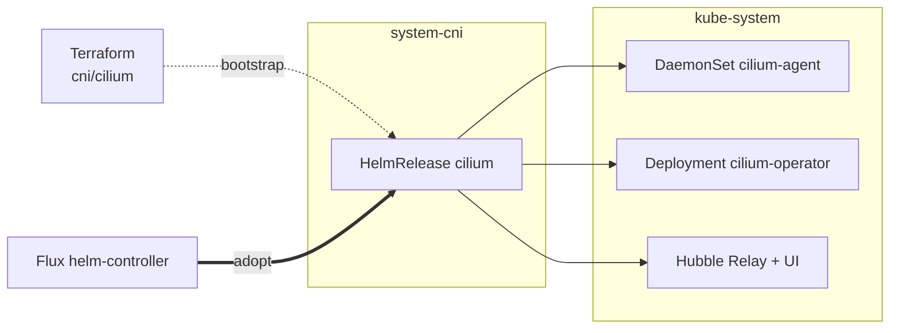

# CNI

Cilium is the only CNI driver this blueprint installs. Other CNIs
(flannel on docker-desktop, AKS's managed CNI) bypass this add-on
entirely when `cluster.cni.driver` is not `cilium`.

## Architecture



The pattern is bootstrap-then-adopt. Terraform installs Cilium first
via the Talos API, because Flux can't reconcile until pod networking
is up. Flux then adopts the running HelmRelease so day-2 changes flow
through GitOps. The HelmRelease CR lives in `system-cni`, and the
Cilium workloads deploy into `kube-system` per upstream convention.

## Recipes

### Talos default

```yaml
flux:
  - name: cni
    dependsOn: [policy-resources, telemetry-install]
    install:
      components: [cilium, cilium/talos, cilium/prometheus, cilium/hubble, cilium/l2]
      substitutions:
        k8s_service_host: 10.5.0.10
        loadbalancer_start_ip: 10.5.1.10
        loadbalancer_end_ip: 10.5.1.30
        cluster_name: local
        operator_replicas: "2"
      timeout: 15m
```

### Talos with Cilium as the gateway driver

Adds `cilium/gateway`. The `gateway-install` dependency is contributed by
`option-gateway` so the Gateway API CRDs exist before cilium-operator
starts.

```yaml
components: [cilium, cilium/talos, cilium/gateway, cilium/prometheus, cilium/hubble, cilium/l2]
dependsOn:  [policy-resources, telemetry-install, gateway-install]
```

### EKS

No Talos-specific patches and no L2 announcer, because the AWS LB
Controller handles LB. `k8s_service_host` is parsed from the cluster
Terraform output.

```yaml
components: [cilium, cilium/prometheus, cilium/hubble]
substitutions:
  k8s_service_host: <from terraform_output('cluster', 'cluster_endpoint')>
```

## Operations

If Cilium pods crash-loop with `Operation not permitted` on Talos, the
`cilium/talos` component is missing or its capabilities patch didn't
apply.

If `cilium-operator` doesn't create a Gateway controller, the Gateway
API CRDs were not present at start. Restart `cilium-operator` after the
CRDs are installed.

If the Cilium gateway Service has no LB IP, verify the
`cilium-gateway-lbipam-sharing` ClusterPolicy is `Ready` and the
`cilium-lbipam-config` ConfigMap in `system-gateway` exists.

If `HelmRelease/cilium` reports `no matches for kind
CiliumLoadBalancerIPPool`, the Cilium chart installs those CRDs and
reconciling Flux too early can race the install. Re-reconcile.

If `windsor apply` flaps Cilium replica counts, the Terraform
`operator_replicas` and the Flux substitution disagree. Both have to
derive from `topology`.

## Security

`system-cni` has no PSA labels. Cilium workloads live in `kube-system`
with host networking and restricted Linux capabilities (full set on
non-Talos, explicit set on Talos via `cilium/talos`).

`kubeProxyReplacement: true` means Cilium replaces kube-proxy entirely.
Removing this add-on does not restore kube-proxy.

Hubble TLS certificates rotate via an in-cluster CronJob, so
cert-manager is not required for Hubble.

<!-- BEGIN_KUSTOMIZE_DOCS -->

## Substitutions

| Name | Required when | Effect |
|---|---|---|
| `k8s_service_host` | always | API server hostname Cilium reaches before its eBPF service rules are active. On Talos resolves to a fixed offset from the cluster CIDR; on EKS parsed from the cluster Terraform output. User-facing knob is `cluster.endpoint`. |
| `cluster_name` | always | Cilium cluster identity stamped onto Hubble flows, metrics, and (if enabled) ClusterMesh routing. Sourced from the Windsor context name (top-level `id` in `values.yaml`). |
| `operator_replicas` | always | 1 on single-node clusters (avoids pending pods + Lease churn), 2 otherwise. Set from `topology`. |
| `loadbalancer_start_ip` | `cilium/l2` is enabled (Talos) | Start of the LBIPAM IP pool. Stamped onto `CiliumLoadBalancerIPPool/default`. |
| `loadbalancer_end_ip` | `cilium/l2` is enabled (Talos) | End of the LBIPAM IP pool. |

## Components

| Component | Enable when | Effect |
|---|---|---|
| `cilium` | always | Helm release of Cilium in `system-cni`, targeting `kube-system`. `kubeProxyReplacement: true`, `ipam.mode: kubernetes`, base values. |
| `cilium/talos` | platform is Talos | Replaces full privileged mode with explicit Linux capabilities (CHOWN, NET_ADMIN, etc.) and disables cgroup auto-mount (Talos already mounts cgroups at boot). |
| `cilium/gateway` | `gateway.driver: cilium` | Enables `gatewayAPI` on Cilium and ships a Kyverno ClusterPolicy that injects LBIPAM sharing annotations onto Cilium-owned Gateway services. Fixes a create-then-patch race in cilium-operator that would otherwise prevent IP sharing on first reconcile. |
| `cilium/prometheus` | `telemetry.metrics.enabled: true` | Enables Prometheus on the operator and agent and creates a ServiceMonitor for each. |
| `cilium/hubble` | always | Hubble metrics (dns, drop, port-distribution, tcp, flow, icmp, http), Hubble Relay, Hubble UI, and the cronJob-based TLS rotation method (avoids a bug where `helm` mode re-renders server-secret on every upgrade). |
| `cilium/l2` | platform is Talos | Enables `l2announcements` and `externalIPs` and creates `CiliumLoadBalancerIPPool/default` with the configured IP range plus `CiliumL2AnnouncementPolicy/default` matching `^eth[0-9]+` and `^ens[0-9]+` interfaces. Replaces kube-vip and MetalLB on Talos. |

## Dependencies

| Add-on | Required when | Reason |
|---|---|---|
| `policy-resources` | `policies.enabled: true` or `gateway.driver: cilium` | Re-rolls Cilium pods after Kyverno's mutation policies are live. When `cilium/gateway` is active, also provides the Kyverno CRDs the LBIPAM sharing ClusterPolicy depends on. |
| `telemetry-install` | `telemetry.metrics.enabled: true` or `telemetry.logs.enabled: true` | The `cilium/prometheus` ServiceMonitor and the Hubble ServiceMonitor target Prometheus from telemetry. |

<!-- END_KUSTOMIZE_DOCS -->

## See also

- [contexts/_template/facets/option-cni.yaml](../../contexts/_template/facets/option-cni.yaml) for the canonical wiring.
- [terraform/cni/cilium/](../../terraform/cni/cilium/) for the Terraform bootstrap module.
- Related add-ons: [policy](../policy/), [telemetry](../telemetry/), [gateway](../gateway/), [csi](../csi/), [lb](../lb/).
