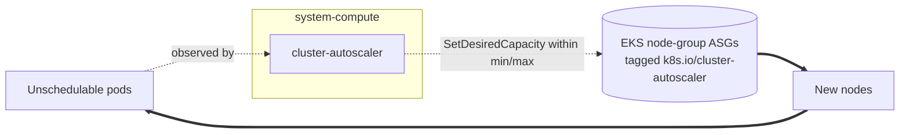

# Compute

Controllers that manage cluster compute capacity. Today this is the
Kubernetes cluster-autoscaler for EKS; the namespace (`system-compute`)
is the home for future node-lifecycle controllers.

On EKS, a node group's min/max only *bounds* its ASG — nothing scales it
on pending pods. `cluster-autoscaler` is the controller that does the
scaling. It discovers the managed node-group ASGs by the
`k8s.io/cluster-autoscaler` tags the `cluster/aws-eks` module applies to
autoscaling-enabled pools, and authenticates through the IAM role + EKS
Pod Identity association the same module provisions.

AKS autoscales natively (the managed cluster-autoscaler is part of the
control plane), so there is no Azure equivalent here — the
`cluster/azure-aks` module just sets `auto_scaling_enabled` on the pool.

The `compute` flux system has a single `install` tier (`compute-install`)
that ships the Helm release. It is gated to AWS by the platform facet and
depends on `policy-resources` so the autoscaler pod is admitted after
Kyverno's baseline policies are live. There is no `resources` tier because
the autoscaler has no dependent CRs to order after it.

## Recipes

### AWS (EKS)



```yaml
flux:
  - name: compute
    dependsOn: [policy-resources]
    install:
      components: [cluster-autoscaler]
      substitutions:
        cluster_name: <terraform_output('cluster', 'cluster_name')>
        aws_region: us-east-1
```

Each pool's bounds come from `cluster.pools[*].autoscaling` (default on,
min 1 / max 3 for every class except system). The autoscaler stays within
those bounds; raising a pool's ceiling is an in-place re-apply.

<!-- BEGIN_KUSTOMIZE_DOCS -->

## Substitutions

| Name | Required when | Effect |
|---|---|---|
| `cluster_name` | `cluster-autoscaler` is enabled | EKS cluster name the autoscaler discovers node groups for. Sourced from `terraform_output('cluster', 'cluster_name')`. No fallback — an empty value fails the install loudly rather than discovering nothing. |
| `aws_region` | `cluster-autoscaler` is enabled | AWS region for the autoscaler's EC2/ASG API calls. Sourced from top-level `aws.region`. |

## Components — `compute-install`

| Component | Enable when | Effect |
|---|---|---|
| `cluster-autoscaler` | platform is AWS | Helm release of the Kubernetes cluster-autoscaler in `system-compute`. Watches for unschedulable pods and adjusts the EKS managed node-group ASGs between each pool's min and max. Discovers groups by the `k8s.io/cluster-autoscaler` tags the aws-eks module applies to autoscaling-enabled pools, and authenticates via the IAM role + Pod Identity the module provisions. AKS autoscales natively, so there is no Azure equivalent component. |

## Dependencies

| Add-on | Required when | Reason |
|---|---|---|
| `policy-resources` | `policies.enabled: true` | compute depends on Kyverno's baseline policies being active before the autoscaler pod (in the `system-compute` system namespace) is admitted. |

<!-- END_KUSTOMIZE_DOCS -->

## See also

- [contexts/_template/facets/platform-aws.yaml](../../contexts/_template/facets/platform-aws.yaml) for the `compute` wiring.
- [terraform/cluster/aws-eks](../../terraform/cluster/aws-eks/) for the node-group autoscaling bounds, ASG discovery tags, and the autoscaler IAM role.
- Related add-ons: [policy](../policy/) (admits the autoscaler pod), [lb](../lb/) (the other AWS-gated controller pattern).
