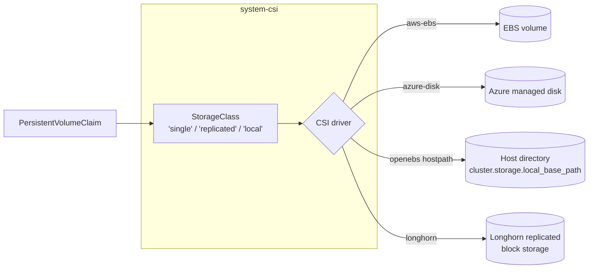

# CSI

The cluster's persistent-volume layer. Four drivers ship in this stack, one
selected per platform:

- **AWS EBS** — uses the EBS CSI driver preinstalled on EKS. This stack only adds the StorageClass.
- **Azure Disk** — uses the Azure Disk CSI driver preinstalled on AKS. Same shape: StorageClass only.
- **OpenEBS host-path** — installs the OpenEBS chart and a `local` StorageClass that allocates from a host directory. Default for local single-node clusters.
- **Longhorn** — installs the Longhorn chart, a distributed replicated block-storage system. Default for HA clusters on incus / metal.

Single Kustomization (`csi`) — no `base`/`resources` split. Each driver is a
component group; platform / option facets pick exactly one.

## Flow



The default StorageClass is named `single` regardless of driver — workloads
that ask for the cluster's default disk get a per-cluster-appropriate
provisioner without knowing which one is wired. Longhorn HA clusters also
get a `replicated` StorageClass for explicit multi-replica volumes.

## Recipes

The recipes below show the materialized kustomize entry for typical
scenarios. Each heading lists the `values.yaml` fields that select this
shape; the YAML is what the facets compose from those inputs. Conditional
`dependsOn` entries (e.g. `policy-resources` is gated on `policies.enabled:
true`) are shown unconditionally for readability — drop them if the gate
is false. The `cni` entry and the `openebs/single-node` component are
contributed by sibling facets (`option-cni` and `option-single-node`).

### AWS (EKS)

Selected by `platform: aws`. Uses the EBS CSI driver preinstalled on EKS.

```yaml
- name: csi
  path: csi
  dependsOn: [policy-resources]
  components:
    - aws-ebs
  timeout: 5m
  substitutions:
    single_storage_type: gp3
```

### Azure (AKS)

Selected by `platform: azure`. Uses the Azure Disk CSI driver preinstalled
on AKS.

```yaml
- name: csi
  path: csi
  dependsOn: [policy-resources]
  components:
    - azure-disk
  timeout: 5m
  substitutions:
    single_storage_type: StandardSSD_LRS
```

### Local single-node with OpenEBS host-path

Selected by `cluster.storage.driver: openebs` (the default on local
single-node clusters). `cluster.storage.local_base_path` controls the host
directory (default `/var/mnt/local`).

```yaml
- name: csi
  path: csi
  dependsOn: [policy-resources, cni]
  components:
    - openebs
    - openebs/single-node
    - openebs/dynamic-localpv
  timeout: 20m
  substitutions:
    local_volume_path: /var/mnt/local
```

### HA cluster with Longhorn

Selected by `cluster.storage.driver: longhorn` AND `cluster.topology: ha`.
The `longhorn/prometheus` component is added when
`addons.observability.enabled: true`.

```yaml
- name: csi
  path: csi
  dependsOn: [policy-resources, telemetry-base, cni]
  components:
    - longhorn
    - longhorn/ha
    - longhorn/prometheus
  timeout: 20m
```

### Local Longhorn

Selected by `cluster.storage.driver: longhorn` plus
`cluster.topology: single-node` OR `cluster.controlplanes.schedulable: true`.

```yaml
- name: csi
  path: csi
  dependsOn: [policy-resources, telemetry-base, cni]
  components:
    - longhorn
    - longhorn/single-node
  timeout: 20m
```

## Substitutions

| Name | Required when | Effect |
|---|---|---|
| `single_storage_type` | `aws-ebs` or `azure-disk` is enabled | Disk type for the cloud StorageClass. Sourced from `cluster.storage.single_storage_type`. AWS values: `gp3` (default), `gp2`, `io1`, etc. Azure values: `StandardSSD_LRS` (default), `Premium_LRS`, etc. |
| `local_volume_path` | `openebs/dynamic-localpv` is enabled | Host directory the OpenEBS hostpath provisioner allocates from. Sourced from `cluster.storage.local_base_path` (schema default `/var/mnt/local`). The directory must exist on every node before any PVC is created. |

## Components

The base kustomization is empty (`resources: []` after the namespace).
Drivers are mutually exclusive — pick one per cluster.

### Cloud drivers (StorageClass-only; CSI driver is preinstalled by the cloud)

| Component | Effect |
|---|---|
| `aws-ebs` | StorageClass `single` (default class) using `ebs.csi.aws.com`, `WaitForFirstConsumer`, `allowVolumeExpansion: true`, `encrypted: true`, `fsType: ext4`, type from `${single_storage_type}`. |
| `azure-disk` | StorageClass `single` (default class) using `disk.csi.azure.com`, `WaitForFirstConsumer`, `allowVolumeExpansion: true`, `cachingMode: ReadWrite`, `fsType: ext4`, skuName from `${single_storage_type}`. |

### OpenEBS host-path

| Component | Effect |
|---|---|
| `openebs` | Helm release of OpenEBS v4.4.0 in `system-csi`. The chart's `localpv-provisioner.enabled: false` here — it's enabled by the variant components below so single-node clusters can disable leader election. |
| `openebs/single-node` | Patches the helm release to set `localpv-provisioner.localpv.enableLeaderElection: false`. Used on single-node clusters. |
| `openebs/dynamic-localpv` | Patches the helm release (presumably to enable the localpv-provisioner) and creates two StorageClasses: `local` and `single` (default), both `openebs.io/local` hostpath, `BasePath: ${local_volume_path}`, `WaitForFirstConsumer`. |

### Longhorn

| Component | Effect |
|---|---|
| `longhorn` | Helm release of Longhorn v1.11.1 in `system-csi`, plus a StorageClass `single` (default class) using `driver.longhorn.io` with `numberOfReplicas: "1"`, `volumeBindingMode: Immediate`, `allowVolumeExpansion: true`. |
| `longhorn/single-node` | Patches the helm release to set `defaultSettings.taintToleration: "node-role.kubernetes.io/control-plane:NoSchedule"` so Longhorn pods can schedule on tainted control planes. Used when `cluster.controlplanes.schedulable: true` OR `cluster.topology: single-node`. |
| `longhorn/ha` | Patches the helm release for HA: `defaultReplicaCount: 3`, `replicaSoftAntiAffinity: false`, `allowVolumeCreationWithDegradedAvailability: false`, `longhornUI.replicas: 2`, CSI sidecar replicas at 3. Adds a second StorageClass `replicated` with `numberOfReplicas: "3"` for explicit multi-replica volumes. Used when `cluster.topology: ha`. |
| `longhorn/prometheus` | ServiceMonitor for `longhorn-manager` metrics on the `manager` port. Used when `addons.observability.enabled: true`. |

## Dependencies

| Stack | Reason |
|---|---|
| `policy-resources` *(when `policies.enabled: true`)* | The `system-csi` namespace runs at PSA `privileged` (storage drivers need host privileges); Kyverno's image-digest policy must be in place before the CSI driver pods are admitted. |
| `cni` | Added by `option-cni` as a reverse dep. CSI's `node-driver-registrar` sees transient loopback connectivity drops during eBPF init and crash-loops without this ordering. |
| `telemetry-base` *(longhorn + `telemetry.metrics.enabled` or `telemetry.logs.enabled`)* | The `longhorn/prometheus` ServiceMonitor needs Prometheus to be live. |

## Operations

Stack-specific failure modes; generic Flux/Renovate behaviour is documented
at the repo level.

- **PVC stuck `Pending` with `no persistent volumes available`** — the StorageClass's `volumeBindingMode: WaitForFirstConsumer` means the volume is only provisioned when a Pod actually schedules. If the Pod is also `Pending`, no volume gets created. Check the Pod's events first.
- **OpenEBS PVCs fail with `directory not found`** — the path set by `cluster.storage.local_base_path` doesn't exist on the node that scheduled the Pod. Talos clusters provision the default `/var/mnt/local` via machine config; if you override the path, every node needs the matching directory pre-created.
- **Longhorn pods crash on Talos with `mount propagation errors`** — Longhorn requires `iscsiadm` and bidirectional mount propagation. Talos clusters need an iSCSI system extension installed in the Talos image config (not in this stack). Check the cluster's Talos machine config if engine pods fail to start.
- **Longhorn HA degraded after a node reboot** — `replicaSoftAntiAffinity: false` enforces hard anti-affinity. After a reboot, replicas may need to be manually rebuilt; check `kubectl get volumes.longhorn.io -A`.
- **Longhorn `single-node` patch absent on a controlplane-only cluster** — without the toleration, longhorn pods don't schedule on tainted control planes and no storage is available. Set `cluster.controlplanes.schedulable: true` (or `cluster.topology: single-node`) so the patch is applied.
- **`HelmRelease/csi` reports `no matches for kind StorageClass`** — usually a race; the StorageClass CRD is built into Kubernetes so this only happens during early bootstrap. Re-reconcile.

Longhorn exposes a UI through the `longhorn-frontend` Service (chart default).
This stack does not ship an HTTPRoute for it — add one manually if external
access is needed.

## Security

- The `system-csi` namespace runs at PSA `privileged`. CSI drivers need access to host devices, mount namespaces, and (for Longhorn) iSCSI tooling.
- AWS EBS volumes are `encrypted: true` by default — uses the AWS account default KMS key unless overridden.
- Azure Disk uses `StandardSSD_LRS` (Standard SSD with locally redundant storage) by default. For Premium / zone-redundant variants, override `single_storage_type`.
- OpenEBS hostpath stores data under the path set by `cluster.storage.local_base_path` on each node. There is no encryption at rest; rely on disk-level encryption from the underlying OS or platform.
- Longhorn replicas are stored on each node's local disk under `/var/lib/longhorn`. Encryption at rest is not enabled by default; the `defaultSettings.encryption*` fields can be set in a custom patch.

## See also

- [contexts/_template/facets/platform-aws.yaml](../../contexts/_template/facets/platform-aws.yaml) — AWS EBS StorageClass wiring.
- [contexts/_template/facets/platform-azure.yaml](../../contexts/_template/facets/platform-azure.yaml) — Azure Disk StorageClass wiring.
- [contexts/_template/facets/option-storage.yaml](../../contexts/_template/facets/option-storage.yaml) — OpenEBS and Longhorn driver selection (resolves `cluster.storage.driver`).
- [contexts/_template/facets/option-single-node.yaml](../../contexts/_template/facets/option-single-node.yaml) — single-node OpenEBS overlay.
- [contexts/_template/facets/option-cni.yaml](../../contexts/_template/facets/option-cni.yaml) — adds the `cni` reverse dep.
- Blueprint schema and facet syntax — https://www.windsorcli.dev/docs/blueprints/
- Related stacks: [policy](../policy/), [cni](../cni/), [telemetry](../telemetry/), [observability](../observability/).
