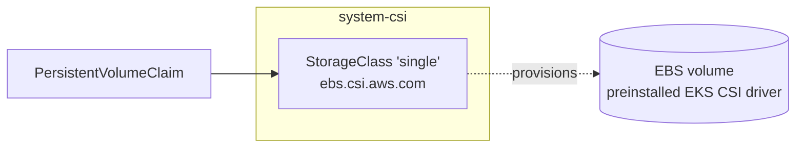
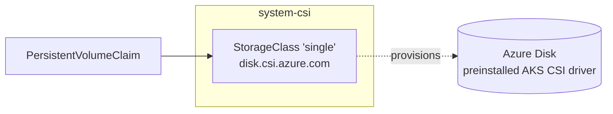
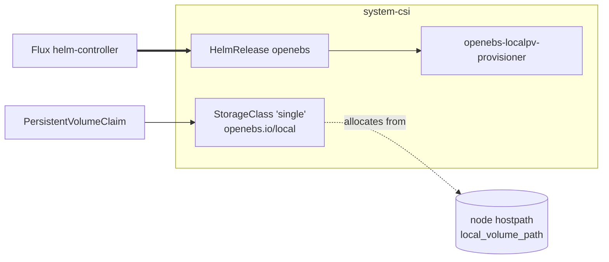
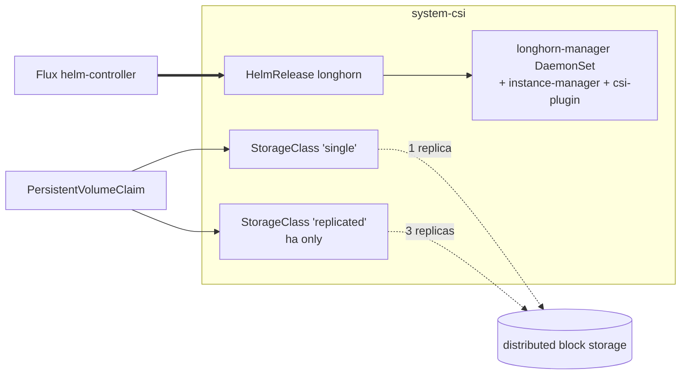

# CSI

The cluster's persistent-volume layer. Four drivers ship in this add-on,
one selected per cluster.

`aws-ebs` is for EKS and `azure-disk` is for AKS. Both are
StorageClass-only wrappers around the cloud's preinstalled CSI driver,
so volumes are AZ- or zone-pinned to the node that first mounts them.

`openebs` is for local single-node clusters. It installs a Helm release
plus a hostpath provisioner that allocates from a directory on each
node. There's no replication, and volumes are tied to the node they
were created on.

`longhorn` is for HA or schedulable-controlplane clusters. It installs
a Helm release of a distributed block-storage system that replicates
each volume across multiple nodes.

The default StorageClass is always named `single` regardless of driver,
so workloads asking for the default disk get a per-cluster-appropriate
provisioner without knowing which one is wired. Longhorn HA clusters
also expose a `replicated` class for explicit multi-replica volumes.

## Recipes

### EKS



```yaml
flux:
  - name: csi
    dependsOn: [policy-resources, cni]
    install:
      components: [aws-ebs]
      timeout: 5m
      substitutions:
        single_storage_type: gp3
```

A StorageClass-only layer over the EBS CSI driver EKS preinstalls.
Volumes are AZ-pinned to the node that first mounts them.

### AKS



```yaml
flux:
  - name: csi
    dependsOn: [policy-resources, cni]
    install:
      components: [azure-disk]
      timeout: 5m
      substitutions:
        single_storage_type: StandardSSD_LRS
```

The same StorageClass-only wrapper over the Azure Disk CSI driver AKS
preinstalls; volumes are zone-pinned.

### Local single-node with OpenEBS host-path



```yaml
flux:
  - name: csi
    dependsOn: [policy-resources, cni]
    install:
      components: [openebs, openebs/single-node, openebs/dynamic-localpv]
      timeout: 20m
      substitutions:
        local_volume_path: /var/mnt/local
```

OpenEBS brings its own Helm release and a hostpath provisioner that
allocates from a directory on each node. No replication — volumes are
tied to the node they were created on.

### HA cluster with Longhorn



```yaml
flux:
  - name: csi
    dependsOn: [policy-resources, telemetry-install, cni]
    install:
      components: [longhorn, longhorn/ha, longhorn/prometheus]
      timeout: 20m
```

Longhorn installs a distributed block-storage system that replicates
each volume across nodes. HA clusters also expose a `replicated` class
for explicit multi-replica volumes.

<!-- BEGIN_KUSTOMIZE_DOCS -->

## Substitutions

| Name | Required when | Effect |
|---|---|---|
| `single_storage_type` | `aws-ebs` or `azure-disk` is enabled | Disk type for the cloud `single` StorageClass. Sourced from `cluster.storage.single_storage_type`. AWS values: `gp3` (default), `gp2`, `io1`. Azure values: `StandardSSD_LRS` (default), `Premium_LRS`, `UltraSSD_LRS`. |
| `local_volume_path` | `openebs/dynamic-localpv` is enabled | Host directory the OpenEBS hostpath provisioner allocates from. Sourced from `cluster.storage.local_base_path` (schema default `/var/mnt/local`). The directory must exist on every node before any PVC is created. |

## Components

| Component | Enable when | Effect |
|---|---|---|
| `aws-ebs` | platform is AWS (EKS) | StorageClass `single` (default class) using `ebs.csi.aws.com`, `WaitForFirstConsumer`, `allowVolumeExpansion: true`, `encrypted: true`, `fsType: ext4`, `type: ${single_storage_type}`. The CSI driver itself is preinstalled by EKS; this component ships StorageClass only. |
| `azure-disk` | platform is Azure (AKS) | StorageClass `single` (default class) using `disk.csi.azure.com`, `WaitForFirstConsumer`, `allowVolumeExpansion: true`, `cachingMode: ReadWrite`, `fsType: ext4`, `skuName: ${single_storage_type}`. The CSI driver itself is preinstalled by AKS. |
| `openebs` | `cluster.storage.driver: openebs` | Helm release of the `openebs` chart in `system-csi`. `localpv-provisioner` is disabled at this layer and enabled by the variant components below so single-node clusters can disable leader election. zfs-localpv, lvm-localpv, and mayastor sub-charts are disabled. |
| `openebs/single-node` | openebs driver AND single-node topology | Patches the openebs HelmRelease to set `localpv-provisioner.localpv.enableLeaderElection: false`. Avoids Lease churn on single-node clusters. |
| `openebs/dynamic-localpv` | openebs driver | Enables the openebs localpv-provisioner and creates two StorageClasses (`local`, and `single` as default class). Both use `openebs.io/local` hostpath, `BasePath: ${local_volume_path}`, `WaitForFirstConsumer`. |
| `longhorn` | `cluster.storage.driver: longhorn` | Helm release of Longhorn in `system-csi`, plus a StorageClass `single` (default class) using `driver.longhorn.io` with `numberOfReplicas: "1"`, `volumeBindingMode: Immediate`, `allowVolumeExpansion: true`. |
| `longhorn/single-node` | longhorn driver AND (single-node topology OR `cluster.controlplanes.schedulable: true`) | Patches the longhorn HelmRelease to add `defaultSettings.taintToleration: "node-role.kubernetes.io/control-plane:NoSchedule"` so Longhorn pods schedule on tainted control planes. |
| `longhorn/ha` | longhorn driver AND ha topology | Patches the longhorn HelmRelease for HA: `defaultReplicaCount: 3`, hard `replicaSoftAntiAffinity: false`, `longhornUI.replicas: 2`, CSI sidecar replicas at 3. Adds a second StorageClass `replicated` with `numberOfReplicas: "3"` for explicit multi-replica volumes. |
| `longhorn/prometheus` | longhorn driver AND `addons.observability.enabled: true` | ServiceMonitor for `longhorn-manager` metrics on the `manager` port. |

## Dependencies

| Add-on | Required when | Reason |
|---|---|---|
| `policy-resources` | `policies.enabled: true` | `system-csi` runs at PSA `privileged`; Kyverno's image-digest and admission policies must be live before CSI driver pods are admitted. |
| `cni` | always (added by `option-cni`) | CSI's `node-driver-registrar` sees transient loopback connectivity drops during eBPF init and crash-loops without this ordering. |
| `telemetry-install` | longhorn driver AND (`telemetry.metrics.enabled: true` OR `telemetry.logs.enabled: true`) | The `longhorn/prometheus` ServiceMonitor needs Prometheus to be live. |

<!-- END_KUSTOMIZE_DOCS -->

## See also

- [contexts/_template/facets/platform-aws.yaml](../../contexts/_template/facets/platform-aws.yaml) for the AWS EBS wiring.
- [contexts/_template/facets/platform-azure.yaml](../../contexts/_template/facets/platform-azure.yaml) for the Azure Disk wiring.
- [contexts/_template/facets/option-storage.yaml](../../contexts/_template/facets/option-storage.yaml) for OpenEBS and Longhorn driver selection.
- [contexts/_template/facets/option-single-node.yaml](../../contexts/_template/facets/option-single-node.yaml) for the single-node OpenEBS overlay.
- [contexts/_template/facets/option-cni.yaml](../../contexts/_template/facets/option-cni.yaml) where the `cni` reverse dependency is added.
- Related add-ons: [policy](../policy/), [cni](../cni/), [telemetry](../telemetry/), [observability](../observability/).
