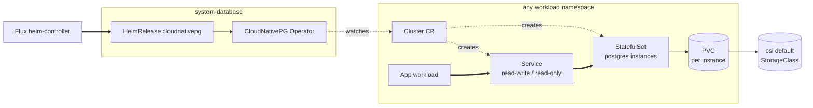

# Database

In-cluster PostgreSQL via the CloudNativePG operator. The add-on installs
the operator only. Actual database clusters are created elsewhere as
`postgresql.cnpg.io/v1` `Cluster` custom resources (see the demo add-on
for a worked example).

`clusterWide: true` means the single operator instance reconciles
`Cluster` CRs in any namespace, so application teams don't need their own
operator per workload namespace.

## Architecture



The Operator is the only thing this add-on installs. Cluster CRs and their
StatefulSets live in whatever namespace consumes the database. The demo
add-on places one in `demo-database`.

## Recipes

### Single-node

```yaml
flux:
  - name: database
    dependsOn: [csi]
    install:
      components:
        - cloudnativepg
        - cloudnativepg/single-node
      timeout: 15m
```

### HA cluster

```yaml
flux:
  - name: database
    dependsOn: [csi]
    install:
      components:
        - cloudnativepg
        - cloudnativepg/ha
      timeout: 15m
```

### With observability dashboards

```yaml
flux:
  - name: database
    dependsOn: [csi]
    install:
      components:
        - cloudnativepg
        - cloudnativepg/prometheus
        - cloudnativepg/ha
      timeout: 15m
```

The `cloudnativepg/prometheus` component adds
`dependsOn: kube-prometheus-stack` to the operator HelmRelease, so the
database-install kustomization waits for telemetry-install to be ready
before reconciling.

<!-- BEGIN_KUSTOMIZE_DOCS -->

## Components

| Component | Enable when | Effect |
|---|---|---|
| `cloudnativepg` | `addons.database.postgres.driver == 'cloudnativepg'` | Helm release of CloudNativePG in `system-database`. `clusterWide: true` so the operator reconciles `Cluster` CRs in any namespace. Mutating and validating webhooks default to `failurePolicy: Fail` so misconfigured Clusters are rejected at admission. |
| `cloudnativepg/prometheus` | `addons.database.postgres.driver == 'cloudnativepg'` AND `addons.observability.enabled: true` | Patches the operator HelmRelease to depend on `kube-prometheus-stack` (system-telemetry) and enable `monitoring.podMonitorEnabled: true` with `release: kube-prometheus-stack` discovery labels. |
| `cloudnativepg/ha` | `addons.database.postgres.driver == 'cloudnativepg'` AND `topology == 'ha'` | Patches the operator HelmRelease for HA: `operator.replicaCount: 2`, hostname-key pod anti-affinity, PodDisruptionBudget `minAvailable: 1`, rolling update `maxUnavailable: 1`. |
| `cloudnativepg/single-node` | `addons.database.postgres.driver == 'cloudnativepg'` AND `topology == 'single-node'` | Patches the operator HelmRelease to append `--leader-elect=false` via `additionalArgs`. The chart unconditionally passes `--leader-elect`; Go's flag parser is last-wins so the override wins. |

## Dependencies

| Add-on | Required when | Reason |
|---|---|---|
| `csi` | always | PostgreSQL `Cluster` CRs request PVCs for data storage; the default StorageClass must exist before the operator can bring a Cluster up. |

<!-- END_KUSTOMIZE_DOCS -->

## See also

- [contexts/_template/facets/addon-database.yaml](../../contexts/_template/facets/addon-database.yaml) for the canonical wiring and Grafana dashboard patch.
- [contexts/_template/facets/option-single-node.yaml](../../contexts/_template/facets/option-single-node.yaml) for the `cloudnativepg/single-node` patch wiring.
- [kustomize/demo/database/](../demo/database/) for a worked example (a `Cluster` CR named `demo-cluster`).
- Related add-ons: [csi](../csi/), [observability](../observability/) (`grafana/dashboards/cloudnativepg`), [telemetry](../telemetry/).
