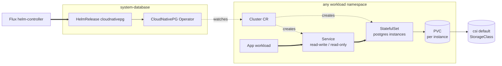

# Database

In-cluster PostgreSQL via the CloudNativePG operator. The add-on installs
the operator only. Actual database clusters are created elsewhere as
`postgresql.cnpg.io/v1` `Cluster` custom resources (see the demo add-on
for a worked example).

`clusterWide: true` means the single operator instance reconciles
`Cluster` CRs in any namespace, so application teams don't need their own
operator per workload namespace.

## Architecture


```mermaid
flowchart LR
  flux[Flux helm-controller]

  subgraph systemdb[system-database]
    operator_hr[HelmRelease cloudnativepg]
    operator_pod[CloudNativePG Operator]
  end

  subgraph anyns[any workload namespace]
    app[App workload]
    svc[Service<br/>read-write / read-only]
    cluster_cr[Cluster CR]
    sts[StatefulSet<br/>postgres instances]
    pvc[(PVC<br/>per instance)]
  end

  csi[(csi default<br/>StorageClass)]

  flux ==> operator_hr --> operator_pod
  operator_pod -.watches.-> cluster_cr
  cluster_cr -.creates.-> sts & svc
  sts --> pvc --> csi
  app ==> svc ==> sts
```

The Operator is the only thing this add-on installs. Cluster CRs and their
StatefulSets live in whatever namespace consumes the database. The demo
add-on places one in `demo-database`.

## Recipes

### Single-node

```yaml
flux:
  - name: database
    dependsOn: [csi]
    install:
      components:
        - cloudnativepg
        - cloudnativepg/single-node
      timeout: 15m
```

### HA cluster

```yaml
flux:
  - name: database
    dependsOn: [csi]
    install:
      components:
        - cloudnativepg
        - cloudnativepg/ha
      timeout: 15m
```

### With observability dashboards

```yaml
flux:
  - name: database
    dependsOn: [csi]
    install:
      components:
        - cloudnativepg
        - cloudnativepg/prometheus
        - cloudnativepg/ha
      timeout: 15m
```

The `cloudnativepg/prometheus` component adds
`dependsOn: kube-prometheus-stack` to the operator HelmRelease, so the
database-install kustomization waits for telemetry-install to be ready
before reconciling.

<!-- BEGIN_KUSTOMIZE_DOCS -->

## Components

| Component | Enable when | Effect |
|---|---|---|
| `cloudnativepg` | `database.postgres.driver == 'cloudnativepg'` | Helm release of CloudNativePG in `system-database`. `clusterWide: true` so the operator reconciles `Cluster` CRs in any namespace. Mutating and validating webhooks default to `failurePolicy: Fail` so misconfigured Clusters are rejected at admission. |
| `cloudnativepg/prometheus` | `database.postgres.driver == 'cloudnativepg'` AND `observability.enabled: true` | Patches the operator HelmRelease to depend on `kube-prometheus-stack` (system-telemetry) and enable `monitoring.podMonitorEnabled: true` with `release: kube-prometheus-stack` discovery labels. |
| `cloudnativepg/ha` | `database.postgres.driver == 'cloudnativepg'` AND `topology == 'ha'` | Patches the operator HelmRelease for HA: `replicaCount: 2`, hostname-key pod anti-affinity, rolling update `maxUnavailable: 1`. Adds a `PodDisruptionBudget` (`minAvailable: 1`) selecting the operator pods. |
| `cloudnativepg/single-node` | `database.postgres.driver == 'cloudnativepg'` AND `topology == 'single-node'` | Patches the operator HelmRelease to append `--leader-elect=false` via `additionalArgs`. The chart unconditionally passes `--leader-elect`; Go's flag parser is last-wins so the override wins. |
| `crossplane/postgres` | always paired with one of `crossplane/postgres/{aws-rds,azure-postgres,gcp-cloudsql}` as a peer component — a driver overlay can't pull in its own parent without a kustomize cycle, so the caller lists both | Driver-agnostic Postgres mechanics, flat and always-on: the `bootstrap` ServiceAccount and a static `Role`/`RoleBinding` granting it access to every admin/monitor-credentials `Secret` in `system-database`; the `ClusterRole` pair aggregating into Kyverno's `background-controller`/`admission-controller` (via `rbac.kyverno.io/aggregate-to-*` labels) so its `generate` rules can create per-instance RBAC; a `generate` `ClusterPolicy` provisioning that per-instance `ClusterRole`/`ClusterRoleBinding` (scoped by `resourceNames` to one instance) letting `bootstrap` read a new instance's status; and a `generate` `ClusterPolicy` provisioning a CronJob that creates a read-only `pg_monitor` Postgres role per instance from its admin credential Secret, publishing its DSN as `<instance>-monitor-credentials`. Connects to the `postgres` maintenance database and names the role after the instance, not any chart-supplied database — `pg_monitor`'s views report every database on the instance regardless of which one a session connects to. Every driver-specific fact (CRD identity, status field names, annotations) is set by patches and a `monitoring-driver-config` ConfigMap in the driver overlay's own `kustomization.yaml`, never by Flux substitution — none of it varies per instance. `app-role` and `monitoring-exporter` are optional sub-components, not part of this always-on base. |
| `crossplane/postgres/app-role` | a chart opts in — see `kustomize/demo/resources/database/{rds,flexibleserver,cloudsql}` for a worked example | Application-credential provisioning for any `provider-sql`-fronted instance CR, driver-agnostic — the role owns its database, matching CNPG's own default `app` user, so a chart can migrate its own schema without its own CronJob. A per-instance `ProviderConfig` reading a `<pg_instance_name>-connection` Secret; a `WatchOperation` that reacts to the instance CR's own changes, mirroring its endpoint and admin credential into that connection Secret (reading the admin username from the instance CR's own spec or from its admin credential Secret, depending on the driver — the one piece `provider-sql` can't assemble on its own, since its `ProviderConfig` takes exactly one Secret with fixed key names); and the `postgresql.sql.crossplane.io` `Role` (auto-generates its own password, publishes `<pg_instance_name>-app-credentials` via `writeConnectionSecretToRef`) and `Database` (adopts the database the driver's own instance component already created, reconciling its `ownerRef` to that `Role`). Requires `pg_instance_name`, `pg_database_name`, `pg_target_namespace`, `pg_crd_apiversion`, `pg_crd_kind`, `pg_endpoint_field`, `pg_username_field`, and `pg_username_from_secret` — the driver's own CRD identity and status field names, supplied as Flux substitutions rather than a per-driver overlay. Needs `crossplane/function-python` and Crossplane's `--enable-operations` alpha flag (see `kustomize/provisioning`). |
| `crossplane/postgres/monitoring-exporter` | `telemetry.metrics.enabled` (default true), combined with `crossplane/postgres` and a driver overlay as peer components — listed before the driver overlay, whose own patches wire its annotations and watched CRD | A `generate` `ClusterPolicy` that provisions a `postgres_exporter` Deployment/Service/PodMonitor in `system-database` for every instance, scraping the `pg_monitor` role `crossplane/postgres`'s own generate policy provisions. Split from that always-on base because `PodMonitor` (`monitoring.coreos.com/v1`) only exists once the metrics pipeline vendors prometheus-operator's CRDs — the RBAC and monitor-role CronJob generate policies don't touch that CRD, so they stay unconditional. A driver's own patch for it is a no-op unless this component is also present. |
| `crossplane/postgres/aws-rds` | `database.postgres.driver == 'rds'`, combined with `crossplane/postgres` as a peer component | RDS's own pieces on top of `crossplane/postgres`: the `default` `ProviderConfig` (credentials source `PodIdentity`, so a consuming `Instance` CR needs no `providerConfigRef`), a Kyverno `ClusterPolicy` that force-sets the `windsorcli.dev/cluster` tag on every `Instance`, and patches wiring `crossplane/postgres`'s generate policies — and, when present, `crossplane/postgres/monitoring-exporter`'s — to RDS's CRD identity. No chart opt-in, matching CNPG's own free monitoring. Requires `kustomize/provisioning`'s `Provider` to report Healthy/Installed first. |
| `crossplane/postgres/azure-postgres` | `database.postgres.driver == 'flexibleserver'`, combined with `crossplane/postgres` as a peer component | Azure twin of `crossplane/postgres/aws-rds`. The `default` `ProviderConfig` (credentials source `OIDCTokenFile`, so a consuming `FlexibleServer` CR needs no `providerConfigRef`), a Kyverno `ClusterPolicy` that force-sets `resourceGroupName` on every `FlexibleServer` to the context's dedicated postgres resource group, and patches wiring `crossplane/postgres`'s generate policies — and, when present, `crossplane/postgres/monitoring-exporter`'s — to Flexible Server's CRD identity. No chart opt-in, matching CNPG's own free monitoring. |
| `crossplane/postgres/gcp-cloudsql` | `database.postgres.driver == 'cloudsql'`, combined with `crossplane/postgres` as a peer component | GCP twin of `crossplane/postgres/aws-rds`. The `default` `ProviderConfig` (credentials source `InjectedIdentity`, so a consuming `DatabaseInstance` CR needs no `providerConfigRef`), a Kyverno `ClusterPolicy` that force-sets `project` on every `DatabaseInstance` to the context's GCP project, and patches wiring `crossplane/postgres`'s generate policies — and, when present, `crossplane/postgres/monitoring-exporter`'s — to Cloud SQL's CRD identity. No chart opt-in, matching CNPG's own free monitoring. |

## Dependencies

| Add-on | Required when | Reason |
|---|---|---|
| `csi` | always | PostgreSQL `Cluster` CRs request PVCs for data storage; the default StorageClass must exist before the operator can bring a Cluster up. |

<!-- END_KUSTOMIZE_DOCS -->

## See also

- [contexts/_template/facets/addon-database.yaml](../../contexts/_template/facets/addon-database.yaml) for the canonical wiring and Grafana dashboard patch.
- [contexts/_template/facets/option-single-node.yaml](../../contexts/_template/facets/option-single-node.yaml) for the `cloudnativepg/single-node` patch wiring.
- [kustomize/demo/database/](../demo/database/) for a worked example (a `Cluster` CR named `demo-cluster`).
- Related add-ons: [csi](../csi/), [observability](../observability/) (`grafana/dashboards/cloudnativepg`), [telemetry](../telemetry/).
