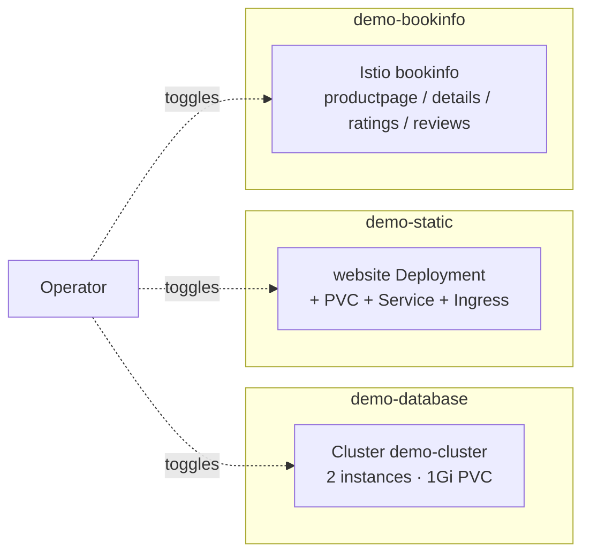

# Demo

Example workloads — not infrastructure. Use this stack to confirm the
cluster's networking, storage, ingress, and database integration paths
work end-to-end. Each subcomponent is a self-contained sample that runs in
its own `demo-*` namespace.

`option-demo` gates the whole stack on `demo.enabled: true`. Inside, three
independent toggles select which samples to deploy:

- `demo.resources.database: true` — a CNPG `Cluster` (depends on the database stack).
- `demo.resources.static: true` — a live-reload Node.js website with PVC, Service, and Ingress.
- `demo.resources.bookinfo: true` — Istio's bookinfo sample fetched directly from upstream Istio releases.

## Flow



The samples are independent — each one toggles separately. There is no
flow between them.

## Recipes

### All samples on (including Ingresses)

The `option-demo` facet emits only the workload components, not the
`*/ingress` sub-components. Hand-author the recipe to include them.

```yaml
- name: demo
  path: demo
  dependsOn: [database]
  components:
    - database
    - static
    - static/ingress
    - bookinfo
    - bookinfo/ingress
```

`dependsOn: [database]` is conditional in the facet — it only fires when
`demo.resources.database: true` is set. Without the database sample, the
demo stack has no required `dependsOn`.

### Just the static site (with Ingress)

The `option-demo` facet only emits `static`, not `static/ingress`.
Hand-author both for the full demo. Without the ingress component, the
`website` Service is only reachable in-cluster.

```yaml
- name: demo
  path: demo
  components:
    - static
    - static/ingress
  substitutions:
    REGISTRY_URL: registry.test:5000
```

### Just the CNPG demo cluster

```yaml
- name: demo
  path: demo
  dependsOn: [database]
  components:
    - database
```

## Substitutions

| Name | Required when | Effect |
|---|---|---|
| `REGISTRY_URL` | `static` is enabled | Container registry hostname for the demo image (`${REGISTRY_URL}/demo:1.0.6`). No kustomize fallback — empty produces an invalid image reference. The `option-demo` facet does NOT emit this; operators must supply it via blueprint substitutions or accept that the static demo won't pull. |
| `DOMAIN` | `static` or `bookinfo` is enabled | Hostname suffix for the Ingress rules (`static.${DOMAIN:-test}`, `bookinfo.${DOMAIN:-test}`). Falls back to `test` via the kustomize default. The facet does not emit this either; on local clusters the fallback is usually correct. |

Both substitutions are uppercase, suggesting they were originally meant
to come from environment-style substitution rather than the Windsor schema.
Treat them as operator-supplied; if you need real values flowing through
the facet, add a `substitutions:` block to your `option-demo` override.

## Components

The base kustomization is empty (`resources: []`). Each sample is a
component that brings its own namespace, manifests, and any associated
resources.

### `database/`

| Component | Effect |
|---|---|
| `database` | `Namespace/demo-database` (PSA `baseline`) plus `Cluster/demo-cluster` (cnpg.io/v1): 2 instances, 1Gi storage per replica, 100 max_connections, requests 100m/256Mi, memory limit 512Mi, `monitoring.enablePodMonitor: true` with relabelings. Requires the database stack's CloudNativePG operator to be running first. |

### `static/`

| Component | Effect |
|---|---|
| `static` | `Namespace/demo-static` (PSA `restricted`); `Deployment/website` running `${REGISTRY_URL}/demo:1.0.6` on port 8080 with restricted security context (runAsNonRoot, runAsUser 1000, all capabilities dropped, RuntimeDefault seccomp); `Service/website` exposing port 80 → 8080; `PVC/content` requesting 100Mi RWO. **Does not include the Ingress** — that's a separate component (`static/ingress`). |
| `static/ingress` | Separate Component creating `Ingress/static-ingress` routing `static.${DOMAIN:-test}` to the Service. **Not emitted by `option-demo`** — operators wanting the Ingress must add it to the components list manually. |

### `bookinfo/`

| Component | Effect |
|---|---|
| `bookinfo` | `Namespace/demo-bookinfo` (PSA `restricted`) plus the upstream Istio `bookinfo.yaml` (pinned to Istio 1.22.8 via the `https://raw.githubusercontent.com/istio/istio/refs/tags/1.22.8/...` URL — Renovate keeps this version updated via the comment marker). Patches every Deployment to add a restricted security context. The `kustomize` `namespace: demo-bookinfo` directive overrides the namespace of every resource in the upstream YAML. **Does not include the Ingress.** |
| `bookinfo/ingress` | Separate Component creating `Ingress/productpage-ingress` routing `bookinfo.${DOMAIN:-test}` to the `productpage` Service on port 9080. **Not emitted by `option-demo`** — same pattern as `static/ingress`. |

## Dependencies

| Stack | Reason |
|---|---|
| `database` *(when `demo.resources.database: true`)* | The CNPG operator (in the `database` Kustomization) must be running before the `Cluster/demo-cluster` resource is admitted. Without it, the apply fails on `no matches for kind Cluster.postgresql.cnpg.io/v1`. |

The `static` and `bookinfo` samples have no hard dependencies in the
facet; they assume:
- A default StorageClass (for `static`'s PVC) — comes from `csi`.
- An IngressClass-default Ingress controller — currently this would be the legacy `ingress` stack, which is not wired by default. The samples use Kubernetes `Ingress` (not Gateway API HTTPRoute), so they do **not** integrate with the modern `gateway` stack out of the box.

## Operations

Stack-specific failure modes; generic Flux/Renovate behaviour is documented
at the repo level.

- **`demo-static` Deployment ImagePullBackoff** — `${REGISTRY_URL}` is empty or the registry is unreachable. The image reference becomes `/demo:1.0.6` if the substitution doesn't resolve. Set `REGISTRY_URL` via a substitution in your `option-demo` override.
- **Ingress hostnames return 404** — no Ingress controller is running. The samples ship `kind: Ingress` (legacy), not `kind: HTTPRoute`. To use the gateway stack instead, replace the Ingress objects with HTTPRoutes manually.
- **CNPG `Cluster/demo-cluster` stuck `Pending`** — usually a StorageClass or PVC issue. The Cluster requests 1Gi per instance; check `kubectl get pvc -n demo-database` and the default StorageClass.
- **bookinfo upstream YAML version drift** — the URL is pinned to Istio 1.22.8; Renovate updates the version via the `# renovate:` marker comment. If the URL stops resolving, Renovate has likely landed a newer version that doesn't match the comment's regex.

## Security

- `demo-database` runs at PSA `baseline` (CNPG needs minor flexibility for postgres processes).
- `demo-static` and `demo-bookinfo` run at PSA `restricted`. The static demo's Deployment ships a fully-restricted security context. The bookinfo patch adds the same security context to every upstream Istio Deployment so they pass `restricted` admission.
- Demo workloads are not gated on Kyverno policies (the `demo-*` namespaces don't have `policy.windsorcli.dev/managed: "true"` labels), so the `require-image-digest` policy doesn't apply. The demo image (`${REGISTRY_URL}/demo:1.0.6`) is not pinned by digest.

## See also

- [contexts/_template/facets/option-demo.yaml](../../contexts/_template/facets/option-demo.yaml) — canonical wiring with the per-sample toggles.
- [contexts/_template/facets/addon-database.yaml](../../contexts/_template/facets/addon-database.yaml) — required when `demo.resources.database: true` (provides the CNPG operator).
- Blueprint schema and facet syntax — https://www.windsorcli.dev/docs/blueprints/
- Related stacks: [database](../database/), [csi](../csi/), [ingress](../ingress/), [gateway](../gateway/).
