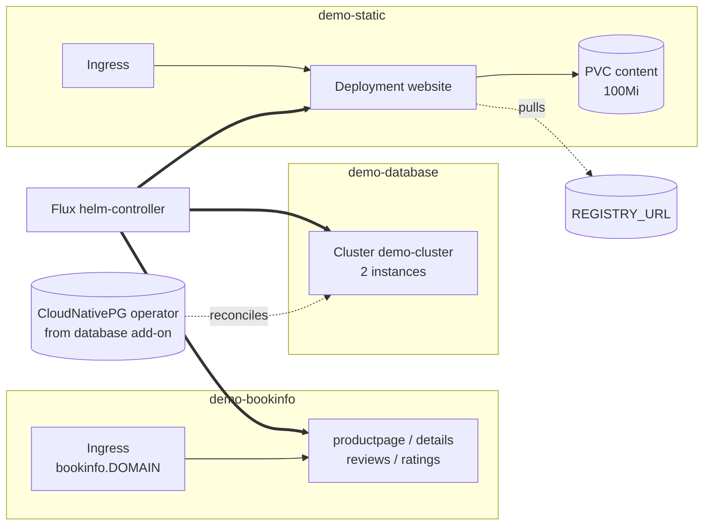

# Demo

Three independent sample workloads, each gated by its own
`demo.resources.<name>` flag. None of them runs by default; the add-on
itself is gated by `demo.enabled == true`.

The three options are not related to each other beyond living in
sibling `demo-*` namespaces — `database` exercises the CloudNativePG
operator, `static` exercises image-pull / PVC / ingress, `bookinfo`
exercises a non-trivial multi-service upstream manifest with Pod
Security Admission constraints.

Each demo namespace runs at PSA `restricted` (stricter than the
`system-*` namespaces) to validate that the cluster's baseline policies
admit security-conscious workloads.

## Architecture



The three sub-stacks are independent — disabling one doesn't affect the
others. The `database` resource is the only one with a cross-add-on
dependency (the operator must be running for the Cluster CR to come up).

## Recipes

### All three demos

```yaml
- name: demo
  path: demo
  dependsOn: [database]
  components: [database, static, bookinfo]
```

Set `demo.resources.{database,static,bookinfo}: true` in `values.yaml`
and the facet expands to the above. `${REGISTRY_URL}` must be defined
at the Flux Kustomization level (the demo facet does not pass it
through).

### Static site only

```yaml
- name: demo
  path: demo
  components: [static]
```

`${REGISTRY_URL}` required. No cross-add-on dependency.

### Postgres Cluster CR only

```yaml
- name: demo
  path: demo
  dependsOn: [database]
  components: [database]
```

Requires the `database` add-on. The Cluster CR creates 2 postgres
instances against the default StorageClass.

<!-- BEGIN_KUSTOMIZE_DOCS -->

## Substitutions

| Name | Required when | Effect |
|---|---|---|
| `DOMAIN` | `demo.resources.bookinfo: true` | Host suffix for the bookinfo Ingress (`bookinfo.${DOMAIN}`). Falls back to `test` if not provided. Must be set via Flux Kustomization-level substitution (the demo facet does not pass one). |
| `REGISTRY_URL` | `demo.resources.static: true` | Image registry hosting the demo static-site container image (`${REGISTRY_URL}/demo:1.0.6`). No fallback; the static workload's pod will fail to pull if the variable is not set at the Flux Kustomization level. |

## Components

| Component | Enable when | Effect |
|---|---|---|
| `database` | `demo.resources.database: true` | Creates the `demo-database` namespace and a `Cluster` CR `demo-cluster` (2 instances, 100 max_connections, 1Gi PVC, PodMonitor enabled). Requires the `database` add-on so the CloudNativePG operator can reconcile the CR. |
| `static` | `demo.resources.static: true` | Creates the `demo-static` namespace (PSA `restricted`) with a `website` Deployment pulling `${REGISTRY_URL}/demo:1.0.6`, a Service, a 100Mi ReadWriteOnce PVC named `content`, and an Ingress. |
| `bookinfo` | `demo.resources.bookinfo: true` | Pulls the upstream Istio bookinfo sample at tag `1.22.8` into `demo-bookinfo` (PSA `restricted`) and applies SecurityContext patches to the four Deployments (productpage, details, ratings, reviews) so the upstream manifests satisfy the namespace's PSA. Ingress at `bookinfo.${DOMAIN}`. |

## Dependencies

| Add-on | Required when | Reason |
|---|---|---|
| `database` | `demo.resources.database: true` | The CloudNativePG operator must be reconciling before the `demo-cluster` Cluster CR can come up. Wired as a conditional `dependsOn` in the facet. |

<!-- END_KUSTOMIZE_DOCS -->

## See also

- [contexts/_template/facets/option-demo.yaml](../../contexts/_template/facets/option-demo.yaml) — canonical wiring.
- [kustomize/demo/static/assets/](static/assets/) — Dockerfile + Node.js source for the static-site image. Build and push to `${REGISTRY_URL}` before enabling the static demo.
- Related add-ons: [database](../database/) (operator for the Postgres demo), [gateway](../gateway/) or [ingress](../ingress/) (route handling), [csi](../csi/) (PVC for the static site).
