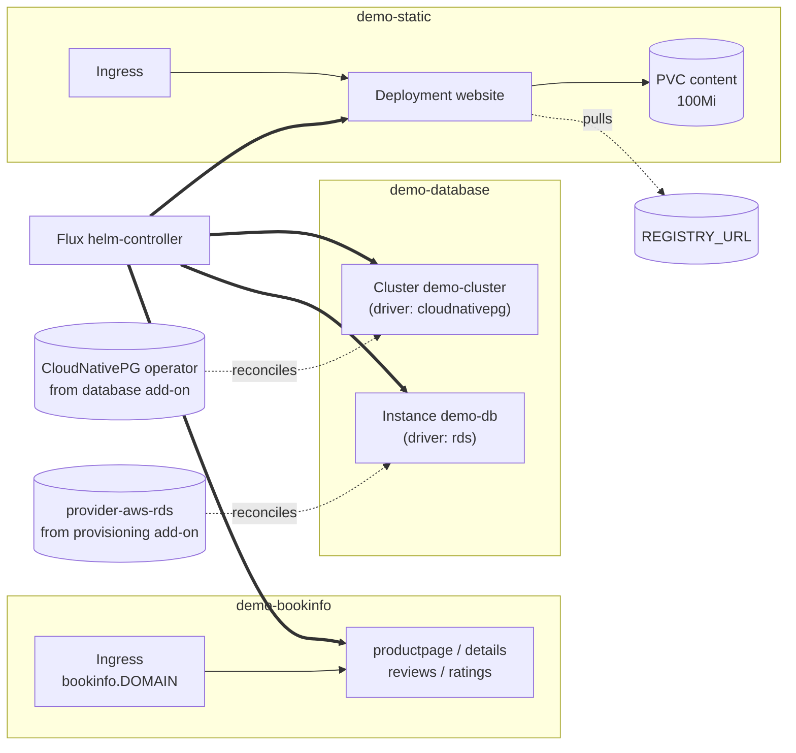

# Demo

Three independent sample workloads, each gated by its own
`demo.resources.<name>` flag. None of them runs by default, and the
add-on itself is gated by `demo.enabled == true`.

The three options aren't related to each other beyond living in sibling
`demo-*` namespaces. `database` creates a `Cluster` CR (CloudNativePG
driver) or an `Instance` CR (`rds` driver, the `kustomize/provisioning`
worked example), matching `database.postgres.driver`; `static` exercises
image-pull plus PVC plus ingress; `bookinfo` exercises a non-trivial
multi-service upstream manifest with Pod Security Admission constraints.

Each demo namespace runs at PSA `restricted` (stricter than the
`system-*` namespaces) to validate that the cluster's baseline policies
admit security-conscious workloads.

## Architecture


```mermaid
flowchart LR
  flux[Flux helm-controller]

  subgraph demobook[demo-bookinfo]
    book_ingress[Ingress<br/>bookinfo.DOMAIN]
    book_svcs[productpage / details<br/>reviews / ratings]
  end

  subgraph demostatic[demo-static]
    static_ingress[Ingress]
    static_dep[Deployment website]
    static_pvc[(PVC content<br/>100Mi)]
  end

  subgraph demodb[demo-database]
    demo_cluster["Cluster demo-cluster<br/>(driver: cloudnativepg)"]
    demo_instance["Instance demo-db<br/>(driver: rds)"]
  end

  cnpg[(CloudNativePG operator<br/>from database add-on)]
  crossplane[(provider-aws-rds<br/>from provisioning add-on)]
  registry[(REGISTRY_URL)]

  flux ==> book_svcs & static_dep & demo_cluster & demo_instance
  static_dep --> static_pvc
  static_dep -.pulls.-> registry
  cnpg -.reconciles.-> demo_cluster
  crossplane -.reconciles.-> demo_instance
  book_ingress --> book_svcs
  static_ingress --> static_dep
```

The three sub-stacks are independent, so disabling one doesn't affect
the others. `database` is the only one with a cross-add-on dependency —
either `database` (CloudNativePG) or `provisioning` (Crossplane), never
both, matching `database.postgres.driver`.

## Recipes

### All three demos

```yaml
- name: demo
  path: demo
  dependsOn: [database]
  components: [database, database/cloudnativepg, static, bookinfo]
```

Set `demo.resources.{database,static,bookinfo}: true` in `values.yaml`
(default `database.postgres.driver`, `cloudnativepg`) and the facet
expands to the above. `${REGISTRY_URL}` must be defined at the Flux
Kustomization level (the demo facet does not pass it through).

### Static site only

```yaml
- name: demo
  path: demo
  components: [static]
```

`${REGISTRY_URL}` required. No cross-add-on dependency.

### Postgres Cluster CR only (driver: cloudnativepg)

```yaml
- name: demo
  path: demo
  dependsOn: [database]
  components: [database, database/cloudnativepg]
```

Requires the `database` add-on. The Cluster CR creates 2 postgres
instances against the default StorageClass.

### RDS Instance CR only (driver: rds)

```yaml
- name: demo
  path: demo
  dependsOn: [provisioning]
  components: [database, database/rds]
  substitutions:
    cluster_name: cluster-<context-id>
    aws_region: us-east-2
```

Requires the `provisioning` add-on (`database.postgres.driver: rds`,
AWS-only). The Instance CR creates one `db.t4g.micro` Postgres instance
against the `<cluster-name>-crossplane-rds` DB subnet group Terraform
provisions.

<!-- BEGIN_KUSTOMIZE_DOCS -->

## Substitutions

| Name | Required when | Effect |
|---|---|---|
| `DOMAIN` | `demo.resources.bookinfo: true` | Host suffix for the bookinfo Ingress (`bookinfo.${DOMAIN}`). Falls back to `test` if not provided. Must be set via Flux Kustomization-level substitution (the demo facet does not pass one). |
| `REGISTRY_URL` | `demo.resources.static: true` | Image registry hosting the demo static-site container image (`${REGISTRY_URL}/demo:1.0.6`). No fallback; the static workload's pod will fail to pull if the variable is not set at the Flux Kustomization level. |
| `db_subnet_group_name` | `demo.resources.database: true` AND `database.postgres.driver == 'rds'` | From `terraform_output('network', 'db_subnet_group_name')`. Sets the `demo-db` Instance's `dbSubnetGroupName` directly — the demo reads the real output rather than reconstructing the naming convention a third-party chart (with no Flux substitution access) has to use instead. Passed by the facet itself. |
| `kms_key_arn` | `demo.resources.database: true` AND `database.postgres.driver == 'rds'` | From `terraform_output('database', 'kms_key_arn')`. Sets the `demo-db` Instance's `kmsKeyId`. Passed by the facet itself. |
| `rds_security_group_id` | `demo.resources.database: true` AND `database.postgres.driver == 'rds'` | From `terraform_output('database', 'security_group_id')`. Sets the `demo-db` Instance's `vpcSecurityGroupIds` — scoped to the EKS cluster's own security group, not the whole VPC CIDR. Passed by the facet itself. |
| `aws_region` | `demo.resources.database: true` AND `database.postgres.driver == 'rds'` | AWS region for the `demo-db` Instance, from `aws.region`. Passed by the facet itself. |
| `demo_db_name` | `demo.resources.database: true` AND `database.postgres.driver == 'rds'` | Fixed value `demo`. Single source of truth for the `demo-db` Instance's `dbName`, referenced by both the Instance CR and the bootstrap job's SQL so the two can't drift independently. Passed by the facet itself. |

## Components

| Component | Enable when | Effect |
|---|---|---|
| `database` | `demo.resources.database: true` | Creates the `demo-database` namespace. Always paired with a driver variant below. |
| `database/cloudnativepg` | `demo.resources.database: true` AND `database.postgres.driver == 'cloudnativepg'` | A `Cluster` CR `demo-cluster` (2 instances, 100 max_connections, 1Gi PVC, PodMonitor enabled). Requires the `database` add-on so the CloudNativePG operator can reconcile the CR. |
| `database/rds` | `demo.resources.database: true` AND `database.postgres.driver == 'rds'` | An `rds.aws.upbound.io/v1beta3` `Instance` CR `demo-db` (db.t4g.micro, 20Gi, AWS-managed master password, network-scoped to the cluster's own security group) — just the database definition, no provider wiring, no RBAC, no CronJob of its own. The application credential (`demo_app`, least-privilege CRUD, via `crossplane/aws-rds/app-role`, wired into this facet's own `demo-app-role` flux entry) is opt-in per chart; monitoring (`demo_monitor`/`postgres_exporter`) is automatic for every `Instance`, provisioned by `kustomize/provisioning`'s Kyverno `generate` policies — nothing here wires it in. |
| `static` | `demo.resources.static: true` | Creates the `demo-static` namespace (PSA `restricted`) with a `website` Deployment pulling `${REGISTRY_URL}/demo:1.0.6`, a Service, a 100Mi ReadWriteOnce PVC named `content`, and an Ingress. |
| `bookinfo` | `demo.resources.bookinfo: true` | Pulls the upstream Istio bookinfo sample at tag `1.22.8` into `demo-bookinfo` (PSA `restricted`) and applies SecurityContext patches to the four Deployments (productpage, details, ratings, reviews) so the upstream manifests satisfy the namespace's PSA. Ingress at `bookinfo.${DOMAIN}`. |

## Dependencies

| Add-on | Required when | Reason |
|---|---|---|
| `database` | `demo.resources.database: true` AND `database.postgres.driver == 'cloudnativepg'` | The CloudNativePG operator must be reconciling before the `demo-cluster` Cluster CR can come up. Wired as a conditional `dependsOn` in the facet. |
| `provisioning` | `demo.resources.database: true` AND `database.postgres.driver == 'rds'` | Crossplane's provider-aws-rds must finish installing before the `demo-db` Instance CR's CRD is registered. Wired as a conditional `dependsOn` in the facet. |

<!-- END_KUSTOMIZE_DOCS -->

## See also

- [contexts/_template/facets/option-demo.yaml](../../contexts/_template/facets/option-demo.yaml) for the canonical wiring.
- [kustomize/demo/static/assets/](static/assets/) for the Dockerfile and Node.js source for the static-site image. Build and push to `${REGISTRY_URL}` before enabling the static demo.
- Related add-ons: [database](../database/) (CloudNativePG operator) and [provisioning](../provisioning/) (Crossplane, `driver: rds`) for the Postgres demo, [gateway](../gateway/) or [ingress](../ingress/) (route handling), [csi](../csi/) (PVC for the static site).
