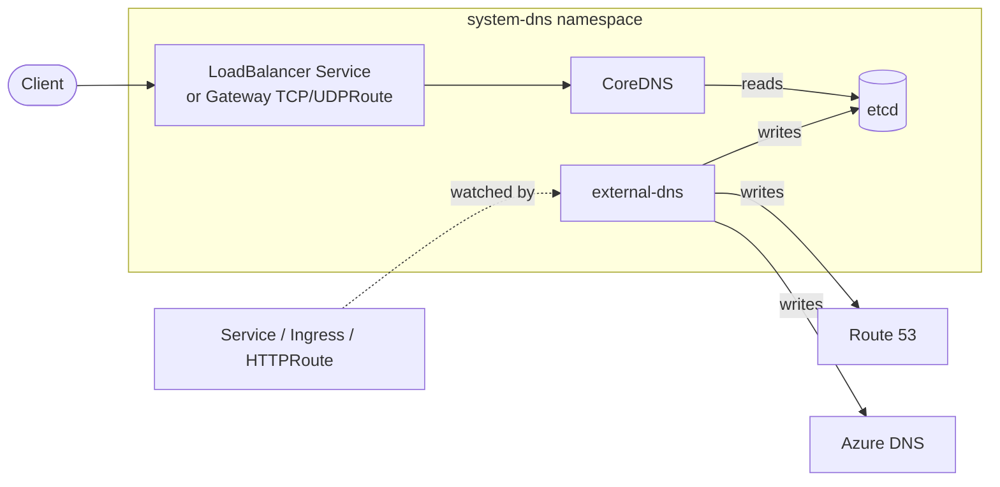

# DNS

Self-hosted DNS for the cluster's private zone, with automatic record
reconciliation against an in-cluster or cloud provider.

## Flow



The provider that external-dns writes to is selected by the
`external-dns/providers/*` component (one of `coredns`, `route53`, `azure`).

## Recipes

The shipped facet at [contexts/_template/facets/addon-private-dns.yaml](../../contexts/_template/facets/addon-private-dns.yaml)
materializes one of the configurations below from blueprint inputs. If you are
authoring a blueprint by hand, copy the recipe that matches your environment.

### docker-desktop (local dev)

Kyverno rewrites DNS targets to `127.0.0.1` so ingress hostnames resolve to
the host loopback.

```yaml
- name: dns
  path: dns
  dependsOn: [pki-base, policy-resources]
  timeout: 20m
  interval: 5m
  components:
    - coredns
    - coredns/etcd
    - external-dns
    - external-dns/providers/coredns
    - external-dns/localhost
  substitutions:
    external_domain: test
    loadbalancer_start_ip: 127.0.0.1
```

### Local Cilium VM cluster

Default `windsor up` topology. CoreDNS exposed via a LoadBalancer Service
sharing the gateway IP through Cilium LBIPAM.

```yaml
- name: dns
  path: dns
  dependsOn: [pki-base, cni]
  timeout: 20m
  interval: 5m
  components:
    - coredns
    - coredns/etcd
    - coredns/loadbalancer
    - coredns/cilium
    - external-dns
    - external-dns/providers/coredns
    - external-dns/sources/gateway-httproute
  substitutions:
    external_domain: example.internal
    loadbalancer_start_ip: 10.5.0.10
```

### Envoy gateway

CoreDNS port-53 listeners attached to the edge Gateway via TCPRoute/UDPRoute.

```yaml
- name: dns
  path: dns
  dependsOn: [pki-base, gateway-base]
  timeout: 20m
  interval: 5m
  components:
    - coredns
    - coredns/etcd
    - coredns/gateway
    - external-dns
    - external-dns/providers/coredns
    - external-dns/sources/gateway-httproute
  substitutions:
    external_domain: example.internal
    loadbalancer_start_ip: 10.5.0.10
```

### AWS production (Route 53)

```yaml
- name: dns
  path: dns
  dependsOn: [pki-base, cni]
  timeout: 20m
  interval: 5m
  components:
    - coredns
    - coredns/etcd
    - coredns/ha
    - coredns/loadbalancer
    - coredns/cilium
    - external-dns
    - external-dns/providers/route53
    - external-dns/ha
    - external-dns/sources/gateway-httproute
  substitutions:
    external_domain: prod.example.com
    loadbalancer_start_ip: 10.0.10.10
```

### Azure production (Azure DNS)

Same shape as the AWS recipe, swapping the provider component to
`external-dns/providers/azure`.

## Substitutions

| Name | Default | Effect and constraints |
|---|---|---|
| `external_domain` | `test` (fallback in helm-release values) | Private zone served by CoreDNS and the `domainFilters` value passed to external-dns. Records outside this domain will not be reconciled. |
| `loadbalancer_start_ip` | required | Anchor IP for the CoreDNS LoadBalancer Service. Must sit inside the LBIPAM pool configured by the `cni` stack on Cilium clusters. Ignored when `coredns/loadbalancer` is not enabled. |

## Components

### `coredns/`

| Component | Enable when | Effect |
|---|---|---|
| `coredns` | always | Helm release of CoreDNS in `system-dns`. |
| `coredns/etcd` | always (record store) | StatefulSet, Service, and mTLS certs for the etcd backing CoreDNS records. |
| `coredns/ha` | `topology == ha` | Multi-replica deployment with anti-affinity. |
| `coredns/loadbalancer` | gateway driver is Cilium | Switches the CoreDNS Service to type `LoadBalancer`. |
| `coredns/cilium` | gateway driver is Cilium | LBIPAM annotation so CoreDNS shares the gateway IP. |
| `coredns/gateway` | gateway driver is Envoy and enabled | TCPRoute and UDPRoute on port 53 attached to the edge Gateway. |

### `external-dns/`

| Component | Enable when | Effect |
|---|---|---|
| `external-dns` | always | Helm release of external-dns in `system-dns`. |
| `external-dns/providers/coredns` | provider is in-cluster CoreDNS-via-etcd | Wires external-dns to write records into the CoreDNS etcd. |
| `external-dns/providers/route53` | provider is AWS Route 53 | IRSA-based AWS provider config. |
| `external-dns/providers/azure` | provider is Azure DNS | Workload-identity-based Azure provider config. |
| `external-dns/ha` | `topology == ha` | Two replicas with leader election. |
| `external-dns/localhost` | runtime is `docker-desktop` | Kyverno ClusterPolicy that mutates Ingress, Gateway, and HTTPRoute objects to set `external-dns.alpha.kubernetes.io/target: 127.0.0.1`. Requires `policy-resources`. |
| `external-dns/sources/gateway-httproute` | a Gateway controller is installed | Adds Gateway API HTTPRoute to external-dns sources. Crashloops if enabled without HTTPRoute CRDs present. |

## Dependencies

| Depends on | Reason |
|---|---|
| `pki-base` | etcd peer, server, and client certificates are issued by the `private` ClusterIssuer. |
| `cni` *(Cilium only)* | LoadBalancer Service for CoreDNS uses Cilium LBIPAM. |
| `gateway-base` *(Envoy only, when gateway enabled)* | TCPRoute/UDPRoute CRDs for the port-53 listeners. |
| `policy-resources` *(docker-desktop only)* | Kyverno CRDs needed by the `external-dns/localhost` ClusterPolicy. |

## Operations

Stack-specific failure modes; generic Flux/Renovate behaviour is documented at
the repo level.

- **`external-dns` crashlooping with `failed to sync HTTPRoute`** — the
  `external-dns/sources/gateway-httproute` component is enabled but the
  Gateway API CRDs are not installed. Either install a Gateway controller or
  drop the component.
- **`HelmRelease/external-dns` reports `no matches for kind ClusterPolicy`** —
  the `external-dns/localhost` component is enabled outside docker-desktop or
  before `policy-resources` (Kyverno) is ready. Confirm the facet still gates
  this on `workstation.runtime == 'docker-desktop'`.
- **CoreDNS pods stuck in `Pending`** — the LoadBalancer Service has no IP.
  On Cilium check the LBIPAM pool covers `loadbalancer_start_ip`; on Envoy
  confirm `coredns/gateway` is selected instead of `coredns/loadbalancer`.
- **Records appear in CoreDNS but not in DNS responses** — etcd peer mTLS is
  failing. Check certificates under [coredns/etcd/certificates.yaml](coredns/etcd/certificates.yaml)
  and that the cert-manager issuer from `pki-base` is `Ready`.

Metrics are scraped by the `telemetry` stack. CoreDNS exposes Prometheus
metrics on port 9153 via the `prometheus` plugin configured in
[coredns/helm-release.yaml](coredns/helm-release.yaml). external-dns metrics
follow the chart default.

## Security

- etcd peer, server, and client traffic is mTLS. Certificates are issued by
  the `private` ClusterIssuer (provided by `pki-base`) and managed under
  [coredns/etcd/certificates.yaml](coredns/etcd/certificates.yaml).
- external-dns identity:
  - Route 53: pod identity (`provider.aws.usePodIdentity: true`) scoped to the hosted zone.
  - Azure DNS: workload identity scoped to the resource group.
- The `external-dns/localhost` Kyverno policy mutates Ingress, Gateway, and
  HTTPRoute objects cluster-wide. It is gated to `docker-desktop` runtime to
  keep it out of shared clusters.

## See also

- [contexts/_template/facets/addon-private-dns.yaml](../../contexts/_template/facets/addon-private-dns.yaml) — canonical wiring with conditional logic.
- Blueprint schema and facet syntax — https://www.windsorcli.dev/docs/blueprints/
- Related stacks: [pki](../pki/), [gateway](../gateway/), [cni](../cni/), [policy](../policy/), [telemetry](../telemetry/).
