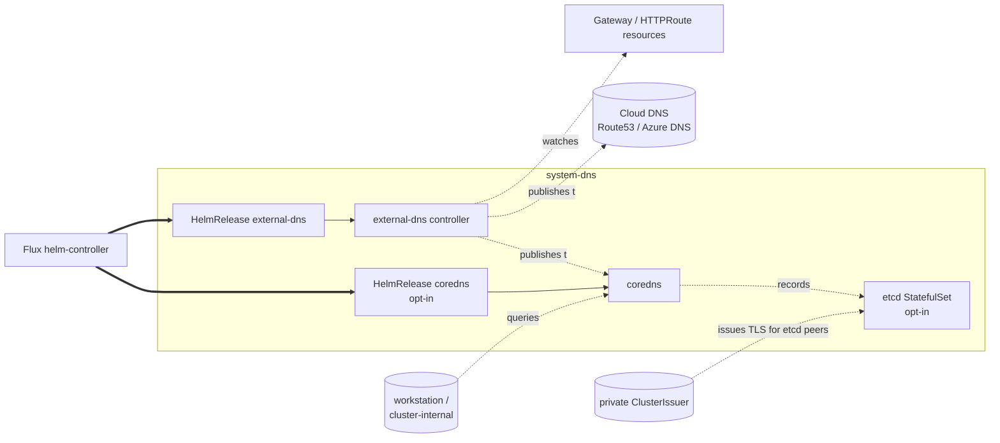

# DNS

Two halves, both gated independently:

- **external-dns** — publishes Kubernetes Service / Gateway / HTTPRoute
  hostnames to a real DNS zone (Route53, Azure DNS, or in-cluster
  coredns). Active whenever `dns.public_domain` is set, or when a
  private gateway path is configured (`gateway.access == 'private'`
  with `dns.private_domain` set).
- **coredns** — in-cluster authoritative private DNS server with an
  etcd backend. Active when `addons.private_dns.enabled: true`. Lets
  workstations resolve `*.<dns.private_domain>` without needing a
  cloud zone.

Single Kustomization path (`dns`) — both halves are wired through the
same facet entry with different component selections.

## Architecture



external-dns runs everywhere DNS publication is needed. coredns +
etcd only run when private DNS is opted in; the etcd peer / server
certs are issued by the `private` ClusterIssuer from the pki add-on.

## Recipes

### Public DNS on AWS (Route53)

```yaml
- name: dns
  path: dns
  dependsOn: [policy-resources, gateway-base]
  components:
    - external-dns
    - external-dns/providers/route53
    - external-dns/sources/gateway-httproute
  substitutions:
    external_domain: example.com
    zone_type: public
    zone_id_filter: <terraform_output('dns-zone', 'zone_id')>
    aws_region: us-east-1
    txt_owner_id: my-cluster
```

### Public DNS on Azure

```yaml
- name: dns
  path: dns
  dependsOn: [policy-resources, gateway-base]
  components:
    - external-dns
    - external-dns/providers/azure
    - external-dns/sources/gateway-httproute
  substitutions:
    external_domain: example.com
    zone_id_filter: <terraform_output('dns-zone', 'zone_id')>
    txt_owner_id: my-cluster
```

### Private DNS (coredns) on a local cluster

```yaml
- name: dns
  path: dns
  dependsOn: [pki-base]
  components:
    - external-dns
    - external-dns/providers/coredns
    - coredns
    - coredns/etcd
    - coredns/loadbalancer
    - coredns/cilium
  substitutions:
    external_domain: example.local
    txt_owner_id: my-cluster
    loadbalancer_start_ip: 10.5.1.10
```

external-dns writes into the in-cluster coredns etcd backend. A
LoadBalancer Service publishes coredns at the configured IP so a
workstation can point its resolver at it.

<!-- BEGIN_KUSTOMIZE_DOCS -->

## Substitutions

| Name | Required when | Effect |
|---|---|---|
| `external_domain` | `external-dns` is enabled | Domain filter for the external-dns controller. Private domain when `gateway.access == 'private'` and `dns.private_domain` is set; otherwise `dns.public_domain` (or `dns.private_domain` for private-dns addon). |
| `zone_type` | platform is AWS | `public` or `private`. Combined with `zone_id_filter` to lock external-dns onto a single Route53 zone in split-horizon setups. |
| `zone_id_filter` | platform is AWS or Azure | Hosted-zone ID to constrain external-dns to. AWS: `terraform_output('dns-zone', 'zone_id')`. Azure: `terraform_output('network', 'private_zone_id')` for private mode. Belt-and-braces alongside `zone_type` for split-horizon DNS. |
| `aws_region` | `external-dns/providers/route53` is enabled | AWS region for external-dns's Route53 API calls. Sourced from top-level `aws.region`. |
| `txt_owner_id` | `external-dns` is enabled | Unique TXT-record owner ID for external-dns's registry. Keeps multiple external-dns instances in the same zone from clobbering each other's records. Threaded via Flux postBuild from the `values-dns` ConfigMap the CLI generates. |
| `loadbalancer_start_ip` | `coredns/loadbalancer` is enabled (private-DNS LB Service) | External IP for the coredns Service when private DNS is exposed via the gateway LB. Sourced from `network.loadbalancer_ips.start`. |

## Components

| Component | Enable when | Effect |
|---|---|---|
| `external-dns` | `dns.public_domain` set OR (`gateway.access == 'private'` AND `dns.private_domain` set) | Helm release of `external-dns` in `system-dns`. Watches Service / Ingress / Gateway / HTTPRoute resources and publishes their hostnames as DNS records. Pod runs as a workload identity-bound ServiceAccount; provider auth is handled by the provider-specific component. |
| `external-dns/ha` | `topology == 'ha'` | Patches the external-dns Deployment to multi-replica with leader election. Skipped on single-node — one replica has nothing to elect against. |
| `external-dns/localhost` | local clusters running external-dns against a coredns-on-localhost target | Patches the controller to point at a localhost coredns instance (used by docker-desktop where in-cluster DNS isn't reachable from the host). |
| `external-dns/providers/route53` | platform is AWS AND public/private DNS zone is set | Patches the external-dns HelmRelease for the Route53 provider: `provider.aws.usePodIdentity: true`, `region: ${aws_region}`, `zoneType: ${zone_type}`, `--zone-id-filter=${zone_id_filter}`. |
| `external-dns/providers/azure` | platform is Azure AND DNS zone is set | Patches the external-dns HelmRelease for the Azure provider: federated workload identity, zone-id filter via `${zone_id_filter}`. |
| `external-dns/providers/coredns` | `addons.private_dns.enabled: true` (provides private DNS via in-cluster coredns) | Patches the external-dns HelmRelease for the CoreDNS provider, writing records into the in-cluster coredns etcd backend instead of a cloud DNS zone. |
| `external-dns/sources/gateway-httproute` | `gateway.enabled: true` | Adds `gateway-httproute` to external-dns's `sources` list so the Gateway API's `HTTPRoute` hostnames are published. Requires the Gateway API CRDs to be present (hence the `gateway-base` dependency). |
| `coredns` | `addons.private_dns.enabled: true` | Helm release of `coredns` in `system-dns`. In-cluster private DNS server. The default plugin chain serves cluster.local and forwards everything else upstream. |
| `coredns/etcd` | `addons.private_dns.enabled: true` | etcd StatefulSet for coredns to use as a persistent backend for the `etcd` plugin. mTLS between coredns and etcd peers, certs issued by the `private` ClusterIssuer. |
| `coredns/ha` | `addons.private_dns.enabled: true` AND `topology == 'ha'` | Patches the coredns HelmRelease for HA (multi-replica + leader election). |
| `coredns/loadbalancer` | `addons.private_dns.enabled: true` AND `gateway.driver == 'cilium'` | Adds a `Service type=LoadBalancer` for coredns at `${loadbalancer_start_ip}` so the cluster's private DNS is reachable from outside the cluster (workstation pointing at the bench IP). |
| `coredns/cilium` | `addons.private_dns.enabled: true` AND `gateway.driver == 'cilium'` | Cilium-specific patches on coredns (typically LB-sharing annotations matching the Cilium gateway's IP pool). |
| `coredns/gateway` | `addons.private_dns.enabled: true` AND `gateway.enabled: true` | Wires a Gateway API listener / route so coredns is reachable through the cluster Gateway (UDP/TCP 53). |

## Dependencies

| Add-on | Required when | Reason |
|---|---|---|
| `pki-base` | `addons.private_dns.enabled: true` | coredns's etcd peer / server certs are issued by the `private` ClusterIssuer; cert-manager must be reconciling first. |
| `gateway-base` | `gateway.enabled: true` | external-dns with `sources: [gateway-httproute]` crash-loops on `no matches for kind HTTPRoute` if the Gateway API CRDs aren't installed yet. |
| `policy-resources` | `workstation.runtime == 'docker-desktop'` | docker-desktop runs Kyverno in restricted-PSA mode for system-dns; the baseline policies need to be reconciling before coredns pods are admitted. |
| `cni` | `addons.private_dns.enabled: true` AND `gateway.driver == 'cilium'` | The `coredns/cilium` and `coredns/loadbalancer` components rely on Cilium's L2 IP-sharing infrastructure being live. |

<!-- END_KUSTOMIZE_DOCS -->

## See also

- [contexts/_template/facets/platform-aws.yaml](../../contexts/_template/facets/platform-aws.yaml) — Route53 wiring.
- [contexts/_template/facets/platform-azure.yaml](../../contexts/_template/facets/platform-azure.yaml) — Azure DNS wiring.
- [contexts/_template/facets/addon-private-dns.yaml](../../contexts/_template/facets/addon-private-dns.yaml) — coredns + etcd wiring.
- [terraform/dns/zone/route53/](../../terraform/dns/zone/route53/) — Route53 zone creation (separate from this add-on).
- [terraform/dns/zone/azure-dns/](../../terraform/dns/zone/azure-dns/) — Azure DNS zone creation.
- Related add-ons: [pki](../pki/) (etcd certs), [gateway](../gateway/) (HTTPRoute source), [policy](../policy/).
