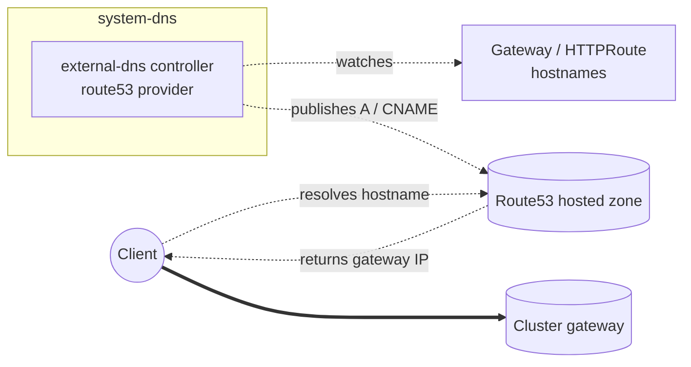
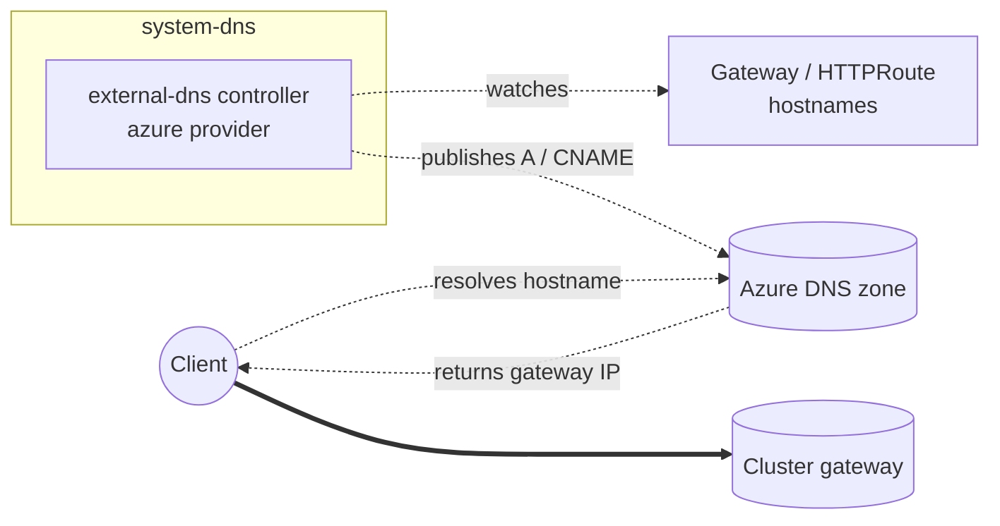
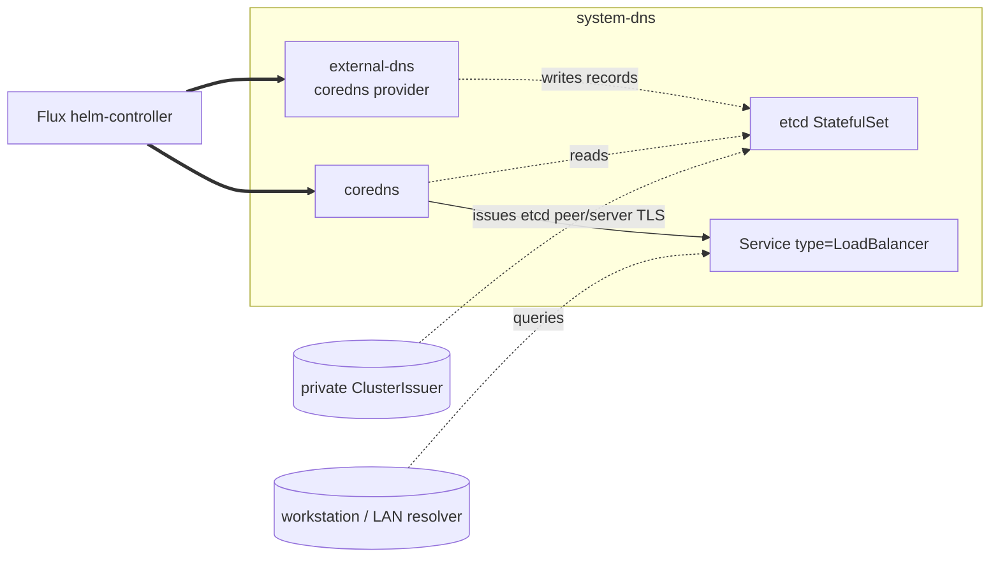

# DNS

Two halves, both gated independently.

`external-dns` publishes Kubernetes Service / Gateway / HTTPRoute
hostnames to a real DNS zone (Route53, Azure DNS, or in-cluster
coredns). Two independent instances, one per zone: the public
instance runs whenever `dns.public_domain` is set, the internal
instance whenever `dns.private_domain` is set -- both can run at
once, one per gateway.

`coredns` is an in-cluster authoritative private DNS server with an
etcd backend. It's active when `dns.private.enabled: true`,
and lets workstations resolve `*.<dns.private_domain>` without
needing a cloud zone.

Both halves run from a single Kustomization path (`dns`). They're
wired through the same facet entry with different component
selections.

## Recipes

`external-dns` runs everywhere DNS publication is needed and watches
Gateway / HTTPRoute resources; the provider component selects where it
writes records. coredns and etcd only run when private DNS is opted in.

### Public DNS on AWS (Route53)


```mermaid
flowchart LR
  client((Client))

  subgraph systemdns[system-dns]
    edns[external-dns controller<br/>route53 provider]
  end

  gateways[Gateway / HTTPRoute<br/>hostnames]
  zone[(Route53 hosted zone)]
  gw[(Cluster gateway)]

  edns -. watches .-> gateways
  edns -. publishes A / CNAME .-> zone
  client -. resolves hostname .-> zone -. returns gateway IP .-> client
  client ==> gw
```

```yaml
- name: dns
  dependsOn: [policy-resources, gateway-install]
  install:
    components:
      - external-dns
      - external-dns/providers/route53
      - external-dns/sources/gateway-httproute
    substitutions:
      external_domain: example.com
      zone_type: public
      zone_id_filter: <terraform_output('dns-zone', 'zone_id')>
      aws_region: us-east-1
      txt_owner_id: my-cluster
```

### Public DNS on Azure


```mermaid
flowchart LR
  client((Client))

  subgraph systemdns[system-dns]
    edns[external-dns controller<br/>azure provider]
  end

  gateways[Gateway / HTTPRoute<br/>hostnames]
  zone[(Azure DNS zone)]
  gw[(Cluster gateway)]

  edns -. watches .-> gateways
  edns -. publishes A / CNAME .-> zone
  client -. resolves hostname .-> zone -. returns gateway IP .-> client
  client ==> gw
```

```yaml
- name: dns
  dependsOn: [policy-resources, gateway-install]
  install:
    components:
      - external-dns
      - external-dns/providers/azure
      - external-dns/sources/gateway-httproute
    substitutions:
      external_domain: example.com
      zone_id_filter: <terraform_output('dns-zone', 'zone_id')>
      txt_owner_id: my-cluster
```

### Private DNS (coredns) on a local or metal cluster


```mermaid
flowchart LR
  flux[Flux helm-controller]

  subgraph systemdns[system-dns]
    edns[external-dns<br/>coredns provider]
    coredns[coredns]
    etcd[etcd StatefulSet]
    lb[Service type=LoadBalancer]
  end

  pki[(private ClusterIssuer)]
  resolver[(workstation / LAN resolver)]

  flux ==> edns
  flux ==> coredns
  edns -.writes records.-> etcd
  coredns -.reads.-> etcd
  pki -.issues etcd peer/server TLS.-> etcd
  coredns --> lb
  resolver -.queries.-> lb
```

```yaml
- name: dns
  dependsOn: [pki-install]
  install:
    components:
      - external-dns
      - external-dns/providers/coredns
      - coredns
      - coredns/etcd
      - coredns/loadbalancer
      - coredns/cilium
    substitutions:
      external_domain: example.local
      txt_owner_id: my-cluster
      loadbalancer_start_ip: 10.5.1.10
```

external-dns writes into the in-cluster coredns etcd backend, whose
peer and server certs come from the pki `private` ClusterIssuer. With
the Cilium driver (the Talos default on both local and metal clusters)
a LoadBalancer Service publishes coredns at the configured IP via
Cilium L2/ARP. Under the Envoy driver coredns is reached through the
gateway's port-53 listener (`coredns/gateway`) instead.

The wiring is identical on a local workstation and on metal; they
differ in who queries that IP. On a local cluster it sits on the
workstation's bridge network and the workstation points its stub
resolver at it. On metal it is a routable LAN address, so LAN clients
or an upstream resolver that forwards `*.<dns.private_domain>` query it.
In both cases `loadbalancer_start_ip` must fall inside
`network.loadbalancer_ips` and be reachable from those resolvers.

<!-- BEGIN_KUSTOMIZE_DOCS -->

## Substitutions

| Name | Required when | Effect |
|---|---|---|
| `external_domain` | `external-dns` (public instance) is enabled | Domain filter for the public external-dns instance. Always `dns.public_domain` -- this instance only ever exists when a public domain is set. |
| `internal_domain` | `external-dns-internal` is enabled | Domain filter for the internal external-dns instance. Always `dns.private_domain` -- this instance only ever exists when a private domain is set. |
| `zone_type` | platform is AWS, public instance | Always `public` on the public external-dns instance. Combined with `zone_id_filter` to lock the controller onto the public Route53 zone. |
| `zone_type_internal` | platform is AWS, internal instance | Always `private` on the internal external-dns instance (`external-dns-internal`). |
| `zone_id_filter` | platform is AWS or Azure, public instance | Public hosted-zone ID to constrain the public external-dns instance to. AWS: `terraform_output('dns-zone', 'zone_id')`. Azure has no zone-id-filter equivalent (the provider already scopes to azure.json's resourceGroup). |
| `zone_id_filter_internal` | platform is AWS, internal instance | Private hosted-zone ID (`terraform_output('network', 'private_zone_id')`) to constrain the internal external-dns instance (`external-dns-internal`) to. |
| `aws_region` | `external-dns/providers/route53` or `external-dns-internal/providers/route53` is enabled | AWS region for external-dns's Route53 API calls. Sourced from top-level `aws.region`. |
| `txt_owner_id` | `external-dns` or `external-dns-internal` is enabled | Unique TXT-record owner ID for external-dns's registry. Keeps multiple external-dns instances in the same zone from clobbering each other's records. Threaded via Flux postBuild from the `values-dns` ConfigMap the CLI generates. |
| `loadbalancer_start_ip` | `coredns/loadbalancer` is enabled (private-DNS LB Service) | External IP for the coredns Service when private DNS is exposed via the gateway LB. Sourced from `network.loadbalancer_ips.start`. |

## Components

| Component | Enable when | Effect |
|---|---|---|
| `external-dns` | `dns.public_domain` set | Helm release of `external-dns` in `system-dns`, serving the public zone only. Watches Service / Ingress / Gateway / HTTPRoute resources and publishes their hostnames as DNS records. Pod runs as a workload identity-bound ServiceAccount; provider auth is handled by the provider-specific component. `external-dns-internal` is the independent counterpart serving the private zone -- both can run at once. |
| `external-dns-internal` | `dns.private_domain` set | Independent `external-dns-internal` HelmRelease serving the private zone only, feeding the internal gateway's hostnames. Same shape as `external-dns`, distinct HelmRelease name and substitution keys (`internal_domain`, `zone_type_internal`, `zone_id_filter_internal`) so both instances can be configured independently in one blueprint. |
| `external-dns/ha` | `topology == 'ha'` | Patches the external-dns Deployment to multi-replica with leader election. Skipped on single-node — one replica has nothing to elect against. |
| `external-dns/providers/route53` | platform is AWS AND `dns.public_domain` set | Patches the `external-dns` HelmRelease for the Route53 provider: `provider.aws.usePodIdentity: true`, `region: ${aws_region}`, `zoneType: ${zone_type}`, `--zone-id-filter=${zone_id_filter}`. `external-dns-internal/providers/route53` is the private-zone counterpart. |
| `external-dns/providers/azure` | platform is Azure AND `dns.public_domain` set | Patches the `external-dns` HelmRelease for the Azure provider (always `azure`, the public zone provider): federated workload identity. `external-dns-internal/providers/azure` is the private-zone counterpart (always `azure-private-dns`). |
| `external-dns/providers/coredns` | `dns.private.enabled: true` (provides private DNS via in-cluster coredns) | Patches the external-dns HelmRelease for the CoreDNS provider, writing records into the in-cluster coredns etcd backend instead of a cloud DNS zone. |
| `external-dns/sources/gateway-httproute` | `gateway.enabled: true` | Adds `gateway-httproute` to external-dns's `sources` list so the Gateway API's `HTTPRoute` hostnames are published. Requires the Gateway API CRDs to be present (hence the `gateway-install` dependency). |
| `coredns` | `dns.private.enabled: true` | Helm release of `coredns` in `system-dns`. In-cluster private DNS server. The default plugin chain serves cluster.local and forwards everything else upstream. |
| `coredns/etcd` | `dns.private.enabled: true` | etcd StatefulSet for coredns to use as a persistent backend for the `etcd` plugin. mTLS between coredns and etcd peers, certs issued by the `private` ClusterIssuer. |
| `coredns/prometheus` | `dns.private.enabled: true` AND `telemetry.metrics.enabled: true` | Enables the chart's metrics Service and ServiceMonitor so this coredns instance is scraped by kube-prometheus-stack. The unfiltered `prometheus/alerts/coredns` rules then cover it automatically alongside the cluster's built-in CoreDNS. |
| `coredns/ha` | `dns.private.enabled: true` AND `topology == 'ha'` | Patches the coredns HelmRelease for HA (multi-replica + leader election). |
| `coredns/loadbalancer` | `dns.private.enabled: true` AND `gateway.driver == 'cilium'` | Adds a `Service type=LoadBalancer` for coredns at `${loadbalancer_start_ip}` so the cluster's private DNS is reachable from outside the cluster (workstation pointing at the bench IP). |
| `coredns/cilium` | `dns.private.enabled: true` AND `gateway.driver == 'cilium'` | Cilium-specific patches on coredns (typically LB-sharing annotations matching the Cilium gateway's IP pool). |
| `coredns/gateway` | `dns.private.enabled: true` AND `gateway.enabled: true` | Wires a Gateway API listener / route so coredns is reachable through the cluster Gateway (UDP/TCP 53). |

## Dependencies

| Add-on | Required when | Reason |
|---|---|---|
| `pki-install` | `dns.private.enabled: true` | coredns's etcd peer / server certs are issued by the `private` ClusterIssuer; cert-manager must be reconciling first. |
| `gateway-install` | `gateway.enabled: true` | external-dns with `sources: [gateway-httproute]` crash-loops on `no matches for kind HTTPRoute` if the Gateway API CRDs aren't installed yet. |
| `policy-resources` | `workstation.runtime == 'docker-desktop'` | docker-desktop runs Kyverno in restricted-PSA mode for system-dns; the baseline policies need to be reconciling before coredns pods are admitted. |
| `cni` | `dns.private.enabled: true` AND `gateway.driver == 'cilium'` | The `coredns/cilium` and `coredns/loadbalancer` components rely on Cilium's L2 IP-sharing infrastructure being live. |

<!-- END_KUSTOMIZE_DOCS -->

## See also

- [contexts/_template/facets/platform-aws.yaml](../../contexts/_template/facets/platform-aws.yaml) for Route53 wiring.
- [contexts/_template/facets/platform-azure.yaml](../../contexts/_template/facets/platform-azure.yaml) for Azure DNS wiring.
- [contexts/_template/facets/addon-private-dns.yaml](../../contexts/_template/facets/addon-private-dns.yaml) for coredns and etcd wiring.
- [terraform/dns/zone/route53/](../../terraform/dns/zone/route53/) for the Route53 zone creation (separate from this add-on).
- [terraform/dns/zone/azure-dns/](../../terraform/dns/zone/azure-dns/) for the Azure DNS zone creation.
- Related add-ons: [pki](../pki/) (etcd certs), [gateway](../gateway/) (HTTPRoute source), [policy](../policy/).
