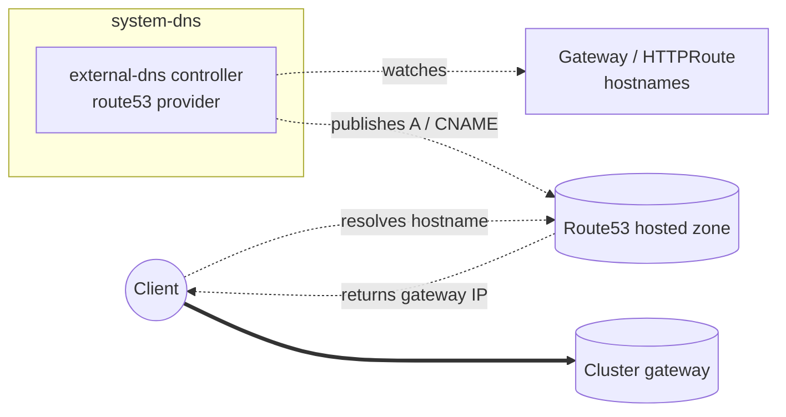
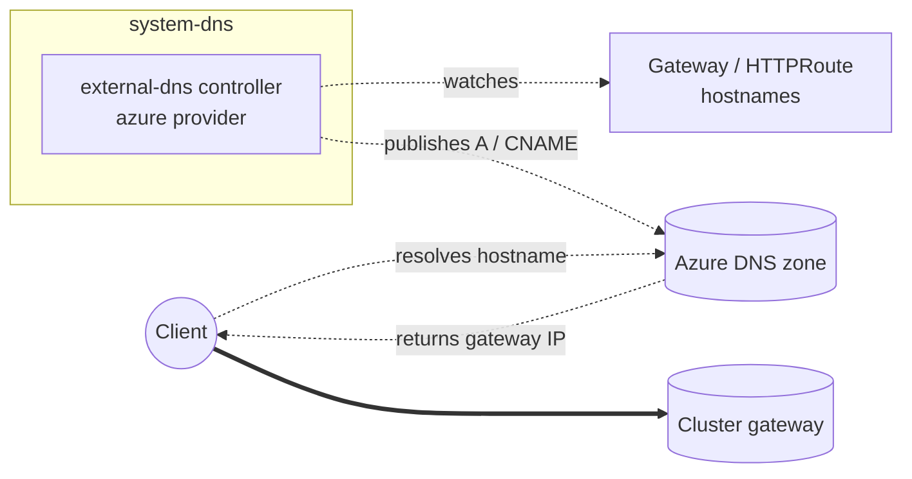
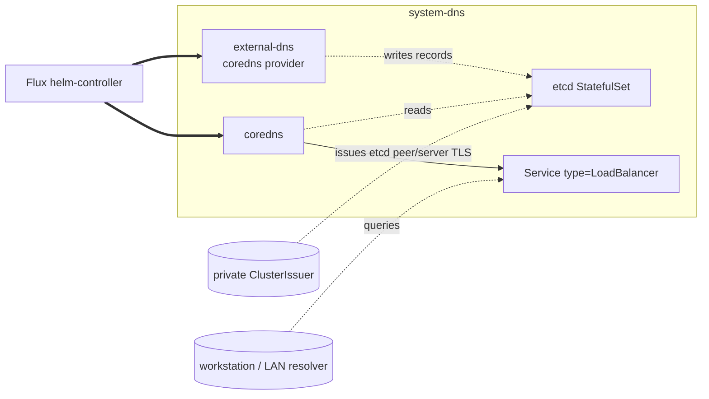

Two halves, both gated independently.

`external-dns` publishes Kubernetes Service / Gateway / HTTPRoute
hostnames to a real DNS zone (Route53, Azure DNS, or in-cluster
coredns). It's active whenever `dns.public_domain` or
`dns.private_domain` is set.

`coredns` is an in-cluster authoritative private DNS server with an
etcd backend. It's active when `dns.private.enabled: true`,
and lets workstations resolve `*.<dns.private_domain>` without
needing a cloud zone.

Both halves run from a single Kustomization path (`dns`). They're
wired through the same facet entry with different component
selections.

## Recipes

`external-dns` runs everywhere DNS publication is needed and watches
Gateway / HTTPRoute resources. The install tier holds the HelmRepository. The resources tier holds the
one ServiceAccount every instance shares (the `account` variant) and runs
one instance per zone as a named variant (`public`, `private`). The
provider component selects where each instance writes records. coredns and
etcd only run when private DNS is opted in.

### Public DNS on AWS (Route53)


```mermaid
flowchart LR
  client((Client))

  subgraph systemdns[system-dns]
    edns[external-dns controller<br/>route53 provider]
  end

  gateways[Gateway / HTTPRoute<br/>hostnames]
  zone[(Route53 hosted zone)]
  gw[(Cluster gateway)]

  edns -. watches .-> gateways
  edns -. publishes A / CNAME .-> zone
  client -. resolves hostname .-> zone -. returns gateway IP .-> client
  client ==> gw
```

```yaml
- name: dns
  dependsOn: [policy-resources, gateway-install]
  install:
    components: [external-dns]
  resources:
    - name: account
      components: [service-account]
    - name: public
      dependsOn: [dns-resources-account]
      components:
        - external-dns
        - external-dns/providers/route53
        - external-dns/sources/gateway-httproute
      substitutions:
        external_dns_name: external-dns-public
        external_dns_domain: example.com
        external_dns_zone_type: public
        external_dns_zone_id_filter: <terraform_output('dns-zone', 'zone_id')>
        aws_region: us-east-1
        txt_owner_id: my-cluster
```

### Public DNS on Azure


```mermaid
flowchart LR
  client((Client))

  subgraph systemdns[system-dns]
    edns[external-dns controller<br/>azure provider]
  end

  gateways[Gateway / HTTPRoute<br/>hostnames]
  zone[(Azure DNS zone)]
  gw[(Cluster gateway)]

  edns -. watches .-> gateways
  edns -. publishes A / CNAME .-> zone
  client -. resolves hostname .-> zone -. returns gateway IP .-> client
  client ==> gw
```

```yaml
- name: dns
  dependsOn: [policy-resources, gateway-install]
  install:
    components: [external-dns]
  resources:
    - name: account
      components:
        - service-account
        - service-account/providers/azure
      substitutions:
        external_dns_client_id: <terraform_output('cluster', 'external_dns_client_id')>
        external_dns_tenant_id: <terraform_output('cluster', 'tenant_id')>
    - name: public
      dependsOn: [dns-resources-account]
      components:
        - external-dns
        - external-dns/providers/azure
        - external-dns/sources/gateway-httproute
      substitutions:
        external_dns_name: external-dns-public
        external_dns_domain: example.com
        external_dns_azure_provider: azure
        external_dns_subscription_id: <terraform_output('dns-zone', 'subscription_id')>
        external_dns_resource_group: <terraform_output('dns-zone', 'resource_group_name')>
        external_dns_tenant_id: <terraform_output('cluster', 'tenant_id')>
        txt_owner_id: my-cluster
```

### Private DNS (coredns) on a local or metal cluster


```mermaid
flowchart LR
  flux[Flux helm-controller]

  subgraph systemdns[system-dns]
    edns[external-dns<br/>coredns provider]
    coredns[coredns]
    etcd[etcd StatefulSet]
    lb[Service type=LoadBalancer]
  end

  pki[(private ClusterIssuer)]
  resolver[(workstation / LAN resolver)]

  flux ==> edns
  flux ==> coredns
  edns -.writes records.-> etcd
  coredns -.reads.-> etcd
  pki -.issues etcd peer/server TLS.-> etcd
  coredns --> lb
  resolver -.queries.-> lb
```

```yaml
- name: dns
  dependsOn: [pki-install]
  install:
    components:
      - external-dns
      - coredns
      - coredns/etcd
      - coredns/loadbalancer
      - coredns/cilium
    substitutions:
      private_domain: example.local
      loadbalancer_start_ip: 10.5.1.10
  resources:
    - name: account
      components: [service-account]
    - name: private
      dependsOn: [dns-resources-account]
      components:
        - external-dns
        - external-dns/providers/coredns
      substitutions:
        external_dns_name: external-dns-private
        external_dns_domain: example.local
```

external-dns writes into the in-cluster coredns etcd backend, whose
peer and server certs come from the pki `private` ClusterIssuer. With
the Cilium driver (the Talos default on both local and metal clusters)
a LoadBalancer Service publishes coredns at the configured IP via
Cilium L2/ARP. Under the Envoy driver coredns is reached through the
gateway's port-53 listener (`coredns/gateway`) instead.

The wiring is identical on a local workstation and on metal; they
differ in who queries that IP. On a local cluster it sits on the
workstation's bridge network and the workstation points its stub
resolver at it. On metal it is a routable LAN address, so LAN clients
or an upstream resolver that forwards `*.<dns.private_domain>` query it.
In both cases `loadbalancer_start_ip` must fall inside
`network.loadbalancer_ips` and be reachable from those resolvers.

<!-- BEGIN_KUSTOMIZE_DOCS -->

## Substitutions

| Name | Required when | Effect |
|---|---|---|
| `public_domain` | `coredns/public-zone` is enabled | Public domain the in-cluster coredns also serves. Always `dns.public_domain`. |
| `private_domain` | `coredns` is enabled | Private domain the in-cluster coredns serves. Always `dns.private_domain`. |
| `external_dns_name` | a `resources/external-dns` instance is enabled | HelmRelease name of the instance: `external-dns-public` for the public zone, `external-dns-private` for the private zone. |
| `external_dns_domain` | a `resources/external-dns` instance is enabled | Domain filter for the instance: `dns.public_domain` or `dns.private_domain`. |
| `external_dns_zone_type` | `resources/external-dns/providers/route53` is enabled | Route53 zone type of the instance, `public` or `private`. Combined with `external_dns_zone_id_filter` to lock the controller onto one zone. |
| `external_dns_zone_id_filter` | `resources/external-dns/providers/route53` is enabled | Hosted-zone ID to constrain the instance to. Public: `terraform_output('dns-zone', 'zone_id')`. Private: `terraform_output('network', 'private_zone_id')`. |
| `external_dns_azure_provider` | `resources/external-dns/providers/azure` is enabled | Azure provider of the instance: `azure` for the public zone, `azure-private-dns` for the VNet-linked private zone. |
| `external_dns_subscription_id` | `resources/external-dns/providers/azure` is enabled | Azure subscription holding the instance's DNS zone. Public: `terraform_output('dns-zone', 'subscription_id')`. Private: `terraform_output('network', 'subscription_id')`. |
| `external_dns_resource_group` | `resources/external-dns/providers/azure` is enabled | Azure resource group holding the instance's DNS zone. Public: `terraform_output('dns-zone', 'resource_group_name')`. Private: `terraform_output('network', 'resource_group_name')`. |
| `external_dns_tenant_id` | `service-account/providers/azure` or `resources/external-dns/providers/azure` is enabled | Azure AD tenant for the external-dns workload identity. Sourced from `terraform_output('cluster', 'tenant_id')`. |
| `external_dns_client_id` | `service-account/providers/azure` is enabled | Client ID of the external-dns managed identity, set on the shared ServiceAccount. Sourced from `terraform_output('cluster', 'external_dns_client_id')`. |
| `aws_region` | `resources/external-dns/providers/route53` is enabled | AWS region for external-dns's Route53 API calls. Sourced from top-level `aws.region`. |
| `google_project_id` | `resources/external-dns/providers/google` is enabled | GCP project external-dns's Cloud DNS API calls run against. Sourced from `gcp.project_id`. |
| `external_dns_service_account_email` | `service-account/providers/google` is enabled | Email of the external-dns Google Service Account, set on the shared ServiceAccount. Sourced from `terraform_output('cluster', 'external_dns_service_account_email')`. |
| `txt_owner_id` | a `resources/external-dns` instance uses a registry-backed provider | Unique TXT-record owner ID for external-dns's registry. Keeps multiple external-dns instances in the same zone from clobbering each other's records. Threaded via Flux postBuild from the `values-dns` ConfigMap the CLI generates. |
| `loadbalancer_start_ip` | `coredns/loadbalancer` is enabled (private-DNS LB Service) | External IP for the coredns Service when private DNS is exposed via the gateway LB. Sourced from `network.loadbalancer_ips.start`. |

## Components

### `external-dns`

_Enabled when `dns.public_domain` or `dns.private_domain` is set._

The `external-dns` HelmRepository in `system-dns`, shared by every instance.

### `service-account`

_Enabled when the `account` variant, present whenever an external-dns instance is._

The shared `external-dns` ServiceAccount in `system-dns`. Every instance runs under it, so the cloud identity bindings (AWS Pod Identity, the Azure federated credential, the GKE Workload Identity binding) cover the public and the private instance alike. It lives in the resources tier so that on an in-place upgrade it applies after the install tier has removed the old HelmRelease, whose uninstall deletes a ServiceAccount of the same name.

### `service-account/providers/azure`

_Enabled when platform is Azure._

Adds the workload identity label and the client and tenant ID annotations to the shared ServiceAccount.

### `service-account/providers/google`

_Enabled when platform is GCP._

Adds the `iam.gke.io/gcp-service-account` annotation to the shared ServiceAccount.

### `resources/external-dns`

_Enabled when one named variant per zone: `public` when `dns.public_domain` is set, `private` when `dns.private_domain` is set._

The `external-dns` HelmRelease for one zone, named by `${external_dns_name}` and filtered to `${external_dns_domain}`. Watches Service / Ingress / Gateway / HTTPRoute resources and publishes their hostnames as DNS records. Runs under the shared ServiceAccount, with provider auth handled by the provider component.

### `resources/external-dns/providers/route53`

_Enabled when platform is AWS._

Patches the HelmRelease for the Route53 provider: `provider.aws.usePodIdentity: true`, `region: ${aws_region}`, `zoneType: ${external_dns_zone_type}`, `--zone-id-filter=${external_dns_zone_id_filter}`.

### `resources/external-dns/providers/azure`

_Enabled when platform is Azure._

Patches the HelmRelease for the Azure provider, `${external_dns_azure_provider}` being `azure` for the public zone and `azure-private-dns` for the private one, with federated workload identity.

### `resources/external-dns/providers/google`

_Enabled when platform is GCP._

Patches the HelmRelease for the Google provider: `provider.name: google` and `--google-project=${google_project_id}`. Cloud DNS serves public and private zones through the same API.

### `resources/external-dns/providers/hetzner`

_Enabled when platform is Hetzner._

Patches the HelmRelease for Hetzner DNS through the external-dns webhook provider, reading the API token from the `hetzner-dns` Secret.

### `resources/external-dns/providers/coredns`

_Enabled when `dns.private.enabled: true` (provides DNS through the in-cluster coredns)._

Patches the HelmRelease for the CoreDNS provider, writing records into the in-cluster coredns etcd backend instead of a cloud DNS zone.

### `resources/external-dns/sources/gateway-httproute`

_Enabled when `gateway.enabled: true`._

Adds `gateway-httproute` to external-dns's `sources` list so the Gateway API's `HTTPRoute` hostnames are published. Requires the Gateway API CRDs to be present.

### `coredns/public-zone`

_Enabled when `dns.private.enabled: true` AND `dns.public_domain` is set._

Adds a `${public_domain}` zone to the in-cluster coredns server block, so a local or metal cluster answers for the public domain as well as the private one.

### `coredns`

_Enabled when `dns.private.enabled: true`._

Helm release of `coredns` in `system-dns`. In-cluster private DNS server. Serves only `dns.private_domain` and refuses every other name.

| Variant | Enabled when | Effect |
|---|---|---|
| `etcd` | `dns.private.enabled: true` | etcd StatefulSet for coredns to use as a persistent backend for the `etcd` plugin. mTLS between coredns and etcd peers, certs issued by the `private` ClusterIssuer. |
| `prometheus` | `dns.private.enabled: true` AND `telemetry.metrics.enabled: true` | Enables the chart's metrics Service and ServiceMonitor so this coredns instance is scraped by kube-prometheus-stack. The unfiltered `prometheus/alerts/coredns` rules then cover it automatically alongside the cluster's built-in CoreDNS. |
| `ha` | `dns.private.enabled: true` AND `topology == 'ha'` | Patches the coredns HelmRelease for HA (multi-replica + leader election). |
| `loadbalancer` | `dns.private.enabled: true` AND `gateway.driver == 'cilium'` | Adds a `Service type=LoadBalancer` for coredns at `${loadbalancer_start_ip}` so the cluster's private DNS is reachable from outside the cluster (workstation pointing at the bench IP). |
| `cilium` | `dns.private.enabled: true` AND `gateway.driver == 'cilium'` | Cilium-specific patches on coredns (typically LB-sharing annotations matching the Cilium gateway's IP pool). |
| `gateway` | `dns.private.enabled: true` AND `gateway.enabled: true` | Wires a Gateway API listener / route so coredns is reachable through the cluster Gateway (UDP/TCP 53). |

## Dependencies

| Add-on | Required when | Reason |
|---|---|---|
| `pki-install` | `dns.private.enabled: true` | coredns's etcd peer / server certs are issued by the `private` ClusterIssuer; cert-manager must be reconciling first. |
| `gateway-install` | `gateway.enabled: true` | external-dns with `sources: [gateway-httproute]` crash-loops on `no matches for kind HTTPRoute` if the Gateway API CRDs aren't installed yet. |
| `policy-resources` | `workstation.runtime == 'docker-desktop'` | docker-desktop runs Kyverno in restricted-PSA mode for system-dns; the baseline policies need to be reconciling before coredns pods are admitted. |
| `cni` | `dns.private.enabled: true` AND `gateway.driver == 'cilium'` | The `coredns/cilium` and `coredns/loadbalancer` components rely on Cilium's L2 IP-sharing infrastructure being live. |

<!-- END_KUSTOMIZE_DOCS -->

## See also

- [contexts/_template/facets/platform-aws.yaml](../../contexts/_template/facets/platform-aws.yaml) for Route53 wiring.
- [contexts/_template/facets/platform-azure.yaml](../../contexts/_template/facets/platform-azure.yaml) for Azure DNS wiring.
- [contexts/_template/facets/addon-private-dns.yaml](../../contexts/_template/facets/addon-private-dns.yaml) for coredns and etcd wiring.
- [terraform/dns/zone/route53/](../../terraform/dns/zone/route53/) for the Route53 zone creation (separate from this add-on).
- [terraform/dns/zone/azure-dns/](../../terraform/dns/zone/azure-dns/) for the Azure DNS zone creation.
- Related add-ons: [pki](../pki/) (etcd certs), [gateway](../gateway/) (HTTPRoute source), [policy](../policy/).
