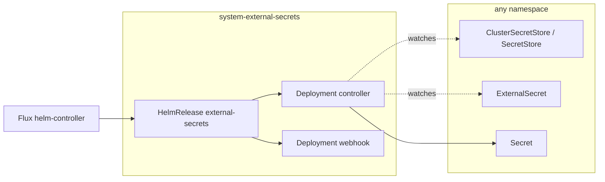

# External Secrets

Installs External Secrets Operator (ESO), the controller half of runtime
secret sync into a live cluster. This add-on ships the operator only; no
`ClusterSecretStore` exists until a backend add-on creates one, so ESO has
nothing to sync until then.

## Architecture



`store` and `es` are created by whatever add-on backs the secret store
(OpenBao, an external Vault-API-compatible instance, etc.), not by this
add-on. ESO's controller and admission webhook both run from the same
image.

## Recipes

### Enable the operator

```yaml
external_secrets:
  enabled: true
```

Installs the controller with no store wired up — `ExternalSecret`
resources created elsewhere will exist but never resolve until a backend
add-on supplies a `ClusterSecretStore`.

## Operations

If an `ExternalSecret` stays `SecretSyncedError` with no store found,
check that a backend add-on (e.g. OpenBao) actually created the
`ClusterSecretStore`/`SecretStore` it references — this add-on creates
neither.

If the webhook's admission requests time out, check
`system-external-secrets` for CrashLoopBackOff pods before assuming a
network-policy or DNS issue; the webhook Service backs both CRD
validation and conversion.

## Security

`system-external-secrets` enforces the `baseline` Pod Security Standard.
The chart's own default `securityContext` is already restricted-compliant
(`runAsNonRoot`, all capabilities dropped, `seccompProfile: RuntimeDefault`,
read-only root filesystem) and isn't overridden here.

CRDs are vendored under `kustomize/crds/external-secrets-<version>/`
(`installCRDs: false` in the HelmRelease values) rather than chart-managed,
so Helm never silently upgrades or deletes them — see `kustomize/crds/`.

<!-- BEGIN_KUSTOMIZE_DOCS -->

## Components

| Component | Enable when | Effect |
|---|---|---|
| `external-secrets` | `external_secrets.enabled: true` | Helm release of External Secrets Operator in `system-external-secrets`. Install-only: manages `ExternalSecret` and `ClusterSecretStore` CRs, creates none of its own. CRDs are vendored under `kustomize/crds/external-secrets-<version>/`, not chart-managed (`installCRDs: false`). |

<!-- END_KUSTOMIZE_DOCS -->

## See also

- [contexts/_template/facets/addon-external-secrets.yaml](../../contexts/_template/facets/addon-external-secrets.yaml) for the canonical wiring.
- `kustomize/crds/` for the vendored-CRD convention.
