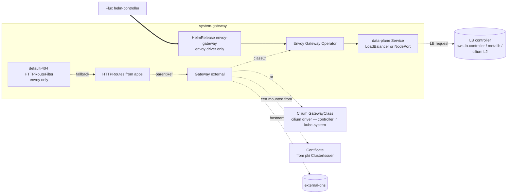

# Gateway

The cluster's external traffic entrypoint via the Kubernetes Gateway API.
Two driver options:

- **Envoy Gateway** (default) — a dedicated control-plane and data-plane
  Envoy stack installed by Helm. Heavier than Cilium's built-in path, but
  unlocks advanced L7 (`HTTPRouteFilter`, ext_authz, rich response
  shaping). Used here for the catch-all 404, and the right pick when you
  need those knobs.
- **Cilium** — uses Cilium's built-in Gateway API implementation. Single
  dataplane for L3/L4 and L7; LoadBalancer Services share IPs via Cilium
  LBIPAM. No separate Helm release; the `cilium/gateway` component on the
  `cni` add-on enables `gatewayAPI` on the existing Cilium operator. This
  add-on only contributes the GatewayClass and the LBIPAM-sharing patch.

The add-on splits across two Kustomization paths so Flux can install the
Gateway API CRDs and the controller workloads before the `Gateway` CR
that targets them:

- `gateway-base` — Gateway API CRDs + the operator Helm release (envoy)
  or just the GatewayClass (cilium). LB-mode patches and Prometheus
  monitor go here.
- `gateway-resources` — the `external` `Gateway` CR (named via the
  `system-gateway` namespace) plus per-feature patches (catch-all 404,
  DNS listeners, fixed LB address, Flux webhook).

## Architecture



The `external` Gateway listens on HTTPS (and HTTP for redirect) with a
cert issued by one of the pki add-on's ClusterIssuers. external-dns
publishes its hostname; the LB controller assigns its external IP.

## Recipes

### Envoy + LoadBalancer (cloud default)

```yaml
- name: gateway-base
  path: gateway/base
  dependsOn: [pki-base, lb-base]
  components: [envoy, envoy/loadbalancer, envoy/prometheus]

- name: gateway-resources
  path: gateway/resources
  dependsOn: [gateway-base, dns, lb-base]
  components: [envoy/default-404, lb-address, flux-webhook]
  substitutions:
    gateway_class_name: envoy
    gateway_dns_target: 10.5.1.10
    external_domain: example.com
    loadbalancer_start_ip: 10.5.1.10
```

### Envoy + NodePort (local dev / single-host)

```yaml
- name: gateway-base
  path: gateway/base
  dependsOn: [pki-base]
  components:
    - envoy
    - envoy/nodeport
    - envoy/nodeport/dns
    - envoy/nodeport/flux-webhook
    - envoy/prometheus
```

NodePort skips the LB controller and forwards via host ports. The
`/dns` and `/flux-webhook` sub-overlays open the additional NodePort
slots needed for in-cluster DNS and Flux push-mode webhooks.

### Envoy on AWS (NLB)

```yaml
- name: gateway-base
  path: gateway/base
  components:
    - envoy
    - envoy/loadbalancer
    - envoy/loadbalancer/aws-nlb
    - envoy/prometheus
```

The aws-nlb overlay adds AWS LB Controller annotations so the
data-plane Service provisions an NLB with target-type=ip.

### Cilium driver

```yaml
- name: gateway-base
  path: gateway/base
  dependsOn: [pki-base]
  components: [cilium]

- name: gateway-resources
  path: gateway/resources
  dependsOn: [gateway-base]
  components: [cilium]
  substitutions:
    loadbalancer_start_ip: 10.5.1.10
```

The base entry installs only the GatewayClass (CRDs come from the same
component's resource list). The resources entry patches the Gateway
with Cilium's LBIPAM annotations.

<!-- BEGIN_KUSTOMIZE_DOCS -->

## Substitutions

| Name | Required when | Effect |
|---|---|---|
| `gateway_class_name` | always | Name of the `GatewayClass` the cluster Gateway references. Sourced from `gateway.driver` (`envoy` or `cilium`). |
| `gateway_dns_target` | `dns` is enabled and `gateway-resources/dns` is composed | External hostname/IP that external-dns publishes as the gateway target. Resolves to `network.loadbalancer_ips.start` when `lb_effective.enabled`, empty otherwise. |
| `external_domain` | `gateway-resources` is composed | Cert SAN domain. `dns.private_domain` when `gateway.access: private` (and the private domain is set); otherwise `dns.public_domain` if set, falling back to `dns.private_domain`. |
| `loadbalancer_start_ip` | `lb-address` or `cilium` (resources) is composed | Fixed IP the Gateway advertises. Used in the cilium variant's `lbipam.cilium.io/ips` annotation and in the envoy variant's `spec.addresses` patch. |

## Components — `gateway-base`

| Component | Enable when | Effect |
|---|---|---|
| `envoy` | `gateway.driver == 'envoy'` | Helm release of `envoy-gateway` in `system-gateway`. Installs the Envoy Gateway operator + its Gateway API CRDs (vendored at a pinned version under `base/crds/`). |
| `envoy/loadbalancer` | envoy driver AND `lb_effective.mode == 'loadbalancer'` | Patches the envoy-gateway HelmRelease so the data-plane Envoy Service is `type: LoadBalancer`. Cloud-specific annotation patches (aws-nlb / azure-lb-internal) merge on top. |
| `envoy/loadbalancer/aws-nlb` | envoy driver AND platform is AWS AND `lb_effective.mode == 'loadbalancer'` | Adds NLB annotations onto the Envoy data-plane Service so the AWS Load Balancer Controller provisions an NLB with target-type=ip. Traffic reaches Envoy pods directly, source IP preserved. |
| `envoy/loadbalancer/azure-lb-internal` | envoy driver AND platform is Azure AND `gateway.access == 'private'` | Adds Azure ILB annotations so the Envoy data-plane Service provisions an internal load balancer (subnet-bound, no public IP). |
| `envoy/nodeport` | envoy driver AND `lb_effective.mode == 'nodeport'` | Patches the envoy-gateway HelmRelease so the data-plane Service is `type: NodePort`. Used on local clusters where no LoadBalancer provider exists. |
| `envoy/nodeport/dns` | envoy/nodeport AND `addons.private_dns.enabled: true` (default in `dev`) | Opens an additional NodePort for the cluster's private DNS resolver (UDP/TCP 53). Lets a workstation point at the host's IP for `*.<dns.private_domain>` resolution. |
| `envoy/nodeport/flux-webhook` | envoy/nodeport AND `gitops.mode == 'push'` | Opens an additional NodePort for the Flux notification-controller webhook (port 9292). Lets the GitOps push pipeline reach in-cluster receivers. |
| `envoy/prometheus` | envoy driver | Adds the Envoy Gateway operator's PodMonitor + the Envoy data-plane's ServiceMonitor. |
| `base/cilium` | `gateway.driver == 'cilium'` | Installs the Gateway API CRDs and a `GatewayClass` referencing the `cilium` controller. The Cilium HelmRelease itself is owned by the `cni` add-on (see option-cni's `cilium/gateway` component). Operator references this as `components: [cilium]` under `gateway-base`. |

## Components — `gateway-resources`

| Component | Enable when | Effect |
|---|---|---|
| `resources/cilium` | `gateway.driver == 'cilium'` | Patches the `external` Gateway with `lbipam.cilium.io/ips: ${loadbalancer_start_ip}` and the LBIPAM sharing annotations so multiple Gateways can share a single IP. Operator references this as `components: [cilium]` under `gateway-resources`. |
| `envoy/default-404` | envoy driver | Catch-all `HTTPRouteFilter` returning a 404 directResponse for any request that doesn't match a real app's HTTPRoute. Cilium clusters don't ship this (the Envoy-specific CRD isn't available there). |
| `envoy/default-404/external-dns` | envoy driver AND (public OR private gateway-managed DNS zone exists) | Adds the `external-dns.alpha.kubernetes.io/hostname` annotation to the 404 catch-all route so external-dns publishes the gateway hostname for the bare domain (not just per-app HTTPRoutes). |
| `dns` | envoy driver AND `addons.private_dns.enabled: true` (default in `dev`) | Patches the `external` Gateway with `external-dns.alpha.kubernetes.io/target: ${gateway_dns_target}` and adds UDPRoute / TCPRoute listeners on port 53 for in-cluster DNS service exposure. |
| `lb-address` | `lb_effective.enabled: true` | Patches the `external` Gateway's `spec.addresses` to pin a fixed IPAddress (`${loadbalancer_start_ip}`). Skipped when no LB is enabled (NodePort mode picks node IP at apply time). |
| `flux-webhook` | `gitops.mode == 'push'` | Adds an HTTP listener on port 9292 to the `external` Gateway for the Flux notification-controller webhook. Paired with `envoy/nodeport/flux-webhook` on nodeport-mode clusters. |

## Dependencies

| Add-on | Required when | Reason |
|---|---|---|
| `pki-base` | always | gateway-base needs cert-manager CRDs reconciling so the `Certificate` for the external Gateway can be issued before the Gateway is admitted. |
| `lb-base` | `lb_effective.controller_required: true` (e.g., metallb-driven clusters; AWS via aws-lb-controller) | The LB controller must be live so the data-plane Service can get an external IP. |
| `dns` | `dns.enabled: true` | external-dns must be reconciling so the gateway hostname is published when the Gateway comes up. |
| `cni` | `gateway.driver == 'cilium'` (declared by option-gateway as a cross-stack merge into option-cni) | Cilium's Gateway controller needs the Gateway API CRDs from gateway-base before its operator starts watching. |

<!-- END_KUSTOMIZE_DOCS -->

## See also

- [contexts/_template/facets/option-gateway.yaml](../../contexts/_template/facets/option-gateway.yaml) — canonical wiring.
- [contexts/_template/facets/platform-aws.yaml](../../contexts/_template/facets/platform-aws.yaml) — NLB merge for the AWS path.
- [contexts/_template/facets/platform-azure.yaml](../../contexts/_template/facets/platform-azure.yaml) — Azure ILB merge for the private-access path.
- Related add-ons: [pki](../pki/) (gateway certificate), [lb](../lb/) (data-plane Service LB), [dns](../dns/) (external-dns publication), [cni](../cni/) (cilium driver).
