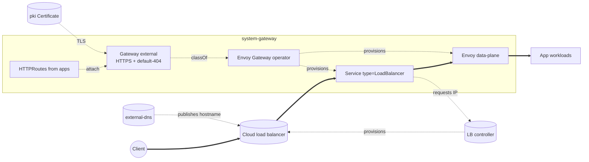
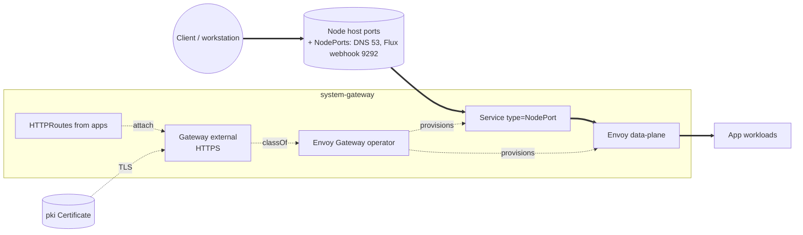
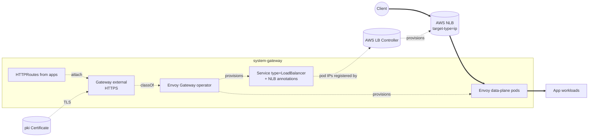
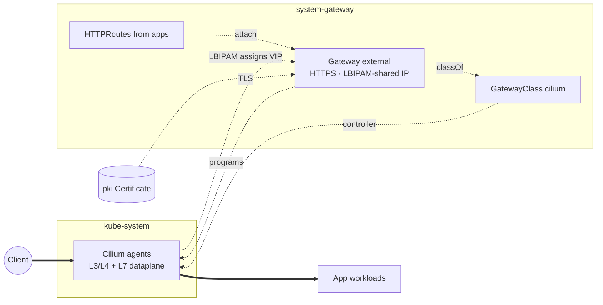

# Gateway

The cluster's traffic entrypoints, via the Kubernetes Gateway API. Two
Gateways, each provisioned from its own domain: `external`
(internet-facing, gated on `dns.public_domain`) and `internal`
(operational surfaces and operator access, gated on
`dns.private_domain`). Neither, one, or both may exist on a cluster.
Operational surfaces (Grafana, Kibana, the Flux UI/webhook, CoreDNS)
always bind to `internal`; application routes pick whichever gateway
fits. Two driver options.

Envoy Gateway is the default. It's a dedicated control-plane and
data-plane Envoy stack installed by Helm. Heavier than Cilium's
built-in path, but unlocks advanced L7 features
(`HTTPRouteFilter`, ext_authz, rich response shaping). It's used here
for the catch-all 404, and it's the right pick when you need those
knobs.

Cilium is the other option, which uses Cilium's built-in Gateway API
implementation. A single dataplane handles L3/L4 and L7, and
LoadBalancer Services share IPs via Cilium LBIPAM. There's no
separate Helm release. The `cilium/gateway` component on the `cni`
add-on enables `gatewayAPI` on the existing Cilium operator, and this
add-on only contributes the GatewayClass and the LBIPAM-sharing
patch.

The add-on is a `flux:` system entry (`gateway`) so Flux can install
the Gateway API CRDs and the controller workloads before the
`Gateway` CRs that target them. `install` ships the Gateway API CRDs
plus the operator Helm release (envoy) or just the GatewayClass
(cilium) -- just the controller, no per-gateway data-plane config.
`resources` compiles to two named variants, `external` and `internal`
(compiled name: `gateway-install` / `gateway-resources-external` /
`gateway-resources-internal`), each rendering the same underlying
files (`Gateway`, `Certificate`, `EnvoyProxy`, LB/nodeport patches,
catch-all 404) parameterized by `${gateway_name}` rather than
duplicated -- only the substitutions each variant supplies differ.
`EnvoyProxy` lives in `resources`, not `install`, since it's a custom
resource the controller reconciles rather than a controller install
artifact, and only `resources` supports the two independently-
substituted variants two coexisting `EnvoyProxy` objects need.
Utility-only pieces (DNS listeners, Flux webhook) exist only in the
`internal` variant.

## Recipes

The `external` Gateway listens on HTTPS (and HTTP for redirect) with a
cert issued by one of the pki add-on's ClusterIssuers. external-dns
publishes its hostname, and — for the LoadBalancer modes — the LB
controller assigns its external IP.

### Envoy + LoadBalancer (cloud default)


```mermaid
flowchart LR
  client((Client))

  subgraph systemgateway[system-gateway]
    op[Envoy Gateway operator]
    gw[Gateway external<br/>HTTPS + default-404]
    routes[HTTPRoutes from apps]
    svc[Service type=LoadBalancer]
    envoy[Envoy data-plane]
  end

  cloudlb[(Cloud load balancer)]
  lbctrl[(LB controller)]
  cert[(pki Certificate)]
  dns[(external-dns)]
  app[App workloads]

  client ==> cloudlb ==> svc ==> envoy ==> app
  op -. provisions .-> svc & envoy
  gw -. classOf .-> op
  routes -. attach .-> gw
  cert -. TLS .-> gw
  svc -. requests IP .-> lbctrl -. provisions .-> cloudlb
  dns -. publishes hostname .-> cloudlb
```

Bold path is the request flow; dotted is the control wiring that sets
it up. The operator turns the Gateway + HTTPRoutes into a running Envoy
data-plane behind a LoadBalancer Service; the LB controller provisions
the cloud LB and external-dns publishes its hostname.

```yaml
flux:
  - name: gateway
    install:
      components: [envoy, envoy/prometheus]
    resources:
      - name: external
        dependsOn: [pki-install]
        components: [envoy/proxy, envoy/loadbalancer, envoy/parameters, envoy/default-404, lb-address]
        substitutions:
          gateway_name: external
          gateway_class_name: envoy
          gateway_domain: example.com
          gateway_cert_issuer: public-acme
          gateway_dns_target: 10.5.1.10
          gateway_loadbalancer_ip: 10.5.1.10
```

The default driver: a dedicated Envoy control- and data-plane installed
by Helm, with the data-plane Service exposed through the LB controller.

### Envoy + NodePort (local dev / single-host)


```mermaid
flowchart LR
  client((Client / workstation))

  subgraph systemgateway[system-gateway]
    op[Envoy Gateway operator]
    gw[Gateway external<br/>HTTPS]
    routes[HTTPRoutes from apps]
    svc[Service type=NodePort]
    envoy[Envoy data-plane]
  end

  node[(Node host ports<br/>+ NodePorts: DNS 53, Flux webhook 9292)]
  cert[(pki Certificate)]
  app[App workloads]

  client ==> node ==> svc ==> envoy ==> app
  op -. provisions .-> svc & envoy
  gw -. classOf .-> op
  routes -. attach .-> gw
  cert -. TLS .-> gw
```

```yaml
flux:
  - name: gateway
    install:
      components: [envoy, envoy/prometheus]
    resources:
      - name: internal
        dependsOn: [pki-install]
        components:
          - envoy/proxy
          - envoy/nodeport
          - envoy/nodeport/dns
          - envoy/nodeport/flux-webhook
          - envoy/parameters
          - dns
          - flux-webhook
```

NodePort skips the LB controller and forwards via host ports. The
`/dns` and `/flux-webhook` sub-overlays open the additional NodePort
slots needed for in-cluster DNS and Flux push-mode webhooks --
internal-gateway only, since those are utility surfaces.

### Envoy on AWS (NLB)


```mermaid
flowchart LR
  client((Client))

  subgraph systemgateway[system-gateway]
    op[Envoy Gateway operator]
    gw[Gateway external<br/>HTTPS]
    routes[HTTPRoutes from apps]
    svc[Service type=LoadBalancer<br/>+ NLB annotations]
    envoy[Envoy data-plane pods]
  end

  nlb[(AWS NLB<br/>target-type=ip)]
  lbc[(AWS LB Controller)]
  cert[(pki Certificate)]
  app[App workloads]

  client ==> nlb ==> envoy ==> app
  op -. provisions .-> svc & envoy
  gw -. classOf .-> op
  routes -. attach .-> gw
  cert -. TLS .-> gw
  svc -. pod IPs registered by .-> lbc -. provisions .-> nlb
```

```yaml
flux:
  - name: gateway
    install:
      components: [envoy, envoy/prometheus]
    resources:
      - name: external
        components: [envoy/proxy, envoy/loadbalancer, envoy/loadbalancer/aws-nlb]
        substitutions:
          gateway_lb_scheme: internet-facing
```

The aws-nlb overlay adds AWS LB Controller annotations so the
data-plane Service provisions an NLB with `target-type=ip`, sending
traffic straight to the Envoy pods with source IP preserved.

### Cilium driver


```mermaid
flowchart LR
  client((Client))

  subgraph systemgateway[system-gateway]
    gc[GatewayClass cilium]
    gw[Gateway external<br/>HTTPS · LBIPAM-shared IP]
    routes[HTTPRoutes from apps]
  end

  subgraph kubesystem[kube-system]
    cil[Cilium agents<br/>L3/L4 + L7 dataplane]
  end

  cert[(pki Certificate)]
  app[App workloads]

  client ==> cil ==> app
  gw -. classOf .-> gc -. controller .-> cil
  gw -. programs .-> cil
  routes -. attach .-> gw
  cil -. LBIPAM assigns VIP .-> gw
  cert -. TLS .-> gw
```

Cilium is already the cluster dataplane (it's the CNI), so it
terminates and routes Gateway traffic directly — no Envoy Service in
the path, one hop shorter than the Envoy recipes.

```yaml
flux:
  - name: gateway
    install:
      components: [cilium]
    resources:
      - name: external
        dependsOn: [pki-install]
        components: [cilium, cilium/fixed-ip]
        substitutions:
          gateway_loadbalancer_ip: 10.5.1.10
```

No separate Helm release: the install tier installs only the
GatewayClass, the Cilium operator (owned by the `cni` add-on) is the
controller, and the resources tier patches the Gateway with Cilium's
LBIPAM annotations so multiple Gateways can share one IP.

<!-- BEGIN_KUSTOMIZE_DOCS -->

## Substitutions

| Name | Required when | Effect |
|---|---|---|
| `gateway_name` | `gateway-resources-external` or `gateway-resources-internal` is composed | `external` or `internal` -- the Gateway/EnvoyProxy/Certificate name this resources variant renders. Every resource and patch in the resources tier is parameterized by this one substitution, so both gateways share the same files. |
| `gateway_class_name` | always | Name of the `GatewayClass` the cluster Gateway references. Sourced from `gateway.driver` (`envoy` or `cilium`). |
| `gateway_domain` | `gateway-resources-external` or `gateway-resources-internal` is composed | Cert SAN and DNS target domain for this gateway. `dns.public_domain` for external, `dns.private_domain` for internal -- no fallback ladder, since each variant only composes when its own domain is set. |
| `gateway_cert_issuer` | `gateway-resources-external` or `gateway-resources-internal` is composed | TLS `ClusterIssuer` name. External: the public issuer (`public-acme` once `dns.public_domain` is set, guaranteed ACME-eligible). Internal: always `private` -- a VPC-only/local zone can't validate ACME DNS-01. |
| `gateway_dns_target` | `dns` is enabled and gateway-resources/dns is composed | Hostname/IP that external-dns publishes as this gateway's target. Resolves to `network.loadbalancer_ips.start` (external) or `.internal_start` (internal) when `lb_effective.enabled`, empty otherwise. |
| `gateway_loadbalancer_ip` | `lb-address` or `cilium/fixed-ip` is composed | Fixed IP this gateway advertises. Used in the cilium variant's `lbipam.cilium.io/ips` annotation and in the envoy variant's `spec.addresses` / `loadBalancerIP` patches. External: `network.loadbalancer_ips.start`. Internal: `.internal_start`, only set when the operator explicitly configures it -- otherwise the driver auto-assigns. |
| `gateway_lb_scheme` | AWS platform, `envoy/loadbalancer/aws-nlb` is composed | `internet-facing` for external, `internal` for internal -- the internal gateway is never internet-facing, so this needs no ternary. |
| `gateway_redirect_port` | `gateway-resources-external` or `gateway-resources-internal` is composed | HTTPS port the `https-redirect` route's 301 targets. `443` for cloud/LB; docker-desktop's NodePort host-forward otherwise (`8443` external, `8444` internal). |
| `gateway_nodeport_http / gateway_nodeport_https` | `lb_effective.mode == 'nodeport'` | NodePort numbers for this gateway's data-plane Service. External: 30080/30443. Internal: 30081/30444 -- distinct so both can coexist on the same node set. |

## Components — `gateway-install`

| Component | Enable when | Effect |
|---|---|---|
| `envoy` | `gateway.driver == 'envoy'` | Helm release of `envoy-gateway` in `system-gateway`. Installs the Envoy Gateway operator only (chart CRD install is skipped). Per-gateway data-plane config (`EnvoyProxy`, LB/nodeport annotations) lives in the resources tier, not here -- it's a custom resource the controller reconciles, and only the resources tier supports the external/internal named variants needed to configure two EnvoyProxy objects independently. |
| `envoy/prometheus` | envoy driver | Adds the Envoy Gateway operator's PodMonitor + the Envoy data-plane's ServiceMonitor. |
| `install/cilium` | `gateway.driver == 'cilium'` | Installs the Gateway API CRDs and a `GatewayClass` referencing the `cilium` controller. The Cilium HelmRelease itself is owned by the `cni` add-on (see option-cni's `cilium/gateway` component). Operator references this as `components: [cilium]` under `gateway-install`. |

## Components — `gateway-resources`

| Component | Enable when | Effect |
|---|---|---|
| `envoy/proxy` | envoy driver | The self-contained `EnvoyProxy` resource (`${gateway_name}`) referenced from the Gateway via `spec.infrastructure.parametersRef` (see `envoy/parameters`). Carries the digest-pinned proxy image (Kyverno requires pinned images); the loadbalancer/nodeport components layer the envoyService Service config in. The EnvoyGateway helm config keeps no default proxy patch, so this resource is authoritative. |
| `envoy/loadbalancer` | envoy driver AND `lb_effective.mode == 'loadbalancer'` | Patches this gateway's `EnvoyProxy` so the data-plane Service is `type: LoadBalancer`, with no fixed IP -- correct for cloud LB controllers, which auto-assign. Cloud-specific annotation patches (aws-nlb / azure) and the fixed-ip component merge on top. |
| `envoy/loadbalancer/fixed-ip` | envoy driver AND `lb_effective.mode == 'loadbalancer'` AND this gateway's `loadbalancer_ips` field is set (a local, fixed-pool LB controller -- MetalLB/kube-vip -- is actually running) | Requests a specific address from the local LB pool via `loadBalancerIP`. Must not apply on cloud platforms, where the LB controller auto-assigns and this field would be meaningless or rejected (issue #2259). |
| `envoy/loadbalancer/aws-nlb` | envoy driver AND platform is AWS AND `lb_effective.mode == 'loadbalancer'` | Adds NLB annotations onto the Envoy data-plane Service so the AWS Load Balancer Controller provisions an NLB with target-type=ip. Traffic reaches Envoy pods directly, source IP preserved. Scheme comes from `gateway_lb_scheme`. |
| `envoy/loadbalancer/azure` | envoy driver AND platform is Azure AND the internal gateway | Adds Azure ILB annotations so the Envoy data-plane Service provisions an internal load balancer (subnet-bound, no public IP). Always applied for internal -- AKS's CCM gives the external gateway a public LB by default, no annotation needed there. |
| `envoy/loadbalancer/hcloud-lb` | envoy driver AND platform is Hetzner | Hetzner-specific annotations so hcloud cloud-controller-manager provisions a Hetzner Cloud Load Balancer for the type=LoadBalancer Service. |
| `envoy/nodeport` | envoy driver AND `lb_effective.mode == 'nodeport'` | Patches this gateway's `EnvoyProxy` so the data-plane Service is `type: NodePort` (external: 30080/30443, internal: 30081/30444). Used on local clusters where no LoadBalancer provider exists. |
| `envoy/nodeport/dns` | envoy/nodeport AND internal gateway | Opens an additional NodePort for the cluster's private DNS resolver (UDP/TCP 53). Lets a workstation point at the host's IP for `*.<dns.private_domain>` resolution. Internal-only, since DNS is a utility surface. |
| `envoy/nodeport/flux-webhook` | envoy/nodeport AND internal gateway AND `gitops.mode == 'push'` | Opens an additional NodePort for the Flux notification-controller webhook (port 9292). Internal-only, since the webhook receiver is a utility surface. |
| `resources/cilium` | `gateway.driver == 'cilium'` AND no cloud LB controller owns the IP | Patches this Gateway with the `lbipam.cilium.io/sharing-key: ${gateway_name}` and sharing-cross-namespace annotations. Operator references this as `components: [cilium]` under `gateway-resources`. |
| `cilium/fixed-ip` | cilium driver AND this gateway's `loadbalancer_ips` field is explicitly set | Adds `lbipam.cilium.io/ips: ${gateway_loadbalancer_ip}` to pin a specific address. Omitted otherwise, letting Cilium auto-assign from the pool. |
| `envoy/parameters` | envoy driver | Patches this Gateway's `spec.infrastructure.parametersRef` to point at its own `EnvoyProxy` (`${gateway_name}`), so the data-plane Service is configured per gateway rather than through the controller-global EnvoyGateway default. Cilium gateways don't use the `EnvoyProxy` resource. |
| `envoy/default-404` | envoy driver | Catch-all `HTTPRoute` (`default-404-${gateway_name}`) returning a 404 directResponse for any request that doesn't match a real app's HTTPRoute, via a shared `HTTPRouteFilter` referenced by both gateways. Cilium clusters don't ship this (the Envoy-specific CRD isn't available there). |
| `envoy/default-404/external-dns` | envoy driver AND this gateway's own DNS zone exists | Adds the `external-dns.alpha.kubernetes.io/hostname` annotation to the 404 catch-all route so external-dns publishes the gateway hostname for the bare domain (not just per-app HTTPRoutes). |
| `dns` | internal gateway only | Patches the internal Gateway with `external-dns.alpha.kubernetes.io/target: ${gateway_dns_target}` and adds UDPRoute / TCPRoute listeners on port 53 for in-cluster DNS service exposure. Always internal -- CoreDNS is a utility surface, never internet-facing. |
| `lb-address` | `lb_effective.enabled: true` (and, for internal, its `loadbalancer_ips` field is explicitly set) | Patches this Gateway's `spec.addresses` to pin a fixed IPAddress (`${gateway_loadbalancer_ip}`). Skipped when no LB is enabled (NodePort mode picks node IP at apply time). |
| `flux-webhook` | internal gateway AND `gitops.mode == 'push'` | Adds an HTTP listener on port 9292 to the internal Gateway for the Flux notification-controller webhook. Paired with `envoy/nodeport/flux-webhook` on nodeport-mode clusters. Always internal -- the webhook receiver is a utility surface. |

## Dependencies

| Add-on | Required when | Reason |
|---|---|---|
| `pki-install` | always | gateway-resources needs cert-manager CRDs reconciling so each Gateway's `Certificate` can be issued before the Gateway is admitted. |
| `lb-install` | `lb_effective.controller_required: true` (e.g., metallb-driven clusters; AWS via aws-lb-controller) | The LB controller must be live so the data-plane Service can get an external IP. |
| `dns` | `dns.enabled: true` | external-dns must be reconciling so each gateway's hostname is published when it comes up. |
| `cni` | `gateway.driver == 'cilium'` (declared by option-gateway as a cross-stack merge into option-cni) | Cilium's Gateway controller needs the Gateway API CRDs from gateway-install before its operator starts watching. |

<!-- END_KUSTOMIZE_DOCS -->

## See also

- [contexts/_template/facets/option-gateway.yaml](../../contexts/_template/facets/option-gateway.yaml) for the canonical wiring.
- [contexts/_template/facets/platform-aws.yaml](../../contexts/_template/facets/platform-aws.yaml) for the NLB merge on the AWS path.
- [contexts/_template/facets/platform-azure.yaml](../../contexts/_template/facets/platform-azure.yaml) for the Azure ILB merge on the internal gateway.
- Related add-ons: [pki](../pki/) (gateway certificate), [lb](../lb/) (data-plane Service LB), [dns](../dns/) (external-dns publication), [cni](../cni/) (cilium driver).
