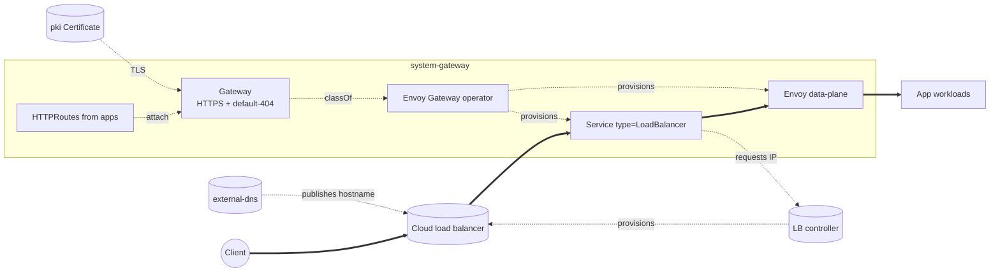
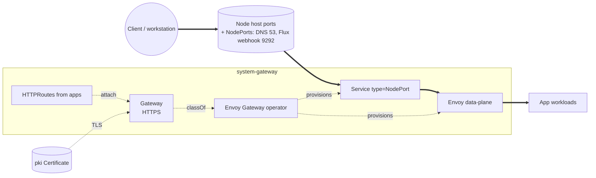
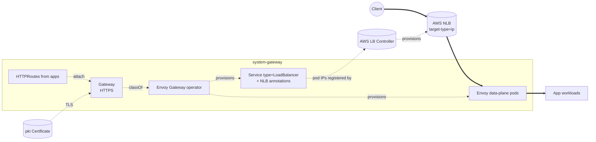
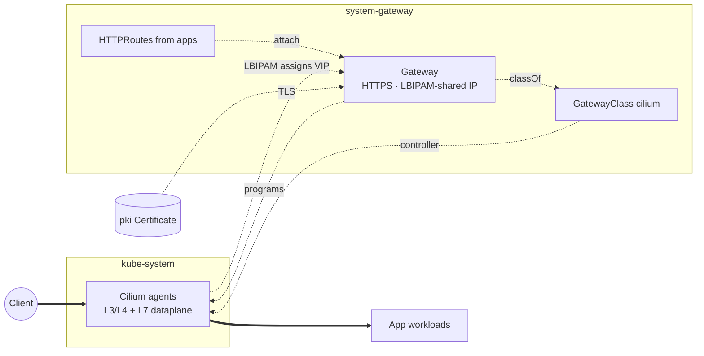

The cluster's traffic entrypoints, via the Kubernetes Gateway API. Two
Gateways can exist: `external`, provisioned when `dns.public_domain` is
set, and `internal`, provisioned when `dns.private_domain` is set
(workstation and dev mode default it to `test`). Two driver options.

Envoy Gateway is the default: a dedicated control-plane and data-plane
Envoy stack installed by Helm. It is heavier than Cilium's built-in path
and supports L7 features Cilium does not — `HTTPRouteFilter`, ext_authz,
and response header and body rewrites. The catch-all 404 uses it.

The `cilium` driver uses Cilium's built-in Gateway API implementation. A
single dataplane handles L3/L4 and L7, and LoadBalancer Services share
IPs via Cilium LBIPAM. No separate Helm release: the install tier
installs only the GatewayClass, the Cilium operator (owned by the `cni`
add-on) is the controller, and the resources tier patches the Gateway
with Cilium's LBIPAM annotations so multiple Gateways can share one IP.

The add-on is a `flux:` system entry (`gateway`) so Flux can install
the Gateway API CRDs and the controller workloads before the
`Gateway` CR that targets them. `install` ships the Gateway API CRDs
plus the operator Helm release (envoy) or just the GatewayClass
(cilium); LB-mode patches and Prometheus monitor go here. `resources`
ships one named variant per Gateway (`gateway-resources-external`,
`gateway-resources-internal`), each rendering the `Gateway`, its
certificate, and its `EnvoyProxy` from the same files through the
`${gateway_name}` substitution, plus per-feature patches (catch-all
404, DNS listeners, fixed LB address, Flux webhook). Utility surfaces
(CoreDNS listeners, the Flux webhook) bind to `internal` only. The tier
implicitly depends on `install` (compiled name: `gateway-install`).

## Recipes

Each Gateway listens on HTTPS (and HTTP for redirect) with a cert
issued by one of the pki add-on's ClusterIssuers: the public issuer for
`external`, `private` for `internal`. external-dns publishes its
hostname, and for the LoadBalancer modes the LB controller assigns its
IP. The diagrams show one Gateway.

### Envoy + LoadBalancer (cloud default)


```mermaid
flowchart LR
  client((Client))

  subgraph systemgateway[system-gateway]
    op[Envoy Gateway operator]
    gw[Gateway<br/>HTTPS + default-404]
    routes[HTTPRoutes from apps]
    svc[Service type=LoadBalancer]
    envoy[Envoy data-plane]
  end

  cloudlb[(Cloud load balancer)]
  lbctrl[(LB controller)]
  cert[(pki Certificate)]
  dns[(external-dns)]
  app[App workloads]

  client ==> cloudlb ==> svc ==> envoy ==> app
  op -. provisions .-> svc & envoy
  gw -. classOf .-> op
  routes -. attach .-> gw
  cert -. TLS .-> gw
  svc -. requests IP .-> lbctrl -. provisions .-> cloudlb
  dns -. publishes hostname .-> cloudlb
```

Bold path is the request flow; dotted is the control wiring that sets
it up. The operator turns the Gateway + HTTPRoutes into a running Envoy
data-plane behind a LoadBalancer Service; the LB controller provisions
the cloud LB and external-dns publishes its hostname.

```yaml
flux:
  - name: gateway
    install:
      components: [envoy, envoy/prometheus]
    resources:
      - name: internal
        dependsOn: [pki-resources, lb-install]
        components:
          - envoy/proxy
          - envoy/loadbalancer
          - envoy/loadbalancer/fixed-ip
          - envoy/parameters
          - envoy/default-404
          - lb-address
          - flux-webhook
        substitutions:
          gateway_name: internal
          gateway_class_name: envoy
          gateway_domain: example.internal
          gateway_cert_issuer: private
          gateway_loadbalancer_ip: 10.5.1.10
          gateway_dns_target: 10.5.1.10
```

The data-plane Service is exposed through the LB controller.

### Envoy + NodePort (local dev / single-host)


```mermaid
flowchart LR
  client((Client / workstation))

  subgraph systemgateway[system-gateway]
    op[Envoy Gateway operator]
    gw[Gateway<br/>HTTPS]
    routes[HTTPRoutes from apps]
    svc[Service type=NodePort]
    envoy[Envoy data-plane]
  end

  node[(Node host ports<br/>+ NodePorts: DNS 53, Flux webhook 9292)]
  cert[(pki Certificate)]
  app[App workloads]

  client ==> node ==> svc ==> envoy ==> app
  op -. provisions .-> svc & envoy
  gw -. classOf .-> op
  routes -. attach .-> gw
  cert -. TLS .-> gw
```

```yaml
flux:
  - name: gateway
    install:
      components: [envoy, envoy/prometheus]
    resources:
      - name: internal
        dependsOn: [pki-resources]
        components:
          - envoy/proxy
          - envoy/nodeport
          - envoy/nodeport/dns
          - envoy/nodeport/flux-webhook
          - envoy/parameters
```

NodePort skips the LB controller and forwards via host ports. The
`/dns` and `/flux-webhook` sub-overlays open the additional NodePort
slots needed for in-cluster DNS and Flux push-mode webhooks.

### Envoy on AWS (NLB)


```mermaid
flowchart LR
  client((Client))

  subgraph systemgateway[system-gateway]
    op[Envoy Gateway operator]
    gw[Gateway<br/>HTTPS]
    routes[HTTPRoutes from apps]
    svc[Service type=LoadBalancer<br/>+ NLB annotations]
    envoy[Envoy data-plane pods]
  end

  nlb[(AWS NLB<br/>target-type=ip)]
  lbc[(AWS LB Controller)]
  cert[(pki Certificate)]
  app[App workloads]

  client ==> nlb ==> envoy ==> app
  op -. provisions .-> svc & envoy
  gw -. classOf .-> op
  routes -. attach .-> gw
  cert -. TLS .-> gw
  svc -. pod IPs registered by .-> lbc -. provisions .-> nlb
```

```yaml
flux:
  - name: gateway
    install:
      components: [envoy, envoy/prometheus]
    resources:
      - name: external
        dependsOn: [pki-resources, lb-install]
        components:
          - envoy/proxy
          - envoy/loadbalancer
          - envoy/loadbalancer/aws-nlb
          - envoy/parameters
```

The aws-nlb overlay adds AWS LB Controller annotations so the
data-plane Service provisions an NLB with `target-type=ip`, sending
traffic straight to the Envoy pods with source IP preserved.

### Cilium driver


```mermaid
flowchart LR
  client((Client))

  subgraph systemgateway[system-gateway]
    gc[GatewayClass cilium]
    gw[Gateway<br/>HTTPS · LBIPAM-shared IP]
    routes[HTTPRoutes from apps]
  end

  subgraph kubesystem[kube-system]
    cil[Cilium agents<br/>L3/L4 + L7 dataplane]
  end

  cert[(pki Certificate)]
  app[App workloads]

  client ==> cil ==> app
  gw -. classOf .-> gc -. controller .-> cil
  gw -. programs .-> cil
  routes -. attach .-> gw
  cil -. LBIPAM assigns VIP .-> gw
  cert -. TLS .-> gw
```

Cilium is already the cluster dataplane (it's the CNI), so it
terminates and routes Gateway traffic directly — no Envoy Service in
the path, one hop shorter than the Envoy recipes.

```yaml
flux:
  - name: gateway
    install:
      components: [cilium]
    resources:
      - name: internal
        dependsOn: [pki-resources, cni-install]
        components: [cilium, cilium/fixed-ip]
        substitutions:
          gateway_name: internal
          gateway_class_name: cilium
          gateway_loadbalancer_ip: 10.5.1.10
```

<!-- BEGIN_KUSTOMIZE_DOCS -->

## Substitutions

| Name | Required when | Effect |
|---|---|---|
| `gateway_name` | `gateway-resources-external` or `gateway-resources-internal` is composed | `external` or `internal` -- the Gateway/EnvoyProxy/Certificate name this resources variant renders. Every resource and patch in the resources tier is parameterized by this one substitution, so both gateways share the same files. |
| `gateway_class_name` | always | Name of the `GatewayClass` the cluster Gateway references. Sourced from `gateway.driver` (`envoy` or `cilium`). |
| `gateway_domain` | `gateway-resources-external` or `gateway-resources-internal` is composed | Cert SAN and DNS target domain for this gateway. `dns.public_domain` for external, `dns.private_domain` for internal -- no fallback ladder, since each variant only composes when its own domain is set. |
| `gateway_cert_issuer` | `gateway-resources-external` or `gateway-resources-internal` is composed | TLS `ClusterIssuer` name. External: the public issuer (`public-acme` once `dns.public_domain` is set, guaranteed ACME-eligible). Internal: always `private` -- a VPC-only/local zone can't validate ACME DNS-01. |
| `gateway_dns_target` | `dns` is enabled and gateway-resources/dns is composed | Hostname/IP that external-dns publishes as this gateway's target. Resolves to the gateway's pool address when `lb_effective.enabled`, empty otherwise. The internal gateway takes `network.loadbalancer_ips.start` and the external gateway takes the next address when both exist. |
| `gateway_loadbalancer_ip` | `lb-address` or `cilium/fixed-ip` is composed | Fixed IP this gateway advertises. Used in the cilium variant's `lbipam.cilium.io/ips` annotation and in the envoy variant's `spec.addresses` / `loadBalancerIP` patches. External: `network.loadbalancer_ips.start`. Internal: `.internal_start`, only set when the operator explicitly configures it -- otherwise the driver auto-assigns. |
| `gateway_lb_scheme` | AWS platform, `envoy/loadbalancer/aws-nlb` is composed | `internet-facing` for external, `internal` for internal -- the internal gateway is never internet-facing, so this needs no ternary. |
| `gateway_redirect_port` | `gateway-resources-external` or `gateway-resources-internal` is composed | HTTPS port the `https-redirect` route's 301 targets. `443` for cloud/LB; docker-desktop's NodePort host-forward otherwise (`8443` internal, `8444` external). |
| `gateway_nodeport_http / gateway_nodeport_https` | `lb_effective.mode == 'nodeport'` | NodePort numbers for this gateway's data-plane Service. External: 30080/30443. Internal: 30081/30444 -- distinct so both can coexist on the same node set. |

## Components — `gateway-install`

### `envoy`

_Enabled when `gateway.driver == 'envoy'`._

Helm release of `envoy-gateway` in `system-gateway`. Installs the Envoy Gateway operator only (chart CRD install is skipped). Per-gateway data-plane config (`EnvoyProxy`, LB/nodeport annotations) lives in the resources tier, not here -- it's a custom resource the controller reconciles, and only the resources tier supports the external/internal named variants needed to configure two EnvoyProxy objects independently.

### `envoy/prometheus`

_Enabled when envoy driver._

Adds the Envoy Gateway operator's PodMonitor + the Envoy data-plane's ServiceMonitor.

### `install/cilium`

_Enabled when `gateway.driver == 'cilium'`._

Installs the Gateway API CRDs and a `GatewayClass` referencing the `cilium` controller. The Cilium HelmRelease itself is owned by the `cni` add-on (see option-cni's `cilium/gateway` component). Operator references this as `components: [cilium]` under `gateway-install`.

## Components — `gateway-resources`

### `envoy/base`

_Enabled when envoy driver._

Named so it sorts ahead of every other `envoy/*` component, which patch the `EnvoyProxy` it creates and apply in sorted order when several facets contribute to one gateway. The self-contained `EnvoyProxy` resource (`${gateway_name}`) referenced from the Gateway via `spec.infrastructure.parametersRef` (see `envoy/parameters`). Carries the digest-pinned proxy image (Kyverno requires pinned images); the loadbalancer/nodeport components layer the envoyService Service config in. The EnvoyGateway helm config keeps no default proxy patch, so this resource is authoritative.

### `envoy/loadbalancer`

_Enabled when envoy driver AND `lb_effective.mode == 'loadbalancer'`._

Patches this gateway's `EnvoyProxy` so the data-plane Service is `type: LoadBalancer`, with no fixed IP -- correct for cloud LB controllers, which auto-assign. Cloud-specific annotation patches (aws-nlb / azure) and the fixed-ip component merge on top.

### `envoy/loadbalancer/fixed-ip`

_Enabled when envoy driver AND `lb_effective.mode == 'loadbalancer'` AND this gateway's `loadbalancer_ips` field is set (a local, fixed-pool LB controller -- MetalLB/kube-vip -- is actually running)._

Requests a specific address from the local LB pool via `loadBalancerIP`. Must not apply on cloud platforms, where the LB controller auto-assigns and this field would be meaningless or rejected (issue #2259).

### `envoy/loadbalancer/cilium-ip`

_Enabled when envoy driver AND `lb_effective.mode == 'loadbalancer'` AND Cilium provides the pool addresses._

Pins this gateway's data-plane Service to its pool address with the `lbipam.cilium.io/ips` annotation. Cilium LBIPAM assigns addresses in creation order, so without it the internal gateway can miss the pool start that the workstation's DNS forward target expects.

### `envoy/loadbalancer/aws-nlb`

_Enabled when envoy driver AND platform is AWS AND `lb_effective.mode == 'loadbalancer'`._

Adds NLB annotations onto the Envoy data-plane Service so the AWS Load Balancer Controller provisions an NLB with target-type=ip. Traffic reaches Envoy pods directly, source IP preserved. Scheme comes from `gateway_lb_scheme`.

### `envoy/loadbalancer/azure`

_Enabled when envoy driver AND platform is Azure AND the internal gateway._

Adds Azure ILB annotations so the Envoy data-plane Service provisions an internal load balancer (subnet-bound, no public IP). Always applied for internal -- AKS's CCM gives the external gateway a public LB by default, no annotation needed there.

### `envoy/loadbalancer/gcp`

_Enabled when envoy driver AND platform is GCP AND the internal gateway._

Adds the GKE internal load balancer annotation (`networking.gke.io/load-balancer-type: Internal`) so the Envoy data-plane Service gets an internal load balancer. Applied only to the internal gateway, since GKE's CCM gives the external gateway a public one by default.

### `envoy/loadbalancer/hcloud-lb`

_Enabled when envoy driver AND platform is Hetzner._

Hetzner-specific annotations so hcloud cloud-controller-manager provisions a Hetzner Cloud Load Balancer for the type=LoadBalancer Service.

### `envoy/nodeport`

_Enabled when envoy driver AND `lb_effective.mode == 'nodeport'`._

Patches this gateway's `EnvoyProxy` so the data-plane Service is `type: NodePort` (internal: 30080/30443, external: 30081/30444). Used on local clusters where no LoadBalancer provider exists.

### `envoy/nodeport/docker-desktop`

_Enabled when envoy/nodeport AND `workstation.runtime == 'docker-desktop'`._

Adds ClusterIP-reachable entries for this gateway's host-published ports (`gateway_host_https_port` and `gateway_host_http_port`: 8443/8080 internal, 8444/8081 external) to the data-plane Service. Lets in-cluster callers reach workstation-domain hostnames at the same port a browser would.

### `envoy/nodeport/dns`

_Enabled when envoy/nodeport AND internal gateway._

Opens an additional NodePort for the cluster's private DNS resolver (UDP/TCP 53). Lets a workstation point at the host's IP for `*.<dns.private_domain>` resolution. Internal-only, since DNS is a utility surface.

### `envoy/nodeport/flux-webhook`

_Enabled when envoy/nodeport AND internal gateway AND `gitops.mode == 'push'`._

Opens an additional NodePort for the Flux notification-controller webhook (port 9292). Internal-only, since the webhook receiver is a utility surface.

### `resources/cilium`

_Enabled when `gateway.driver == 'cilium'` AND no cloud LB controller owns the IP._

Patches this Gateway with the `lbipam.cilium.io/sharing-key: ${gateway_name}` and sharing-cross-namespace annotations. Operator references this as `components: [cilium]` under `gateway-resources`.

### `cilium/fixed-ip`

_Enabled when cilium driver AND this gateway's `loadbalancer_ips` field is explicitly set._

Adds `lbipam.cilium.io/ips: ${gateway_loadbalancer_ip}` to pin a specific address. Omitted otherwise, letting Cilium auto-assign from the pool.

### `envoy/parameters`

_Enabled when envoy driver._

Patches this Gateway's `spec.infrastructure.parametersRef` to point at its own `EnvoyProxy` (`${gateway_name}`), so the data-plane Service is configured per gateway rather than through the controller-global EnvoyGateway default. Cilium gateways don't use the `EnvoyProxy` resource.

### `envoy/default-404`

_Enabled when envoy driver._

Catch-all `HTTPRoute` (`default-404-${gateway_name}`) returning a 404 directResponse for any request that doesn't match a real app's HTTPRoute, via a shared `HTTPRouteFilter` referenced by both gateways. Cilium clusters don't ship this (the Envoy-specific CRD isn't available there).

### `envoy/default-404/external-dns`

_Enabled when envoy driver AND this gateway's own DNS zone exists._

Adds the `external-dns.alpha.kubernetes.io/hostname` annotation to the 404 catch-all route so external-dns publishes the gateway hostname for the bare domain (not just per-app HTTPRoutes).

### `dns`

_Enabled when internal gateway only._

Patches the internal Gateway with `external-dns.alpha.kubernetes.io/target: ${gateway_dns_target}` and adds UDPRoute / TCPRoute listeners on port 53 for in-cluster DNS service exposure. Always internal -- CoreDNS is a utility surface, never internet-facing.

### `lb-address`

_Enabled when `lb_effective.enabled: true` (and, for internal, its `loadbalancer_ips` field is explicitly set)._

Patches this Gateway's `spec.addresses` to pin a fixed IPAddress (`${gateway_loadbalancer_ip}`). Skipped when no LB is enabled (NodePort mode picks node IP at apply time).

### `flux-webhook`

_Enabled when internal gateway AND `gitops.mode == 'push'`._

Adds an HTTP listener on port 9292 to the internal Gateway for the Flux notification-controller webhook. Paired with `envoy/nodeport/flux-webhook` on nodeport-mode clusters. Always internal -- the webhook receiver is a utility surface.

## Dependencies

| Add-on | Required when | Reason |
|---|---|---|
| `pki-install` | always | gateway-resources needs cert-manager CRDs reconciling so each Gateway's `Certificate` can be issued before the Gateway is admitted. |
| `lb-install` | `lb_effective.controller_required: true` (e.g., metallb-driven clusters; AWS via aws-lb-controller) | The LB controller must be live so the data-plane Service can get an external IP. |
| `dns` | `dns.enabled: true` | external-dns must be reconciling so each gateway's hostname is published when it comes up. |
| `cni` | `gateway.driver == 'cilium'` (declared by option-gateway as a cross-stack merge into option-cni) | Cilium's Gateway controller needs the Gateway API CRDs from gateway-install before its operator starts watching. |

<!-- END_KUSTOMIZE_DOCS -->

## See also

- [contexts/_template/facets/option-gateway.yaml](../../contexts/_template/facets/option-gateway.yaml) for the canonical wiring.
- [contexts/_template/facets/platform-aws.yaml](../../contexts/_template/facets/platform-aws.yaml) for the NLB merge on the AWS path.
- [contexts/_template/facets/platform-azure.yaml](../../contexts/_template/facets/platform-azure.yaml) for the Azure ILB merge on the private-access path.
- Related add-ons: [pki](../pki/) (gateway certificate), [lb](../lb/) (data-plane Service LB), [dns](../dns/) (external-dns publication), [cni](../cni/) (cilium driver).
