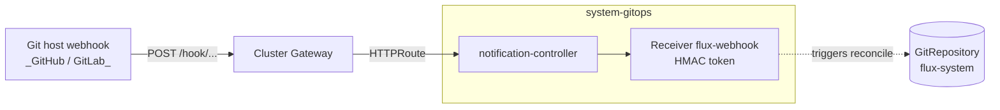

# GitOps

Almost all of the GitOps weight in this blueprint is in the Terraform module
at [terraform/gitops/flux/](../../terraform/gitops/flux/) — that's what
installs Flux's controllers, the root `GitRepository`, and the bootstrap
`Kustomization`. This Kustomize stack adds the **flux notification
webhook receiver** on top: a `Receiver` resource the
notification-controller exposes for HMAC-authenticated push triggers, plus
an HTTPRoute that lets external git hosts (GitHub, GitLab) reach it.

If `gitops.mode` is `pull`, this stack renders nothing — Flux polls and no
inbound webhook is needed.

## Flow



The receiver is a `notification.toolkit.fluxcd.io/v1` `Receiver` of `type:
generic` — the `webhook-token` Secret holds the HMAC the git host signs
each delivery with. On a valid signature, notification-controller forces a
reconcile of the named `GitRepository` (`${git_repository_name}`).

## Recipes

`platform-base` emits exactly one of two variants based on whether a
Gateway is available; both are gated on `(gitops.mode ?? 'push') == 'push'`.

### Push mode without a Gateway

Plain `Receiver` only — no HTTPRoute, so reachability depends on something
else exposing the notification-controller Service. Useful for clusters
with no Gateway API controller (rare in this blueprint, since the bootstrap
flow assumes one).

```yaml
- name: gitops
  path: gitops/flux
  components:
    - webhook
  substitutions:
    git_repository_name: my-repo
```

### Push mode with Envoy gateway

Webhook plus an HTTPRoute attached to the cluster's `external` Gateway.
The Gateway has a dedicated `flux-webhook` listener (port 9292) added by
[gateway-resources/flux-webhook](../gateway/resources/flux-webhook).

```yaml
- name: gitops
  path: gitops/flux
  dependsOn: [gateway-base]
  components:
    - webhook
    - webhook/gateway
  substitutions:
    git_repository_name: my-repo
```

### Push mode with Cilium gateway

Same as Envoy plus a `CiliumNetworkPolicy` permitting ingress from the
`ingress` entity to the notification-controller pods. The policy is
required on Cilium clusters where default-deny network policies block
gateway-originated traffic.

```yaml
- name: gitops
  path: gitops/flux
  dependsOn: [gateway-base]
  components:
    - webhook
    - webhook/gateway
    - webhook/gateway/cilium
  substitutions:
    git_repository_name: my-repo
```

### Pull mode

Set `gitops.mode: pull`. Both webhook entries' `when:` evaluates false and
this stack contributes nothing beyond the namespace already created by
Terraform.

## Substitutions

| Name | Required when | Effect |
|---|---|---|
| `git_repository_name` | always (when push mode) | Name of the `GitRepository` the receiver triggers. Defaults to `"local"` (workstation default); platform facets pass through `gitops.repository.name`. The receiver will accept any payload but will only ever reconcile the named repository. |

The `webhook-token` Secret holding the HMAC is provisioned by the
Terraform module — not by this stack. This Kustomization only references
it (`secretRef.name: webhook-token`).

## Components

The Kustomize stack has only a webhook subtree. Flux's controllers are
not in this stack — they ship from the Terraform module.

| Component | Enable when | Effect |
|---|---|---|
| `webhook` | push mode | `Receiver/flux-webhook` of `type: generic`, referencing the `webhook-token` Secret and triggering the `${git_repository_name}` GitRepository. |
| `webhook/gateway` | push mode AND a Gateway is enabled | HTTPRoute attaching the receiver Service to the cluster Gateway's `web-http` and `flux-webhook` listeners. The `web-http` listener is the standard port-80; `flux-webhook` is a dedicated port-9292 listener (added by [gateway-resources/flux-webhook](../gateway/resources/flux-webhook)). PathPrefix `/hook/` routes to the `webhook-receiver` Service on port 80. |
| `webhook/gateway/cilium` | push mode + Cilium gateway driver | `CiliumNetworkPolicy` named `allow-gateway-webhooks` that permits ingress traffic from the `ingress` entity to the notification-controller pods (matched by label `app: notification-controller`). |

## Dependencies

The Kustomize stack has minimal dependencies:

| Stack | Reason |
|---|---|
| `gateway-base` *(when Gateway variant)* | The Gateway API CRDs (HTTPRoute) and the `external` Gateway must exist before `webhook/gateway` is applied. |

Dependencies on the Terraform side are richer:

- `terraform: gitops` `dependsOn: cluster` (every platform).
- `terraform: gitops` `dependsOn: cni` on platforms where Cilium is the CNI (waits for pod networking).
- `terraform: gitops` `dependsOn: cluster, cluster-extensions` on AWS (EKS-specific, when applicable).

These are not part of the Kustomize stack but matter for ordering: Flux
itself must be running before any Windsor Kustomization (including this
one) can reconcile.

## Operations

Stack-specific failure modes; generic Flux/Renovate behaviour is documented
at the repo level.

- **Webhook returns 401** — the HMAC secret in `webhook-token` doesn't match what the git host is signing with. Inspect `kubectl get secret webhook-token -n system-gitops` and confirm the git host webhook config uses the same value. The Terraform module provisions this; on workstations the default is `${gitops.webhook.token ?? "abcdef123456"}`.
- **Webhook returns 404** — the HTTPRoute path or listener doesn't match. The route uses `PathPrefix: /hook/` — git hosts must POST to `https://<external_domain>/hook/<receiver-path>` (the suffix is the `webhook-path` from the Receiver status).
- **Cilium clusters: webhook reachable but reconciles don't trigger** — the `webhook/gateway/cilium` policy isn't applied. Without it, ingress traffic is dropped before reaching notification-controller. Ensure the component is enabled when `gateway_effective.driver == 'cilium'`.
- **Push mode set but receiver not rendered** — confirm `gitops.mode` is exactly `push` (or unset, which defaults to push). The `when:` clauses use `(gitops.mode ?? 'push') == 'push'` so both work.
- **GitRepository never reconciles on push** — the receiver references `${git_repository_name}`. If the substitution doesn't match the actual GitRepository name in `system-gitops`, the receiver will accept the webhook but reconcile a non-existent target. Check `kubectl get gitrepository -n system-gitops` and the Receiver's `spec.resources[0].name`.

## Security

- The `system-gitops` namespace has no PSA enforce labels in [namespace.yaml](namespace.yaml). The chart's pod security defaults apply; Flux runs at PSA `restricted` upstream.
- Authentication on the webhook is HMAC via the `webhook-token` Secret. The Receiver type is `generic` — for git-host-specific verification (e.g. GitHub's `X-Hub-Signature-256`) configure the receiver type accordingly. The shipped `generic` type accepts any signature on any payload as long as the HMAC matches.
- The Cilium policy permits ingress to notification-controller from `fromEntities: [ingress]` only — pod-to-pod traffic from other namespaces is still blocked by default.
- Webhook tokens default to `abcdef123456` on workstation contexts via `option-workstation`'s `webhook_token: ${gitops.webhook.token ?? "abcdef123456"}`. Production clusters MUST override this; the default is documented as a placeholder.

## See also

- [terraform/gitops/flux/](../../terraform/gitops/flux/) — the Flux installer, including controllers, GitRepository, root Kustomization, and the `webhook-token` Secret. Most operator concerns about gitops live there, not in this stack.
- [contexts/_template/facets/platform-base.yaml](../../contexts/_template/facets/platform-base.yaml) (lines ~491-509) — canonical wiring for both webhook variants.
- [contexts/_template/facets/option-workstation.yaml](../../contexts/_template/facets/option-workstation.yaml) — workstation-specific Terraform inputs (`concurrency`, `git_username`, `git_password`, `webhook_token`).
- [contexts/_template/facets/option-cni.yaml](../../contexts/_template/facets/option-cni.yaml) — adds the `cni` Terraform dep so Flux waits for pod networking on Cilium clusters.
- Blueprint schema and facet syntax — https://www.windsorcli.dev/docs/blueprints/
- Related stacks: [gateway](../gateway/), [cni](../cni/).
