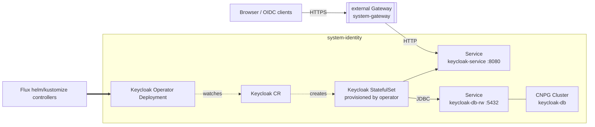

# Identity

In-cluster identity provider. The add-on installs the Keycloak Operator and a
single `Keycloak` server backed by its own CloudNativePG database, reachable at
`keycloak.${external_domain}` through the shared gateway.

The default (and only) driver is `keycloak`. The schema accepts additional
drivers as future `identity` `flux:` entries gated on `addons.keycloak.driver`.

Keycloak has no first-party Helm chart, so the operator's Deployment/RBAC is
vendored verbatim (`install/keycloak-operator/operator.yaml`) and its CRDs are
vendored through the `crds:` layer (`kustomize/crds/keycloak-26.7.0`). Both come
from the same `keycloak-k8s-resources` release and are kept in lockstep by
`kustomize/crds/sources.yaml`. The operator does not manage its own CRDs.

## Architecture



TLS terminates at the gateway; Keycloak serves plain HTTP internally and trusts
the proxy's `X-Forwarded-*` headers for the external scheme and host.

## Recipes

### Reach the admin console

The operator generates a temporary admin in the `keycloak-initial-admin` secret
on first boot:

```sh
windsor exec -- kubectl -n system-identity get secret keycloak-initial-admin \
  -o jsonpath='{.data.username}' | base64 -d
windsor exec -- kubectl -n system-identity get secret keycloak-initial-admin \
  -o jsonpath='{.data.password}' | base64 -d
```

Open `https://keycloak.${external_domain}` and sign in. Create a permanent admin,
then rotate out the bootstrap one. On docker-desktop the gateway is forwarded to a
non-standard host port (e.g. `https://keycloak.<domain>:8443`); Keycloak resolves
its own scheme/port from the request, so links stay on that port.

### Hostname / base URL

Keycloak bakes its external URL into every redirect and issuer, and it can't infer
the gateway's external port (that lives outside the cluster; the proxy only forwards
a standard one). The facet derives the base URL from the domain and the gateway
exposure: `https://keycloak.<domain>` on loadbalancer/cloud (`:443`), and
`https://keycloak.<domain>:8443` on docker-desktop (its NodePort host-forward).

Override for anything else — a plain-NodePort Talos VM on `:30443`, or a fixed
canonical production URL:

```yaml
addons:
  keycloak:
    enabled: true
    hostname: https://sso.example.com
```

### Server image: stock (default) vs. optimized

By default the stock Keycloak image runs with `startOptimized: false`, so it runs
its build step at each boot (a one-time cost per pod start) against the Postgres
backend. For faster, production-grade startup, pre-build an optimized image
(`kc.sh build --db=postgres …`), push it digest-pinned to your registry, and set:

```yaml
addons:
  keycloak:
    enabled: true
    image: registry.example.com/keycloak-optimized:26.7.0@sha256:<digest>
```

A set `image` is assumed pre-built, so the operator starts it with `--optimized`.
It must be digest-pinned — `system-identity` is policy-managed (Kyverno
`require-image-digest`).

### High availability

`topology: ha` scales the stack out — Keycloak runs 2 replicas (the operator wires
Infinispan clustering across them) on a 3-instance Postgres cluster (primary +
replicas with automatic failover). `single-node` and `multi-node` keep both at 1.

```yaml
topology: ha
addons:
  keycloak:
    enabled: true
```

### Declarative realms and clients (follow-up)

The vendored CRDs include `KeycloakRealmImport`, `KeycloakOIDCClient`, and
`KeycloakSAMLClient`. Realms and clients are managed as those custom resources in
a later change; this add-on stands up the server only.

<!-- BEGIN_KUSTOMIZE_DOCS -->

## Components

| Component | Enable when | Effect |
|---|---|---|
| `keycloak-operator` | `addons.keycloak.enabled == true` | Keycloak Operator (Deployment + RBAC) in `system-identity`, vendored verbatim from keycloak-k8s-resources. Reconciles `Keycloak` custom resources; installs no server by itself. CRDs are applied separately by the `crds:` layer. |
| `keycloak` | `addons.keycloak.enabled == true` | The `Keycloak` server CR and its CloudNativePG `Cluster`. Keycloak serves HTTP internally (TLS terminates at the gateway) and stores realms in the `keycloak` database. |
| `keycloak/gateway` | `gateway.enabled == true` | HTTPRoute publishing `keycloak.${external_domain}` through the shared external Gateway to the operator-managed `keycloak-service`. |

## Dependencies

| Add-on | Required when | Reason |
|---|---|---|
| `database` | always | Keycloak stores realm data in PostgreSQL; the CloudNativePG operator (database addon) must exist before its `Cluster` CR applies. |
| `gateway-resources` | `gateway.enabled == true` | The shared Gateway must exist before the Keycloak HTTPRoute attaches to it. |

<!-- END_KUSTOMIZE_DOCS -->

## See also

- [contexts/_template/facets/addon-keycloak.yaml](../../contexts/_template/facets/addon-keycloak.yaml) for the canonical wiring.
- [kustomize/crds/sources.yaml](../crds/sources.yaml) for the vendored operator + CRD versions.
- Related add-ons: [database](../database/) (backing Postgres), [gateway](../gateway/) (ingress + TLS).
