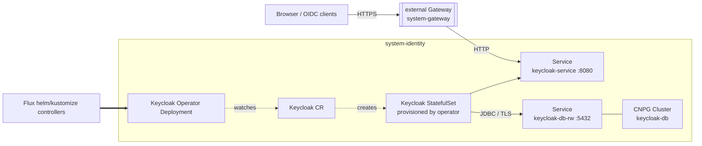

# Identity

The cluster identity provider (SSO). `identity.driver: keycloak` (default) hosts
Keycloak in-cluster — the operator plus a single `Keycloak` server backed by its
own CloudNativePG database, reachable at `keycloak.${external_domain}` through the
shared gateway. `identity.driver: oidc` hosts nothing and points consumers at an
external issuer (`identity.oidc.issuer`).

Either way, `identity` exposes an effective issuer and realm that SSO consumers
read; consumers opt in with their own switch (e.g. `observability.grafana.sso`)
and never name Keycloak. This page covers the hosted `keycloak` driver.

Keycloak has no first-party Helm chart, so the operator's Deployment/RBAC is
vendored verbatim (`install/keycloak-operator/operator.yaml`) and its CRDs are
vendored through the `crds:` layer (`kustomize/crds/keycloak-26.7.0`). Both come
from the same `keycloak-k8s-resources` release and are kept in lockstep by
`kustomize/crds/sources.yaml`. The operator does not manage its own CRDs.

## Architecture


```mermaid
flowchart LR
  flux[Flux helm/kustomize controllers]

  subgraph systemidentity[system-identity]
    operator_pod[Keycloak Operator Deployment]
    keycloak_cr[Keycloak CR]
    keycloak_sts[Keycloak StatefulSet<br/>provisioned by operator]
    keycloak_svc[Service<br/>keycloak-service :8080]
    pg_cluster[CNPG Cluster<br/>keycloak-db]
    pg_svc[Service<br/>keycloak-db-rw :5432]
  end

  gateway[[external Gateway<br/>system-gateway]]
  users[Browser / OIDC clients]

  flux ==> operator_pod
  operator_pod -.watches.-> keycloak_cr
  keycloak_cr -.creates.-> keycloak_sts
  keycloak_sts --> keycloak_svc
  keycloak_sts -->|JDBC / TLS| pg_svc
  pg_svc --- pg_cluster
  users -->|HTTPS| gateway
  gateway -->|HTTP| keycloak_svc
```

TLS terminates at the gateway; Keycloak serves plain HTTP internally and trusts
the proxy's `X-Forwarded-*` headers for the external scheme and host.

## Recipes

### Reach the admin console

Outside dev, the operator generates a temporary admin in the `keycloak-initial-admin`
secret on first boot:

```sh
windsor exec -- kubectl -n system-identity get secret keycloak-initial-admin \
  -o jsonpath='{.data.username}' | base64 -d
windsor exec -- kubectl -n system-identity get secret keycloak-initial-admin \
  -o jsonpath='{.data.password}' | base64 -d
```

In dev the console admin is a known default (`admin` / `admin-password`), the same
password as the seeded SSO admin user. To set a known admin anywhere, or override the
dev default, set `identity.keycloak.admin` (the password takes a `${secret(...)}`
reference or a literal):

```yaml
identity:
  enabled: true
  keycloak:
    admin:
      username: admin
      password: ${secret("MyVault", "keycloak-admin", "password")}
```

The operator honors `bootstrapAdmin` only at initial cluster creation, so this
seeds the first admin — it does not rotate an existing one.

Open `https://keycloak.${external_domain}` and sign in. On docker-desktop the
gateway is forwarded to a non-standard host port (e.g.
`https://keycloak.<domain>:8443`); Keycloak resolves its own scheme/port from the
request, so links stay on that port.

### Hostname / base URL

Keycloak bakes its external URL into every redirect and issuer, and it can't infer
the gateway's external port (that lives outside the cluster; the proxy only forwards
a standard one). The facet derives the base URL from the domain and the gateway
exposure: `https://keycloak.<domain>` on loadbalancer/cloud (`:443`), and
`https://keycloak.<domain>:8443` on docker-desktop (its NodePort host-forward).

Override for anything else — a plain-NodePort Talos VM on `:30443`, or a fixed
canonical production URL:

```yaml
identity:
  enabled: true
  keycloak:
    hostname: https://sso.example.com
```

### Server image: stock (default) vs. optimized

By default the stock Keycloak image runs with `startOptimized: false`, so it runs
its build step at each boot (a one-time cost per pod start) against the Postgres
backend. For faster, production-grade startup, pre-build an optimized image
(`kc.sh build --db=postgres …`), push it digest-pinned to your registry, and set:

```yaml
identity:
  enabled: true
  keycloak:
    image: registry.example.com/keycloak-optimized:26.7.0@sha256:<digest>
```

A set `image` is assumed pre-built, so the operator starts it with `--optimized`.
It must be digest-pinned — `system-identity` is policy-managed (Kyverno
`require-image-digest`).

### High availability

`topology: ha` scales the stack out — Keycloak runs 2 replicas (the operator wires
Infinispan clustering across them) on a 3-instance Postgres cluster (primary +
replicas with automatic failover). `single-node` and `multi-node` keep both at 1.

```yaml
topology: ha
identity:
  enabled: true
```

### Platform realm

Enabling Keycloak also imports a `platform` realm (apps never live in `master`).
It ships a security baseline — `sslRequired: external`, brute-force detection, a
`length(12) and notUsername and notEmail` password policy, and short access-token
plus bounded SSO-session lifetimes — and a `platform-admins` group mapped to the
realm-management `realm-admin` role as the one place to grant realm administration.
Core creates the group; its members are deployment-specific and are not managed in
git.

Rename the realm to fit an existing naming convention:

```yaml
identity:
  enabled: true
  keycloak:
    realm: corp
```

The import is one-shot: the operator applies the realm once via
`KeycloakRealmImport`, so later edits happen in-console (or by recreating the CR),
not by continuous reconciliation.

### Grafana single sign-on

SSO is inferred: with a cluster identity provider and Grafana both enabled, Grafana
authenticates against the platform realm, with no per-app flag. Core patches a `grafana`
client into the platform realm import with no secret set, so Keycloak generates one for
the confidential client; a Job then reads it back and writes it into Grafana's namespace.
Nothing has to be supplied and no secret lands in git. The client carries a mapper that
puts the `platform-admins` group into the token, which Grafana maps to the Admin role.

For an external OIDC provider (`identity.driver: oidc`) there is no realm to generate the
secret, so supply the client secret from your provider:

```yaml
identity:
  enabled: true
  driver: oidc
  oidc:
    issuer: https://sso.example.com/realms/platform
observability:
  enabled: true
  grafana:
    client_secret: ${secret("MyVault", "grafana-oidc", "clientSecret")}
```

In dev mode the platform realm seeds standard users so local SSO works out of the box
across every consumer (Grafana and any future one): **`admin` / `admin-password`** (in
`platform-admins` → admin) and **`viewer` / `viewer-password`** (no group → read-only), so you can
see the role mapping take effect. The `admin` password is shared with the Keycloak console
admin and is overridable through `identity.keycloak.admin.password`. Grafana also uses
`auto_login` in dev, so clicking it goes straight to the SSO login. None of this is created
outside dev.

Opt out or override the role mapping:

```yaml
observability:
  grafana:
    # sso: false                                              # opt out of SSO
    role_attribute_path: "contains(groups[*], '/platform-admins') && 'Admin' || 'Viewer'"
```

### API-server (kubectl) single sign-on

`cluster.oidc.enabled: true` turns on kube-apiserver OIDC. With the hosted `keycloak`
driver, the issuer and a fixed `kubernetes` client are inferred from this realm, so
no `issuer_url`/`client_id` is needed:

```yaml
identity:
  enabled: true
cluster:
  oidc:
    enabled: true
```

The client is public (PKCE, no secret) — pair it with a `kubectl` OIDC login plugin
(e.g. `kubelogin`) pointed at this realm. Override `issuer_url`/`client_id` to bypass
inference, e.g. to point at a different realm or an already-existing client.

OIDC only authenticates; it grants no RBAC on its own. In `dev`, a `ClusterRoleBinding`
maps `platform-admins` to `cluster-admin` so the seeded `admin` user can do something
after logging in. Outside dev, bind `platform-admins` (or another claim) to a role yourself.

### External identity provider

Point the cluster at an issuer you already run — a remote Keycloak, or any OIDC
provider — instead of hosting one. Nothing is deployed in `system-identity`;
consumers read the external issuer and bring their own client credentials (required
for the `oidc` driver — the external provider owns them). The login button label is
`identity.display_name` (default `SSO`); endpoints derive from the issuer's standard
OIDC path — override under `identity.oidc` if the provider differs:

```yaml
identity:
  enabled: true
  driver: oidc
  display_name: Acme SSO
  oidc:
    issuer: https://sso.corp/realms/platform
    # auth_url / token_url / userinfo_url  # only if the provider's paths are non-standard
observability:
  grafana:
    client_secret: ${secret("MyVault", "grafana-oidc", "clientSecret")}
```

### Declarative clients

Core patches an OIDC client into the platform realm import per opted-in consumer, from
a per-consumer folder under `clients/` (Grafana, kubectl today; MinIO and gateway
edge-auth to follow). This uses the stable v2beta1 `KeycloakRealmImport` — not the v2alpha1
`KeycloakOIDCClient` CRDs, which need the preview `client-admin-api:v2` feature plus a
manually bootstrapped admin service-account. The realm import is one-shot, so adding a
client re-imports the realm.

## Security

- **Database in transit.** Keycloak connects to Postgres with `sslmode=verify-full`,
  importing CNPG's generated CA into its truststore, so the server certificate and the
  `keycloak-db-rw` hostname are verified (TLS 1.3). Postgres authenticates Keycloak by
  password over that channel.
- **Ingress is HTTPS-only.** The gateway 301-redirects plain HTTP, and the Keycloak
  route attaches to the HTTPS listener only. On the Cilium gateway driver,
  `keycloak/cilium` further restricts Keycloak ingress to the gateway proxy via
  CiliumNetworkPolicy.
- **Admin credentials.** The operator generates a temporary admin by default; supply
  your own via `identity.keycloak.admin` (see Recipes). `bootstrapAdmin` seeds the
  initial admin only, not a rotation path.
- **Realm baseline.** The platform realm enforces `sslRequired: external`, brute-force
  detection, and a `length(12) and notUsername and notEmail` password policy, with
  short access tokens and bounded SSO sessions. Realm administration is granted through
  the `platform-admins` group (`realm-admin`), not by handing out the master admin.
- **Client secrets.** SSO client secrets never land in git. For the hosted keycloak driver
  Keycloak generates the client secret and a Job copies it into the consumer's namespace, so
  none is supplied. For an external `oidc` provider, supply it from a store
  (`grafana.client_secret: ${secret(...)}`). Consumer pods use `optional: false` and wait for
  the Secret rather than start misconfigured.
- **Copy Job credentials.** The secret-copy Job authenticates to the admin API with the
  bootstrap admin, staging the password, token, and secret on an in-memory volume so they
  stay off disk and out of process arguments. Set `identity.keycloak.admin.password` outside
  dev so it uses the persistent bootstrap admin; the operator's temporary admin is meant to
  be deleted once a permanent one exists.
- **Images.** `system-identity` is policy-managed (Kyverno `require-image-digest`); the
  operator, server, and Postgres images are all digest-pinned.

<!-- BEGIN_KUSTOMIZE_DOCS -->

## Components

| Component | Enable when | Effect |
|---|---|---|
| `keycloak-operator` | `identity.driver == 'keycloak'` | Keycloak Operator (Deployment + RBAC) in `system-identity`, vendored verbatim from keycloak-k8s-resources. Reconciles `Keycloak` custom resources; installs no server by itself. CRDs are applied separately by the `crds:` layer. |
| `keycloak` | `identity.driver == 'keycloak'` | The `Keycloak` server CR and its CloudNativePG `Cluster`. Keycloak serves HTTP internally (TLS terminates at the gateway) and stores realms in the `keycloak` database. |
| `keycloak/realm` | `identity.driver == 'keycloak'` | One-shot `KeycloakRealmImport` for the platform realm (name from `identity.keycloak.realm`, default `platform`): a security baseline (sslRequired, brute-force detection, password policy, token/session lifetimes), a `platform-admins` group mapped to `realm-admin`. Consumers target this realm by name. |
| `keycloak/realm/clients/grafana` | identity + Grafana both enabled (`grafana.sso != false`) | Onboards Grafana as an SSO consumer: a patch registers the `grafana` OIDC client in the platform `KeycloakRealmImport` (v2beta1, no client-admin-api CRDs) with no secret, so Keycloak generates one; a Job then reads that generated secret over the admin API and writes it into Grafana's namespace as `grafana-oidc-client`. No operator-supplied secret; stable because the realm import runs with `--override=false`. One folder per consumer under `realm/clients/`. |
| `keycloak/realm/clients/kubernetes` | `cluster.oidc.enabled == true` | Registers the `kubernetes` OIDC client (public, PKCE) in the platform `KeycloakRealmImport` for kube-apiserver token validation. `cluster.oidc.issuer_url`/`client_id` are auto-inferred from this realm when unset, so enabling identity plus `cluster.oidc.enabled: true` needs no manual issuer/client config. |
| `keycloak/realm/dev-user` | `dev == true` | Dev-only patch seeding standard platform-realm users so local SSO works out of the box: `admin` / `admin-password` (in `platform-admins` → admin everywhere) and `viewer` / `viewer-password` (no group → read-only). Passwords satisfy the realm's length(12) policy. Never applied outside dev. |
| `keycloak/realm/clients/kubernetes/dev-rbac` | `dev == true` and `cluster.oidc.enabled == true` | Dev-only `ClusterRoleBinding` mapping the `platform-admins` group to `cluster-admin`, so the seeded dev `admin` user can do something after logging in via kubectl OIDC. Never applied outside dev. |
| `keycloak/gateway` | `gateway.enabled == true` | HTTPRoute publishing `keycloak.${external_domain}` through the shared external Gateway to the operator-managed `keycloak-service`. |
| `keycloak/cilium` | `gateway.driver == 'cilium'` | CiliumNetworkPolicy restricting Keycloak ingress to the gateway proxy. Cilium-enforced, so gated on the Cilium gateway driver. |
| `keycloak/admin` | `identity.keycloak.admin.password` set, or `dev == true` | Points the `Keycloak` CR at the `keycloak-bootstrap-admin` secret via `spec.bootstrapAdmin`, instead of the operator's auto-generated temporary admin. The password is the supplied one, or in dev a known default shared with the SSO admin user. Honored only at initial cluster creation. |

## Dependencies

| Add-on | Required when | Reason |
|---|---|---|
| `database` | `identity.driver == 'keycloak'` | Keycloak stores realm data in PostgreSQL; the CloudNativePG operator (database addon) must exist before its `Cluster` CR applies. |
| `gateway-resources` | `gateway.enabled == true` | The shared Gateway must exist before the Keycloak HTTPRoute attaches to it. |

<!-- END_KUSTOMIZE_DOCS -->

## See also

- [contexts/_template/facets/addon-identity.yaml](../../contexts/_template/facets/addon-identity.yaml) for the canonical wiring.
- [kustomize/crds/sources.yaml](../crds/sources.yaml) for the vendored operator + CRD versions.
- Related add-ons: [database](../database/) (backing Postgres), [gateway](../gateway/) (ingress + TLS).
