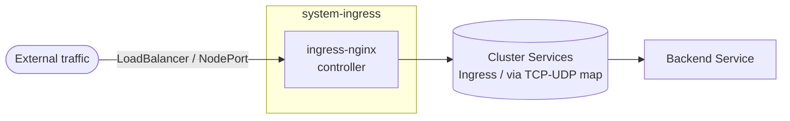

# Ingress

> **Status:** No shipped facet wires this stack. The
> [gateway](../gateway/) stack is the supported traffic entrypoint
> (Envoy Gateway or Cilium via Gateway API). The components here remain for
> blueprint authors who explicitly want a Kubernetes Ingress / nginx-based
> path. The legacy `ingress.driver` field on the schema is treated as an
> alias by `platform-base` (`'envoy-gateway'` and `'nginx'` both fold into
> `gateway.driver: envoy`); see
> [contexts/_template/facets/platform-base.yaml](../../contexts/_template/facets/platform-base.yaml)
> around the `gateway_effective.driver` resolution.

## Flow



ingress-nginx terminates HTTP/HTTPS and (when extra components are layered)
also TCP/UDP for port 53 (CoreDNS) and 9292 (Flux webhook). The data-plane
Service is exposed via either LoadBalancer or NodePort depending on which
service-mode component is enabled.

## Recipes

Hand-authored — no shipped facet emits these entries.

### NodePort (docker-desktop, single-node)

```yaml
- name: ingress
  path: ingress
  components:
    - nginx
    - nginx/nodeport
    - nginx/web
  timeout: 10m
  interval: 5m
```

### LoadBalancer (cloud or in-cluster LB)

```yaml
- name: ingress
  path: ingress
  components:
    - nginx
    - nginx/loadbalancer
    - nginx/web
  timeout: 10m
  substitutions:
    loadbalancer_start_ip: 10.5.0.10
```

> The `nginx/loadbalancer` patch references `${loadbalancer_ip_start}` (note
> the swapped wording) instead of the canonical `${loadbalancer_start_ip}`
> — same typo as `gateway/base/envoy/loadbalancer`. The substitution
> renders empty and the cloud LB allocates an arbitrary IP. To pin a
> specific IP, fix the patch's variable name first.

### With CoreDNS pass-through and Flux webhook

```yaml
- name: ingress
  path: ingress
  components:
    - nginx
    - nginx/nodeport
    - nginx/web
    - nginx/coredns
    - nginx/flux-webhook
    - nginx/prometheus
```

## Substitutions

| Name | Required when | Effect |
|---|---|---|
| `loadbalancer_start_ip` | `nginx/loadbalancer` is enabled | Anchor IP for the LoadBalancer Service. Must sit inside the cluster's LB IP pool. **Note:** the patch in [nginx/loadbalancer/patches/helm-release.yaml](nginx/loadbalancer/patches/helm-release.yaml) uses `${loadbalancer_ip_start}` (typo) — the value never threads through unless the patch is fixed. |

## Components

| Component | Effect |
|---|---|
| `nginx` | Helm release of ingress-nginx v4.15.1 in `system-ingress`. The Service has `enableHttp: false`, `enableTls: false` until layered with `nginx/web`. The IngressClass is set as default. |
| `nginx/loadbalancer` | Patches the Service to type `LoadBalancer` with `loadBalancerIP` from `${loadbalancer_ip_start}` (see typo note above). |
| `nginx/nodeport` | Patches the Service to type `NodePort`. |
| `nginx/web` | Enables HTTP and TLS on the Service with NodePorts 30080 (HTTP) and 30443 (HTTPS). |
| `nginx/coredns` | Maps Service UDP/TCP port 53 (NodePort 30053 each) to `system-dns/coredns:53`. Use when ingress-nginx is the path for in-cluster DNS exposure (mirrors the gateway stack's `coredns/gateway` and `dns` components). |
| `nginx/flux-webhook` | Maps Service TCP port 9292 (NodePort 30292) to `system-gitops/webhook-receiver:80`. Mirrors the gateway stack's `gitops/flux/webhook/gateway` route. |
| `nginx/prometheus` | Enables controller metrics and adds a ServiceMonitor labeled `release: kube-prometheus-stack`. Adds a Flux `dependsOn` so ingress-nginx waits for the Prometheus stack. |

## Dependencies

This stack has no platform-emitted dependencies (no facet wires it).
Hand-authored recipes should add:

| Stack | When |
|---|---|
| `policy-resources` | When `policies.enabled: true`. Without it, ingress-nginx pods may fail Kyverno's image-digest validation on first reconcile. |
| `pki-base` | When the Ingress consumes a `Certificate` from cert-manager (the `nginx` chart does not ship one — operators add it themselves via `Ingress.spec.tls`). |
| `lb-base` | When `nginx/loadbalancer` is enabled on AWS or any cluster needing a managed LB controller. |
| `dns` | When `nginx/coredns` is enabled, since the upstream `system-dns/coredns:53` Service must exist before ingress-nginx forwards to it. |

## Operations

Stack-specific failure modes; generic Flux/Renovate behaviour is documented
at the repo level.

- **`nginx/loadbalancer` Service has no IP** — see the typo note above; the patch references the wrong variable name, so `loadBalancerIP` renders empty. Either fix the patch (`loadbalancer_ip_start` → `loadbalancer_start_ip`) or pin via cloud-provider annotations on the Service instead.
- **`nginx/coredns` doesn't resolve queries** — the `system-dns` Kustomization isn't applied, or the `coredns` Service in that namespace is named differently. The TCP/UDP map points at `system-dns/coredns:53`; verify both the namespace and the Service name with `kubectl get svc -n system-dns`.
- **Flux pushes don't trigger reconciles via the webhook port** — `nginx/flux-webhook` maps to `system-gitops/webhook-receiver:80`. Without that Service (provisioned by the gitops stack's `webhook` component), the TCP map dead-ends.
- **Prometheus metrics missing** — `nginx/prometheus` adds a ServiceMonitor with the `kube-prometheus-stack` release label. If telemetry uses a different Prometheus setup, the label must match.

## Security

- The `system-ingress` namespace runs at PSA `baseline`. ingress-nginx does not need privileged mode.
- TLS termination is handled by ingress-nginx; certificates come from `Secret` references in each `Ingress` resource. Operators are responsible for creating those Secrets — typically via cert-manager `Certificate` resources from the `pki` stack.

## See also

- [contexts/_template/facets/platform-base.yaml](../../contexts/_template/facets/platform-base.yaml) — `gateway_effective.driver` resolution that folds the legacy `ingress.driver` field into `gateway.driver`.
- [../gateway/](../gateway/) — the supported traffic entrypoint stack. New blueprints should wire that instead.
- Blueprint schema and facet syntax — https://www.windsorcli.dev/docs/blueprints/
- Related stacks: [gateway](../gateway/), [pki](../pki/), [lb](../lb/), [dns](../dns/), [gitops](../gitops/), [telemetry](../telemetry/).
