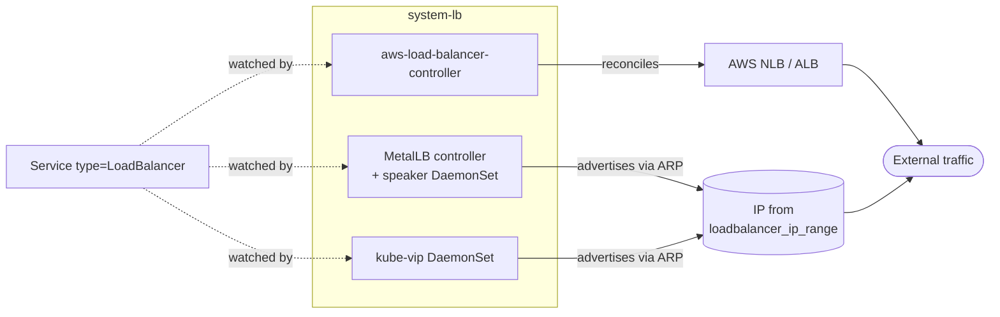

# Load balancer

Exposes Kubernetes `Service` of type `LoadBalancer` to clients outside the
cluster. Two paths share the same `system-lb` namespace and the same
canonical Kustomization names — which controller is wired depends on the
platform.

- **Cloud** (AWS): the `aws-load-balancer-controller` reconciles Services
  and Ingress into AWS NLBs and ALBs.
- **In-cluster** (metal, incus, docker): MetalLB or kube-vip allocates an IP
  from a pool defined by the network module and advertises it via ARP/L2.

Azure clusters use the native AKS LB and do not render this stack.

## Flow



The `system-lb` namespace runs at PSA `privileged` because the in-cluster
speakers need NET_ADMIN and host networking to send gratuitous ARP. The AWS
LB Controller does not need privilege but shares the namespace.

## Recipes

`lb-base` and `lb-resources` are conditional. AWS always renders `lb-base`
(the AWS LB Controller). metal/incus/docker render both when
`network.loadbalancer_driver` is set. docker-desktop forces no in-cluster
LB regardless (no routable node network); Azure never renders this stack
(uses native AKS LBs).

### AWS (cloud-managed NLB/ALB)

The controller does not allocate IPs itself — it provisions cloud LBs in
response to `Service` and `Ingress` resources. No `lb-resources` is needed.

```yaml
- name: lb-base
  path: lb/base
  dependsOn: [policy-resources]
  components:
    - aws-lb-controller
  substitutions:
    cluster_name: <terraform output cluster.cluster_name>
    vpc_id: <terraform output network.vpc_id>
    aws_region: us-east-1
```

### Metal or incus with MetalLB

Set `network.loadbalancer_driver: metallb`. The default is `kube-vip`.

```yaml
- name: lb-base
  path: lb/base
  dependsOn: [policy-resources]
  components:
    - metallb

- name: lb-resources
  path: lb/resources
  dependsOn: [lb-base]
  components:
    - metallb
    - metallb/arp
  substitutions:
    loadbalancer_ip_range: 10.5.1.10-10.5.1.30
```

### Metal or incus with kube-vip (default driver)

kube-vip is deployed entirely from `lb-resources` — there is no `lb-base`
component for kube-vip, so `lb-base` only renders the `system-lb` namespace.

```yaml
- name: lb-base
  path: lb/base
  dependsOn: [policy-resources]
  components: []

- name: lb-resources
  path: lb/resources
  dependsOn: [lb-base]
  components:
    - kube-vip
    - kube-vip/arp
  substitutions:
    loadbalancer_ip_range: 10.5.1.10-10.5.1.30
```

## Substitutions

| Name | Required when | Effect |
|---|---|---|
| `cluster_name` | `aws-lb-controller` is enabled | AWS LB Controller `clusterName` value. Stamped onto every AWS resource the controller owns; the controller filters reconciliation by this tag, so two clusters in the same account must use distinct names. No fallback — empty fails the helm install loudly. |
| `vpc_id` | `aws-lb-controller` is enabled | VPC ID passed explicitly so the controller does not fall back to IMDS (worker launch templates set `http_put_response_hop_limit=1`, blocking pod-network IMDS calls). |
| `aws_region` | `aws-lb-controller` is enabled | AWS region the controller's API calls target. No default — a wrong region silently misses the cluster's VPC and emits confusing "not found" errors. |
| `loadbalancer_ip_range` | `metallb/arp` or `kube-vip/arp` is enabled | IP range MetalLB or kube-vip allocates LoadBalancer IPs from. Format `start-end` (e.g. `10.5.1.10-10.5.1.30`); sourced from `network.loadbalancer_ips.start` and `network.loadbalancer_ips.end` joined by `-`. |

## Components

### `lb/base/`

The base kustomization always renders the `system-lb` namespace.

| Component | Enable when | Effect |
|---|---|---|
| `aws-lb-controller` | platform is AWS | Helm release of `aws-load-balancer-controller` v3.2.2 in `system-lb`. Two replicas with anti-affinity (degrades gracefully on single-node). IRSA / Pod Identity provides the IAM role; `clusterName`, `vpcId`, and `region` are passed through substitutions to avoid IMDS. |
| `metallb` | `network.loadbalancer_driver: metallb` | Helm release of MetalLB v0.15.3 (controller + speaker) in `system-lb`. CRDs (IPAddressPool, L2Advertisement) ship with the chart. |

### `lb/resources/`

The base kustomization is empty by default. AWS does not render
`lb-resources` (the controller manages cloud LBs, not in-cluster IPs).

| Component | Enable when | Effect |
|---|---|---|
| `metallb` | `network.loadbalancer_driver: metallb` | Empty placeholder Component. The MetalLB controller is installed by `lb-base/metallb`; this exists so the uniform `${driver}` pattern in platform facets resolves to a real path on both driver branches. |
| `metallb/arp` | metallb + `network.loadbalancer_mode: arp` (default) | Creates `IPAddressPool/metallb-layer2` with `addresses: ${loadbalancer_ip_range}` and `L2Advertisement/metallb-layer2` selecting that pool. |
| `metallb/layer2` | (deprecated) | Compatibility shim that imports `../arp`. Will be dropped in v0.8.0 — switch to `metallb/arp` directly. |
| `kube-vip` | `network.loadbalancer_driver: kube-vip` (the default) | Helm release of kube-vip v0.9.8 with service election enabled, plus a sidecar release for the kube-vip cloud-provider that handles IP allocation. |
| `kube-vip/arp` | kube-vip + `network.loadbalancer_mode: arp` (default) | Patches the kube-vip HelmRelease to set `vip_arp: true` and `vip_routing_table: false` (gratuitous ARP advertisement, no BGP table). |

## Dependencies

| Stack | Reason |
|---|---|
| `policy-resources` | `lb-base` `dependsOn` policy-resources on every platform that wires it. The lb namespace runs at PSA `privileged` and Kyverno policies inspect/exempt it; reconciling the helm release before policy CRDs exist would race. |

`lb-resources` always depends on `lb-base` (the controller must be running
before any `IPAddressPool` or `L2Advertisement` is created — without the
MetalLB CRDs the apply fails on `no matches for kind IPAddressPool`).

Reverse dependency: any stack that owns a `Service` of type `LoadBalancer`
or an `Ingress` reconciled by the AWS LBC declares `dependsOn: lb-base` so
destroy ordering puts the controller last. The controller has to be alive
to clear AWS finalizers (`service.k8s.aws/resources`,
`elbv2.k8s.aws/resources`) when the consumer Service is deleted; if the
controller is torn down first, those resources hang.

## Operations

Stack-specific failure modes; generic Flux/Renovate behaviour is documented
at the repo level.

- **AWS LB Controller crashlooping with `failed to discover VPC`** — `vpc_id` or `aws_region` substitution didn't resolve. Check `terraform_output('network', 'vpc_id')` returned a value and that the deferred substitution propagated.
- **AWS LB Controller starts but no AWS resources are created** — `clusterName` doesn't match the EKS / Pod Identity association. The IAM role's trust policy is scoped by cluster name; a mismatch fails silently with permission errors at API call time.
- **MetalLB Service stuck in `Pending` with no external IP** — `loadbalancer_ip_range` is empty or doesn't cover any unused IPs. Confirm `network.loadbalancer_ips` in the context values resolves to a real range; check `kubectl get ipaddresspool -n system-lb -o yaml`.
- **MetalLB IP allocated but unreachable** — speakers can't send gratuitous ARP. Usually a CNI / underlay network policy issue; the speaker DaemonSet runs at PSA `privileged` and needs host networking on every node.
- **`lb-resources` reports `no matches for kind IPAddressPool`** — the MetalLB CRDs aren't ready. Either `lb-base` hasn't reconciled yet, or the chart version is mismatched with the CRD apiVersion (`metallb.io/v1beta1`).
- **AWS LB stuck on destroy** — a consumer Service was torn down after `lb-base`. Re-reconcile `lb-base`, wait for the controller to come back, then delete the Service / Ingress.

## Security

- The `system-lb` namespace runs at PSA `privileged`. MetalLB speakers and kube-vip require NET_ADMIN and host networking; the AWS LB Controller does not but shares the namespace.
- AWS LB Controller IAM is provided by IRSA or Pod Identity (the `serviceMutatorWebhook` is disabled — pods are not annotated). The associated IAM role is provisioned by the cluster Terraform module.
- MetalLB advertises only IPs in `loadbalancer_ip_range`. The pool is namespace-scoped to `system-lb`; a Service requesting a `loadBalancerClass` MetalLB does not own will be ignored.

## See also

- [contexts/_template/facets/platform-aws.yaml](../../contexts/_template/facets/platform-aws.yaml) — AWS LBC wiring with `cluster_name` / `vpc_id` substitutions.
- [contexts/_template/facets/platform-metal.yaml](../../contexts/_template/facets/platform-metal.yaml) — metal MetalLB wiring.
- [contexts/_template/facets/platform-incus.yaml](../../contexts/_template/facets/platform-incus.yaml) — incus wiring (supports both metallb and kube-vip drivers).
- [contexts/_template/facets/platform-base.yaml](../../contexts/_template/facets/platform-base.yaml) — `lb_effective` resolution (the internal config that folds `network.loadbalancer_driver` together with platform-specific overrides like docker-desktop's force-disable).
- Blueprint schema and facet syntax — https://www.windsorcli.dev/docs/blueprints/
- Related stacks: [policy](../policy/), [gateway](../gateway/).
