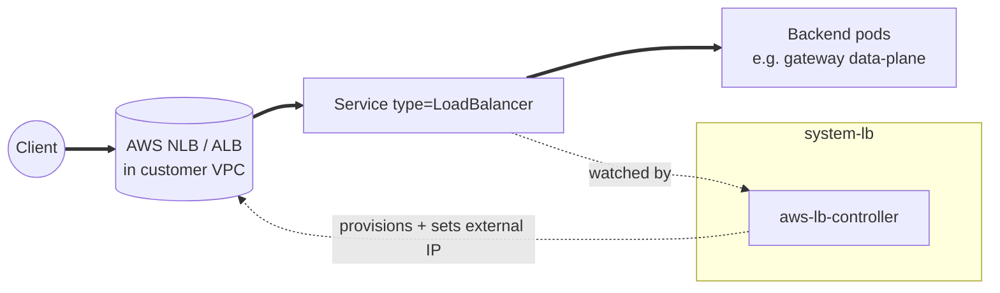
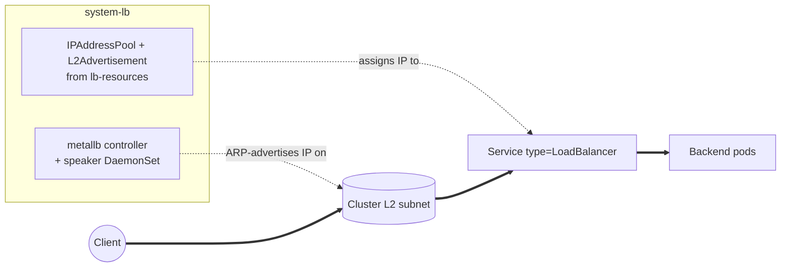
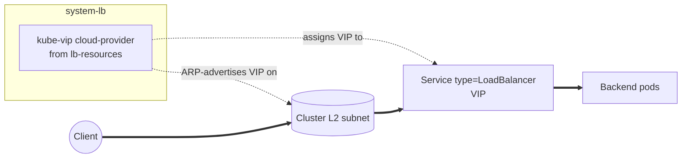

# LB

The cluster's LoadBalancer-Service provider, gated on
`lb_effective.enabled` and selected by `lb_effective.driver`. Three
drivers ship.

`aws-lb-controller` is used on EKS to provision real AWS NLB / ALB
resources outside the cluster. The controller is here, and the AWS-side
LB lives in the customer's VPC.

`metallb` is a speaker DaemonSet that ARP- or BGP-advertises IPs from
a configured pool. Used on docker / incus / metal clusters.

`kube-vip` is a VIP-style provider for Talos clusters that uses ARP
for L2 advertisement.

The add-on splits across two Kustomization paths so Flux can install
the controller (CRDs + workloads) before the resources that depend on
the controller being live (advertisement pools, cloud-provider
patches). `lb-base` ships the Helm releases (aws-lb-controller,
metallb). `lb-resources` ships the advertisement / address-pool
configs and (for the Talos kube-vip path) the kube-vip cloud-provider
HelmRelease itself, and depends on `lb-base`.

The namespace runs at PSA `privileged` because MetalLB's speaker
needs host networking, and aws-lb-controller shares the namespace
even though it doesn't.

## Recipes

Exactly one driver is wired per cluster, selected by
`lb_effective.driver`. The gateway add-on's data-plane Service gets
its external IP from whichever driver is on.

### AWS (EKS)



```yaml
- name: lb-base
  path: lb/base
  dependsOn: [policy-resources]
  components: [aws-lb-controller]
  substitutions:
    cluster_name: <terraform_output('cluster', 'cluster_name')>
    vpc_id: <terraform_output('network', 'vpc_id')>
    aws_region: us-east-1
```

The controller runs in the cluster and provisions real AWS-side load
balancers in the customer's VPC. There's no `lb-resources` block
because AWS LB Controller handles address management through the cloud
API. `lb_effective.controller_required` is true for this driver, so
gateway-base depends on lb-base.

### MetalLB (docker / incus / metal)



```yaml
- name: lb-base
  path: lb/base
  dependsOn: [policy-resources]
  components: [metallb]

- name: lb-resources
  path: lb/resources
  dependsOn: [lb-base]
  components: [metallb/arp]
  substitutions:
    loadbalancer_ip_range: 10.5.1.10-10.5.1.30
```

The speaker DaemonSet ARP- or BGP-advertises IPs from the configured
pool on the cluster's L2 subnet. ARP advertisement is the default;
the pool range comes from `network.loadbalancer_ips.{start,end}`.

### Talos (kube-vip)



```yaml
- name: lb-resources
  path: lb/resources
  dependsOn: [lb-base]
  components: [kube-vip, kube-vip/arp]
```

The Talos kube-vip path skips `lb-base`. There's no separate
controller chart, and the kube-vip cloud-provider ships in the
resources layer, advertising a VIP over ARP.

<!-- BEGIN_KUSTOMIZE_DOCS -->

## Substitutions

| Name | Required when | Effect |
|---|---|---|
| `cluster_name` | `aws-lb-controller` is enabled | AWS-side cluster name (LBC tag). Sourced from `terraform_output('cluster', 'cluster_name')`. No fallback — LBC tags every AWS resource it owns with this and filters reconciliation by it, so a generic default would let a second cluster in the same account race the tags. |
| `vpc_id` | `aws-lb-controller` is enabled | VPC ID the LBC operates against. Sourced from `terraform_output('network', 'vpc_id')`. |
| `aws_region` | `aws-lb-controller` is enabled | AWS region for LBC API calls. Sourced from top-level `aws.region`. |
| `loadbalancer_ip_range` | `metallb/*` advertisement component is enabled | IP range MetalLB advertises (CIDR-style `start-end`). Sourced from `network.loadbalancer_ips.start + '-' + network.loadbalancer_ips.end`. |

## Components — `lb-base`

| Component | Enable when | Effect |
|---|---|---|
| `aws-lb-controller` | platform is AWS | Helm release of the AWS Load Balancer Controller in `system-lb`. Watches `Service type=LoadBalancer` (NLB) and `Ingress` (ALB) resources and provisions AWS-side LBs against the cluster's VPC. Talks to AWS via the IAM role + Pod Identity the cluster Terraform module provisioned. The chart's `crds/` directory is install-only (Helm never upgrades it); the CRDs are vendored under `kustomize/crds/` and applied via the facet `crds:` section so they stay current. |
| `metallb` | `lb_effective.driver == 'metallb'` | Helm release of MetalLB in `system-lb`. Installs the controller and speaker DaemonSet. The address pool and advertisement mode come from `lb-resources` (`metallb/arp` or `metallb/layer2`). |

## Components — `lb-resources`

| Component | Enable when | Effect |
|---|---|---|
| `kube-vip` | `lb_effective.driver == 'kube-vip'` (Talos clusters) | Helm release of the kube-vip cloud-provider in `system-lb`. Provides VIP-based LoadBalancer Services for Talos clusters where MetalLB is not used; pairs with `kube-vip/arp` for L2 advertisement. |
| `kube-vip/arp` | kube-vip driver AND `network.loadbalancer_mode == 'arp'` (default) | Patches the kube-vip cloud-provider HelmRelease to enable ARP-based VIP advertisement (Layer 2). |
| `metallb/arp` | metallb driver AND `network.loadbalancer_mode == 'arp'` (default) | MetalLB `IPAddressPool` (range = `${loadbalancer_ip_range}`) plus an `L2Advertisement` selecting it. Use this for flat L2 networks where speakers can ARP-respond on the cluster subnet. |
| `metallb/layer2` | metallb driver AND `network.loadbalancer_mode == 'layer2'` | MetalLB layer2 advertisement variant. (See `MOVED.md` in this component's directory — kept for compatibility while the canonical entry is consolidating.) |

## Dependencies

| Add-on | Required when | Reason |
|---|---|---|
| `policy-resources` | `policies.enabled: true` | lb-base depends on Kyverno's baseline policies being active before LB controller pods (which run privileged in `system-lb`) are admitted. |

<!-- END_KUSTOMIZE_DOCS -->

## See also

- [contexts/_template/facets/platform-aws.yaml](../../contexts/_template/facets/platform-aws.yaml) for aws-lb-controller wiring.
- [contexts/_template/facets/platform-docker.yaml](../../contexts/_template/facets/platform-docker.yaml) for MetalLB wiring on docker hosts.
- [contexts/_template/facets/platform-incus.yaml](../../contexts/_template/facets/platform-incus.yaml) for MetalLB wiring on incus hosts.
- Related add-ons: [gateway](../gateway/) (data-plane Service consumes lb), [cni](../cni/) (Cilium's L2 announcer is an alternative to lb on Talos, see `cilium/l2`), [policy](../policy/).
