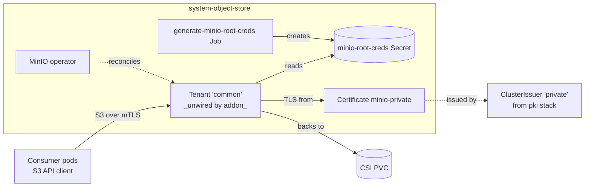

# Object store

S3-compatible object storage backed by the MinIO operator. The operator
runs in `system-object-store` and watches `Tenant` (minio.min.io/v2)
resources cluster-wide; tenants instantiate actual MinIO server pools.

The shipped `addon-object-store` facet wires only the operator (the
`object-store-base` Kustomization). The tenant resources at
`object-store/resources/common/` — a `Tenant` HelmRelease, mTLS
certificate, root-credential generation Job, and supporting RBAC — are not
emitted by any shipped facet. Blueprint authors who want a default tenant
must wire `object-store/resources` themselves.

`addons.object_store.driver: minio` is currently the only driver wired.

## Flow



The operator alone is enough to deploy MinIO tenants — workloads can apply
their own `Tenant` resources in any namespace. The shipped (but unwired)
`resources/common/` set is a complete reference tenant: it issues a
`Certificate` from the `private` ClusterIssuer (so the addon-private-ca
trust path covers it), generates root credentials via a Job, and creates
a single-pool tenant named `common`.

## Recipes

### Operator only (what `addon-object-store` ships)

Sufficient for blueprints whose workloads define their own `Tenant`
resources.

```yaml
- name: object-store-base
  path: object-store/base
  dependsOn: [csi]
  components:
    - minio
  timeout: 10m
  interval: 5m
```

### With the reference `common` tenant (manual wiring)

Adds a `Tenant` HelmRelease, mTLS certificate, and root-credential Job.
Single pool, 1 server, 1 volume, 1Gi PVC on the `single` StorageClass.

```yaml
- name: object-store-base
  path: object-store/base
  dependsOn: [csi]
  components:
    - minio

- name: object-store-resources
  path: object-store/resources
  dependsOn: [object-store-base, pki-resources]
  components:
    - common
  timeout: 10m
  interval: 5m
```

The dependency on `pki-resources` is critical: the tenant Certificate
references `ClusterIssuer/private`, which is created by the
`addon-private-ca` facet's `pki-resources` entry. Without it, the
Certificate stays `Pending` and the Tenant never gets a TLS Secret.

## Substitutions

This stack does not consume any blueprint substitutions. All tenant
configuration is in the shipped manifests.

## Components

### `object-store/base/`

| Component | Enable when | Effect |
|---|---|---|
| `minio` | `addons.object_store.driver: minio` | Helm release of the MinIO operator chart v7.1.1 in `system-object-store`. Operator image v7.1.1, runAsUser 1000, fsGroup 1000. Adds `use-custom-ca: "true"` label to operator pods so trust-manager distributes the private CA bundle when the addon-private-ca path is enabled. |

The base directory also contains a [`git-repository.yaml`](base/minio/git-repository.yaml)
referencing the upstream MinIO operator git repo. It is **not included** in
`base/minio/kustomization.yaml` (which lists only `helm-repository.yaml`
and `helm-release.yaml`) — the file is a stray and currently has no
effect. The HelmRepository at `https://operator.min.io` is what actually
sources the operator chart.

### `object-store/resources/`

The base kustomization is empty (`resources: []`). The single subcomponent
provides a reference tenant.

| Component | Effect |
|---|---|
| `common` | Bundle of: `Tenant/common` HelmRelease (1 pool, 1 server, 1 volume, 1Gi PVC on the `single` StorageClass, mountPath `/export`, subPath `/data`); `Certificate/minio-private` issued by the `private` ClusterIssuer with SANs covering `common-hl.system-object-store.svc.cluster.local` and `minio.system-object-store.svc.cluster.local` (plus wildcards); `Job/generate-minio-root-creds` that randomizes a 12-byte access key and 16-byte secret key on first reconcile and stores them in the `minio-root-creds` Secret; supporting `ServiceAccount`, `Role`, `RoleBinding` for the Job. Ingress is disabled — exposure is the consumer's responsibility. |

## Dependencies

| Stack | Reason |
|---|---|
| `csi` | The MinIO operator does not allocate PVCs eagerly, but tenant pools do. The shipped reference tenant requests a 1Gi PVC on StorageClass `single`; without a CSI driver, tenant pods stay `Pending`. |
| `pki-resources` *(only when wiring `resources/common`)* | The reference tenant's `Certificate` references `ClusterIssuer/private`, which is created by `addon-private-ca`'s `pki-resources` entry. Wiring `object-store/resources` without `addon-private-ca` enabled produces a Certificate stuck `Pending`. |

## Operations

Stack-specific failure modes; generic Flux/Renovate behaviour is documented
at the repo level.

- **`Tenant` reconciles but pods stay `Pending`** — PVC scheduling. The reference tenant uses StorageClass `single` and 1 volume per server; check `kubectl get pvc -n system-object-store` and the StorageClass's `volumeBindingMode` (it's `WaitForFirstConsumer` on the cloud paths, so the volume only provisions when the Pod schedules).
- **Tenant pods crashloop with `tls: bad certificate`** — the Certificate isn't ready or the `minio-private-tls` Secret hasn't been created yet. Confirm `kubectl get certificate -n system-object-store minio-private` shows `READY=True`. The Tenant references `minio-private-tls` via `externalCertSecret` — until cert-manager populates it, the operator can't bring up MinIO over HTTPS.
- **Root credentials missing** — the `generate-minio-root-creds` Job didn't run or hasn't finished. The Job has `ttlSecondsAfterFinished: 86400` (24h) and the manifest is annotated `kustomize.toolkit.fluxcd.io/force: enabled` so Flux re-applies on every reconcile. Check `kubectl get job -n system-object-store` and the Job's logs.
- **External clients can't reach the tenant** — by design. The reference tenant has `ingress.api.enabled: false` and `ingress.console.enabled: false`. To expose externally, add an HTTPRoute or Ingress and update the Certificate SANs to cover the external hostname.
- **`HelmRelease/cluster-tenant` reports `no matches for kind Tenant`** — the operator hasn't installed the Tenant CRD. The CRDs ship with the operator chart; reconcile `object-store-base` before `object-store-resources`.

## Security

- The `system-object-store` namespace runs at PSA `baseline`. The namespace is also labeled `use-custom-ca: "true"`, so trust-manager's Bundle (from `addon-private-ca`) distributes the cluster's private CA to it.
- The operator pod runs `runAsUser: 1000`, `fsGroup: 1000`. The credential-generation Job runs `runAsNonRoot: true`, drops all capabilities, and uses `seccompProfile: RuntimeDefault`.
- mTLS for the tenant is enforced via `requestAutoCert: false` + `externalCertSecret` referencing the cert-manager-issued `minio-private-tls`. There is no in-tree certificate generation; everything flows through the `pki` stack.
- Root credentials are generated in-cluster (12-byte hex access key, 16-byte hex secret key) by the bootstrap Job. They're stored in the `minio-root-creds` Secret in `system-object-store`. Tenant workloads needing the root credentials must reference this Secret directly; consider rotating before exposing the tenant.
- Tenant ingress (API and console) is disabled by default. Exposing the tenant externally is the consumer's responsibility — add an HTTPRoute and update the Certificate SANs.

## See also

- [contexts/_template/facets/addon-object-store.yaml](../../contexts/_template/facets/addon-object-store.yaml) — canonical wiring of the operator. Note that `object-store/resources` is NOT wired by this facet.
- [base/minio/git-repository.yaml](base/minio/git-repository.yaml) — stray file not included in the kustomization. Unused.
- Blueprint schema and facet syntax — https://www.windsorcli.dev/docs/blueprints/
- MinIO operator docs — https://min.io/docs/minio/kubernetes/upstream/
- Related stacks: [csi](../csi/), [pki](../pki/).
