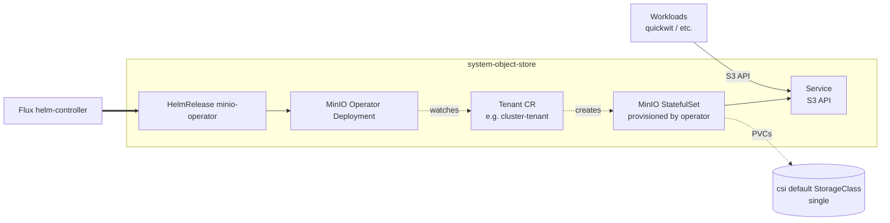

# Object-store

In-cluster S3-compatible storage. The add-on installs the MinIO Operator
only. It manages Tenant custom resources, but doesn't create one
automatically. Provisioning an actual MinIO cluster is a separate step
(see Recipes below).

The default driver is `minio`. The schema is set up to accept additional
drivers (cloud-managed S3, Ceph, etc.) as future `object-store` `flux:`
entries gated on `addons.object_store.driver`.

## Architecture



The Operator runs continuously and reconciles Tenant CRs into
StatefulSet-backed MinIO pools. Each pool requests PVCs against the
default StorageClass at apply time.

## Recipes

### Operator only (default)

```yaml
flux:
  - name: object-store
    dependsOn: [csi]
    install:
      components: [minio]
      timeout: 10m
```

Installs the Operator. No MinIO cluster runs until a Tenant CR is
created.

### Add the reference single-pool Tenant

`kustomize/object-store/resources/common/` ships a reference Tenant
configuration (1 pool, 1 server, 1 volume, 1Gi storage class `single`,
TLS via `minio-private-tls` secret, root creds generated by an
in-cluster Job). It isn't wired by any default facet. To deploy it, add
a custom kustomize entry in your context:

```yaml
- name: object-store-resources
  path: object-store/resources/common
  dependsOn: [object-store-install]
  timeout: 10m
```

This creates the `cluster-tenant` HelmRelease (`tenant` chart). The
companion `generate-minio-root-creds` Job populates the
`minio-root-creds` Secret with random openssl-generated credentials on
first apply. The Secret persists across reconciles because the TTL is
on the completed Job, not the Secret.

<!-- BEGIN_KUSTOMIZE_DOCS -->

## Components

| Component | Enable when | Effect |
|---|---|---|
| `minio` | `addons.object_store.driver == 'minio'` | Helm release of the MinIO Operator (`operator` chart) in `system-object-store`. Installs only the Operator (CRDs + Deployment); does not create any MinIO Tenant by itself. Operator runs as `uid 1000`, baseline PSA-compatible. |

## Dependencies

| Add-on | Required when | Reason |
|---|---|---|
| `csi` | always | MinIO Tenants need PVCs (the default StorageClass) for their pool storage. Without csi the operator runs but no Tenant CR can come up. |

<!-- END_KUSTOMIZE_DOCS -->

## See also

- [contexts/_template/facets/addon-object-store.yaml](../../contexts/_template/facets/addon-object-store.yaml) for the canonical wiring.
- [kustomize/object-store/resources/common/](resources/common/) for the reference Tenant config (not facet-wired).
- Related add-ons: [csi](../csi/), [observability](../observability/) (Quickwit log store can use a MinIO Tenant as its object backend).
