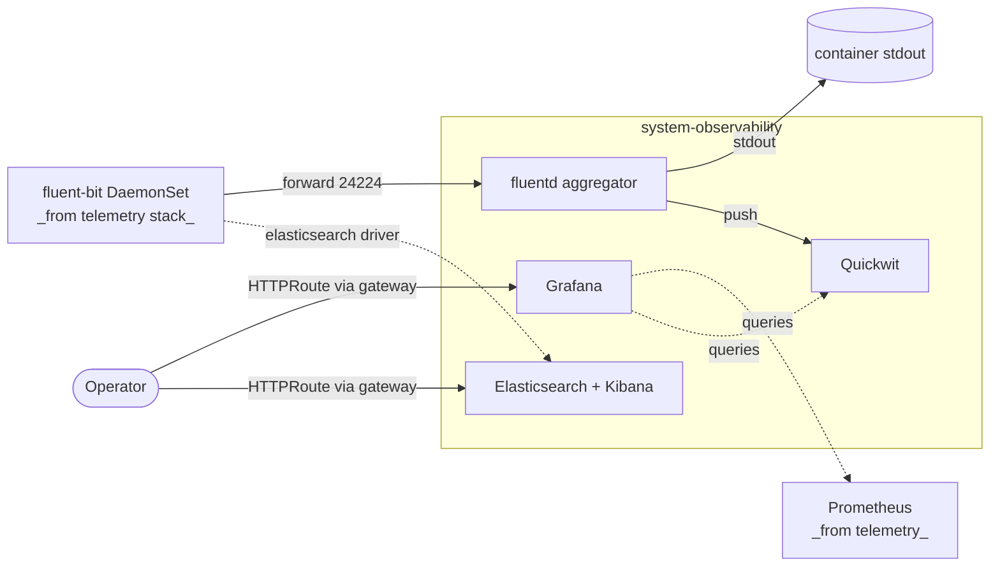

# Observability

Visualization (Grafana) plus the log sink for the telemetry pipeline. The
`observability` Kustomization is unusual in that it has **no `base/` or
`resources/` split** — every component lives directly under
`kustomize/observability/`, and four different facets contribute components
to the same Kustomization name:

- `platform-base` always emits the fluentd aggregator when `logs_driver == 'fluentd'` (even without `addons.observability.enabled`). Without addon-observability, fluentd runs as a terminal receiver with no output; the pipeline shape stays intact so enabling the addon later doesn't reconfigure telemetry.
- `addon-observability` (gated on `addons.observability.enabled == true`) adds Grafana, dashboards, the gateway route, and the chosen log-storage backend.
- `option-cni` adds `grafana/dashboards/cilium` when `dashboards == 'grafana'`.
- Other facets (`option-storage`, `addon-database`) add their own dashboards the same way.

## Flow



`platform-base` is responsible for fluentd; `addon-observability` is
responsible for Grafana and the storage backend. Choosing
`logs_driver: elasticsearch` is special — it replaces `telemetry-base` and
`telemetry-resources` entirely, swapping fluent-bit for filebeat (which
ships directly to Elasticsearch and bypasses fluentd).

## Recipes

`addons.observability.enabled` toggles the Grafana / storage path. Even with
the addon off, fluentd still runs from `platform-base` if
`telemetry.logs.driver` is `fluentd` (the default).

### Default (addon enabled, no external log store)

Grafana plus fluentd as a terminal receiver. Logs are buffered and dropped;
useful for trying observability without committing storage.

```yaml
- name: observability
  path: observability
  dependsOn: [telemetry-base, dns]
  components:
    - grafana
    - grafana/prometheus
    - grafana/dashboards/node
    - grafana/dashboards/kubernetes
    - grafana/dashboards/flux
    - grafana/dashboards/cert-manager
    - grafana/dashboards/fluent-bit
    - grafana/dashboards/fluentd
    - fluentd
    - fluentd/filters/otel
    - fluentd/prometheus
    - fluentd/filters/log-level/info
  substitutions:
    external_domain: example.internal
    timezone: UTC
    date_full: "YYYY-MM-DD HH:mm:ss"
```

### With Gateway HTTPRoute

When the cluster has a Gateway, layer in the `grafana/gateway` HTTPRoute and
(on Envoy) the envoy dashboards.

```yaml
- name: observability
  path: observability
  dependsOn: [telemetry-base, dns, gateway-resources]
  components:
    - grafana
    - grafana/prometheus
    - grafana/gateway
    - grafana/dashboards/envoy
    # ... plus the dashboards from the previous recipe
    - fluentd
    - fluentd/filters/otel
    - fluentd/prometheus
    - fluentd/filters/log-level/info
  substitutions:
    external_domain: example.internal
```

### Quickwit logs

Set `addons.observability.logs_driver: quickwit`. Full sink stack with a
PVC-backed staging directory; depends on a CSI driver.

```yaml
- name: observability
  path: observability
  dependsOn: [telemetry-base, dns, csi, telemetry-resources]
  components:
    - grafana
    - grafana/prometheus
    - grafana/quickwit
    - grafana/dashboards/logs/quickwit
    - fluentd
    - fluentd/outputs/quickwit
    - fluentd/filters/otel
    - fluentd/prometheus
    - quickwit
    - quickwit/pvc
    - quickwit/prometheus
```

### Elasticsearch + Kibana

`addons.observability.logs_driver: elasticsearch`. This recipe **replaces**
`telemetry-base` and `telemetry-resources` (filebeat → Elasticsearch directly,
no fluent-bit, no fluentd). Requires a Gateway for Kibana's HTTPRoute.

```yaml
- name: telemetry-base
  path: telemetry/base
  strategy: replace
  components:
    - prometheus
    - prometheus/flux
    - filebeat

- name: telemetry-resources
  path: telemetry/resources
  strategy: replace
  dependsOn: [telemetry-base]
  components:
    - metrics-server
    - prometheus
    - prometheus/flux

- name: observability
  path: observability
  dependsOn: [telemetry-base, dns, csi, gateway-resources]
  components:
    - grafana
    - grafana/prometheus
    - elasticsearch
    - kibana
    - kibana/gateway
  substitutions:
    external_domain: example.com
```

Talos clusters running Elasticsearch must apply
`vm.max_map_count: 262144` in machine config; see
[elasticsearch/README.md](elasticsearch/README.md).

## Substitutions

| Name | Required when | Effect |
|---|---|---|
| `external_domain` | always | Hostname (and wildcard) on the Grafana / Kibana HTTPRoutes. Resolved from `dns.public_domain` if set, otherwise `dns.private_domain`. |
| `timezone` | always | Grafana default timezone (`grafana.ini` → `default.timezone`). Stamped from the context-level `timezone` value; falls back to `utc`. |
| `date_full`, `date_interval_*` | always (with fallbacks) | Grafana date format strings, switched between 12h and 24h based on the context-level `time_format`. Each has a kustomize fallback so dropping the substitution doesn't break panels. |
| `admin_password` | optional | Grafana admin password. Falls back to `grafana` (the `option-dev` default). Production should set this via secret-mgr. |

## Components

The component tree is large. Components group by subsystem:

### `grafana/`

| Component | Effect |
|---|---|
| `grafana` | Helm release of Grafana v10.5.15 in `system-observability`. Image v13.0.1. Sidecars import dashboards from labeled ConfigMaps. |
| `grafana/dev` | Patches the helm release to set `adminPassword: ${admin_password:-grafana}` for dev clusters. |
| `grafana/prometheus` | Configures the Prometheus datasource pointing at the kube-prometheus-stack instance in `system-telemetry`. |
| `grafana/quickwit` | Configures the Quickwit datasource (only when logs_driver=quickwit). |
| `grafana/gateway` | HTTPRoute on the cluster's Gateway exposing Grafana at `grafana.${external_domain}`. |
| `grafana/ingress` | Plain Kubernetes Ingress (alternative to gateway when no Gateway API controller is installed). |
| `grafana/cert-manager` | Datasource / config for the cert-manager dashboard. |
| `grafana/cloudnativepg` | Datasource for the CloudNativePG dashboard. |
| `grafana/flux` | Datasource for the Flux dashboard. |
| `grafana/kubernetes` | Datasource for the Kubernetes overview dashboards. |
| `grafana/nginx` | Datasource for the nginx-ingress dashboard. |
| `grafana/node` | Datasource for the node-exporter dashboard. |

### `grafana/dashboards/`

Each subdirectory is a ConfigMap dashboard (Grafana's sidecar imports them by
label). Always-on dashboards are wired from `addon-observability`; the rest
are added by their respective owner facets.

| Component | Wired by | Effect |
|---|---|---|
| `grafana/dashboards/node` | addon-observability | Standard node-exporter dashboard. |
| `grafana/dashboards/kubernetes` | addon-observability | Multi-cluster Kubernetes overview. |
| `grafana/dashboards/flux` | addon-observability | Flux controllers and reconciliation status. |
| `grafana/dashboards/cert-manager` | addon-observability | cert-manager controller / certificate health. |
| `grafana/dashboards/fluent-bit` | addon-observability | fluent-bit metrics. |
| `grafana/dashboards/fluentd` | addon-observability | fluentd aggregator metrics. |
| `grafana/dashboards/envoy` | addon-observability (Envoy gateway only) | Envoy data-plane metrics. |
| `grafana/dashboards/cilium` | option-cni (when dashboards=grafana) | Cilium agent and operator metrics. |
| `grafana/dashboards/cloudnativepg` | addon-database | CloudNativePG cluster health. |
| `grafana/dashboards/longhorn` | option-storage | Longhorn volumes / replicas. |
| `grafana/dashboards/logs/quickwit` | addon-observability (logs_driver=quickwit) | Logs panel populated from the Quickwit datasource. |
| `grafana/dashboards/nginx` | *(unwired)* | nginx ingress metrics. Available for manual blueprint wiring; not in any shipped facet. |
| `grafana/dashboards/prometheus` | *(unwired)* | Prometheus self-monitoring. Available for manual blueprint wiring; not in any shipped facet. |
| `grafana/dashboards/quickwit` | *(unwired)* | Quickwit operator metrics. Exists on disk but not in any shipped facet — `addon-observability` pulls in `grafana/dashboards/logs/quickwit` (the logs panel) but not this one. |
| `grafana/dashboards/logs` | *(unwired)* | Logs panel framework. Exists on disk but not referenced by any facet. |

### `fluentd/`

| Component | Wired by | Effect |
|---|---|---|
| `fluentd` | platform-base (when logs_driver=fluentd) | `Fluentd` CR (replicas: 1) in `system-observability` listening on TCP 24224 for forward protocol. ClusterFluentdConfig selects all configs labeled `config.fluentd.fluent.io/enabled: "true"`. |
| `fluentd/prometheus` | platform-base (when `telemetry.metrics.enabled: true`) | ServiceMonitor for fluentd's own metrics. |
| `fluentd/filters/otel` | platform-base | OpenTelemetry filter normalizing fields. |
| `fluentd/filters/log-level/{debug,info,warn,error}` | platform-base (one chosen by `log_level`) | Drops records below the configured severity. `log_level: 'trace'` skips this component entirely (passes everything). |
| `fluentd/outputs/stdout` | addon-observability (logs_driver=stdout) | ClusterOutput writing to fluentd's container stdout. |
| `fluentd/outputs/quickwit` | addon-observability (logs_driver=quickwit) | ClusterOutput pushing to Quickwit's ingest API. |

### `quickwit/`

| Component | Wired by | Effect |
|---|---|---|
| `quickwit` | addon-observability (logs_driver=quickwit) | Helm release of Quickwit. |
| `quickwit/pvc` | addon-observability (logs_driver=quickwit) | PVC for Quickwit's staging / index data. Requires a `csi` driver. |
| `quickwit/prometheus` | addon-observability (logs_driver=quickwit) | ServiceMonitor for Quickwit. |

### `elasticsearch/` and `kibana/`

| Component | Wired by | Effect |
|---|---|---|
| `elasticsearch` | addon-observability (logs_driver=elasticsearch) | Helm release of Elasticsearch. Talos requires `vm.max_map_count: 262144` in machine sysctls — see [elasticsearch/README.md](elasticsearch/README.md). |
| `kibana` | addon-observability (logs_driver=elasticsearch) | Helm release of Kibana. |
| `kibana/gateway` | addon-observability (logs_driver=elasticsearch) | HTTPRoute exposing Kibana via the cluster Gateway. Required because Kibana has no other path out. |
| `kibana/ingress` | (consumer-wired) | Plain Ingress alternative to the Gateway route. |

## Dependencies

`observability` is contributed to by multiple facets, so dependencies vary
per facet entry. Common patterns:

| Stack | Reason |
|---|---|
| `telemetry-base` | Grafana points at the Prometheus instance from telemetry; fluentd inherits CRDs from fluent-operator (also installed by telemetry-base). |
| `dns` | Conditional. Grafana's HTTPRoute hostname is reconciled via external-dns; without `dns` the record never publishes. |
| `gateway-resources` | When wiring `grafana/gateway` or `kibana/gateway`. The Gateway must exist before the HTTPRoute is applied. |
| `csi` | When wiring `quickwit/pvc` or `elasticsearch` — both need persistent volumes. |
| `telemetry-resources` | When `logs_driver` is stdout or quickwit — fluentd outputs reference fluent-bit's ClusterFluentdConfig from telemetry-resources. |

## Operations

Stack-specific failure modes; generic Flux/Renovate behaviour is documented
at the repo level.

- **Grafana panels show "no data" but Prometheus has metrics** — the `grafana/prometheus` datasource isn't configured or points at the wrong service. Check the Grafana ConfigMap with the datasource definition.
- **Logs reach fluentd but disappear** — no ClusterOutput is configured. When `addons.observability.enabled` is false but `logs_driver: fluentd`, fluentd runs as a terminal receiver and buffers. Set `addons.observability.logs_driver` to `stdout` (cheapest) to emit somewhere.
- **`quickwit/pvc` stuck `Pending`** — CSI driver isn't ready. Check `csi` Kustomization status and the StorageClass referenced by the PVC.
- **Elasticsearch pods crash on Talos with `max virtual memory areas vm.max_map_count too low`** — required Talos sysctl missing. Apply `vm.max_map_count: 262144` in the machine config; see [elasticsearch/README.md](elasticsearch/README.md). This is a Talos-only requirement.
- **Switching between log drivers leaves stale ClusterOutputs** — fluentd's selectors are label-based, so an unmatched ClusterOutput is harmless. To clean up, delete the resource by hand (Flux removes it on the next reconcile after the component is dropped).
- **Kibana HTTPRoute returns 404** — `kibana/gateway` was applied before `gateway-resources` finished. Reconcile order should prevent this; if it fires, re-reconcile `observability`.

Grafana exposes its own metrics at `/metrics` on the same port as the UI;
node-exporter, kube-state-metrics, and Prometheus itself feed into the
default dashboards.

## Security

- `system-observability` runs at PSA `baseline` and is labeled `use-custom-ca: "true"`. The label opts the namespace into the trust-manager Bundle from `addon-private-ca` so Grafana / Kibana / Elasticsearch trust the private CA when issued certs from it.
- Grafana admin credentials default to `admin/grafana` via `grafana/dev`. Production blueprints should override `admin_password` from a secret store (the helm release values use `${admin_password:-grafana}` so the substitution wins when set).
- Kibana exposes Elasticsearch query / config UI; the HTTPRoute relies on the Gateway TLS cert from `pki` for transport security but does not enforce auth. If exposing publicly, layer authentication in front.
- fluentd's forward port (24224) is namespace-scoped; only fluent-bit pods (in `system-telemetry`) reach it via the cluster network. No external listener.
- Quickwit's ingest API is internal only by default — if exposing to other clusters, add an HTTPRoute and authentication.

## See also

- [contexts/_template/facets/addon-observability.yaml](../../contexts/_template/facets/addon-observability.yaml) — Grafana, dashboards, log-driver branching, and the Elasticsearch telemetry replacement.
- [contexts/_template/facets/platform-base.yaml](../../contexts/_template/facets/platform-base.yaml) (lines ~462-473) — fluentd aggregator wiring, runs even without the addon when logs_driver=fluentd.
- [contexts/_template/facets/option-cni.yaml](../../contexts/_template/facets/option-cni.yaml) — example of a sibling facet patching dashboards into observability.
- [elasticsearch/README.md](elasticsearch/README.md) — Talos sysctl prerequisite for Elasticsearch.
- Blueprint schema and facet syntax — https://www.windsorcli.dev/docs/blueprints/
- Related stacks: [telemetry](../telemetry/), [pki](../pki/), [gateway](../gateway/), [dns](../dns/), [csi](../csi/), [database](../database/).
