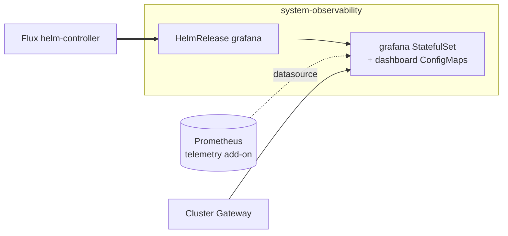
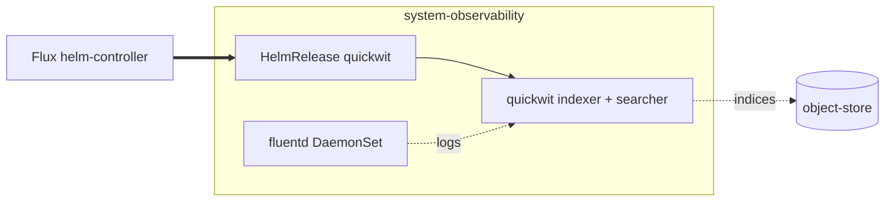
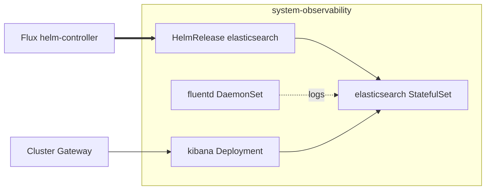

# Observability

The dashboards-and-logs layer. Two halves that can be enabled
independently.

Dashboards run on Grafana with a Prometheus datasource and per-add-on
dashboards. Set `addons.observability.dashboards: grafana`.

The log store ships records via fluentd to one of three back-ends:
`stdout` (dev), `quickwit` (production default), or `elasticsearch` +
`kibana` (when ES is already the team's standard). Set
`addons.observability.logs_driver` to choose.

The metric pipeline (Prometheus, fluent-bit) lives in the `telemetry`
add-on. This add-on assumes telemetry-install is already producing
metrics and shipping logs to fluentd's input.

## Recipes

Everything runs in `system-observability`. The dashboards half (Grafana)
and the log store are enabled independently; fluentd is the universal
log shipper, and `logs_driver` selects which output component and
back-end Helm release run alongside it. With no driver set, fluentd
ships to stdout.

### Grafana dashboards only (no log store)



```yaml
- name: observability
  dependsOn: [telemetry-install, dns-install]
  install:
    components:
      - grafana
      - grafana/prometheus
    timeout: 15m
    substitutions:
      external_domain: example.com
  resources:
    - components:
        - grafana/dashboards/node
        - grafana/dashboards/kubernetes
        - grafana/dashboards/flux
        - grafana/dashboards/cert-manager
        - grafana/dashboards/fluent-bit
        - grafana/dashboards/fluentd
      substitutions:
        timezone: utc
        date_full: YYYY-MM-DD HH:mm:ss
        date_interval_second: HH:mm:ss
        date_interval_minute: HH:mm
        date_interval_hour: MM/DD HH:mm
        date_interval_day: MM/DD
```

### Add Quickwit as the log store



```yaml
- name: observability
  dependsOn: [csi]
  install:
    components:
      - quickwit
      - quickwit/pvc
      - quickwit/prometheus
      - grafana/quickwit
  resources:
    - dependsOn: [telemetry-resources]
      components:
        - fluentd/outputs/quickwit
        - grafana/dashboards/logs/quickwit
```

The production default: a search-optimized store backed by object
storage, with a Grafana datasource and logs dashboard wired in.

### Elasticsearch + Kibana log store



```yaml
- name: observability
  dependsOn: [csi]
  install:
    components:
      - elasticsearch
      - kibana
  resources:
    - dependsOn: [gateway-resources]
      components:
        - kibana/gateway
      substitutions:
        external_domain: example.com
```

For teams already standardized on Elasticsearch: fluentd ships to ES
and Kibana is exposed through the cluster Gateway.

<!-- BEGIN_KUSTOMIZE_DOCS -->

## Substitutions

| Name | Required when | Effect |
|---|---|---|
| `external_domain` | `grafana/gateway` or `kibana/gateway` is enabled | Hostname suffix for the Grafana / Kibana HTTPRoute. Resolves to `dns.public_domain` when set, otherwise `dns.private_domain`. |
| `timezone` | `grafana` is enabled | Grafana display timezone. Sourced from the top-level `timezone` config; defaults to `utc` when unset. |
| `date_full` | `grafana` is enabled | Grafana full date format. Derived from `time_format` (`12h` switches to 12-hour clock); falls back to `YYYY-MM-DD HH:mm:ss`. |
| `date_interval_second` | `grafana` is enabled | Grafana second-granularity timestamp format on time series; tracks `time_format`. |
| `date_interval_minute` | `grafana` is enabled | Grafana minute-granularity timestamp format. |
| `date_interval_hour` | `grafana` is enabled | Grafana hour-granularity timestamp format. |
| `date_interval_day` | `grafana` is enabled | Grafana day-granularity timestamp format. |

## Components

| Component | Enable when | Effect |
|---|---|---|
| `grafana` | `addons.observability.dashboards == 'grafana'` | Helm release of the Grafana chart in `system-observability`. Provides the Grafana UI, sidecar dashboard loader, and a default Prometheus datasource. Image tag and chart version tracked by Renovate. |
| `grafana/prometheus` | `addons.observability.dashboards == 'grafana'` | Patches the grafana HelmRelease with the Prometheus datasource URL. Pure HelmRelease patch (install tier); the prometheus-internals dashboards ship separately under `grafana/dashboards/` in the resources tier. |
| `grafana/dashboards/*` | varies per dashboard | Per-topic dashboard ConfigMaps loaded by the Grafana sidecar. Always-on: `node`, `kubernetes`, `flux`, `cert-manager`, `fluent-bit`, `fluentd`. Conditional: `cloudnativepg` (when CNPG is the database driver), `longhorn` (when csi=longhorn), `cilium` (when cni=cilium), `envoy` (when gateway.driver=envoy), `logs/quickwit` (when logs_driver=quickwit). Each ships as a separate component path. |
| `grafana/gateway` | `addons.observability.dashboards == 'grafana'` AND `gateway.enabled: true` | HTTPRoute exposing Grafana at `grafana.${external_domain}` through the cluster Gateway. Skipped on clusters without Gateway API. |
| `grafana/dev` | `dev == true` | Patches the grafana HelmRelease to disable persistence and lower resource requests. Used by dev contexts to keep the footprint small. |
| `grafana/quickwit` | `addons.observability.dashboards == 'grafana'` AND `logs_driver == 'quickwit'` | Adds the Quickwit datasource to Grafana so logs-explore dashboards can query the quickwit indexer. Pure HelmRelease patch (install tier); the logs dashboard ships separately as `grafana/dashboards/logs/quickwit` in the resources tier. |
| `fluentd` | `telemetry.logs.driver == 'fluentd'` | Helm release of the `fluent-operator` chart sourced from a GitRepository (chart embedded in `system-gitops`). Installs the fluent-operator CR controller and a fluentd DaemonSet. Container runtime pinned to `containerd`. |
| `fluentd/filters/otel` | `telemetry.logs.driver == 'fluentd'` | Fluentd CRDs that normalize log records into OpenTelemetry severity / body / resource fields before they hit the output. |
| `fluentd/filters/log-level/*` | `telemetry.logs.driver == 'fluentd'` AND `log_level != 'trace'` | One of `info` / `debug` / `warn` filter variants — drops log records below the configured threshold so downstream stores only see what the operator asked for. `trace` skips this component entirely. |
| `fluentd/prometheus` | `telemetry.logs.driver == 'fluentd'` AND `telemetry.metrics.enabled: true` | Patches the fluentd DaemonSet to expose Prometheus metrics and adds a ServiceMonitor in `system-observability`. |
| `fluentd/outputs/stdout` | `addons.observability.logs_driver == 'stdout'` | Routes fluentd records to container stdout. No external store. Dev / smoke-test default. |
| `fluentd/outputs/quickwit` | `addons.observability.logs_driver == 'quickwit'` | Routes fluentd records to the quickwit ingest API with batching and retry tuned for the quickwit `0.8.x` chart. |
| `quickwit` | `addons.observability.logs_driver == 'quickwit'` | Helm release of the Quickwit chart in `system-observability`. Search-optimized log store backed by object storage (S3 / Azure Blob / GCS via add-on `object-store`). |
| `quickwit/pvc` | `addons.observability.logs_driver == 'quickwit'` | PVC for the quickwit indexer's staging data. Bound by `csi`'s default StorageClass. |
| `quickwit/prometheus` | `addons.observability.logs_driver == 'quickwit'` | ServiceMonitor for quickwit metrics. |
| `elasticsearch` | `addons.observability.logs_driver == 'elasticsearch'` | Helm release of the Elastic-published Elasticsearch chart in `system-observability`. Bundles a Certificate (issuer = cluster CA) for TLS between client and the ES cluster. |
| `kibana` | `addons.observability.logs_driver == 'elasticsearch'` | Helm release of the Kibana chart, wired to the elasticsearch service. |
| `kibana/gateway` | `addons.observability.logs_driver == 'elasticsearch'` AND `gateway.enabled: true` | HTTPRoute exposing Kibana at `kibana.${external_domain}` through the cluster Gateway. |

## Dependencies

| Add-on | Required when | Reason |
|---|---|---|
| `telemetry-install` | always (grafana, fluentd, and dashboards facets all set it) | Prometheus must be live so Grafana's datasource and fluentd's ServiceMonitor have a scrape target. |
| `telemetry-resources` | any `logs_driver` is selected | Provides the shared resources (FluentBit / FluentD operator CRDs, ClusterFlow base) the log-driver outputs attach to. |
| `csi` | `logs_driver == 'quickwit'` OR `logs_driver == 'elasticsearch'` | Quickwit's staging PVC and Elasticsearch's data PVCs both need a working default StorageClass. |
| `gateway-resources` | `logs_driver == 'elasticsearch'` (always) OR `grafana/gateway` is enabled | HTTPRoutes need the cluster Gateway to be Programmed first. |
| `dns` | `dns.enabled: true` AND `addons.observability.dashboards == 'grafana'` | External DNS records for `grafana.${external_domain}` and `kibana.${external_domain}` are managed by the dns add-on; without it, hostnames don't resolve. |

<!-- END_KUSTOMIZE_DOCS -->

## See also

- [contexts/_template/facets/addon-observability.yaml](../../contexts/_template/facets/addon-observability.yaml) for the canonical wiring for dashboards and log stores.
- [contexts/_template/facets/platform-base.yaml](../../contexts/_template/facets/platform-base.yaml) for the fluentd base shipper wiring.
- [contexts/_template/facets/option-storage.yaml](../../contexts/_template/facets/option-storage.yaml) for Longhorn dashboard injection.
- [contexts/_template/facets/option-cni.yaml](../../contexts/_template/facets/option-cni.yaml) for Cilium dashboard injection.
- [contexts/_template/facets/addon-database.yaml](../../contexts/_template/facets/addon-database.yaml) for CloudNativePG dashboard injection.
- Related add-ons: [telemetry](../telemetry/), [pki](../pki/), [object-store](../object-store/), [csi](../csi/), [gateway](../gateway/), [dns](../dns/).
