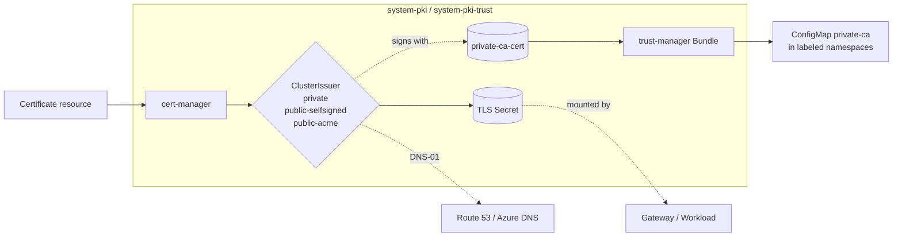

# PKI

cert-manager issues TLS certificates from one or more ClusterIssuers. trust-manager
distributes the private CA bundle to opted-in namespaces. The stack is split into
two kustomizations so the operators (`pki/base`) bootstrap before any issuer
(`pki/resources`) tries to create CRD instances.

## Flow



cert-manager runs in `system-pki` (PSA baseline). trust-manager runs in
`system-pki-trust` (PSA restricted). The DNS-01 path is only exercised by the
`public-acme` issuer; the CA distribution path is only exercised when the
private-ca addon is enabled.

## Recipes

`pki-base` is always rendered (cert-manager is required by every other stack
that issues certs). `pki-resources` is rendered conditionally — platform and
context-level facets contribute one issuer per cluster, and `addon-private-ca`
adds another. Multiple facets can contribute components to the same `pki-base`
and `pki-resources` entries; the materialized component list is the union.

The recipes below show that materialized union for common combinations.

### Single-node local dev (no private-CA addon)

Set `addons.private_ca.enabled: false` if you don't want the trust-manager
distribution path. Otherwise see the addon-private-ca recipe at the bottom.

```yaml
- name: pki-base
  path: pki/base
  components:
    - cert-manager
    - cert-manager/single-node

- name: pki-resources
  path: pki/resources
  dependsOn: [pki-base]
  components:
    - public-issuer/selfsigned
```

### AWS without a public domain

Bootstrap mode. The gateway gets a self-signed cert from `public-selfsigned`;
browsers warn but the cluster is reachable. Setting `dns.public_domain` later
flips the issuer to `public-acme` and cert-manager re-issues automatically.

```yaml
- name: pki-base
  path: pki/base
  dependsOn: [policy-resources, telemetry-base]
  components:
    - cert-manager
    - cert-manager/prometheus
  timeout: 20m

- name: pki-resources
  path: pki/resources
  dependsOn: [pki-base, policy-resources]
  components:
    - public-issuer/selfsigned
```

### AWS with a public domain

Let's Encrypt via Route 53 DNS-01. The cluster module provisions IAM (Pod
Identity, Route 53 zone permissions) so cert-manager can write TXT records.

```yaml
- name: pki-resources
  path: pki/resources
  dependsOn: [pki-base, policy-resources]
  components:
    - public-issuer/acme/route53
  substitutions:
    acme_server: https://acme-v02.api.letsencrypt.org/directory
    acme_email: ops@example.com
    acme_dns_zone: example.com
    acme_region: us-east-1
    acme_hosted_zone_id: Z1234567890ABC
```

### Azure with a public domain

Same as AWS but the cert-manager pod uses Azure workload identity (added by
the `cert-manager/azure-workload-identity` component) and DNS-01 runs against
Azure DNS.

```yaml
- name: pki-base
  path: pki/base
  components:
    - cert-manager
    - cert-manager/prometheus
    - cert-manager/azure-workload-identity
  substitutions:
    cert_manager_client_id: <UAMI client id>
    cert_manager_tenant_id: <tenant id>

- name: pki-resources
  path: pki/resources
  dependsOn: [pki-base, policy-resources]
  components:
    - public-issuer/acme/azuredns
  substitutions:
    acme_server: https://acme-v02.api.letsencrypt.org/directory
    acme_email: ops@example.com
    acme_dns_zone: example.com
    acme_dns_zone_resource_group: dns-rg
    acme_dns_zone_subscription_id: <sub id>
    cert_manager_client_id: <UAMI client id>
```

### addon-private-ca on top of any of the above

Adds trust-manager and a CA-backed `private` ClusterIssuer. Layers on top of
the platform's existing `pki-base` and `pki-resources`, adding components
rather than replacing them.

```yaml
- name: pki-base
  path: pki/base
  components:
    - trust-manager

- name: pki-resources
  path: pki/resources
  dependsOn: [pki-base, policy-resources]
  components:
    - private-issuer/ca
```

## Substitutions

| Name | Required when | Effect |
|---|---|---|
| `cert_manager_client_id` | `cert-manager/azure-workload-identity` is enabled | UAMI client ID stamped onto the cert-manager ServiceAccount and the ACME issuer's `managedIdentity.clientID`. |
| `cert_manager_tenant_id` | `cert-manager/azure-workload-identity` is enabled | Azure tenant ID stamped onto the cert-manager ServiceAccount. |
| `acme_server` | `public-issuer/acme/*` is enabled | ACME directory URL. Use staging in dev to avoid Let's Encrypt rate limits. |
| `acme_email` | `public-issuer/acme/*` is enabled | Account email Let's Encrypt registers against; required by the ACME protocol. |
| `acme_dns_zone` | `public-issuer/acme/*` is enabled | DNS zone the DNS-01 solver writes TXT records into. |
| `acme_region` | `public-issuer/acme/route53` is enabled | AWS region for the Route 53 API call. |
| `acme_hosted_zone_id` | `public-issuer/acme/route53` is enabled | Route 53 hosted zone ID; locks the solver to one zone. |
| `acme_dns_zone_resource_group` | `public-issuer/acme/azuredns` is enabled | Azure resource group containing the DNS zone. |
| `acme_dns_zone_subscription_id` | `public-issuer/acme/azuredns` is enabled | Azure subscription ID containing the DNS zone. |

## Components

### `pki/base/`

| Component | Enable when | Effect |
|---|---|---|
| `cert-manager` | always (default platform path) | Helm release of cert-manager in `system-pki`. CRDs enabled. |
| `cert-manager/single-node` | `topology: single-node` | Disables leader election on the controller and cainjector. |
| `cert-manager/prometheus` | `telemetry.metrics.enabled: true` | Enables the chart's ServiceMonitor with the `kube-prometheus-stack` release label, and adds a Flux `dependsOn` so cert-manager waits for kube-prometheus-stack to be ready. |
| `cert-manager/azure-workload-identity` | platform is Azure with a public domain | Adds Azure workload-identity labels and annotations to the cert-manager ServiceAccount and pods. |
| `trust-manager` | `addons.private_ca.enabled == true` | Helm release of trust-manager in `system-pki-trust`. Flux waits for cert-manager. |
| `trust-manager/single-node` | single-node + private-ca | Disables leader election on trust-manager. |

### `pki/resources/`

Each component creates exactly one ClusterIssuer (and supporting resources for
the CA path). Components are mutually exclusive within their family — pick
one private-issuer/* if any, and one public-issuer/* if any.

| Component | ClusterIssuer name | Effect |
|---|---|---|
| `private-issuer/selfsigned` | `private` (selfSigned) | Bare self-signed issuer; useful for private-mode gateways without the full CA distribution. |
| `private-issuer/ca` | `private` (CA) | Self-signed root + intermediate Certificate, trust-manager Bundle distributing the CA to namespaces labeled `use-custom-ca=true`, and a Kyverno ClusterPolicy that mounts the bundle into pods labeled `use-custom-ca=true`. |
| `public-issuer/selfsigned` | `public-selfsigned` (selfSigned) | Self-signed public issuer; used as the initial bootstrap before a real public domain is configured. |
| `public-issuer/acme/route53` | `public-acme` (ACME, DNS-01 via Route 53) | Let's Encrypt issuer that solves DNS-01 against a Route 53 hosted zone. |
| `public-issuer/acme/azuredns` | `public-acme` (ACME, DNS-01 via Azure DNS) | Let's Encrypt issuer that solves DNS-01 against an Azure DNS zone. |

`private-issuer/selfsigned` and `private-issuer/ca` both create a ClusterIssuer
named `private` and conflict if both are enabled — pick one. The two
`public-issuer/*` variants emit distinct names (`public-selfsigned` and
`public-acme`) and can coexist, though typically only one is wired. The
distinct public names are deliberate: swapping between them shows up to
cert-manager as a Certificate spec change and triggers reissuance, where
mutating one shared `public` issuer in place would not.

## Dependencies

| Stack | Reason |
|---|---|
| `policy-resources` *(when policies enabled)* | `private-issuer/ca` ships a Kyverno ClusterPolicy that mounts the CA bundle into opted-in pods. Flux fails the apply on `no matches for kind ClusterPolicy` if Kyverno's CRDs aren't installed. |
| `telemetry-base` *(when `telemetry.metrics.enabled: true` or `telemetry.logs.enabled: true`)* | `cert-manager/prometheus` enables a ServiceMonitor with `release: kube-prometheus-stack`; without telemetry-base the ServiceMonitor has no Prometheus to register against. |

`pki-resources` always depends on `pki-base` (the operators must be running before any ClusterIssuer is created).

## Operations

Stack-specific failure modes; generic Flux/Renovate behaviour is documented
at the repo level.

- **`Certificate` stuck in `Issuing` for the ACME issuer** — DNS-01 challenge isn't solving. For Route 53 confirm Pod Identity is bound to the cert-manager ServiceAccount and the IAM policy covers the hosted zone. For Azure DNS confirm the UAMI client ID matches `cert_manager_client_id` and the role assignment on the resource group is in place.
- **`HelmRelease/trust-manager` reports `no matches for kind Bundle`** — trust-manager hasn't installed or its CRDs aren't ready yet. Check the cert-manager Flux `dependsOn` chain (trust-manager waits for cert-manager).
- **`HelmRelease/pki-resources` reports `no matches for kind ClusterPolicy`** — `private-issuer/ca` is enabled but `policy-resources` (Kyverno) hasn't installed. The hard `dependsOn` in `addon-private-ca` should prevent this; if it fires, confirm policies are not disabled.
- **Switching from `public-selfsigned` to `public-acme` doesn't reissue** — cert-manager only reissues on Certificate spec changes. The Gateway cert references `gateway_cert_issuer`, which option-gateway switches based on `dns.public_domain`. If the substitution isn't flowing through, the spec doesn't change and the cert stays on the old issuer.

cert-manager exposes Prometheus metrics when `cert-manager/prometheus` is
enabled; a ServiceMonitor with `release: kube-prometheus-stack` registers it
with the telemetry stack.

## Security

- cert-manager runs in `system-pki` with PSA `baseline`. trust-manager runs in `system-pki-trust` with PSA `restricted`.
- The `private-ca` Certificate is self-signed (root) with `isCA: true`, 1-year duration and 30-day renewBefore. The signing key lives in the `private-ca-cert` Secret in `system-pki`.
- The trust-manager Bundle distributes the CA only to namespaces labeled `use-custom-ca=true`. Workloads in unlabeled namespaces never see the bundle.
- The `inject-private-ca` Kyverno ClusterPolicy only matches Pods labeled `use-custom-ca=true` and operates as a `mutate` rule — it does not block other workloads.
- ACME identity:
  - Route 53: Pod Identity association created by the cluster module, scoped to the hosted zone via `acme_hosted_zone_id`.
  - Azure DNS: workload identity (UAMI), scoped to the resource group via `acme_dns_zone_resource_group`.

## See also

- [contexts/_template/facets/platform-base.yaml](../../contexts/_template/facets/platform-base.yaml) — base wiring of `pki-base`.
- [contexts/_template/facets/addon-private-ca.yaml](../../contexts/_template/facets/addon-private-ca.yaml) — private-CA addon (trust-manager + private-issuer/ca).
- [contexts/_template/facets/platform-aws.yaml](../../contexts/_template/facets/platform-aws.yaml) — AWS public-issuer wiring.
- [contexts/_template/facets/platform-azure.yaml](../../contexts/_template/facets/platform-azure.yaml) — Azure public-issuer wiring.
- Blueprint schema and facet syntax — https://www.windsorcli.dev/docs/blueprints/
- Related stacks: [policy](../policy/), [telemetry](../telemetry/), [gateway](../gateway/), [dns](../dns/).
