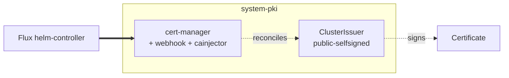
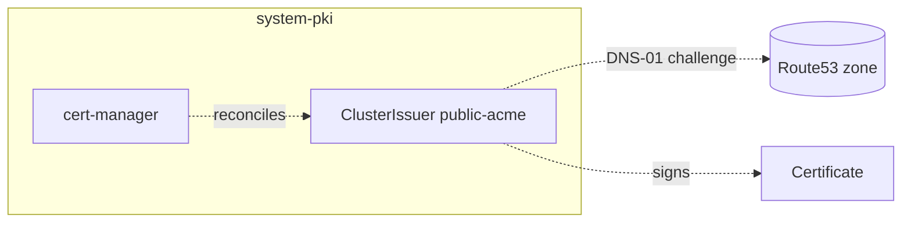
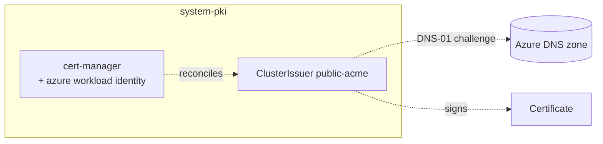
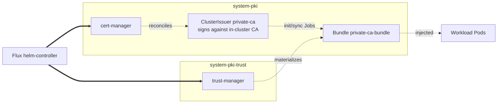

# PKI

The cluster's certificate-issuance layer. cert-manager's CRDs are
vendored under `kustomize/crds/` and applied ahead of the stack via
the facet `crds:` section. The add-on is a `flux:` system entry
(`pki`) so Flux can reconcile the controller before the ClusterIssuer
CRs that depend on it. `install` installs cert-manager (trust-manager
is added when the private-CA addon is enabled), plus optional patches
that enable Prometheus scraping, Azure workload identity, and
single-node leader-election tweaks. `resources` applies one or more
ClusterIssuers depending on the cluster's DNS and gateway-access
posture, and implicitly depends on `install` (compiled name:
`pki-install` / `pki-resources`); the ACME and private-CA variants
also depend on `policy-resources` for the private-CA inject policy.

The ClusterIssuers this add-on can ship are named consistently across
platforms so downstream `Certificate` resources can reference a stable
name (`private-selfsigned`, `private-ca`, `public-selfsigned`,
`public-acme`). Switching between selfsigned and ACME is a
substitution flip, not a Certificate spec change. cert-manager
reissues into the same Secret.

## Recipes

The ClusterIssuers are named consistently across platforms
(`public-selfsigned`, `public-acme`, `private-selfsigned`,
`private-ca`), so switching between selfsigned and ACME is a
substitution flip, not a Certificate spec change — cert-manager
reissues into the same Secret. cert-manager runs in `system-pki` (PSA
`baseline`); trust-manager, when present, runs in `system-pki-trust`
(PSA `restricted`).

### Baseline (selfsigned, no private CA)



```yaml
flux:
  - name: pki
    install:
      components: [cert-manager]
      timeout: 20m
    resources:
      - dependsOn: [policy-resources]
        components: [public-issuer/selfsigned]
        timeout: 5m
```

Issues against `public-selfsigned`. Browser warnings until the CA
cert is trusted out-of-band. Good first-cluster setup.

### Public ACME on AWS



```yaml
flux:
  - name: pki
    resources:
      - dependsOn: [policy-resources]
        components: [public-issuer/acme/route53]
        substitutions:
          acme_server: https://acme-v02.api.letsencrypt.org/directory
          acme_email: you@example.com
          acme_dns_zone: example.com
          acme_hosted_zone_id: <from terraform_output('dns-zone', 'zone_id')>
```

DNS-01 against Route53. Auth comes from the IAM role and Pod Identity
binding the AWS cluster Terraform module provisioned.

### Public ACME on Azure



```yaml
flux:
  - name: pki
    install:
      components: [cert-manager, cert-manager/azure-workload-identity]
      substitutions:
        cert_manager_client_id: <terraform_output('cluster', 'cert_manager_client_id')>
        cert_manager_tenant_id: <terraform_output('cluster', 'tenant_id')>
    resources:
      - dependsOn: [policy-resources]
        components: [public-issuer/acme/azuredns]
        substitutions:
          acme_server: https://acme-v02.api.letsencrypt.org/directory
          acme_email: you@example.com
          acme_dns_zone: example.com
          acme_dns_zone_resource_group: <terraform_output('dns-zone', 'resource_group_name')>
          acme_dns_zone_subscription_id: <terraform_output('dns-zone', 'subscription_id')>
```

DNS-01 against Azure DNS, authed via the AKS federated workload
identity attached by `cert-manager/azure-workload-identity`.

### Private CA with trust-manager distribution



```yaml
flux:
  - name: pki
    install:
      components: [cert-manager, trust-manager]
    resources:
      - dependsOn: [policy-resources]
        components: [private-issuer/ca]
```

`private-ca` ClusterIssuer signs against an in-cluster selfSigned CA.
The init and sync Jobs extract the CA cert into a `Bundle`, which
trust-manager materializes into a Secret/ConfigMap that downstream
namespaces can mount.

## Operations

If `cert-manager-controller` restarts with `Last State: Terminated,
Reason: Completed` and its logs show `clockHealth failed: the system
clock is out of sync with the internal monotonic clock`, this is
expected on docker-desktop/colima after the host laptop sleeps: the
VM pauses, and on wake its wall clock steps forward while the
already-running controller's monotonic baseline doesn't, tripping
cert-manager's built-in `/livez` clock check (~5m tolerance, not
configurable via Helm values). The restart itself resets the
baseline and self-heals; no action needed. It stops recurring once
the host stays awake long enough for the VM's clock sync to
converge.

<!-- BEGIN_KUSTOMIZE_DOCS -->

## Substitutions

| Name | Required when | Effect |
|---|---|---|
| `cert_manager_client_id` | `cert-manager/azure-workload-identity` is enabled | Azure AD client ID for the cert-manager managed identity. Sourced from `terraform_output('cluster', 'cert_manager_client_id')`. |
| `cert_manager_tenant_id` | `cert-manager/azure-workload-identity` is enabled | Azure AD tenant ID for the federated workload identity credential. |
| `acme_server` | any `public-issuer/acme/*` component is enabled | ACME directory URL. Resolves to `acme-staging-v02.api.letsencrypt.org` in dev, `acme-v02.api.letsencrypt.org` otherwise. |
| `acme_email` | any `public-issuer/acme/*` component is enabled | Contact email Let's Encrypt registers against the ACME account. Sourced from top-level `email`. |
| `acme_dns_zone` | any `public-issuer/acme/*` component is enabled | FQDN of the DNS zone cert-manager writes DNS-01 challenges into. Sourced from `dns.public_domain`. |
| `acme_hosted_zone_id` | `public-issuer/acme/route53` is enabled | Route53 hosted zone ID. Threaded via deferred `terraform_output('dns-zone', 'zone_id')` so the ACME ClusterIssuer reissues automatically when the dns-zone stack first applies. |
| `acme_dns_zone_resource_group` | `public-issuer/acme/azuredns` is enabled | Azure resource group holding the public DNS zone. Sourced from `terraform_output('dns-zone', 'resource_group_name')`. |
| `acme_dns_zone_subscription_id` | `public-issuer/acme/azuredns` is enabled | Azure subscription ID for the public DNS zone. Sourced from `terraform_output('dns-zone', 'subscription_id')`. |

## Components — `pki-install`

| Component | Enable when | Effect |
|---|---|---|
| `cert-manager` | always | Helm release of the `cert-manager` chart in `system-pki`. Installs the controller, webhook, and cainjector (chart CRD install is skipped). The cert-manager CRDs are vendored under `kustomize/crds/` and applied ahead of the controller via the facet `crds:` section, so `pki-resources` can consume ClusterIssuer / Certificate CRs. |
| `cert-manager/single-node` | single-node topology | Patches the cert-manager HelmRelease to disable leader election on the controller (single replica has nothing to elect against). |
| `cert-manager/azure-workload-identity` | platform is Azure AND `dns.public_domain` is set | Patches the cert-manager Deployment to attach the AKS federated workload identity used by the DNS-01 ACME solver against Azure DNS. Reads `cert_manager_client_id` and `cert_manager_tenant_id`. |
| `cert-manager/prometheus` | `telemetry.metrics.enabled: true` | Patches the cert-manager HelmRelease to enable Prometheus annotations / ServiceMonitor on the controller and webhook. |
| `trust-manager` | `addons.private_ca.enabled: true` | Helm release of the `trust-manager` chart in `system-pki-trust` (PSA `restricted`). Depends on cert-manager. Consumes `Bundle` CRs to distribute the private CA into workload namespaces. |
| `trust-manager/single-node` | single-node topology AND `addons.private_ca.enabled: true` | Patches the trust-manager HelmRelease to disable leader election. |

## Components — `pki-resources`

| Component | Enable when | Effect |
|---|---|---|
| `private-issuer/selfsigned` | `gateway.access == 'private'` AND `dns.private_domain` is set | ClusterIssuer `private-selfsigned` with `selfSigned: {}`. Used for the private gateway certificate when no private CA is configured; browsers warn until the CA cert is added to a trust store. |
| `private-issuer/ca` | `addons.private_ca.enabled: true` | Full private CA: a `selfSigned` issuer mints a CA `Certificate`, a `ca`-type `ClusterIssuer` (`private-ca`) signs against it, plus an init / sync Job pair that copies the CA cert into a `Bundle` for trust-manager and a Kyverno mutation policy that injects the trust bundle into workload Pods. |
| `public-issuer/selfsigned` | `dns.public_domain` is unset (default) | ClusterIssuer `public-selfsigned`. Bootstraps a working gateway cert immediately; flip to `acme/*` by setting `dns.public_domain` and cert-manager reissues into the same Secret. |
| `public-issuer/acme/route53` | platform is AWS AND `dns.public_domain` is set | ClusterIssuer `public-acme` using the ACME DNS-01 solver against Route53. Auth is via the Pod Identity binding provisioned by the cluster Terraform module. |
| `public-issuer/acme/azuredns` | platform is Azure AND `dns.public_domain` is set | ClusterIssuer `public-acme` using the ACME DNS-01 solver against Azure DNS. Auth is via the federated workload identity (see `cert-manager/azure-workload-identity`). |

## Dependencies

| Add-on | Required when | Reason |
|---|---|---|
| `policy-resources` | `policies.enabled: true` | pki-install depends on Kyverno baseline policies being active before cert-manager pods are admitted into `system-pki`. pki-resources depends on `policy-resources` so the private-CA inject policy (when private_ca is on) doesn't apply before Kyverno itself is reconciling. |
| `telemetry-install` | `cert-manager/prometheus` is enabled | The ServiceMonitor added by `cert-manager/prometheus` needs Prometheus to be live to scrape. |

<!-- END_KUSTOMIZE_DOCS -->

## See also

- [contexts/_template/facets/platform-base.yaml](../../contexts/_template/facets/platform-base.yaml) for the base cert-manager and selfsigned defaults.
- [contexts/_template/facets/platform-aws.yaml](../../contexts/_template/facets/platform-aws.yaml) for ACME on Route53 wiring.
- [contexts/_template/facets/platform-azure.yaml](../../contexts/_template/facets/platform-azure.yaml) for ACME on AzureDNS plus workload-identity wiring.
- [contexts/_template/facets/addon-private-ca.yaml](../../contexts/_template/facets/addon-private-ca.yaml) for trust-manager and private CA wiring.
- Related add-ons: [policy](../policy/), [telemetry](../telemetry/), [gateway](../gateway/) (consumes the ClusterIssuer for the external gateway cert), [observability](../observability/) (Elasticsearch consumes the private CA).
